# **Mindscience贡献指南**

<!-- TOC -->

- [Mindscience贡献指南](#Mindscience贡献指南)
    - [如何成为mindscience仓的贡献者](#如何成为mindscience仓的贡献者)
        - [一、提交合并请求，为mindscience仓贡献自己的力量](#一提交合并请求为mindscience仓贡献自己的力量)
        - [二、新增测试用例，看护代码功能](#二新增测试用例看护代码功能)
    - [本地代码操作](#本地代码操作)
        - [一、信息配置](#一信息配置)
        - [二、拉取目标仓代码](#二拉取目标仓代码)
        - [三、查看仓及分支信息](#三查看仓及分支信息)
        - [四、修改代码后提交commit以及多个commit合并](#四修改代码后提交commit以及多个commit合并)
        - [五、更新本地代码，同步仓代码——冲突解决](#五更新本地代码同步仓代码冲突解决)
        - [六、将本地修改代码推到远端仓，提起向主仓合并请求的PR](#六将本地修改代码推到远端仓提起向主仓合并请求的pr)
        - [七、附加](#七附加)

<!-- /TOC -->

## **如何成为mindscience仓的贡献者**

- 在gitee上输入mindscience的主仓网站:https://gitee.com/mindspore/mindscience
- 通过右上角的Star按钮成为mindscience仓的贡献者
- 通过右上角的Fork按钮Fork一个mindscience主仓，为后续贡献代码做准备

<div align=center>
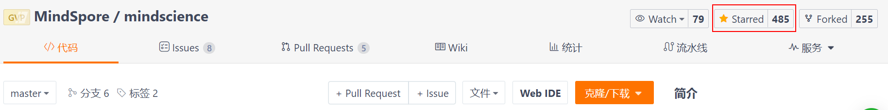
</div>

<div align=center>
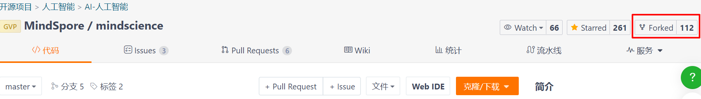
</div>

### **一、提交合并请求，为mindscience仓贡献自己的力量**

- 本地修改的代码如果需要合并到主仓，可以通过曾经Fork过mindscience的远端仓，进行新建代码合并请求操作

<div align=center>
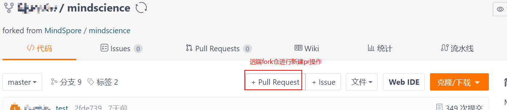
</div>

- 点击新建合并请求后，需要进行源分支名的选择，目标分支名的选择，标题输入，以及简要说明修改点等操作（ **注意：合并标题格式为[SPONG]+内容** ）

- 在新建合并请求的右下角需进行关联Issue操作，每个合并请求的合入都要有对应的Issue，如果没有相关的Issue，可以自行创建，请记得关联完Issue后将（合并后关闭提到的Issue）前面勾勾取消，然后点击创建合并请求操作

<div align=center>
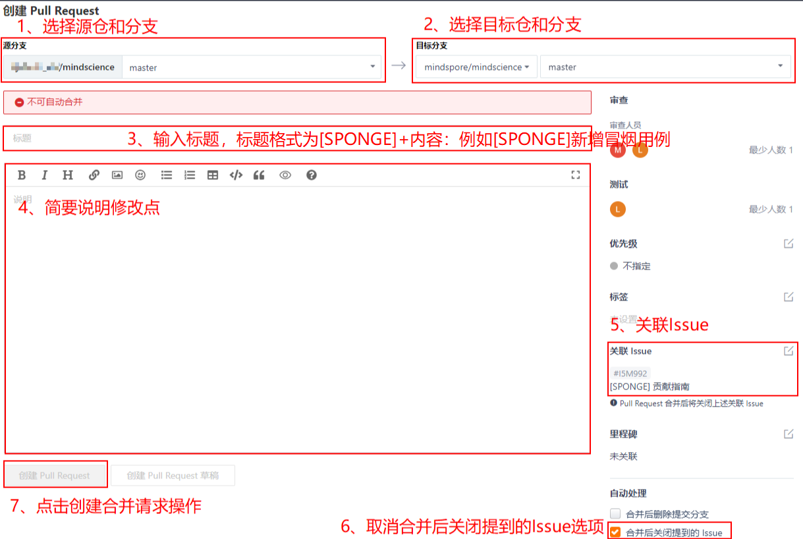
</div>

- 关联Issue处如果没有可选择的Issue关联，可以在主仓新建一个Issue，如果有则直接忽略此步。在主仓中点击新建Issue，根据合并请求的类型选择对应Issue类型，输入标题后，点击创建即可，这样在新建合并请求的关联Issue操作中就可以选择刚刚创建的Issue（ **注意：Issue标题格式为[SPONGE]+内容** ）

<div align=center>
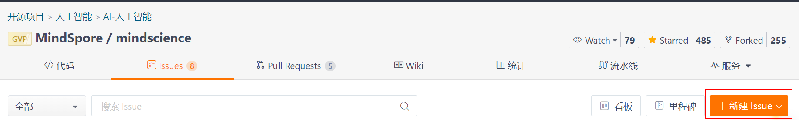
</div>

<div align=center>
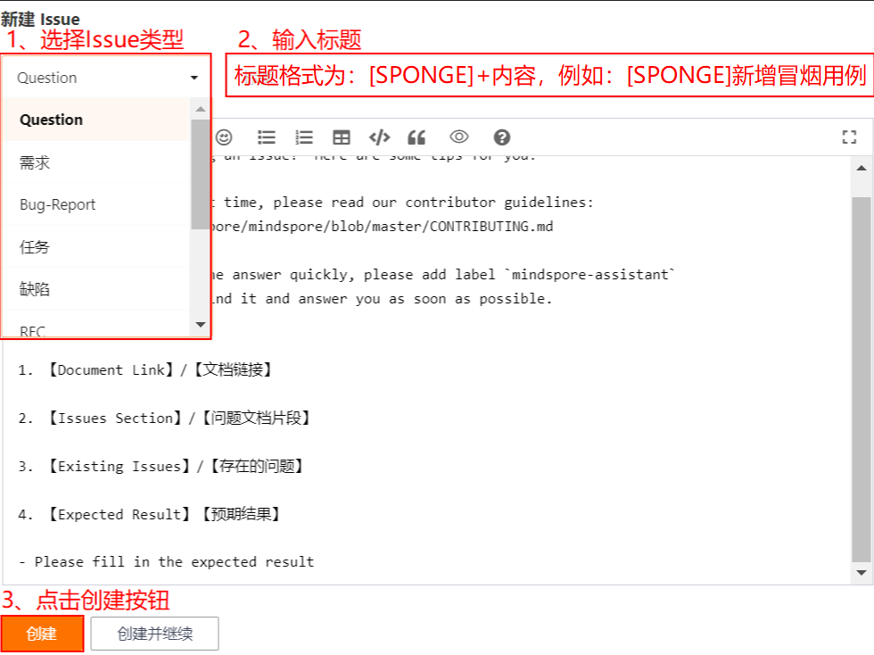
</div>

- 新用户如果未注册过CLA，新建的合并请求会打上（mindspore-cla/no）标签，需要通过i-robot给出的链接注册，注册完成后在评论区输入（/check-cla）重新校验，已注册用户请忽略此步

<div align=center>
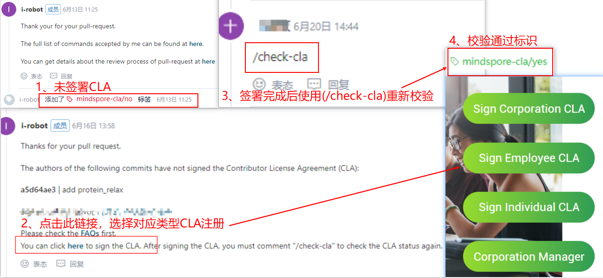
</div>

- 合并请求创建完成后，需要在评论区输入（/retest）启动门禁任务，进行静态检查以及冒烟用例测试，确保合入的代码不会影响主仓上面已有功能。如果全部通过会出现SUCCESS字样，即可以找相关审核人员合入代码；反之，如果出现FAILURE字样，需要点进失败链接，进行相关报错修复，修复完成后重新执行（/retest）操作，直至静态检查和冒烟用例全部通过才可合入

<div align=center>
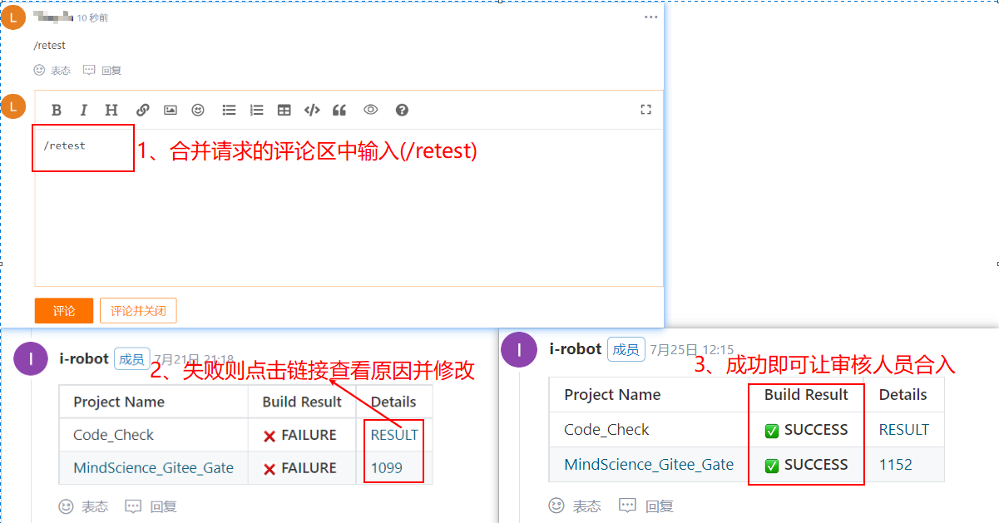
</div>

### **二、新增测试用例，看护代码功能**

- 对于贡献者来说，如果需要新增门禁冒烟测试用例来维护自己代码功能，可以在代码目录的mindscience/tests/st下，新增测试用例代码，这样可以保证其他人合入代码时不会影响自己代码功能（ **注意：测试用例运行时间必须尽量短，受设备资源限制，太久的用例不适合作为门禁用例看护** ）

- 系统级测试用例，此阶段的用例是在whl包安装完成后启动，因此可以调用whl包中的任何函数，需要注意，系统级测试用例中需要添加（import pytest），并且在函数入口处新增pytest的标识，该标识可以使门禁任务识别到函数入口

<div align=center>
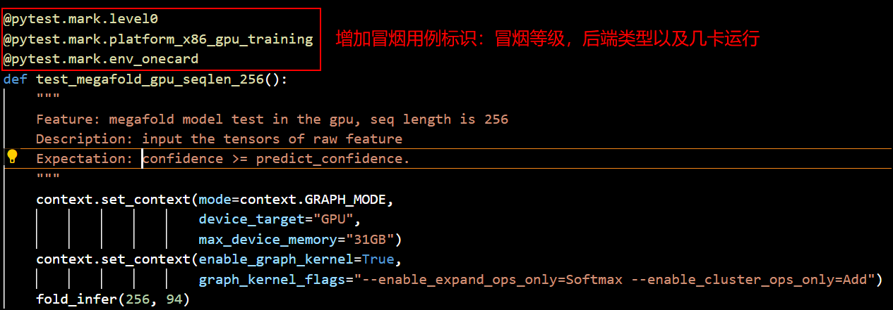
</div>

- 测试用例代码完成后，需按照第一点进行代码上库操作，上库之后，新增的用例便会在门禁中体现

## **本地代码操作**

- Git 各平台安装包下载地址为：http://git-scm.com/downloads

安装完成后

- windows系统：可以在任意目录下直接右键Git Bush Here进行git相关操作

<div align=center>
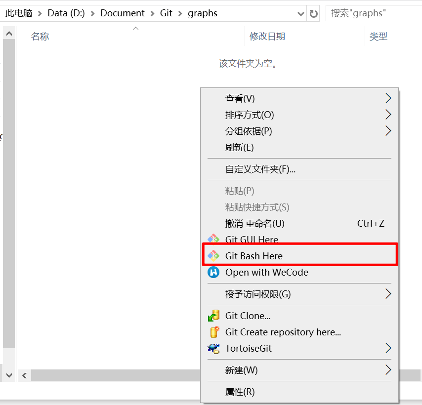
</div>

<div align=center>
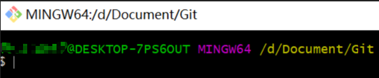
</div>

- Linux系统: 通过终端进入所要存放代码的目录下直接进行git操作

<div align=center>
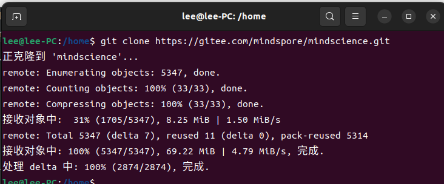
</div>

### **一、信息配置**

- 配置用户信息可以使你提交代码的commit下拥有你的账户信息——用于代码贡献量的统计

```bash
git config --global user.name "abc"
git config --global user.email abc@tbs.com
```

<div align=center>
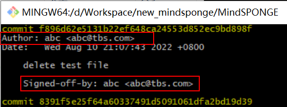
</div>

### **二、拉取目标仓代码**

- 代码提交流程为：本地代码---->push到远端自己仓_分支(Fork的仓即可以作为自己的远端仓)---->提起PR请求合入主仓_分支

- 采用git clone + 代码仓链接方式拉取代码，代码仓路径在gitee仓代码目录的右上角，有个克隆/下载按钮，点击后可以复制HTTPS或者SSH链接，即为clone所需的代码仓路径链接

```bash
git clone 代码仓链接
git clone -b 分支名 代码仓链接
例如：git clone https://gitee.com/mindspore/mindscience.git
```

- 代码拉取完成后，进入代码目录内部便可以使用git操作（ **注意：拉取代码时的目录是无法使用类似git pull/push/remote/log等命令，必须进入其下一级目录才可以使用git pull/push等命令** ）

<div align=center>
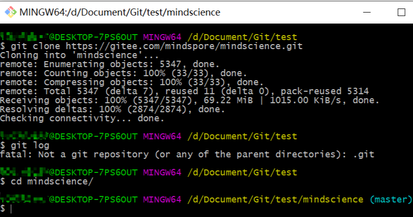
</div>

### **三、查看仓及分支信息**

- 一般代码操作都是针对仓中的某个分支进行，因此在git下面主要的操作都有两个参数：仓+分支，如果不加分支名，默认对master分支进行操作

- 仓信息查询以及添加：

- a、在代码目录中使用git remote -v就可以看到添加的远端仓地址和名字，后续操作仓便可以直接使用名字代替

- b、如果有多个仓需要操作，可以使用git remote add + 仓名(例如master) + 代码仓路径便可以添加新的仓

```bash
git remote -v
git remote add 仓名 仓地址
例如：git remote add master https://gitee.com/xxxxxxx/mindscience.git
```

<div align=center>
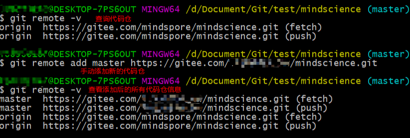
</div>

分支信息查询

- a、使用git branch -a可以看到clone代码仓的分支名字以及本地分支名

- b、如果还想继续从远端拉分支可以使用git fetch 仓名 远端分支名:本地分支名，这样会将远端对应分支名下面的代码拉到本地命名分支下

- c、既然有了新的分支，那我们如何切换呢？可以使用git checkout + 本地分支名将代码切换为相应分支下面的代码（注意：当所在分支有修改点未保存时切换会报错，因此需要先将修改点保存或者放弃修改点再进行分支切换操作

```bash
git branch -a
git fetch 远端仓名 远端分支名:本地分支名
git checkout 本地分支名
```

<div align=center>
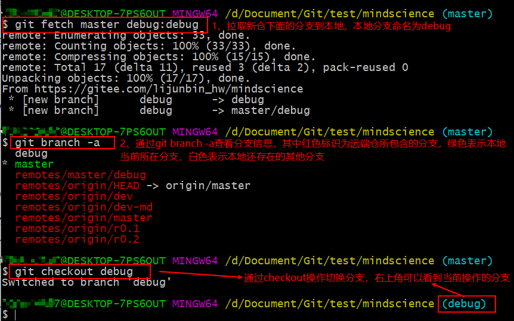
</div>

### **四、修改代码后提交commit以及多个commit合并**

- 当修改代码完成后，可以通过git status查看当前修改的文件数量和路径，如果所有修改点都需要保存，可以直接使用git add .操作，如果仅仅想保存部分修改文件，可以git add 文件名路径逐一保存，如果想回退某个文件的修改点，可以使用git checkout 文件名路径逐一回退，上述操作完成后，可以使用git commit -s生成commit id以及填写相应的commit内容，填写完成后保存，这样通过git log操作就能看到生成的commit信息

```bash
git status
git add .  
git add 文件名路径
git checkout -- 文件名路径
git commit -s
git log
git rebase -i commit_id
```

<div align=center>
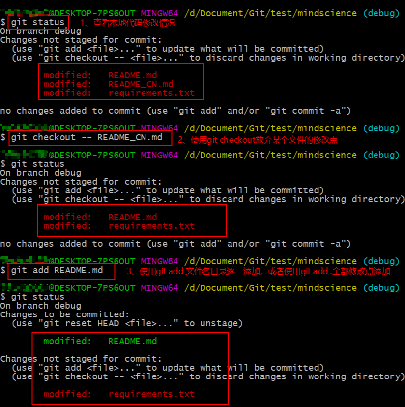
</div>

<div align=center>
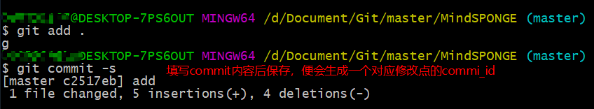
</div>

- 合并commit操作：有些时候可能由于修改点和时间原因，保存了多个commit，但是上库只允许有一个commit，怎么办呢？这个时候可以使用git rebase -i + 需要合并的所有commit_id之前的一个id号，然后将多余commit id前面的pick标识修改成f，再进行保存，这样多个commit_id就会自动合并到标识为pick的commit_id上

<div align=center>
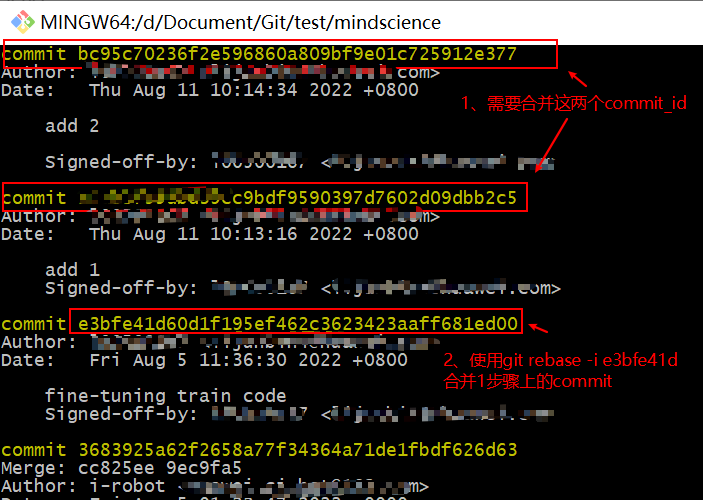
</div>

<div align=center>
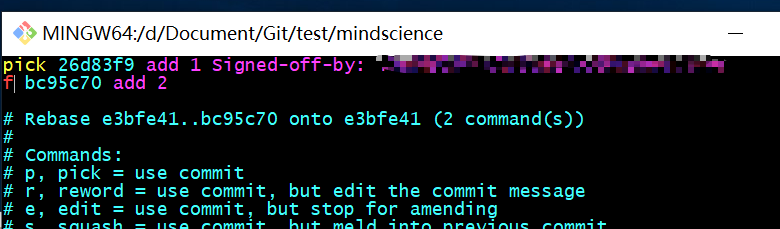
</div>

<div align=center>
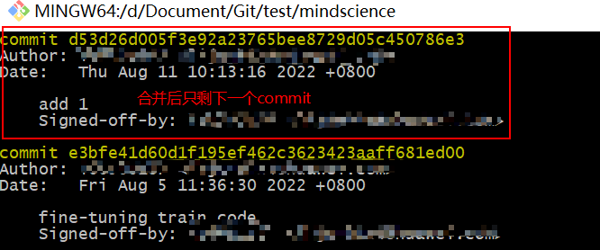
</div>

### **五、更新本地代码，同步仓代码——冲突解决**

- 本地代码想同步仓代码时，如果本地没有修改也没有新增commit_id的话，此时直接用git pull 仓名 仓分支名即可

- 如果本地代码有修改，并且保存了commit，此时想要同步主仓并且保留修改点时建议使用git pull --rebase + 仓名 + 仓分支名，这样同步代码的好处是：先将本地未修改前的代码同步仓上代码再自动加入本地的修改点

```bash
git pull 仓名 仓分支名
git pull --rebase 仓名 仓分支名
```

- 由于主仓不止一个人在提交代码，当出现多人同时修改同一行时，如果前面人代码先合入主仓，此时更新本地代码操作会出现冲突，通过git pull --rebase 更新主仓时可以使用以下命令解决冲突(注意：在git pull --rebase时，如果本地修改存在多个commit，最好通过步骤四将多个commit id合并后再进行，否则会对每个修改的commit做一次rebase同步操作，例如本地有4个修改的commit，同步仓上代码时会首先对第一个修改的commit同步一次仓，如果有冲突需要解决后再git rebase --continue继续对第二个commit同步一次仓，这样相对繁琐，因此建议最好合并完本地commit后再进行同步仓代码)

冲突解决：

1、git status会显示主仓代码和自己代码同时修改的文件

2、进入该文件，可以搜索“<<<<<<<"这样的符号标识

3、"<<<<<<<commit"到”============“标识下面的代码即为主仓上面的代码

4、”============“到”>>>>>>>commit_id"标识下面的代码为本地修改

5、此时需要识别是保留主仓修改，还是保留本地修改，亦或是合并两者的修改点

6、所有冲突文件以及冲突点都修改完成后，使用git add .保存

7、使用git rebase --continue继续同步下一个commit，如果在同步仓代码前已经把本地修改的commit合并成一个的话，那么这里只需要执行一次命令即可

```bash
git status
git add .
git rebase --continue
git rebase --abort放弃同步
```

例如：现在存在A用户和B用户，同时clone了主仓的代码

1、A用户修改了部分文件并且提交到主仓
此时如果B用户只是clone过主仓代码但是没有任何修改点，没有添加任何commit，可直接使用git pull操作

<div align=center>
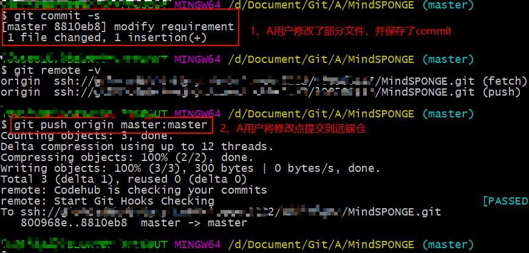
</div>

<div align=center>
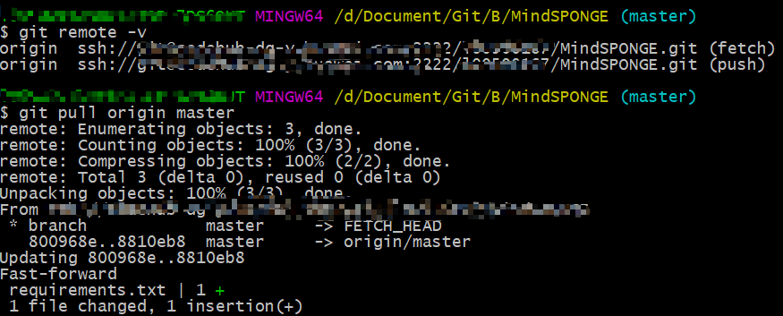
</div>

2、A用户修改了部分文件并且提交主仓
此时B用户本地也修改了同一个文件，并且提交PR时显示有冲突，那么此时需要使用git pull --rebase 仓 分支名进行手动解决冲突后，git add .保存修改，并使用git rebase --continue继续操作

<div align=center>
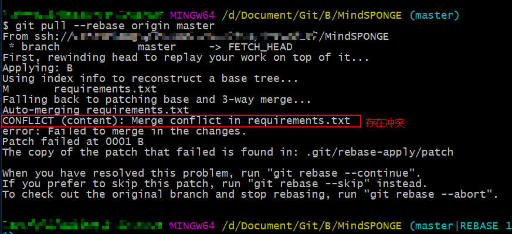
</div>

<div align=center>

</div>

### **六、将本地修改代码推到远端仓，提起向主仓合并请求的PR**

- 可以通过git push操作将本地代码推到远端仓，远端分支名如果省略则默认提交到master

```bash
git push 远端仓名 本地分支名：远端分支名
git push 远端仓名 本地分支名：远端分支名 -f
```

### **七、附加**

- 补丁的使用，修改的代码可以通过format-patch的命令保存为.patch文件，该文件可以任意传输，别的用户只要使用git apply操作便可以把修改点作为补丁打到自己的代码中

```bash
git format-patch -i commit_id
git apply --reject xxxxx.patch
```

- Cherry-pick操作：将指定的commit修改应用到其他分支上

```bash
git cherry-pick commit_id
```

- 修改点添加完成后，使用git commit --amend可以不生成新的commit信息，修改点直接合入之前commit_id上

```bash
git commit --amend
```

- 强制回退到某个commit_id节点

```bash
git reset --hard commit_id
```
