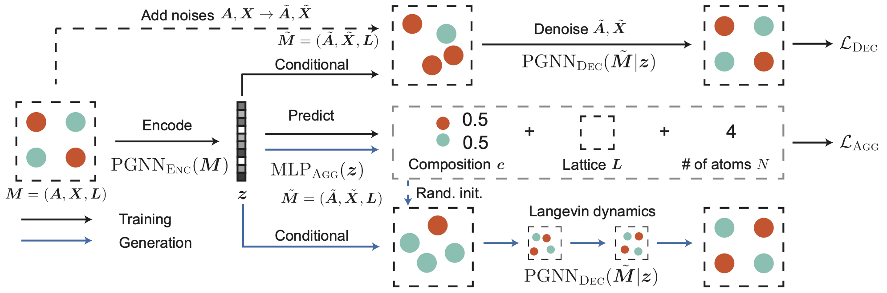
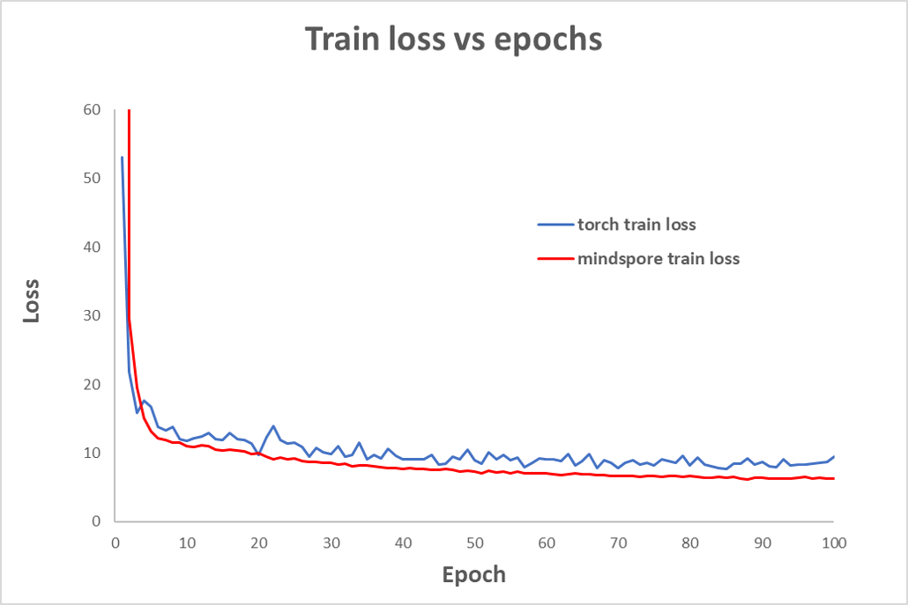

# 模型名称

> CDVAE

## 介绍

> Crystal Diffusion Variational AutoEncoder (CDVAE)是用来生成材料的周期性结构的SOTA模型，相关论文已发表在ICLR上。模型主要有两个部分组成，首先是encoder部分，将输入得信息转化成隐变量z，部分简单得特性，如原子数量和晶格常数等，直接使用MLP进行decode得到输出，其他部分如原子种类和原子在晶格中得位置等，则通过扩散模型得到。具体模型结构如下图所示：

<div align=center>
    
</div>

## 数据集

> 提供了Perov_5数据集：

Perov_5 (Castelli et al., 2012): 包含接近19000个钙钛矿晶体结构，结构相似，但是组成不同,下载地址：[Perov_5](https://figshare.com/articles/dataset/Perov5/22705189).

数据集下载后直接放在./data目录下即可。

## 环境要求

> 1. 安装`pip install -r requirements.txt`

## 脚本说明

### 代码目录结构

```txt
└─cdvae
    │  README.md     README文件
    │  train.py     训练启动脚本
    │  evaluation.py     推理启动脚本
    │  compute_metrics.py     评估结果脚本
    │  create_dataset.py     生成数据集
    │  
    └─src
        │  evaluate_utils.py  推理结果生成
        │  metrics_utils.py  评估结果计算
        │  dataloader.py 将数据集加载到网络
        |  mp_20_process.py     对mp_20数据集预处理
    │  
    └─conf            参数配置
        │ config.yaml  网络参数
        └─data  数据集参数
```

## 训练

## 快速开始

> 训练命令： `python train.py --dataset 'perov_5'`

### 命令行参数

```
dataset: 使用得数据集，perov_5
create_dataset: 是否重新对数据集进行处理
num_sample_train: 如重新处理数据集，训练集得大小，-1为使用全部原始数据
num_samples_val：如重新处理数据集，验证集得大小，-1为使用全部原始数据
num_samples_test：如重新处理数据集，测试集得大小，-1为使用全部原始数据
name_ckpt：保存权重的路径和名称
load_ckpt：是否读取权重
device_target：MindSpore使用的后端
device_id：如MindSpore使用昇腾后端，使用的NPU卡号
epoch_num：训练的epoch数
```

<div align=center>
    
</div>

## 推理评估过程

### 推理过程

```txt
1.将权重checkpoint文件保存至 `/loss/`目录下（默认读取目录）
2.执行推理脚本：
            python evaluation.py --dataset perov_5 --tasks 'gen'

```
### 命令行参数

```
device_target：MindSpore使用的后端
device_id：如MindSpore使用昇腾后端，使用的NPU卡号
model_path: 权重保存路径
dataset: 使用得数据集，perov_5
tasks：推理执行的任务，可选：gen
n_step_each：执行的denoising的步数
step_lr：opt任务中设置的lr
min_sigma：生成随机噪声的最小值
save_traj：是否保存traj
disable_bar：是否展示进度条
num_evals：gen任务中产生的结果数量
start_from：随机或从头开始读取数据集，可选：ramdon, data
batch_size: batch_size大小
force_num_atoms：是否限制原子数不变
force_atom_types：是否限制原子种类不变
label：推理结果保存时的名称
```

推理结果

```txt
可以在`/eval_result/`路径下找到推理的输出文件。
generation的输出文件为eval_gen.npy,包含了随机生成结果的晶体结构信息；
```

### 结果评估

```txt
运行 python comput_metrics.py --eval_path './eval_result' --dataset 'perov_5' --task gen, 结果会保存在./eval_path文件夹下的eval_metrics.json文件中
```
## 性能
 
| 参数               | Ascend               |
|:----------------------:|:--------------------------:|
| 硬件资源                | 昇腾 NPU            |
| MindSpore版本           | >=2.3.0                 |
| 数据集                  | perov5/carbon24/mp20 |
| 参数量                  | 4.9 M   |
| 求解参数              | batch_size=128, lr=0.0001, epoch_num=5000 |
| 求解速度(s/epoch) | 0.4(perov5)                 |
| 评估指标-valid | 0.9877(perov5)                 |
| 评估指标-Coverage_R | 0.9962(perov5)            |

## 引用
[1] Xie T, Fu X, Ganea O E, et al. Crystal diffusion variational autoencoder for periodic material generation[J]. arXiv preprint arXiv:2110.06197, 2021.

[2] Castelli I E, Landis D D, Thygesen K S, et al. New cubic perovskites for one-and two-photon water splitting using the computational materials repository[J]. Energy & Environmental Science, 2012, 5(10): 9034-9043.

[3] Castelli I E, Olsen T, Datta S, et al. Computational screening of perovskite metal oxides for optimal solar light capture[J]. Energy & Environmental Science, 2012, 5(2): 5814-5819.