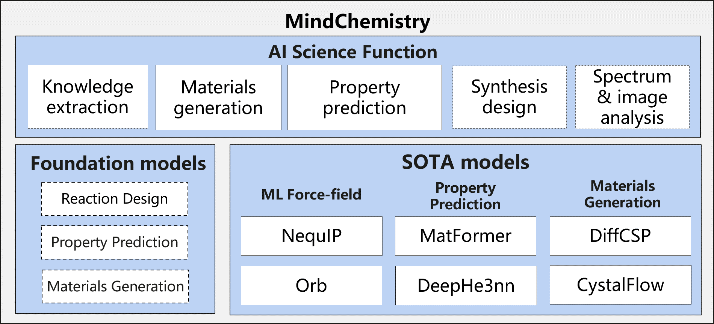

# MindSpore Chemistry

[查看中文](README_CN.md)

---

## Contents

- [MindSpore Chemistry](#mindspore-chemistry)
    - [Contents](#contents)
    - [Introduction](#introduction)
    - [Latest News](#latest-news)
    - [Models & Applications](#models--applications)
        - [Machine Learning Force Fields](#machine-learning-force-fields)
        - [Property Prediction](#property-prediction)
        - [Structure Generation](#structure-generation)
    - [Community](#community)
        - [Core Contributors](#core-contributors)
    - [Contribution Guide](#contribution-guide)
    - [License](#license)
    - [References](#references)

---

## Introduction

Conventional chemistry studies have long been confronted with numerous challenges. The process of experimental design, synthesis, characterization, and analysis can be time-consuming, costly, and highly dependent on experts’ experiences.
The synergy between AI and chemistry offers unprecedented opportunities to overcome the limitations of conventional approaches and unlock new frontiers in scientific discovery and innovation. AI techniques can efficiently process vast amount of data, mining underneath patterns and generating predictive models. By leveraging AI, chemistry and material science researchers can accelerate the design and optimization of chemical processes and the design and analysis of novel materials.

**MindSpore Chemistry**(MindChemistry) is a toolkit built on MindSpore endeavoring to integrate AI with conventional chemistry research. It supports multi-scale tasks including molecular generation, property prediction and synthesis optimization on multiple chemistry systems such as organic, inorganic and composites chemistry systems. MindChemistry dedicates to enabling the joint research of AI and chemistry with high efficiency, and seek to facilitate an innovative paradigm of joint research between AI and chemistry, providing experts with novel perspectives and efficient tools.

## Latest News

- `2025.07.07` Added Orb model support.
- `2025.04.16` Added CrystalFlow model support.
- `2025.03.30` MindChemistry 0.2.0 has been released, featuring several applications including NequIP, DeephE3nn, Matformer, and DiffCSP.
- `2024.07.30` MindChemistry 0.1.0 has been released.

## Models & Applications

---

### Machine Learning Force Fields

| Model | System | Dataset | Task |
|-------|--------|---------|------|
| [NequIP](./applications/nequip/) | Small molecules | Revised Molecular Dynamics 17 (rMD17) dataset | Molecular energy prediction using E(3)-equivariant GNNs |
| [Orb](https://gitee.com/mindspore/mindscience/tree/master/MindChemistry/applications/orb) | Molecular and crystalline materials | Large-scale 3D atomic-structure datasets; DFT calculations | General GNN interatomic potential for energy, forces, and stress; suitable for molecular dynamics simulation |

### Property Prediction

| Model | System | Dataset | Task |
|-------|--------|---------|------|
| [DeephE3nn](https://gitee.com/mindspore/mindscience/tree/master/MindChemistry/applications/deephe3nn) | Materials systems | Bilayer graphene dataset | E(3)-equivariant neural network for electronic Hamiltonian prediction |
| [Matformer](./applications/matformer/) | Crystalline materials | JARVIS-DFT 3D dataset | Graph + Transformer for materials property prediction |

### Structure Generation

| Model | System | Dataset | Task |
|-------|--------|---------|------|
| [DiffCSP](./applications/diffcsp/) | Crystalline materials | Stable crystal structure datasets (MP-20, MPTS-52, Carbon-24) | Crystal structure prediction/generation via joint diffusion |
| [CrystalFlow](./applications/crystalflow/) | Crystalline materials | Materials database crystal structure datasets (MP-20, Carbon-24, MPTS-52) | Flow-based crystal structure generation |

## Community

### Core Contributors

Thanks goes to these wonderful people:

Danyang Chen, Jianhuan Cen, Kunming Xu, wujian, wangyuheng, Lin Peijia, gengchenhua, caowenbin，Siyu Yang

## Contribution Guide

- Please click here to see how to contribute your code:[Contribution Guide](https://gitee.com/mindspore/mindscience/blob/master/CONTRIBUTION.md)

## License

[Apache License 2.0](http://www.apache.org/licenses/LICENSE-2.0)

## References

[1] Batzner S, Musaelian A, Sun L, et al. E(3)-equivariant graph neural networks for data-efficient and accurate interatomic potentials[J]. Nature Communications, 2022, 13(1): 2453.

[2] Neumann M, Gin J, Rhodes B, Bennett S, Li Z, Choubisa H, Hussey A, Godwin J. Orb: A Fast, Scalable Neural Network Potential[J]. arXiv:2410.22570, 2024.

[3] Xiaoxun Gong, He Li, Nianlong Zou, et al. General framework for E(3)-equivariant neural network representation of density functional theory Hamiltonian[J]. Nature Communications, 2023, 14: 2848.

[4] Keqiang Yan, Yi Liu, Yuchao Lin, Shuiwang Ji, et al. Periodic Graph Transformers for Crystal Material Property Prediction[J]. arXiv:2209.11807v1 [cs.LG], 2022.

[5] Jiao Rui, Huang Wenbing, Lin Peijia, et al. Crystal structure prediction by joint equivariant diffusion[J]. Advances in Neural Information Processing Systems, 2024, 36.

[6] Luo X, Wang Z, Wang Q, et al. CrystalFlow: a flow-based generative model for crystalline materials[J]. Nature Communications, 2025, 16: 9267.