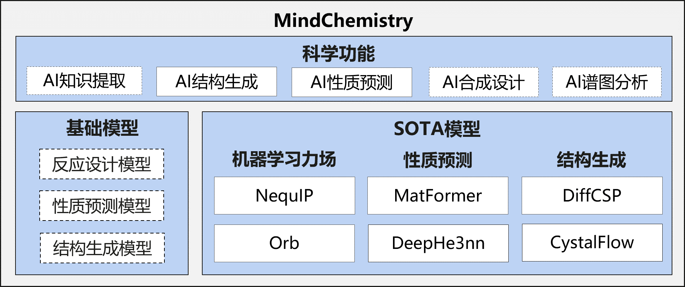

# MindSpore Chemistry

[View English](README.md)

---

## 目录

- [MindSpore Chemistry](#mindspore-chemistry)
    - [目录](#目录)
    - [介绍](#介绍)
    - [最新消息](#最新消息)
    - [模型与应用](#模型与应用)
        - [机器学习力场](#机器学习力场)
        - [性质预测](#性质预测)
        - [结构生成](#结构生成)
    - [社区](#社区)
        - [核心贡献者](#核心贡献者)
    - [贡献指南](#贡献指南)
    - [许可证](#许可证)
    - [引用](#引用)

---

## 介绍

传统化学研究长期以来面临着众多挑战，实验设计、合成、表征和分析的过程往往耗时、昂贵，并且高度依赖专家经验。AI与化学的协同可以克服传统方法的局限性、开拓全新的研究范式，结合AI模型与化学知识，可以高效处理大量数据、挖掘隐藏的关联信息，构建仿真模型，从而加快化学反应的设计和优化，实现材料的性质预测，并辅助设计新材料。

**MindSpore Chemistry**（MindChemistry）是基于 MindSpore 与 MindScience 构建的化学领域套件，支持多体系（有机/无机/复合材料化学）、多尺度任务（微观分子生成/预测、宏观反应优化）的AI+化学仿真，致力于高效使能AI与化学的融合研究，践行和牵引AI与化学联合多研究范式跃迁，为化学领域专家的研究提供全新视角与高效的工具。

---

## 最新消息

- `2025.07.07` 增加Orb模型支持；
- `2025.04.16` 增加CrystalFlow模型支持；
- `2025.03.30` MindChemistry 0.2.0版本发布，包括多个应用案例，支持NequIP、DeephE3nn、Matformer以及DiffCSP模型；
- `2024.07.30` MindChemistry 0.1.0版本发布；

---

## 模型与应用

下面是当前支持的主要模型及其用途概览，便于快速了解与定位示例：

---

### 机器学习力场

| 模型 | 体系 | 数据 | 任务 |
|---------|------|------|------|
| [NequIP](./applications/nequip/) | 小分子 | Revised Molecular Dynamics 17 (rMD17) 数据集 | 分子能量预测，基于等变计算与图神经网络 |
| [Orb](./applications/orb/) | 分子与晶体材料体系 | 大规模三维原子结构数据集，DFT 计算结果 | 通用图神经网络势，预测能量、力、应力，用于分子动力学模拟等 |

### 性质预测

| 模型 | 体系 | 数据 | 任务 |
|---------|------|------|------|
| [DeephE3nn](./applications/deephe3nn/) | 材料体系 | 双层石墨烯数据集 | 基于 E(3)-等变神经网络预测电子哈密顿量 |
| [Matformer](./applications/matformer/) | 晶体材料体系 | JARVIS-DFT 3D数据集 | 基于图神经网络 + Transformer 预测材料性质 |

### 结构生成

| 模型 | 体系 | 数据 | 任务 |
|---------|------|------|------|
| [DiffCSP](./applications/diffcsp/) | 晶体材料体系 | 稳定晶体结构数据集（MP-20、MPTS-52、Carbon-24等） | 基于联合扩散的晶体结构预测/生成 |
| [CrystalFlow](./applications/crystalflow/) | 晶体材料体系 | 材料数据库晶体结构数据集（MP-20、Carbon-24、MPTS-52等） | 基于归一化流的晶体结构生成 |

## 社区

### 核心贡献者

感谢以下开发者做出的贡献：

Danyang Chen, Jianhuan Cen, Kunming Xu, wujian, wangyuheng, Lin Peijia, gengchenhua, caowenbin，Siyu Yang

## 贡献指南

- 如何贡献您的代码，请点击此处查看：[贡献指南](https://gitee.com/mindspore/mindscience/blob/master/CONTRIBUTION.md)

## 许可证

[Apache License 2.0](http://www.apache.org/licenses/LICENSE-2.0)

## 引用

[1] Batzner S, Musaelian A, Sun L, et al. E(3)-equivariant graph neural networks for data-efficient and accurate interatomic potentials[J]. Nature communications, 2022, 13(1): 2453.

[2] Neumann M, Gin J, Rhodes B, Bennett S, Li Z, Choubisa H, Hussey A, Godwin J. Orb: A Fast, Scalable Neural Network Potential[J]. arXiv:2410.22570, 2024.

[3] Xiaoxun Gong, He Li, Nianlong Zou, et al. General framework for E(3)-equivariant neural network representation of density functional theory Hamiltonian[J]. Nature communications, 2023, 14: 2848.

[4] Keqiang Yan, Yi Liu, Yuchao Lin, Shuiwang ji, et al. Periodic Graph Transformers for Crystal Material Property Prediction[J]. arXiv:2209.11807v1 [cs.LG] 23 sep 2022.

[5] Jiao Rui and Huang Wenbing and Lin Peijia, et al. Crystal structure prediction by joint equivariant diffusion[J]. Advances in Neural Information Processing Systems, 2024, 36.

[6] Luo X, Wang Z, Wang Q, et al. CrystalFlow: a flow-based generative model for crystalline materials[J]. Nature communications, 2025, 16: 9267.

