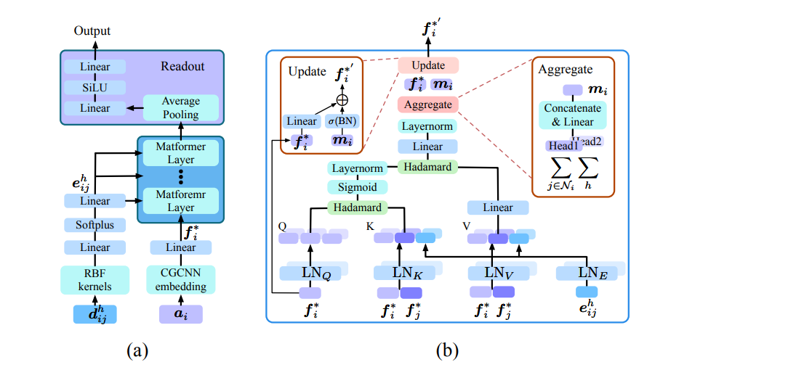

# MatFormer

## 背景简介

[MatFormer](https://arxiv.org/abs/2209.11807) 是基于 **图神经网络 (GNN)** 和
**Transformer** 架构的 SOTA 模型，专门用于预测晶体材料的多种性质。

该模型在周期性晶体图（Periodic Graph）上进行建模，能够同时捕捉局部与全局结构信息，并保持对晶格平移等对称性的鲁棒性。与传统模型（如 CGCNN、SchNet、MEGNet）相比，MatFormer 在形成能、带隙、晶格相关性质等任务上取得了更优的预测精度。

## 模型实现

### 硬件要求

- 当前脚本默认在 `Ascend` 设备上运行，具体设备类型和 `device_id` 由 `config.yaml`
  中 `train.device` 与 `train.device_id` 指定，并在 `train.py` 中读取。

### 版本依赖

- 需要安装 `MindSpore >= 2.7.0`。
- 需要安装 `MindScience`，以提供等变计算相关的基础组件。

### 安装

- 安装 MindSpore：参考官方安装指南 `https://www.mindspore.cn/install`
- 安装 MindScience：参考 `https://atomgit.com/mindspore-lab/mindscience`
- 安装依赖包：

```bash
pip install -r requirements.txt
```

### 数据集

- 从 <https://figshare.com/articles/dataset/jdft_3d-7-7-2018_json/6815699>
  下载 `jdft_3d-12-12-2022.json` 到当前目录，无需修改文件名。

#### 基本信息

- **数据集名称**：`jdft_3d-12-12-2022.json`
- **数据来源**：[JARVIS-DFT](https://jarvis.nist.gov/)
  （Joint Automated Repository for Various Integrated Simulations - Density Functional Theory）
- **规模**：共 **75,993** 个三维体相晶体结构
- **格式**：JSON
- **材料标识**：使用 `jid`（如 `JVASP-90856`）作为唯一 ID

#### 数据内容概览

该数据集包含通过密度泛函理论（DFT）计算的 **三维体相材料**（3D-bulk）的结构与性质，适用于材料发现、性质预测与机器学习建模等任务。

#### 主要字段说明

| 字段名 | 类型 | 说明 |
|-------|------|------|
| `jid` | str | JARVIS 唯一材料 ID（如 `JVASP-90856`） |
| `formula` | str | 化学式（如 `TiCuSiAs`） |
| `spg_number` / `spg_symbol` | int / str | 空间群编号与符号（如 129, `P4/nmm`） |
| `formation_energy_peratom` | float | 每原子形成能（eV/atom），越负越稳定 |
| `optb88vdw_bandgap` | float | OptB88vdW 泛函计算的带隙（eV） |
| `mbj_bandgap`, `hse_gap` | float | mBJ 或 HSE06 泛函计算的带隙（部分材料提供） |
| `atoms` | dict | **核心结构字段**，包含：<br>• `lattice_mat`: 晶格矩阵（3×3）<br>• `coords`: 原子坐标<br>• `elements`: 元素列表<br>• `cartesian`: 坐标是否为笛卡尔坐标（bool） |
| `density` | float | 材料密度（g/cm³） |
| `ehull` | float | 凸包能（eV/atom），< 0.1 eV/atom 通常视为稳定 |
| `func` | str | 使用的 DFT 泛函（如 `OptB88vdW`） |
| `dimensionality` | str | 材料维度（本集均为 `3D-bulk`） |
| `crys` | str | 晶系（如 `tetragonal`, `cubic`） |
| `nat` | int | 原子总数 |
| `reference` | str | 对应的 Materials Project ID（如 `mp-1080455`） |

### 核心代码实现

- 代码主要模块位于 `data` 与 `models` 文件夹：

```text
applications
  └── matformer
        ├── README.md                    # 英文说明
        ├── README_CN.md                 # 中文说明
        ├── config.yaml                  # 配置文件
        ├── train.py                     # 训练入口
        ├── predict.py                   # 推理入口
        ├── requirements.txt             # 环境依赖
        ├── matformer_application.ipynb  # Notebook（中文）
        ├── matformer_application_EN.ipynb  # Notebook（英文）
        ├── data
        |     ├── __init__.py            # 包初始化
        |     ├── data.py                # JARVIS 数据加载与图构建
        |     ├── features.py            # 特征工程工具
        |     ├── generate.py            # 数据预处理与划分
        |     └── graphs.py              # 晶体图与数据集定义
        ├── models
        |     ├── __init__.py
        |     ├── matformer.py           # MatFormer 主网络
        |     ├── transformer.py         # MatFormerConv 与 Transformer 模块
        |     ├── utils.py               # RBF 展开、学习率调度、损失记录
        |     └── graph
        |           ├── __init__.py
        |           ├── dataloader.py    # 图数据 DataLoader
        |           ├── graph.py         # 图操作与全局聚合
        |           ├── loss.py          # 带掩码的 L1/L2 损失
        |           └── normlization.py  # 归一化工具
        └── images
              ├── architecture.png       # 模型结构示意图
              └── result.png             # 预测结果示意图
```

- 模型主体由 `Matformer`（`models/matformer.py`）构成：通过 RBF 展开与多层 MatFormerConv，对节点与边特征进行多头注意力更新，并在图级进行池化得到材料属性预测；训练流程由 `train.py` 组织，包括数据预处理（`data/generate.py`）、图数据加载（`models/graph/dataloader.py`）、学习率调度（`OneCycleLr`）与损失统计（`LossRecord`）等。

### 模型架构



Matformer 的整体流程如下：

1. **输入特征提取**：
  - 原子特征 $ a_i $ 经过全连接嵌入层得到节点初始表示 $ f^*_i $。
  - 原子间距离 $ d_{ij}^h $ 通过 RBF 核函数展开为高斯径向基特征 $ e_{ij}^h $。
  - 边特征 $ e_{ij}^h $ 进一步经过 Linear + Softplus 变换后作为边输入。

2. **MatformerConv 堆叠**：
  - 多个 MatFormerConv 层依次堆叠，在周期性晶体图上对节点与边表示进行更新。
  - 每一层基于注意力机制聚合邻居信息，并结合边特征进行消息传递。

3. **读出层（Readout）**：
  - 所有节点的最终表示通过节点平均池化聚合为图级表示。
  - 经过 Linear → SiLU → Linear 的前馈模块得到最终性质预测（如形成能）。

## 模型运行步骤

### 训练

- 确保已完成以下准备：
- 安装 MindSpore、MindScience 及 Python 依赖；
- 下载 `jdft_3d-12-12-2022.json` 至当前目录；
- 在 `config.yaml` 中配置训练参数：
- `train.device`、`train.device_id`：运行设备；
- `train.props`：目标性质（如 `formation_energy_peratom`）；
- `train.epoch_size`、`train.batch_size`：训练轮数与批大小；
- 在 `matformer` 目录下执行：

```bash
python train.py
```

训练过程中会自动调用 `data/generate.py` 中的数据预处理与图构建函数，将原始 JARVIS 数据转换为图表示并缓存到 `dataset_dir`；模型权重会周期性保存到 `ckpt_dir`。

### 推理

- 将需要加载的权重路径写入 `config.yaml` 中 `predictor.checkpoint_path` 字段（默认 `./ckpt/best_matformer.ckpt`）。
- 在 `matformer` 目录下执行：

```bash
python predict.py
```

推理相关的轮数等参数由 `config.yaml` 中的 `predictor` 字段控制，预测结果在日志中输出，可根据实际任务进行保存与后处理。

### Notebook 运行

也可以通过提供的 Jupyter Notebook 逐步运行训练与验证代码：

- `matformer_application.ipynb`：中文 Notebook
- `matformer_application_EN.ipynb`：英文 Notebook

## 结果展示

下图展示了充分训练后模型对晶体材料形成能的预测表现，可以看出预测值与真实值高度接近，误差较小。


### 日志示例

`train.py` 运行日志示例如下：

```log
INFO:root:Loading from saved file...
INFO:root:The model you built has 2786689 parameters.
INFO:root:load from existing check point................
INFO:root:finish load from existing checkpoint, start training from epoch: 1
INFO:root:change learning rate to current step: 953
INFO:root:current learning rate: 9.345746e-08
INFO:root:Start to initialise train_loader
INFO:root:Start to initialise eval_loader
INFO:root:+++++++++++++++ start traning +++++++++++++++++++++
INFO:root:==============================step: 0 ,epoch: 0
INFO:root:learning rate: 9.345746e-08
INFO:root:train mse loss: 0.09808009
INFO:root:is_finite: True
INFO:root:traning time: 22.13266158103943
...
INFO:root:step:117, epoch: 499
INFO:root:validation mse loss: 0.004059551
INFO:root:validation mae loss: 0.034488887
INFO:root:validation time: 0.041112422943115234
INFO:root:epoch 499 running time: 137.772692
INFO:root:epoch 499 average train mse loss: 0.0003474082
INFO:root:epoch 499 average validation mse loss: 0.00414170
INFO:root:epoch 499 average validation mae loss: 0.03259226
```

Jupyter Notebook 日志示例如下：

```log
Model trainable parameters: %s 2786689
Starting new training process
.Saved best model at epoch %d, MSE: %.6f 0 0.0991247
Epoch 0 | Train MSE: 0.152263 | Val MSE: 0.099125 | Val MAE: 0.211994
```

## 许可证

- 开源协议：`Apache License 2.0`
- 许可证链接：`http://www.apache.org/licenses/LICENSE-2.0`

## 引用

- 如果本项目对您的研究有帮助，请引用相关工作，例如：
    - Keqiang Yan, Yi Liu, Yuchao Lin, Shuiwang Ji, et al. Periodic Graph Transformers for Crystal Material Property Prediction[J]. arXiv:2209.11807v1 [cs.LG], 2022.
