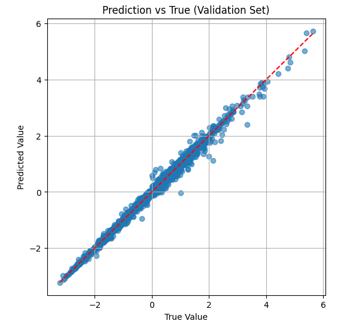

[ENFLISH](README.md) | 简体中文

# MatFormer：预测晶体材料原子单位的形成能

## 模型简介

### 背景

> [MatFormer](https://arxiv.org/abs/2209.11807) 是基于 **图神经网络 (GNN)** 和 **Transformer** 架构的 SOTA 模型，专门用于预测晶体材料的各种性质。  
> 该模型能够处理晶体材料的周期性图结构（Periodic Graph），在捕捉局部与全局结构信息的同时保持对周期性的不变性。相比传统模型（如 CGCNN、SchNet、MEGNet），Matformer 在晶体材料能量、带隙、晶格常数等性质预测上表现更优。

### 模型架构


Matformer 的整体流程如下：

1. **输入特征提取**：
   - 原子特征 $a_i$ 经过 CGCNN embedding 层得到节点初始表示 $f^*_i$。
   - 原子间距离 $d_{ij}^h$ 通过 RBF 核函数转换为高斯径向基特征 $e_{ij}^h$。
   - $e_{ij}^h$ 经过 Linear + Softplus 变换后作为边特征输入。

2. **Matformer Layer 堆叠**：
   - 多个 Matformer Layer 依次堆叠，每个层对节点和边信息进行更新。
   - 每一层接收当前节点状态 $f^*_i$ 和边特征 $e_{ij}^h$ 作为输入。

3. **读出层（Readout）**：
   - 所有节点的最终表示经过 Average Pooling 汇总。
   - 接着通过 Linear → SiLU → Linear 的结构输出最终预测结果。

---

每个 Matformer Layer 包含以下核心组件：

### 1. 注意力机制（Attention Mechanism）

- **Query (Q), Key (K), Value (V)**：
  - 分别由 $f^*_i$ 和 $f^*_j$ 经过不同的线性变换 $\text{LN}_Q, \text{LN}_K, \text{LN}_V$ 得到。
  - 边特征 $e_{ij}^h$ 经过 $\text{LN}_E$ 后也参与计算。

- **多头注意力（Multi-head Attention）**：
  - 图中展示了两个注意力头（Head1, Head2），实际可扩展。
  - 使用 Hadamard 积（逐元素乘积）融合节点特征与边特征。

- **注意力权重计算**：
  - Q 和 K 经过 LayerNorm、Sigmoid 和 Hadamard 操作生成注意力权重。
  - 最终注意力输出为：
    $$
    \sum_{j \in N_i} \sum_h [\text{Head1}, \text{Head2}]
    $$

### 2. 聚合（Aggregate）

- 将邻居节点的信息聚合为消息 $m_i$。
- 具体操作包括：
  - Concatenate 邻居信息。
  - 线性变换。
  - 通过两个注意力头（Head1, Head2）分别处理。

### 3. 更新（Update）

- 当前节点状态 $f^*_i$ 与聚合消息 $m_i$ 进行组合：
  $$
  f'_i = f^*_i \oplus m_i
  $$
  其中 $\oplus$ 表示残差连接或拼接。
- $m_i$ 经过 LayerNorm、Linear、Hadamard 和激活函数 $\sigma(\text{BN})$ 后更新。

### 4. 归一化与非线性激活

- 使用 LayerNorm 和 Sigmoid 等归一化与激活函数稳定训练过程。
- Hadamard 用于融合不同路径的信息。

---

## 数据集

> 从<https://figshare.com/articles/dataset/jdft_3d-7-7-2018_json/6815699> 下载 jdft_3d-12-12-2022.json 到当前目录，不需要修改其文件名。

### 基本信息

- **数据集名称**：`jdft_3d-12-12-2022.json`
- **数据来源**：[JARVIS-DFT](https://jarvis.nist.gov/)（Joint Automated Repository for Various Integrated Simulations - Density Functional Theory）
- **数据规模**：共 **75,993** 个三维晶体结构
- **数据格式**：JSON 格式
- **材料标识**：使用 `jid`（如 `JVASP-90856`）作为唯一 ID

---

### 数据内容概览

该数据集包含通过密度泛函理论（DFT）计算的 **三维体相材料**（3D-bulk）的结构与性质，适用于材料发现、性质预测、机器学习建模等任务。

---

### 主要字段说明

| 字段名 | 类型 | 说明 |
|-------|------|------|
| `jid` | str | JARVIS 唯一材料 ID（如 `JVASP-90856`） |
| `formula` | str | 化学式（如 `TiCuSiAs`） |
| `spg_number` / `spg_symbol` | int / str | 空间群编号与符号（如 129, `P4/nmm`） |
| `formation_energy_peratom` | float | 每原子生成能（eV/atom），越负越稳定 |
| `optb88vdw_bandgap` | float | OptB88vdW 泛函计算的带隙（eV） |
| `mbj_bandgap`, `hse_gap` | float | mBJ 或 HSE06 泛函计算的带隙（部分材料有） |
| `atoms` | dict | **核心结构字段**，包含：<br>• `lattice_mat`: 晶格矩阵（3×3）<br>• `coords`: 原子坐标<br>• `elements`: 元素列表<br>• `cartesian`: 坐标是否为笛卡尔坐标（bool） |
| `density` | float | 材料密度（g/cm³） |
| `ehull` | float | 凸包能（eV/atom），< 0.1 eV/atom 视为稳定 |
| `func` | str | 使用的 DFT 泛函（如 `OptB88vdW`） |
| `dimensionality` | str | 材料维度（本集均为 `3D-bulk`） |
| `crys` | str | 晶系（如 `tetragonal`, `cubic`） |
| `nat` | int | 原子总数 |
| `reference` | str | 对应的 Materials Project ID（如 `mp-1080455`） |

---

## 环境要求

> 1. 安装`mindspore`
> 2. 安装`mindscience`

## 快速入门

### 训练方式一：

```bash
pip install -r requirements.txt
python train.py
```

训练所需的参数配置都在config.yaml中存放，可直接通过修改config.yaml中的内容控制训练参数。

将权重的path写入config文件的predictor.checkpoint_path中

```bash
python predict.py
```
所需的参数配置都在config.yaml中存放。

### 运行方式二：运行Jupyter Notebook

您可以使用[中文版](matformer_application.ipynb)和[英文版](matformer_application_EN.ipynb)Jupyter Notebook逐行运行训练和验证代码。

## 结果展示

下图为经过充分训练的模型对晶体材料形成能的预测，可以看出预测的误差与真实值差距很小。


### 日志

`train.py`运行日志如下：

```log
INFO:root:The model you built has 2786689 parameters.
INFO:root:Starting new training process
INFO:root:Start to initialise train loader
INFO:root:Start to initialise eval loader
INFO:root:+++++++++++++++ start traning +++++++++++++++++++++
INFO:root:==============================step: 0 ,epoch: 0
INFO:root:learning rate: 4e-05
INFO:root:train mse loss: 0.8999285
INFO:root:is_finite: True
INFO:root:training time: 51.66963744163513
.
.
.
INFO:root:step:117, epoch: 499
INFO:root:validation mse loss: 0.004059551
INFO:root:validation mae loss: 0.034488887
INFO:root:validation time: 0.041112422943115234
INFO:root:epoch 499 running time: 137.772692
INFO:root:epoch 499 average train mse loss: 0.0003474082
INFO:root:epoch 499 average validation mse loss: 0.00414170
INFO:root:epoch 499 average validation mae loss: 0.03259226
```

Jupyter Notebook日志如下：

```log
Model trainable parameters: %s 2786689
Starting new training process
.Saved best model at epoch %d, MSE: %.6f 0 0.0991247
Epoch 0 | Train MSE: 0.152263 | Val MSE: 0.099125 | Val MAE: 0.211994
```