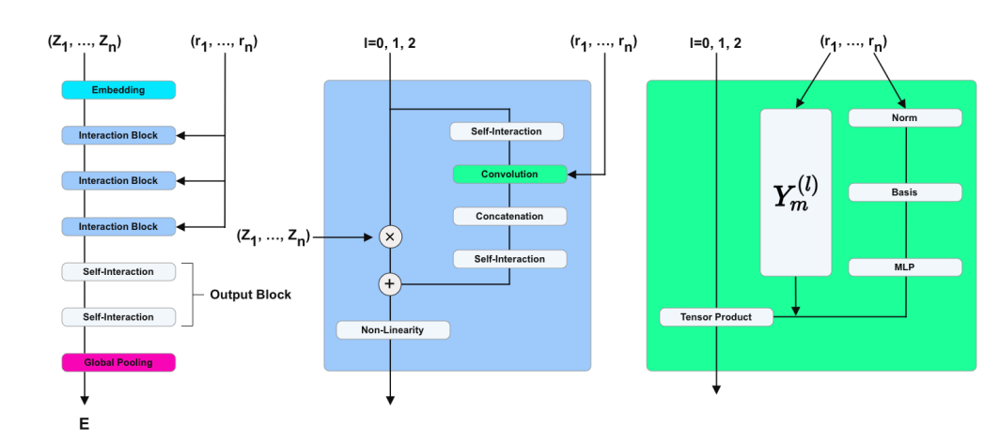
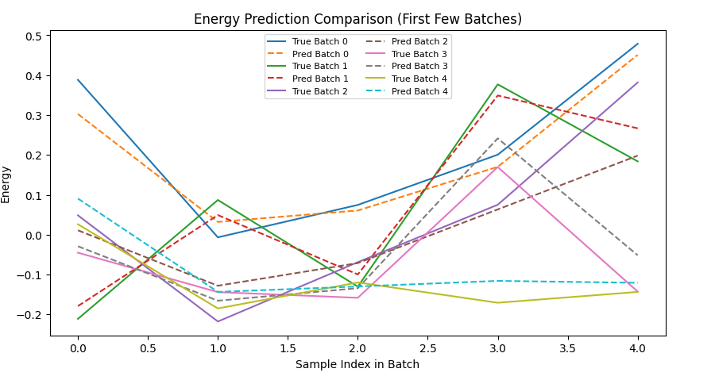

# NequIP

## 背景简介

论文链接：[NequIP](https://arxiv.org/abs/2101.03164)。
**NequIP (Neural Equivariant Interatomic Potential)** 是一种基于 **E(3)-等变图神经网络 (E(3)-Equivariant Graph Neural Network)** 的分子势能预测模型。
其核心思想是利用物理对称性（旋转、平移、反射）保持模型的预测结果与实际分子体系的物理不变性一致。

相比传统的原子势模型（如 Behler–Parrinello 网络或基于手工特征的 SOAP 方法），NequIP 具有以下显著优点：

- **物理一致性 (Physical Consistency)**：模型输出在三维空间的旋转和平移下保持等变性；
- **高数据效率 (Data Efficiency)**：在极少训练样本下即可达到量子化学精度；
- **通用性与可扩展性 (Generalizability)**：适用于多种分子或材料体系的势能预测。

## 模型实现

### 硬件要求

- 训练脚本 `train.py` 当前在 `Ascend` 设备上验证通过，可通过 `--device_target` 和 `--device_id` 指定卡号（见 `train.py`）。
- 推理脚本 `predict.py` 支持 `Ascend` 后端，可通过 `--device_target` 切换（见 `predict.py`）。

### 版本依赖

- 建议使用 `MindSpore >= 2.7.0`。
- 需要安装 `MindScience`，以提供等变计算相关的基础组件。

### 安装

- 安装 MindSpore：参考官方安装指南 `https://www.mindspore.cn/install`
- 安装 MindScience：参考 `https://atomgit.com/mindspore-lab/mindscience`

### 模型架构

NequIP 的核心结构基于消息传递神经网络(Message Passing Neural Network, MPNN)，并在特征空间中引入了球谐张量表示(Spherical Harmonic Tensor Representations)，从而在三维空间中实现 E(3) 群等变性。



1. **Input Embedding 层**
   输入原子种类（原子序号）与坐标信息。
   原子被映射为初始特征向量，坐标用于计算原子对间距离。

2. **Message Passing Layers 消息传递层**
   每一层对邻近原子间的相互作用进行更新。
   消息以球谐张量的形式进行编码，从而保证旋转等变性。
   特征更新遵循：

   $$
   h_i^{(l+1)} = \sum_{j \in \mathcal{N}(i)} \Phi\left(h_i^{(l)}, h_j^{(l)}, r_{ij}\right)
   $$

   其中 $r_{ij}$ 表示原子间相对位置，$\Phi$ 为等变线性层。

3. **Tensor Product 层**
   用于在特征更新时维持 E(3)-等变性。
   通过对张量特征与球谐基函数进行张量积操作，实现方向依赖的消息传递。

4. **Readout 层**
   聚合节点特征，输出分子的总势能 **$E$**。
   原子力通过能量对坐标的梯度计算获得：

   $$
   \mathbf{F}_i = -\frac{\partial E}{\partial \mathbf{r}_i}
   $$

### 数据集

本实验使用的数据集为 **RMD17** 数据集中的 **Uracil 分子** 子集，文件路径：`dataset/RMD17/npz_data/rmd_uracil.npz`。

- **数据集名称**：`rmd17_uracil.npz`
- **数据来源**：[Revised MD-17 (RMD-17)](https://figshare.com/articles/dataset/Revised_MD17_dataset_rMD17_/12672038)
- **目标分子**：**尿嘧啶（Uracil）**
- **数据格式**：`.npz`（NumPy 压缩格式）
- **原子数**：每构型 **24个原子**（含氢）

该数据集包含尿嘧啶分子在分子动力学（MD）模拟中的 **原子构型轨迹** 与对应的 **高精度量子力学能量和力**，数据经过修正以解决原始 MD-17 的能量不一致性问题。
所有构型共享相同的原子序数列表（`nuclear_charges`），适用于：

- 分子势能面建模
- 机器学习力场（MLFF）训练
- 图神经网络（GNN）在分子系统上的能量与力联合预测

#### 原始字段说明（`.npz` 文件）

| 字段名 | 形状 | 类型 | 说明 |
|-------|------|------|------|
| `nuclear_charges` | `(24,)` | int | 每个原子的原子序数（Z），全局共享，不随构型变化 |
| `coords` | `(N, 24, 3)` | float | 所有构型的原子坐标（单位：Å） |
| `energies` | `(N,)` | float | 每个构型的标量能量（单位：kcal/mol） |
| `forces` | `(N, 24, 3)` | float | 每个原子在每个构型中所受的力（单位：kcal/mol/Å） |

### 核心代码实现

- 代码主要模块位于 `models` 与 `src` 文件夹：

```text
applications
  └── nequip
        ├── rmd.yaml               # 配置文件
        ├── train.py               # 训练入口
        ├── predict.py             # 推理入口
        ├── README.md              # 英文说明
        ├── README_CN.md           # 中文说明
        ├── nequip.ipynb           # 中文 Notebook 示例
        ├── nequip_en.ipynb        # 英文 Notebook 示例
        ├── images
        |     ├── architecture.png # 模型结构示意图
        |     └── result.png       # 结果可视化
        ├── models
        |     ├── nequip.py        # 模型主体
        |     ├── convolution.py   # 等变卷积层
        |     ├── embedding.py     # 原子嵌入模块
        |     ├── graph.py         # 图结构构建
        |     ├── message_passing.py # 消息传递层
        |     └── utils.py         # 模型工具函数
        └── src
              ├── dataset.py       # 数据集加载与预处理
              ├── trainer.py       # 训练流程封装
              ├── predicter.py     # 推理与评估工具
              └── utils.py         # 日志与通用工具
```

## 模型运行步骤

### 训练

在运行前，可根据需要修改 `rmd.yaml` 中的训练相关配置（如数据路径、批大小、学习率等）。然后执行：

```bash
python train.py --config_file_path ./rmd.yaml --mode GRAPH --device_target Ascend --device_id 0 --dtype float32
```

参数说明：

- `--config_file_path`：指定配置文件位置。
- `--mode`：运行模式，`GRAPH` 表示静态图以提升执行效率。
- `--device_target`：指定设备类型，训练阶段建议使用 `Ascend`。
- `--device_id`：运行卡号。
- `--dtype`：设定计算精度类型（如 `float32`）。

### 推理

在完成训练并保存模型参数后，可使用 `predict.py` 进行能量与力的预测：

```bash
python predict.py --config_file_path ./rmd.yaml --mode GRAPH --device_target Ascend --device_id 0 --dtype float32
```

推理阶段各参数含义与训练脚本基本一致，更多配置请参考 `rmd.yaml` 与 `predict.py`。

### Notebook 运行

您可以使用 [中文版](nequip.ipynb) 和 [英文版](nequip_en.ipynb) Jupyter Notebook 逐行运行训练和验证代码。

### 评估

下图展示了对分子能量预测的结果。从图中可以看出，预测结果与真实结果的变化趋势基本一致：



训练过程日志示例：

```bash
python train.py --config_file_path ./rmd.yaml --mode GRAPH --device_target Ascend --device_id 0 --dtype float32
```

```log
2024-03-25 21:49:49 (INFO): ---- Configuration Summary -----
.
.
.
2024-03-25 21:49:49 (INFO): --------------------------------
2024-03-25 21:49:49 (INFO): Loading data...
2024-03-25 21:50:13 (INFO): Initializing model...
2024-03-25 21:50:37 (INFO): Initializing train...
2024-03-25 22:01:58 (INFO): epoch 1:  train loss: 1000.02729235, time gap: 680.55, total time used: 680.55
.
.
.
```

notebook 运行日志示例：

```log
Epoch 1/2: 100%
 190/190 [06:24<00:00,  1.01it/s]
.......
Epoch 2/2: 100%
 190/190 [03:33<00:00,  1.15s/it]
```

## 许可证

- 开源协议：`Apache License 2.0`
- 许可证链接：http://www.apache.org/licenses/LICENSE-2.0

## 引用

- 如果本项目对您的研究有帮助，请引用相关工作：
    - Batzner S, Musaelian A, Sun L, et al. E(3)-equivariant graph neural networks for data-efficient and accurate interatomic potentials[J]. Nature Communications, 2022, 13: 2453.
