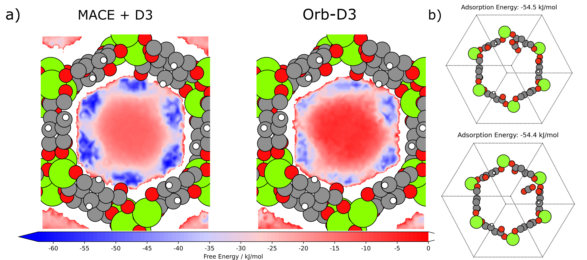

# Orb

## 概述

> 材料科学中，设计新型功能材料一直是新兴技术的关键部分。然而，传统的从头算计算方法在设计新型无机材料时速度慢且难以扩展到实际规模的系统。近年来，深度学习方法在多个领域展示了其强大的能力，能够通过并行架构高效运行。ORB模型的核心创新在于将这种深度学习方法应用于材料建模，通过可扩展的图神经网络架构学习原子间相互作用的复杂性。ORB模型是一个基于图神经网络（GNN）的机器学习力场（MLFF），设计为通用的原子间势能模型，适用于多种模拟任务（几何优化、蒙特卡洛模拟和分子动力学模拟）。该模型的输入是一个图结构，包含原子的位置、类型以及系统配置（如晶胞尺寸和边界条件）；输出包括系统的总能量、每个原子的力向量以及单元格应力。与现有的开源神经网络势能模型（如MACE）相比，ORB模型在大系统规模下的速度提高了3-6倍。在Matbench Discovery基准测试中，ORB模型的误差比其他方法降低了31%，并且在发布时成为该基准测试的最新最佳模型。ORB模型在零样本评估中表现出色，即使在没有针对特定任务进行微调的情况下，也能在高温度非周期分子的分子动力学模拟中保持稳定。



> 上图中：(a) 通过Widom插入法在Mg-MOF-74中获得的MACE + D3（左）和Orb-D3（右）自由能表面。开放金属位点附近的蓝色区域代表最低自由能，表明这些是CO2的优势吸附位点。(b) CO2在Mg-MOF-74中的吸附位置，展示了通过Widom插入法获得的两个最有利的吸附位点，其吸附能分别为-54.5 kJ/mol和-54.4 kJ/mol。虽然Orb和MACE预测的能量极小值位置相似，但ORB的自由能最小值与实验测得的吸附热（-44 kJ/mol）数值更为接近。

## 环境要求

> 1. 安装`mindspore（2.7.0）`
> 2. 安装依赖包：`pip install -r requirement.txt`

## 快速入门

> 1. 在[数据集链接](https://download-mindspore.osinfra.cn/mindscience/mindchemistry/orb/dataset/)下载相应的数据集并放在`dataset`目录下
> 2. 在[模型链接](https://download-mindspore.osinfra.cn/mindscience/mindchemistry/orb/orb_ckpts/)下载orb预训练模型ckpt并放在`orb_ckpts`目录下
> 3. 安装依赖包：`pip install -r requirement.txt`
> 4. 单卡训练命令： `bash run.sh`
> 5. 多卡训练命令： `bash run_parallel.sh`
> 6. 评估命令： `python evaluate.py`
> 7. 模型预测结果会存在`results`目录下

### 代码目录结构

```text
代码主要模块在src文件夹下，其中dataset文件夹下是数据集，orb_ckpts文件夹下是预训练模型和训练好的模型权重文件，configs文件夹下是各代码的参数配置文件。

orb_models                                           # ORB 预训练 / 微调工程
├── dataset
│   ├── train_mptrj_ase.db                           # 微调训练集（ASE 轨迹，SQLite 格式）
│   └── val_mptrj_ase.db                             # 微调验证 / 测试集
│
├── orb_ckpts                                        # 预训练 & 微调模型 ckpt 存放目录
│   └── orb-mptraj-only-v2.ckpt                      # 仅 mptraj 任务的预训练 ORB 模型
│
├── configs                                          # 训练 / 推理配置
│   ├── config.yaml                                  # 单卡训练配置（学习率、batch_size 等）
│   ├── config_parallel.yaml                         # 多卡数据并行训练配置
│   └── config_eval.yaml                             # 推理 / 评估配置
│
├── src                                              # 数据处理与训练核心源码
│   ├── __init__.py                                  # src 包初始化
│   ├── ase_dataset.py                               # ASE 数据集读取与封装（读 SQLite、组装原子图）
│   ├── atomic_system.py                             # 原子系统数据结构定义（坐标、原子种类、晶胞信息等）
│   ├── base.py                                      # 通用基类与工具（batch_graphs 等图数据打包）
│   ├── featurization_utilities.py                   # 原子系统 → 模型输入特征张量的特征化工具
│   ├── pretrained.py                                # 预训练 ORB 模型构造与加载接口
│   ├── property_definitions.py                      # 能量 / 力 / 应力等物理量配置与命名
│   ├── trainer.py                                   # 训练循环与 OrbLoss 等损失封装
│   ├── segment_ops.py                               # segment_sum / mean / max 等分段归约算子
│   └── utils.py                                     # 通用工具函数（随机种子、日志、优化器、LR scheduler 等）
│
├── models                                           # 模型结构定义（GNN / ORB 等）
│   ├── __init__.py                          # orb 子包初始化
│   ├── gns.py                               # GNS(Graph Network Simulator) 相关结构 / 接口
│   ├── orb.py                               # ORB 主体网络（encoder + heads）
│   └── utils.py                             # ORB 内部工具与辅助模块
│
├── finetune.py                                      # 模型微调入口脚本
├── evaluate.py                                      # 推理 / 评估入口脚本
│
├── run.sh                                           # 单卡训练启动脚本（调用 finetune.py + config.yaml）
├── run_parallel.sh                                  # 多卡并行训练启动脚本（msrun + config_parallel.yaml）
└── requirement.txt                                  # Python 依赖列表（环境搭建用）

```  

## 下载数据集

在[数据集链接](https://download-mindspore.osinfra.cn/mindscience/mindchemistry/orb/dataset/)下载训练和测试数据集放置于当前路径的dataset文件夹下（如果没有需要自己手动创建）；在[模型链接](https://download-mindspore.osinfra.cn/mindscience/mindchemistry/orb/orb_ckpts/)下载orb预训练模型`orb-mptraj-only-v2.ckpt`放置于当前路径的orb_ckpts文件夹下（如果没有需要自己手动创建）；文件路径参考[代码目录结构](#代码目录结构)

## 训练过程

### 单卡训练

更改`configs/config.yaml`文件中训练参数:

> 1. 设置微调阶段的训练和测试数据集，见`data_path`字段
> 2. 设置训练加载的预训练模型权重文件，更改`checkpoint_path`路径字段
> 3. 其它训练设置见Training Configuration部分

```bash
pip install -r requirement.txt
bash run.sh
```

代码运行结果如下所示：

```log
==============================================================================================================
Please run the script as:
bash run.sh
==============================================================================================================
Loading datasets: dataset/train_mptrj_ase.dbTotal train dataset size: 800 samples
Loading datasets: dataset/val_mptrj_ase.dbTotal train dataset size: 200 samples
Model has 25213610 trainable parameters.
Epoch: 0/100,
 train_metrics: {'data_time': 0.00010895108183224995, 'train_time': 386.58018293464556, 'energy_reference_mae': 5.598883946736653, 'energy_mae': 3.3611322244008384, 'energy_mae_raw': 103.14391835530598, 'stress_mae': 41.36046473185221, 'stress_mae_raw': 12.710869789123535, 'node_mae': 0.02808943825463454, 'node_mae_raw': 0.0228044210622708, 'node_cosine_sim': 0.7026202281316122, 'fwt_0.03': 0.23958333333333334, 'loss': 44.74968592325846}
 val_metrics: {'energy_reference_mae': 5.316623687744141, 'energy_mae': 3.594848871231079, 'energy_mae_raw': 101.00129699707031, 'stress_mae': 30.630516052246094, 'stress_mae_raw': 9.707925796508789, 'node_mae': 0.017718862742185593, 'node_mae_raw': 0.014386476017534733, 'node_cosine_sim': 0.5506304502487183, 'fwt_0.03': 0.375, 'loss': 34.24308395385742}

...

Epoch: 99/100,
 train_metrics: {'data_time': 7.802306208759546e-05, 'train_time': 59.67856075416785, 'energy_reference_mae': 5.5912095705668134, 'energy_mae': 0.007512244085470836, 'energy_mae_raw': 0.21813046435515085, 'stress_mae': 0.7020445863405863, 'stress_mae_raw': 2.222463607788086, 'node_mae': 0.04725319395462672, 'node_mae_raw': 0.042800972859064736, 'node_cosine_sim': 0.3720853428045909, 'fwt_0.03': 0.09895833333333333, 'loss': 0.7568100094795227}
 val_metrics: {'energy_reference_mae': 5.308632850646973, 'energy_mae': 0.27756747603416443, 'energy_mae_raw': 3.251189708709717, 'stress_mae': 2.8720269203186035, 'stress_mae_raw': 9.094478607177734, 'node_mae': 0.05565642938017845, 'node_mae_raw': 0.05041291564702988, 'node_cosine_sim': 0.212838813662529, 'fwt_0.03': 0.19499999284744263, 'loss': 3.2052507400512695}
Checkpoint saved to orb_ckpts/
Training time: 7333.08717 seconds
```

### 多卡并行训练

更改`configs/config_parallel.yaml`和`run_parallel.sh`文件中训练参数:

> 1. 设置微调阶段的训练和测试数据集，见`data_path`字段
> 2. 设置训练加载的预训练模型权重文件，更改`checkpoint_path`路径字段
> 3. 其它训练设置见Training Configuration部分
> 4. 修改`run_parallel.sh`文件中`--worker_num=4 --local_worker_num=4`来设置调用的卡的数量

```bash
pip install -r requirement.txt
bash run_parallel.sh
```

代码运行结果如下所示：

```log
Loading datasets: dataset/train_mptrj_ase.dbTotal train dataset size: 800 samples
Loading datasets: dataset/train_mptrj_ase.dbTotal train dataset size: 800 samples
Loading datasets: dataset/train_mptrj_ase.dbTotal train dataset size: 800 samples
Loading datasets: dataset/train_mptrj_ase.dbTotal train dataset size: 800 samples
Loading datasets: dataset/val_mptrj_ase.dbTotal train dataset size: 200 samples
Loading datasets: dataset/val_mptrj_ase.dbTotal train dataset size: 200 samples
Loading datasets: dataset/val_mptrj_ase.dbTotal train dataset size: 200 samples
Loading datasets: dataset/val_mptrj_ase.dbTotal train dataset size: 200 samples
Model has 25213607 trainable parameters.
Model has 25213607 trainable parameters.
Model has 25213607 trainable parameters.
Model has 25213607 trainable parameters.

...

Training time: 2375.89474 seconds
Training time: 2377.02413 seconds
Training time: 2377.22778 seconds
Training time: 2376.63176 seconds
```

在相同的训练配置下，并行训练相比单卡训练取得了显著的性能提升：

- 单卡训练耗时：7293.28995 seconds
- 4卡并行训练耗时：2377.22778 seconds
- 性能提升：67.40%
- 加速比：3.07倍

### 推理

更改`configs/config_eval.yaml`文件中推理参数:

> 1. 设置测试数据集，见`val_data_path`字段
> 2. 设置推理加载的预训练模型权重文件，更改`checkpoint_path`路径字段
> 3. 其它训练设置见Evaluating Configuration部分

```bash
python evaluate.py
```

代码运行结果如下所示：

```log
Loading datasets: dataset/val_mptrj_ase.dbTotal train dataset size: 200 samples
Model has 25213607 trainable parameters.
.Validation loss: 0.89507836
    energy_reference_mae: 5.3159098625183105
    energy_mae: 0.541229784488678
    energy_mae_raw: 4.244375228881836
    stress_mae: 0.22862032055854797
    stress_mae_raw: 10.575761795043945
    node_mae: 0.12522821128368378
    node_mae_raw: 0.04024107754230499
    node_cosine_sim: 0.38037967681884766
    fwt_0.03: 0.22499999403953552
    loss: 0.8950783610343933
```
