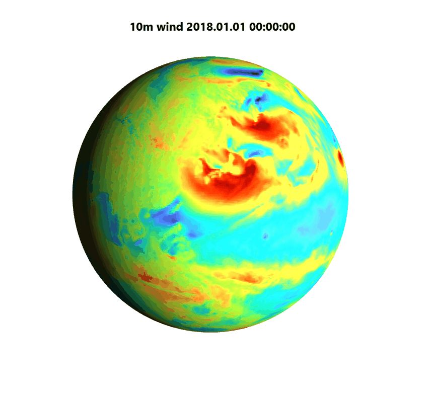
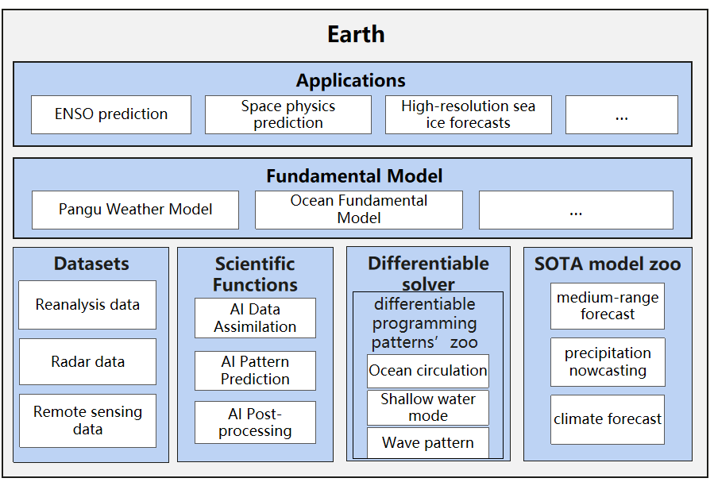

 ENGLISH | [简体中文](README_CN.md)


[](https://gitee.com/mindspore/mindscience/pulls)
[](https://github.com/mindspore-ai/mindspore/blob/master/LICENSE)

# **MindEarth**

- [Introduction](#Introduction)
- [Latest News](#Latest-News)
- [Applications](#Applications)
    - [Precipitation Nowcasting](#Precipitation-Nowcasting)
    - [Medium-range Forecast](#Medium-range-Forecast)
    - [Data Preprocessing](#Data-Preprocessing)
- [Installation](#Installation)
    - [Version Dependency](#Version-Dependency)
    - [Install Dependency](#Install-Dependency)
    - [Hardware](#Hardware)
    - [pip install](#pip-install)
    - [source code install](#source-code-install)
- [Community](#Community)
    - [Core Contributor](#Core-Contributor)
- [Contribution Guide](#Contribution-Guide)
- [License](#License)

## **Introduction**



Weather phenomena are closely related to human production and life, social economy, military activities and other aspects. Accurate weather forecasts can mitigate the impact of disaster weather events, avoid economic losses, and generate continuous fiscal revenue, such as energy, agriculture, transportation and entertainment industries. At present, the weather forecast mainly adopts numerical weather prediction models, which processes the observation data collected by meteorological satellites, observation stations and radars, solves the atmospheric dynamic equations describing weather evolution, and then provides weather and climate prediction information. The prediction process of numerical prediction model involves a lot of computation, which consumes a long time and a large amount of computation resources. Compared with the numerical prediction model, the data-driven deep learning model can effectively reduce the computational cost by several orders of magnitude.


MindEarth is an earth science suite developed based on [MindSpore](https://www.mindspore.cn/). It supports AI meteorological prediction of short-term, medium-term, and long-term weather and catastrophic weather such as precipitation and typhoon. The aim is to provide efficient and easy-to-use AI meteorological prediction software for industrial scientific research engineers, college teachers and students.

<div align=center></div>

## **Latest News**

- 🔥`2023.02.06` MindSpore Helps Ocean Terrain Overscore: Huang Xiaomeng Team of Tsinghua University Releases Global 3 Arc Second (90 m) Sea and Land DEM Data Products.[Page](https://blog.csdn.net/Kenji_Shinji/article/details/128906754).

## Applications

### Precipitation Nowcasting

|        Case            |        Dataset               |    Network       |  GPU    |  NPU  |
|:----------------------:|:--------------------------:|:---------------:|:-------:|:------:|
|DGMs       |             Radar dataset             | GAN、ConvGRU |   ✔️     |   ✔️   |

### Medium-range Forecast

|        Case            |              Dataset                  |    Network       |  GPU    |  NPU  |
|:----------------------:|:-------------------------------------:|:---------------:|:-------:|:------:|
|FourCastNet        |       ERA5 Reanalysis Dataset       |      AFNO      |   ✔️     |   ✔️   |
|ViT-KNO       | ERA5 Reanalysis Dataset     |       ViT       |   ✔️     |   ✔️   |
|GraphCast        |      ERA5 Reanalysis Dataset      |       GNN       |   ✔️     |   ✔️   |

### Data Preprocessing

|          Case              |        Dataset               |    Network       |  GPU    |  NPU  |
|:--------------------------:|:--------------------------:|:---------------:|:-------:|:------:|
|   DEM Super-resolution   | NASADEM、GEBCO_2021 |    SRGAN    |   ✔️     |   ✔️   |

## **Installation**

### Version Dependency

Because MindEarth is dependent on MindSpore, please click [MindSpore Download Page](https://www.mindspore.cn/versions) according to the corresponding relationship indicated in the following table. Download and install the corresponding whl package.

| MindEarth |                                  Branch                                |  MindSpore  |Python |
|:--------:|:----------------------------------------------------------------------:|:-----------:|:-------:|
|  master  | [master](https://gitee.com/mindspore/mindscience/tree/master/MindEarth) |        \       | \>=3.7 |
|  0.1.0  | [r0.5](https://gitee.com/mindspore/mindscience/tree/r0.5/MindEarth) |        >=1.8.1       | \>=3.7 |

### Install Dependency

```bash
pip install -r requirements.txt
```

### Hardware

| Hardware      | OS              | Status |
|:--------------| :-------------- | :--- |
| Ascend 910    | Ubuntu-x86      | ✔️ |
|               | Ubuntu-aarch64  | ✔️ |
|               | EulerOS-aarch64 | ✔️ |
|               | CentOS-x86      | ✔️ |
|               | CentOS-aarch64  | ✔️ |
| GPU CUDA 11.1 | Ubuntu-x86      | ✔️ |

### **pip install**

```bash
# gpu and ascend are supported
export DEVICE_NAME=gpu
pip install mindearth_${DEVICE_NAME}
```

### **source code install**

- Download source code from Gitee.

```bash
git clone https://gitee.com/mindspore/mindscience.git
cd {PATH}/mindscience/MindEarth
```

- Compile in Ascend backend.

```bash
bash build.sh -e ascend -j8
```

- Compile in GPU backend.

```bash
export CUDA_PATH={your_cuda_path}
bash build.sh -e gpu -j8
```

- Install the compiled .whl file.

```bash
cd {PATH}/mindscience/MindEarth/output
pip install mindearth_*.whl
```

## **Community**

### Core Contributor

Thanks goes to these wonderful people 🧑‍🤝‍🧑:

yufan, wangzidong, liuhongsheng, zhouhongye, liulei, libokai, chengqiang, dongyonghan, zhouchuansai

## **Contribution Guide**

- Please click here to see how to contribute your code:[Contribution Guide](https://gitee.com/mindspore/mindscience/blob/master/CONTRIBUTION.md)

## **License**

[Apache License 2.0](http://www.apache.org/licenses/LICENSE-2.0)