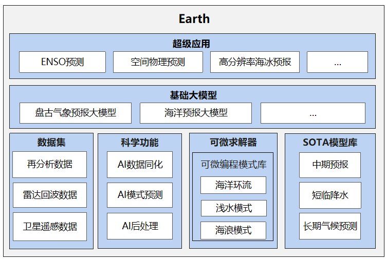

[ENGLISH](README.md) | 简体中文


[](https://gitee.com/mindspore/mindscience/pulls)
[](https://github.com/mindspore-ai/mindspore/blob/master/LICENSE)

# **MindEarth**

- [MindEarth介绍](#MindEarth介绍)
- [最新消息](#最新消息)
- [应用案例](#应用案例)
    - [短临降水](#物理驱动)
    - [中期气象预报](#中期气象预报)
    - [数据前处理](#数据前处理)
- [安装教程](#安装教程)
    - [依赖安装](#依赖安装)
    - [硬件支持情况](#硬件支持情况)
    - [pip安装](#pip安装)
    - [源码安装](#源码安装)
- [社区](#社区)
  - [核心贡献者](#核心贡献者)
- [贡献指南](#贡献指南)
- [许可证](#许可证)

## **MindEarth介绍**


天气现象与人类的生产生活、社会经济、军事活动等方方面面都密切相关，准确的天气预报能够在灾害天气事件中减轻影响、避免经济损失，还能创造持续不断地财政收入，例如能源、农业、交通和娱乐行业。目前，天气预报主要采用数值天气预报模式，通过处理由气象卫星、观测台站、雷达等收集到的观测资料，求解描写天气演变的大气动力学方程组，进而提供天气气候的预测信息。数值预报模式的预测过程涉及大量计算，耗费较长时间与较大的计算资源。相较于数值预报模式，数据驱动的深度学习模型能够有效地将计算成本降低数个量级。


MindEarth是基于[昇思MindSpore](https://www.mindspore.cn/)开发的地球科学领域套件，支持短临、中期、长期等多时空尺度以及降水、台风等灾害性天气的AI气象预测，旨在于为广大的工业界科研工程人员、高校老师及学生提供高效易用的AI气象预测软件。

<div align=center></div>

## **最新消息**

- 🔥 `2023.02.06` 昇思MindSpore助力海洋地形超分：清华大学黄小猛团队发布全球3弧秒（90 m）海陆DEM数据产品， [相关新闻](https://blog.csdn.net/Kenji_Shinji/article/details/128906754)。

## 应用案例

### 短临降水

|        案例            |        数据集               |    模型架构       |  GPU    |  NPU  |
|:----------------------:|:--------------------------:|:---------------:|:-------:|:------:|
| DGMs |          雷达数据            |     GAN、ConvGRU     |   ✔️     |   ✔️   |

### 中期气象预报

|        案例            |        数据集               |    模型架构       |  GPU    |  NPU  |
|:----------------------:|:--------------------------:|:---------------:|:-------:|:------:|
|FourCastNet                  |    ERA5再分析数据集    |     AFNO       |   ✔️     |   ✔️   |
|ViT-KNO         | ERA5再分析数据集 |   ViT    |   ✔️     |   ✔️   |
|GraphCast         | ERA5再分析数据集 |       GNN       |   ✔️     |   ✔️   |

### 数据前处理

|          案例              |        数据集               |    模型架构       |  GPU    |  NPU  |
|:-------------------------:|:--------------------------:|:---------------:|:-------:|:------:|
|   DEM超分辨率   | NASADEM、GEBCO_2021 |    SRGAN    |   ✔️     |   ✔️   |

## **安装教程**

### 版本依赖关系

由于MindEarth与MindSpore有依赖关系，请根据下表中所指示的对应关系，在[MindSpore下载页面](https://www.mindspore.cn/versions)下载并安装对应的whl包。

| MindEarth |                                   分支                 |  MindSpore  | Python |
|:--------:|:----------------------------------------------------------------------:|:-----------:|:------:|
|  master  | [master](https://gitee.com/mindspore/mindscience/tree/master/MindEarth) |        \       | \>=3.7 |
|  0.1.0  | [r0.5](https://gitee.com/mindspore/mindscience/tree/r0.5/MindEarth) |        >=1.8.1       | \>=3.7 |

### 依赖安装

```bash
pip install -r requirements.txt
```

### 硬件支持情况

| 硬件平台      | 操作系统        | 状态 |
| :------------ | :-------------- | :--- |
| Ascend 910    | Ubuntu-x86      | ✔️ |
|               | Ubuntu-aarch64  | ✔️ |
|               | EulerOS-aarch64 | ✔️ |
|               | CentOS-x86      | ✔️ |
|               | CentOS-aarch64  | ✔️ |
| GPU CUDA 11.1 | Ubuntu-x86      | ✔️ |

### pip安装

```bash
# gpu and ascend are supported
export DEVICE_NAME=gpu
pip install mindearth_${DEVICE_NAME}
```

### 源码安装

- 从Gitee下载源码。

```bash
git clone https://gitee.com/mindspore/mindscience.git
cd {PATH}/mindscience/MindEarth
```

- 编译Ascend后端源码。

```bash
bash build.sh -e ascend -j8
```

- 编译GPU后端源码。

```bash
export CUDA_PATH={your_cuda_path}
bash build.sh -e gpu -j8
```

- 安装编译所得whl包。

```bash
cd {PATH}/mindscience/MindEarth/output
pip install mindearth_*.whl
```

## **社区**

### 核心贡献者

感谢以下开发者做出的贡献 🧑‍🤝‍🧑：

yufan, wangzidong, liuhongsheng, zhouhongye, liulei, libokai, chengqiang, dongyonghan, zhouchuansai

## **贡献指南**

- 如何贡献您的代码，请点击此处查看：[贡献指南](https://gitee.com/mindspore/mindscience/blob/master/CONTRIBUTION.md)

## **许可证**

[Apache License 2.0](http://www.apache.org/licenses/LICENSE-2.0)