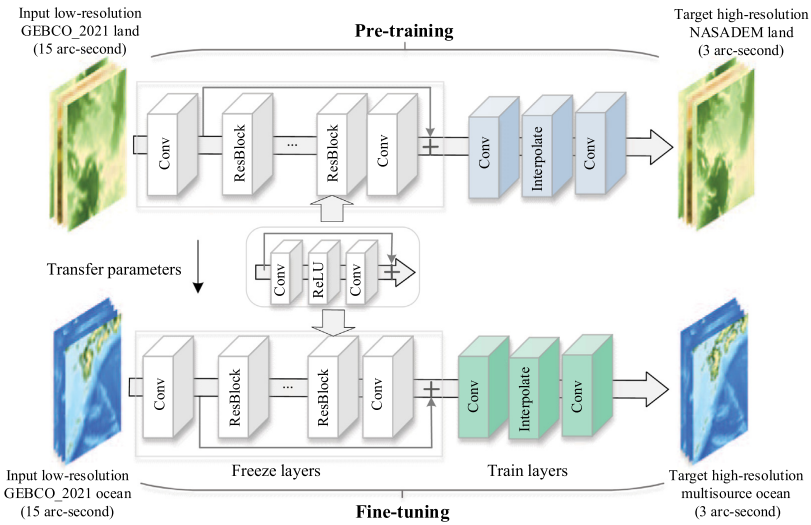

ENGLISH | [简体中文](README_CN.md)

# DEM-SRNet: Super-resolution reconstruction of a 3 arc-second global DEM dataset

## Overview

A deep residual network called DEM-SRNet is proposed to pretrain the terrestrial DEM data. The designed pre-training structure is derived from the enhanced deep superresolution network (EDSR).



This tutorial introduces the research background and technical path of DEM-SRNet, and shows how to train and fast infer the model through MindEarth. More information can be found in [paper](https://pubmed.ncbi.nlm.nih.gov/36604030/).

## QuickStart

You can download dataset from [dataset](https://download.mindspore.cn/mindscience/mindearth/dataset/dem_dataset.zip) for model evaluation. Save these dataset at `./dataset`.

### Run Option 1: Call `main.py` from command line

```shell
python -u ./main.py \
  --device_target Ascend \
  --device_id 0 \
  --output_dir ./summary
```

where:
--device_target device type, default Ascend.
--device_id NPU id, default 0.
--output_dir the path of output file, default "./summary".

### Run Option 2: Run Jupyter Notebook

You can use '[Chinese](DEM-SRNet_CN.ipynb)' or '[English](DEM-SRNet.ipynb)' Jupyter Notebook to run the training and evaluation code line-by-line.

## Analysis

Root-mean squared error (RMSE) values of test results for land and ocean regions

|            |               | Bicubic | SRCNN  | VDSR   | ESRGAN | EDSR   | DEM-SRNet | ΔRMSE (%) |
| :--------- | ------------- | ------- | ------ | ------ | ------ | ------ | --------- | --------- |
| Land area  | A1            | 57.99   | 35.76  | 36.66  | 38.44  | 35.92  | 35.23     | 39.24     |
|            | A2            | 51.99   | 44.83  | 37.36  | 43.22  | 40.66  | 36.43     | 29.92     |
|            | A3            | 20.85   | 13.60  | 20.44  | 13.89  | 14.81  | 13.56     | 34.96     |
|            | A4            | 67.22   | 46.56  | 47.01  | 49.68  | 53.36  | 45.28     | 32.63     |
| Ocean area | B             | 25.97   | 25.52  | 30.62  | 25.18  | 25.38  | 24.87     | 4.24      |
|            | C             | 27.59   | 22.65  | 24.44  | 21.18  | 20.90  | 17.95     | 34.94     |
|            | D             | 117.16  | 214.95 | 115.87 | 118.71 | 115.63 | 112.97    | 3.58      |
|            | E             | 35.18   | 104.68 | 37.97  | 74.02  | 38.74  | 29.25     | 16.86     |
|            | F             | 4.54    | 17.75  | 17.52  | 4.55   | 4.54   | 3.35      | 26.21     |
|            | G             | 57.63   | 66.08  | 58.11  | 56.61  | 52.10  | 49.01     | 14.96     |
|            | Total average |         |        |        |        |        |           | 23.75     |

## Contributor

gitee id: alancheng511

email: alanalacheng@gmail.com