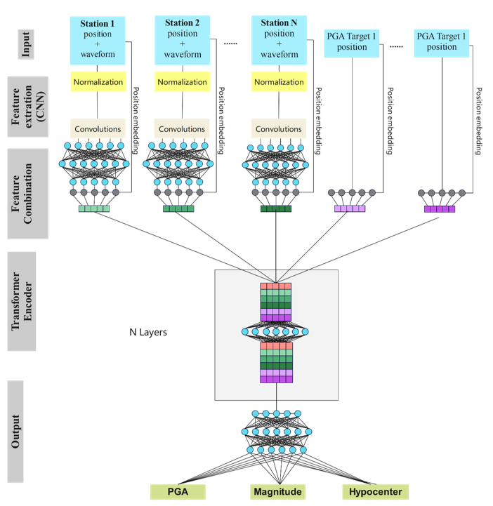
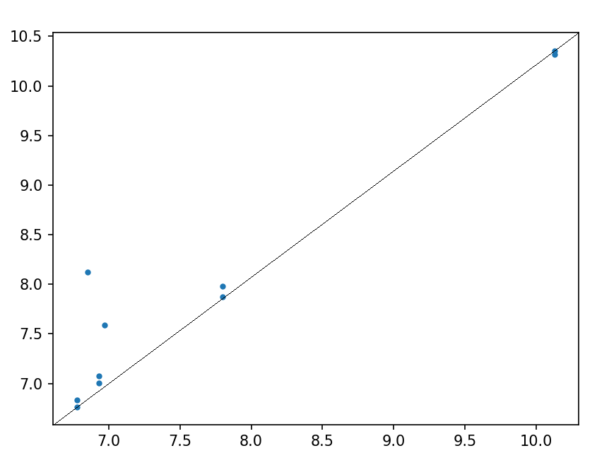

[ENGLISH](README.md) | 简体中文

# G-TEAM地震预警模型

## 概述

地震预警系统旨在在破坏性震动到达前尽早发出警报，以减少人员伤亡和经济损失。G-TEAM 模型是一种数据驱动的全国地震预警系统，结合了图神经网络（GNN）和 Transformer 架构，能够在地震发生后 3 秒内迅速提供震中位置、震级及地震强度分布。该模型通过直接处理原始地震波形数据，避免了手动特征选择的限制，并充分利用多台站数据，提高了预测的准确性和实时性。

本模型是一款高效的地震预警系统，结合了图神经网络（Graph Neural Network, GNN）与 Transformer 架构，以任意数量的地震台站记录的地震波形数据作为输入。该模型能够实时接收地震信号，并对震源位置、震级以及地震烈度分布范围进行快速且精准的估计，其中烈度分布范围以地面峰值加速度（Peak Ground Acceleration, PGA）表征。通过深度学习方法，本模型可以充分利用地震台网的空间关联性与时序特征，提高预警精度和响应速度，为地震应急响应和减灾决策提供可靠支持。



该模型采用多源地震台站数据进行PGA预测，具体架构如下：首先，系统接收多个地震台站的位置信息及其记录的地震波形数据，同时获取待估计PGA的目标位置坐标。对于每个地震台站的波形数据，首先进行标准化处理，随后通过卷积神经网络（CNN）进行特征提取。提取的特征经全连接层进行特征融合，并与对应台站的位置信息共同构成特征向量。
目标PGA位置坐标经过位置编码模块处理后，形成特征向量。所有特征向量按序列形式输入到Transformer编码器中，编码器通过自注意力机制捕捉全局依赖关系。编码器输出依次通过三个独立的全连接层，分别完成地震事件震级、震中位置以及PGA的回归预测任务。

本模型的训练数据来源于[谛听数据集2.0 -中国地震台网多功能大型人工智能训练数据集](http://www.esdc.ac.cn/article/137)，该数据集汇集了中国大陆及其邻近地区（15°-50°N，65°-140°E）1177 个中国地震台网固定台站的波形记录，覆盖时间范围为 2020 年 3 月至 2023 年 2 月。数据集包含研究区域内所有震级大于 0 的地方震事件，共计 264,298 个。我们在训练过程中仅选取了初至 P 波和 S 波震相，并且只保留至少被三个台站记录到的地震事件，以确保数据的可靠性和稳定性。

目前本模型已开源推理部分，可使用提供的[ckpt](https://download-mindspore.osinfra.cn/mindscience/mindearth/dataset/G-TEAM/)进行推理。

## 快速开始

可在[dataset](https://download-mindspore.osinfra.cn/mindscience/mindearth/dataset/G-TEAM/)下载训练所需要的数据集。

### 运行方式： 在命令行调用`main`脚本

### 推理

```python

python main.py --cfg_path ./config/config.yaml --device_id 0 --device_target Ascend

```

其中， --cfg_path表示配置文件路径，默认值"./config/config.yaml" --device_target 表示设备类型，默认Ascend。 --device_id 表示运行设备的编号，默认值0。

### 结果可视化



图示为pga的点坐标，横轴表示预测值，纵轴表示实际值，点数据越靠近y=x这条直线代表数据越准确。

### 结果展示

|   参数         |        NPU              |
|:----------------------:|:--------------------------:|
|   硬件       |  Ascend, memory 64G    |
|   mindspore版本       |  mindspore2.5.0    |
|   数据集       |  diting2_2020-2022_sc    |
|   测试参数     |  batch_size=1<br>steps=9 |
| Mag震级误差(RMSE, MSE)     |   [ 0.262, 0.257 ]       |
| Loc震中距离误差（RMSE, MAE）    |   [ 4.318 , 4.123 ]    |
| Loc震源距离误差（RMSE, MAE）    |   [ 5.559 , 5.171 ]    |
| Pga峰值地面加速度误差（RMSE, MSE） |[ 0.466, 0.287 ]  |
| 推理资源       |        1NPU                    |
| 推理速度(ms/step)  |     556                 |

## 贡献者

gitee id: chengjie, longjundong, xujiabao, dinghongyang, funfunplus

email: funniless@163.com