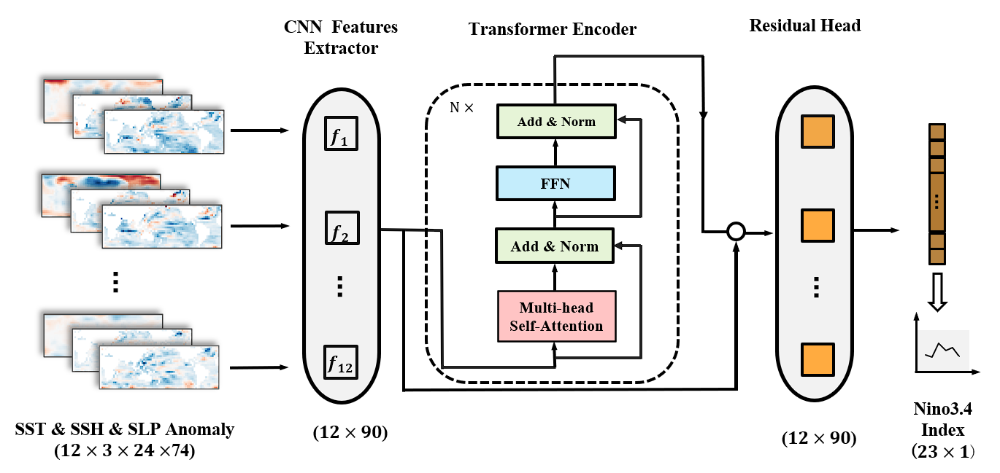
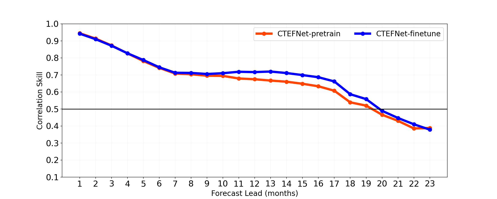

[ENGLISH](README.md) | 简体中文

# CTEFNet: 基于 CNN 与迁移学习的厄尔尼诺预测模型

## 概述

CTEFNet是一种基于深度学习的 ENSO 预测模型，其使用 2D CNN 从气象数据中提取特征，将多个时点特征拼接为时间序列后输入 Transformer Encoder 进行时序分析和 ENSO 预测。
与之前的深度学习模型相比，CTEFNet的有效预测时长延长至19个月。



本教程介绍了CTEFNet的研究背景和技术路径，并展示了如何通过MindEarth训练和快速推理模型。

## 快速开始

在[mindearth/dataset](https://download-mindspore.osinfra.cn/mindscience/mindearth/dataset/enso_dataset.zip) 下载数据并保存在`./dataset`。

### 运行方式一: 在命令行调用`main.py`脚本

```shell
python -u ./main.py \
  --config_file_path ./configs/pretrain.yaml \
  --device_target GPU \
  --device_id 0
```

其中，
`--config_file_path` 配置文件的路径，默认值"./configs/pretrain.yaml"。

`--device_target` 表示设备类型，默认GPU。

`--device_id` 表示运行设备的编号，默认值0。

### 运行方式二: 运行Jupyter Notebook

使用[中文](https://gitee.com/mindspore/mindscience/raw/master/MindEarth/applications/medium-range/ensoforecast/ctefnet_CN.ipynb) 或[英文](https://gitee.com/mindspore/mindscience/raw/master/MindEarth/applications/medium-range/ensoforecast/ctefnet.ipynb) Jupyter Notebook可以逐行运行训练和推理代码

### 结果展示

下图展示了模型经过预训练与调优后的预测相关系数。



## 贡献者

gitee id: YingHaoCui, Charles_777

email: 1332350708@qq.com, 1332715137@qq.com