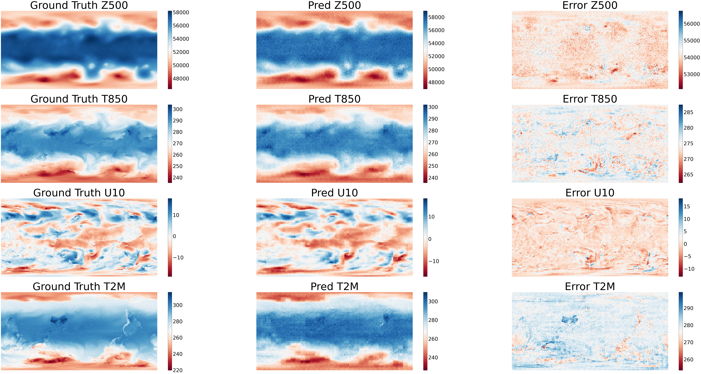
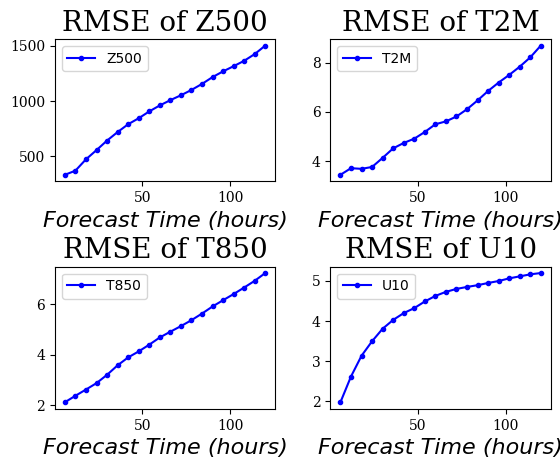
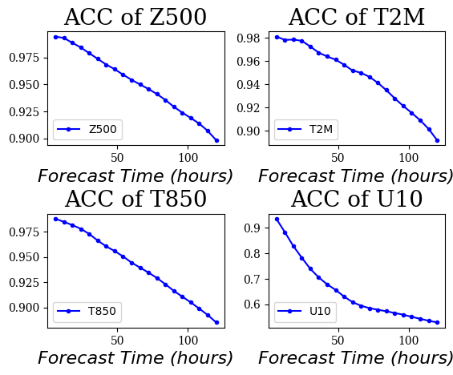

# FourCastNet

## 概述

FourCastNet是一种数据驱动的全球气象预测模型。它能以0.25°的分辨率生成全球关键天气指标的中期气象预测，这相当于赤道附近约30×30km的空间分辨率和721×1440像素的权重网格大小。

FNO充份利用了AFNO模型，提高在高分辨率的预测精度。AFNO是一种为高分辨率输入而设计的模型，以ViT为backbone，并结合了傅里叶神经算子。

## 快速开始

在[dataset](https://download.mindspore.cn/mindscience/mindearth/dataset/WeatherBench_1.4_69/)下载数据并保存在`./dataset`。

### 方式一：命令行启动

```shell
bash ./scripts/run_standalone_train.sh $device_id $device_target $config_file_path
```

其中：

`--device_id` 表示运行设备的编号。

`--device_target` 表示设备类型，默认"Ascend"。

`--config_file_path` 配置文件的路径，默认值"./configs/FourCastNet.yaml"。

若运行0.25°分别率训练任务，将./configs/FourCastNet.yaml中的grid_resolution修改为0.25，并且修改root_dir为0.25数据集地址即可。

### 运行方式二: 运行Jupyter Notebook

使用'Chinese'或'English' Jupyter Notebook可以逐行运行训练和推理代码

### 结果展示

下图展示了使用训练结果的第10个epoch进行推理绘制的地表、预测值和他们之间的误差。



6小时至5天的天气预报关键指标见下图。




## Contributor

gitee id: Bokai Li
email: 1052173504@qq.com