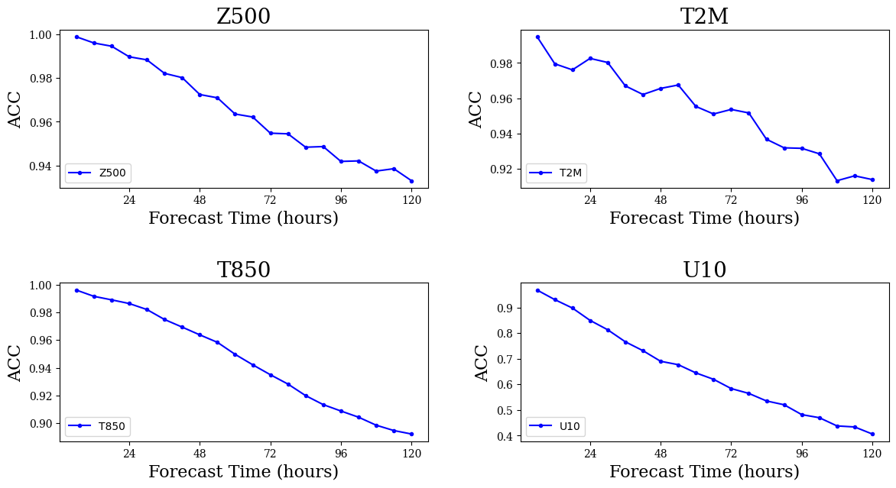

[ENGLISH](README.md) | 简体中文

# FuXi: 基于级联架构的全球中期天气预报

## 概述

FuXi模型是由复旦大学的研究人员开发的一个基于数据驱动的全球天气预报模型。它提供了关键全球天气指标的中期预报，分辨率为0.25°。相当于赤道附近约25公里x25公里的空间分辨率和大小为720 x 1440像素的全球网格。与以前的基于ML的天气预报模型相比，采用级联架构的FuXi模型在[EC中期预报评估](https://charts.ecmwf.int/products/plwww_3m_fc_aimodels_wp_mean?area=Northern%20Extra-tropics&parameter=Geopotential%20500hPa&score=Root%20mean%20square%20error)中取得了优异的结果。


本教程介绍了FuXi的研究背景和技术路径，并展示了如何通过MindEarth训练和快速推理模型。 更多信息参见[文章] (https://www.nature.com/articles/s41612-023-00512-1)。本教程中使用分辨率为0.25°的部分数据集(67 samples)，结果如下所示。

## 快速开始

在[mindearth/dataset](https://download.mindspore.cn/mindscience/mindearth/dataset/)下载数据并保存在`./dataset`。

### 运行方式一: 在命令行调用`main.py`脚本

```shell
python -u ./main.py \
  --config_file_path ./configs/FuXi.yaml \
  --device_target Ascend \
  --device_id 0
```

其中，
`--config_file_path` 配置文件的路径，默认值"./configs/FuXi.yaml"。

`--device_target` 表示设备类型，默认Ascend。

`--device_id` 表示运行设备的编号，默认值0。

### 运行方式二: 运行Jupyter Notebook

使用[中文](https://gitee.com/mindspore/mindscience/raw/master/MindEarth/applications/medium-range/graphcast/graphcast_CN.ipynb)或[英文](https://gitee.com/mindspore/mindscience/raw/master/MindEarth/applications/medium-range/graphcast/graphcast.ipynb) Jupyter Notebook可以逐行运行训练和推理代码

### 结果展示

下图展示了使用训练结果的第100个epoch进行推理绘制的地表、预测值和他们之间的误差。


6小时至5天的天气预报关键指标见下图。




## 性能

|        参数         |        Ascend               |                                         GPU                                         |
|:----------------------:|:--------------------------:|:-----------------------------------------------------------------------------------:|
|     硬件资源         |     Ascend 910A, 显存32G；CPU: 2.6GHz, 192核      |                                  NVIDIA V100 显存32G                                  |
|     MindSpore版本   |        2.2.0             |                                        2.2.0                                        |
|        数据集      |        [ERA5_0_25](https://download.mindspore.cn/mindscience/mindearth/dataset/)        | [ERA5_0_25](https://download.mindspore.cn/mindscience/mindearth/dataset/) |
|        参数量      |          61161472          |                                      61161472                                       |
|        训练参数      |        batch_size=1,steps_per_epoch=67,epochs=100              |                     batch_size=1,steps_per_epoch=67,epochs=100                      |
|        测试参数      |        batch_size=1,steps=20             |                                batch_size=1,steps=20                                |
|        优化器      |        Adam               |                                        Adam                                         |
|        训练损失(RMSE)      |        0.12              |                                        0.12                                         |
|        验证加权损失(z500/5天)      |                             1200                             |                                        1240                                         |
|        验证加权损失(t850/5天)      |           6.5           |                                         6.8                                         |
|        速度(ms/step)          |     3386     |                                        8071                                         |

使用[ERA5_0.25](https://github.com/pangeo-data/WeatherBench)更多数据训练可以获得如下结果:

|        RMSE      |     Z500(3 / 5 days)      |     T850(3 / 5 days)     |    U10(3 / 5 days)      |    T2m(3 / 5 days)     |
|:----------------:|:--------------:|:---------------:|:--------------:|:---------------:|
|        Operational IFS     |     152.2 / 331.38     |     1.34 / 2.01     |    1.92 / 2.89      |    1.3 / 1.71     |
|        ours(16yr)     |     179 / 347     |     1.37 / 2.00     |    1.88 / 2.87    |    1.38 / 1.89    |

## 贡献者

gitee id: alancheng511

email: alanalacheng@gmail.com