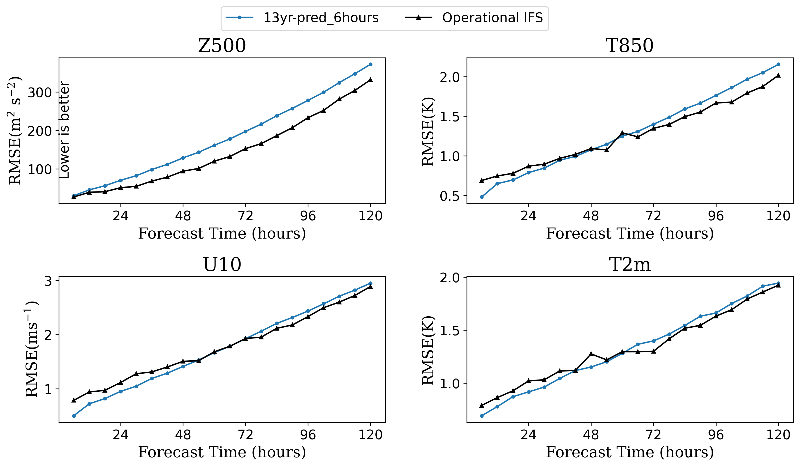
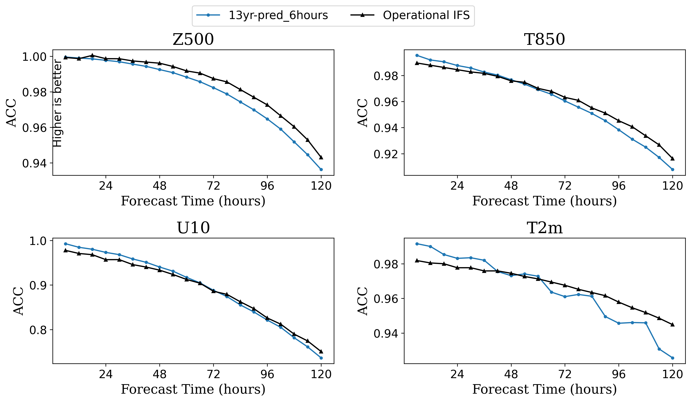

[ENGLISH](README.md) | 简体中文

# FuXi: 基于级联架构的全球中期天气预报

## 概述

FuXi模型是由复旦大学的研究人员开发的一个基于数据驱动的全球天气预报模型。它提供了关键全球天气指标的中期预报，分辨率为0.25°。相当于赤道附近约25公里x25公里的空间分辨率和大小为720 x 1440像素的全球网格。与以前的基于ML的天气预报模型相比，采用级联架构的FuXi模型在[EC中期预报评估](https://charts.ecmwf.int/products/plwww_3m_fc_aimodels_wp_mean?area=Northern%20Extra-tropics&parameter=Geopotential%20500hPa&score=Root%20mean%20square%20error)中取得了优异的结果。

本教程介绍了FuXi的研究背景和技术路径，并展示了如何通过MindEarth训练和快速推理模型。更多信息参见[文章](https://www.nature.com/articles/s41612-023-00512-1)。本教程中使用分辨率为0.25°的[ERA5_0_25_tiny400](https://download-mindspore.osinfra.cn/mindscience/mindearth/dataset/ERA5_0_25_tiny400/)数据集详细介绍案例的运行流程。

## 模型运行

### 基础Backbone

下载[ERA5_0_25_tiny400](https://download-mindspore.osinfra.cn/mindscience/mindearth/dataset/ERA5_0_25_tiny400/)数据并保存在`./dataset`。

*方式一：命令行启动*

```shell
bash ./scripts/run_standalone_train.sh $device_id $device_target $config_file_path
```

其中：

`--device_id` 表示运行设备的编号。

`--device_target` 表示设备类型，默认"Ascend"。

`--config_file_path` 配置文件的路径，默认值"./configs/FuXi.yaml"。

*方式二: 运行Jupyter Notebook*

使用[中文](https://gitee.com/mindspore/mindscience/blob/f93ea7a7f90d67c983256844a2bcab094a3c7084/MindEarth/applications/medium-range/fuxi/fuxi_CN.ipynb)或[英文](https://gitee.com/mindspore/mindscience/raw/f93ea7a7f90d67c983256844a2bcab094a3c7084/MindEarth/applications/medium-range/fuxi/fuxi.ipynb) Jupyter Notebook可以逐行运行训练和推理代码

#### 多卡并行

多卡并行需要将`config_file_path`指定的配置文件中`distribute`字段设置为`True`。

```shell
bash ./scripts/run_distributed_train.sh $rank_table_file $device_num $device_start_id $config_file_path
```

其中：

`--rank_table_file` [组网信息文件](https://www.mindspore.cn/tutorials/experts/zh-CN/r2.2/parallel/rank_table.html#%E6%A6%82%E8%BF%B0)。

`--device_num` 表示组网设备的数量。

`--device_start_id` 表示组网设备起始ID。

`--config_file_path` 配置文件的路径。

### 结果展示

#### 基础要素可视化

下图展示了使用训练结果的第100个epoch进行推理绘制的地表、预测值和他们之间的误差。


## 所有训练结果

### 基础Backbone

使用13年ERA5 0.25°分辨率数据，进行6小时间隔数据训练，下图展示了训练模型预测6小时，一些关键气象指标在5天内同IFS结果的对比。




## 性能

### 基础Backbone

|      参数        |        NPU              |        NPU             |    GPU       |
|:----------------------:|:--------------------------:|:--------------------------:|:---------------:|
|    硬件资源        |     Ascend, memory 32G     |     Ascend, memory 32G      |     V100, memory 32G       |
|     MindSpore版本   |        2.2.0             |         2.2.0             |      2.2.0       |
|     数据集      |      ERA5_0_25_13yr             |      [ERA5_0_25_tiny400](https://download.mindspore.cn/mindscience/mindearth/dataset/ERA5_0_25_tiny400)     |     [ERA5_0_25_tiny400](https://download.mindspore.cn/mindscience/mindearth/dataset/ERA5_0_25_tiny400)     |
|    参数量     |    61 mil.         |          61 mil.         |        61 mil.    |
|    训练参数  |        batch_size=1<br>steps_per_epoch=1187<br>epochs=200    |    batch_size=1<br>steps_per_epoch=67<br>epochs=100   |     batch_size=1<br>steps_per_epoch=67<br>epochs=100     |
|        测试参数      |    batch_size=1<br>steps=39 | batch_size=1<br>steps=9 |    batch_size=1<br>steps=9  |
|    优化器    |        Adam      |         Adam              |    Adam     |
|        训练损失(RMSE)      |    0.046    |   0.12     |  0.12   |
|        Z500  (6h, 72h, 120h)      |   30, 197.5, 372 |  176, 992, 1187 |   176, 992, 1187    |
|        T850  (6h, 72h, 120h)      |   0.48, 1.39, 2.15 |  1.23, 5.78, 7.29 |1.23, 5.78, 7.29   |
|        U10  (6h, 72h, 120h)      |    0.5, 1.9, 2.9 | 1.48, 5.58, 6.33 | 1.48, 5.58, 6.33   |
|        T2m  (6h, 72h, 120h)      |    0.69, 1.39, 1.94|  2.52, 5.78, 7.29 | 2.52, 5.78, 7.29   |
|    训练资源      | 2Node 16NPUs  | 1Node 1NPU   | 1Node 1GPU    |
|    运行时间     | 445 hours  | 7.8 hours   | 15 hours    |
|    速度(ms/step)          |     4386     |     3821       |   8071 |

## 贡献者

gitee id: alancheng511, liulei277

email: alanalacheng@gmail.com, liulei2770919@163.com