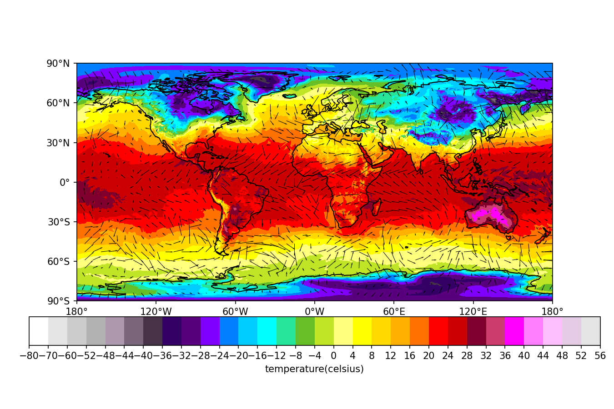
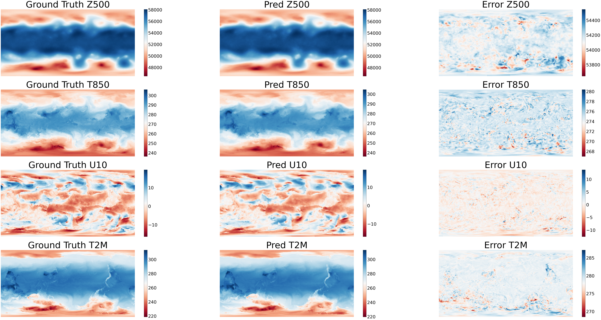
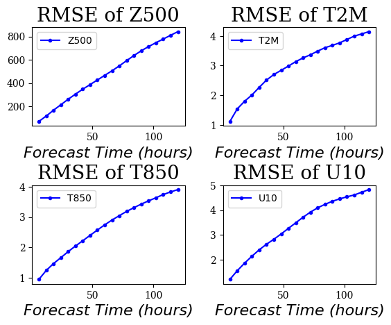
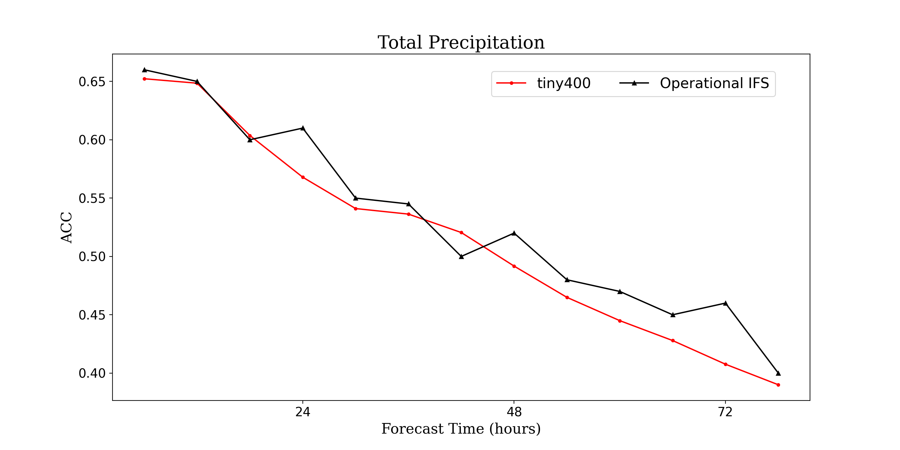
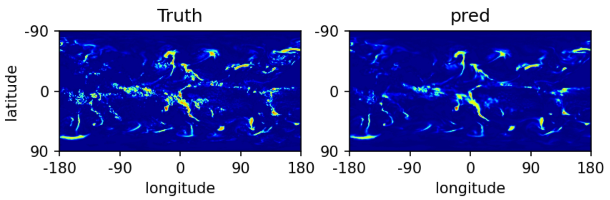
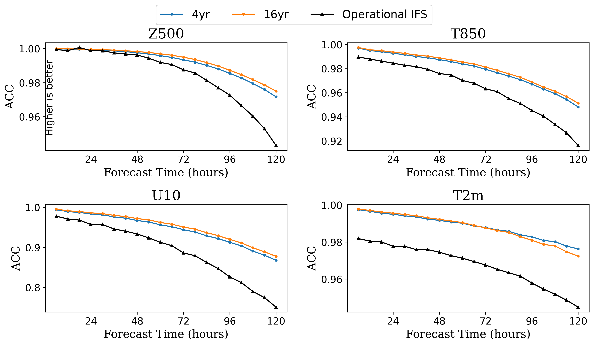
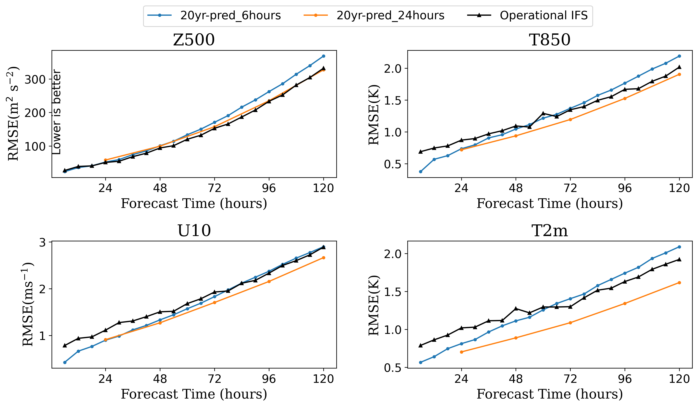
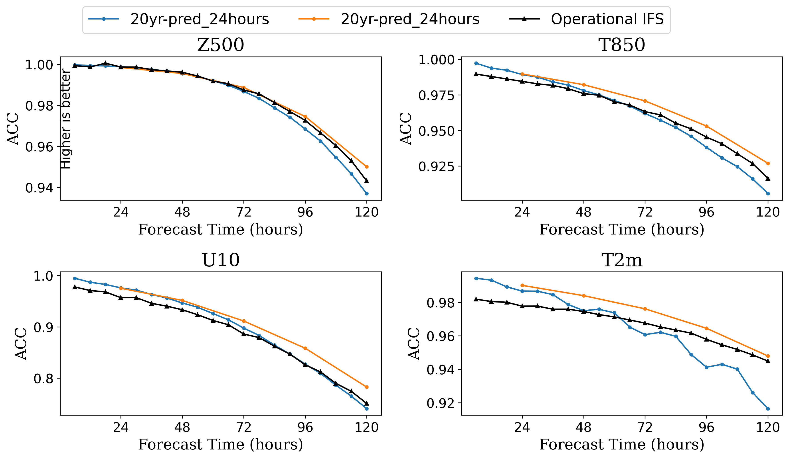
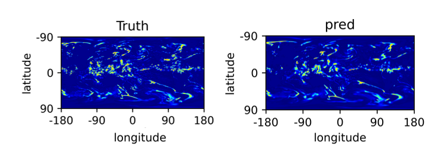

ENGLISH | [简体中文](README_CN.md)

# GraphCast: Medium-range Global Weather Forecasting Based on GNN

## Overview

GraphCast is a data-driven global weather forecast model developed by researchers from DeepMind and Google. It provides medium-term forecasts of key global weather indicators with a resolution of 0.25°. Equivalent to a spatial resolution of approximately 25 km x 25 km near the equator and a global grid of 721 x 1440 pixels in size. Compared with the previous ML-based weather forecast model, this model improves the accuarcy to 99.2% of the 252 targets.



This tutorial introduces the research background and technical path of GraphCast, and shows how to train and fast infer the model through MindEarth. More information can be found in [paper](https://arxiv.org/abs/2212.12794). In the training process of GraphCast, we use partial datasets with resolutions of 1.4° and 0.25°, and present a comparison of training results on datasets of different scales and resolutions.

## Dataset

ERA5 is the fifth generation atmospheric reanalysis dataset of European Centre for Medium-Range Weather Forecasts (ECMWF) on global climate from January 1950 to present. ERA5 provides hourly estimates of a large number of atmospheric, terrestrial, and oceanic climate variables. GraphCast trains on a subset of ERA5, preserving the highest spatial resolution available in ERA5, which is 0.25° x 0.25° on the Earth's surface and an input resolution of 1440 x 721. In order to reduce computational costs, we selected 13 pressure layers (i.e. 50hPa, 100hPa, 150hPa, 200hPa, 250hPa, 300hPa, 400hPa, 500hPa, 600hPa, 700hPa, 850hPa, 925hPa, and 1000hPa) and surface variables from 37 pressure layers in the dataset as input features.

Meanwhile, this case provides a module for [generating regular icosahedral meshes](https://gitee.com/mindspore/mindscience/tree/master/MindEarth/applications/medium-range/graphcast/graph_processing). Users can generate multi-level grids of different scales and resolutions as needed. A multi-level grid is a spatially homogeneous graph, with the highest resolution formed by 6 iterations of a regular icosahedron (including 12 nodes, 20 faces, and 30 edges). Each iteration refines the grid by dividing a single triangle into 4 smaller triangles and projecting its nodes onto a sphere.

### Backbone Input Variables

| *Surface variables (5)*       | *Atmospheric variables (6)*              | *Pressure levels (37)*          |
| ------------------ | ------------------------- | ----------------- |
| **2-meter temperature** (2T) | **Temperatue** (T) | 1, 2, 3, 5, 7, 10, 20, 30, **50**, 70, |
| **10 meter u wind component** (10U) | **U component of wind** (U) | **100**, 125, **150**, 175, 200, 225, |
| **10 meter v wind component** (10V) | **V component of wind** (V) | **250**, **300**, 350, **400**, 450, **500**,|
| **Mean sea-level pressure** (MSL) | **Geopotential** (Z) | 550, **600**, 650, **700**, 750, 775,|
| Total precipitation (TP) | **Specific humidity** (Q) | 800, 825, **850**, 875, 900, **925**,|
|                          | Vertical wind speed (W) | 950, 975, **1000**|

### Multi-mesh Statistics

| *Refinement*       |   *0*   |   *1*   |   *2*   |   *3*   |   *4*    |   *5*   |   *6*   |
| ------------------ | ------ | ------ |------- | ------ | ------| ------- | ------- |
| Num Nodes | 12 | 42 | 162 | 642 | 2562 | 10242 | 40962 |
| Num Faces | 20 | 80 | 320 | 1280 | 5120 | 20480 | 81920 |
| Num Edges | 60 | 240| 960 | 3840 | 15360 | 61440 | 245760 |
| Num Multilevel Edges | 60 | 300|  1260 | 5100 | 20460 | 81900 | 327660 |

### Medium-range Precipitation

In the medium-range precipitation case downstream, we use $0.5^{\circ} \times 0.5^{\circ}$ and input ERA5 data with a resolution of $360 \times 720$ for training, where the input variables of the model are the same as above. In addition, to alleviate the imbalanced characteristics of precipitation data samples, we need to perform Log transformation on the variable `Total Precipitation` for model training. The specific formula is as follows
$$
\hat{tp}=ln(\frac{tp}{\epsilon} + 1),
$$
Where $tp$ represents the original value of `Total Precipitation`, in our experiment $\epsilon=1e-5$.

## Running Model

### Base Backbone

Before running, it is necessary to prepare the training data, which can be downloaded in [1.40625°](https://download.mindspore.cn/mindscience/mindearth/dataset/WeatherBench_1.4_69/) or [0.25°](https://download-mindspore.osinfra.cn/mindscience/mindearth/dataset/ERA5_0_25_tiny400/) as needed, and saved in the `./dataset`.

#### Quick Start

*Option 1: use command line*

```shell
bash ./scripts/run_standalone_train.sh $device_id $device_target $config_file_path
```

where:

`--device_id` NPU id.

`--device_target` device type, default 'Ascend'.

`--config_file_path` the path of config file, default "./configs/GraphCast_1.4.yaml".

If running a 0.25° resolution training task, simply pass in "./configs/GraphCast_0.25.yaml" for `config_file_path`.

*Option 2: Run Jupyter Notebook*

You can use [Chinese](https://gitee.com/mindspore/mindscience/raw/master/MindEarth/applications/medium-range/graphcast/graphcast_CN.ipynb) or [English](https://gitee.com/mindspore/mindscience/raw/master/MindEarth/applications/medium-range/graphcast/graphcast.ipynb) Jupyter Notebook to run the training and evaluation code line-by-line.

#### Multi-Card Parallel

Running in Multi-Card parallel mode requires setting the `distribute` in the configuration file specified by `config_file_path` to `True`.

```shell
bash ./scripts/run_distributed_train.sh $rank_table_file $device_num $device_start_id $config_file_path
```

where:

`--rank_table_file` [path to the networking information file](https://www.mindspore.cn/tutorials/experts/zh-CN/r2.2/parallel/rank_table.html#%E6%A6%82%E8%BF%B0).

`--device_num` the numbers of networking device.

`--device_start_id` the start ID of networking device.

`--config_file_path` the path of config file.

### Medium-range Precipitation

Before running, it is necessary to prepare the training data, which can be downloaded in [ERA5_0_5_tiny400](https://download-mindspore.osinfra.cn/mindscience/mindearth/dataset/medium_precipitation/tiny_datasets/), and saved in the `./dataset`. In addition, it is necessary to set the path of GraphCast pretrain ckpt in the file `GraphCastTp.yaml`, which is `backbone_ckpt_path`. Users can download the provided 0.5° data for 4-year pretrain [ckpt](https://download-mindspore.osinfra.cn/mindscience/mindearth/dataset/medium_precipitation/tiny_datasets/ckpt/). You can set it up or train yourself to obtain CKPT for configuration.

#### Quick Start

*Option 1: use command line*

```shell
bash ./scripts/run_standalone_train.sh $device_id $device_target "./configs/GraphCastTp.yaml"
```

where:

`--device_id` the running device id.

`--device_target` device type，default "Ascend".

*Option 2: Run Jupyter Notebook*

You can use [Chinese](https://gitee.com/mindspore/mindscience/raw/master/MindEarth/applications/medium-range/graphcast/graphcast_tp_CN.ipynb) or [English](https://gitee.com/mindspore/mindscience/raw/master/MindEarth/applications/medium-range/graphcast/graphcast_tp.ipynb) Jupyter Notebook to run the training and evaluation code line-by-line.

#### Multi-Card Parallel

Running in Multi-Card parallel mode requires setting the `distribute` in the configuration file `./configs/GraphCastTp.yaml` to `True`.

```shell
bash ./scripts/run_distributed_train.sh $rank_table_file $device_num $device_start_id "./configs/GraphCastTp.yaml"
```

where:

`--rank_table_file` [Path to the networking information file.](https://www.mindspore.cn/tutorials/experts/zh-CN/r2.2/parallel/rank_table.html#%E6%A6%82%E8%BF%B0).

`--device_num` the numbers of networking device.

`--device_start_id` the start ID of networking device.

### Results

#### Visualization of basic meteorological variables

The following figure shows the ground truth, prediction and their errors using the 1.40625° [ERA5_1_4_tiny400](https://download.mindspore.cn/mindscience/mindearth/dataset/WeatherBench_1.4_69/) training checkpoint of training epoch 100.



Summary of skill score for 6-hours to 5-days lead time is shown below.




Summary of skill score for 6-hours to 78-hours lead time is shown below.



#### Visualization of Precipitation

The following figure shows the precipitation result using the 0.5° [ERA5_0_5_tiny400](https://download-mindspore.osinfra.cn/mindscience/mindearth/dataset/medium_precipitation/tiny_datasets/) training checkpoint of epoch 20.


## Total Training Results

### 1.4° Base Backbone

Training with more data from [ERA5 1.40625°](https://github.com/pangeo-data/WeatherBench). By conducting hourly data training and optimizing the training results through rolling out, one can achieve a training result exceeding IFS.




### 0.25° Base Backbone

By using ERA5 0.25° resolution data and conducting 6-hour interval data training, it is possible to achieve 20 years of data training results that surpass IFS. The following figure shows the comparison of key meteorological indicators with IFS results over a period of 5 days for training models to predict 6 hours and 24 hours.




### Medium-range Precipitation

By using ERA5 0.5° resolution data and conducting 6-hour interval data training, the following figure shows the comparison of key meteorological indicators with IFS results over a period of 78 hours and the precipitation result of training using 10 years dataset.




## Performance

### Base Backbone

|        Parameter         |       NPU     |    NPU       |  NPU       |    NPU       |      GPU    |
|:------------------------:|:--------------------------:|:---------------:|:---------------:|:---------------:|:---------------:|
|     Hardware         |    Ascend, Memory 64G  |   Ascend, Memory 64G  | Ascend, Memory 32G  |  Ascend, Memory 32G  |  V100, Memory 32G  |
|     MindSpore  |        2.2.10          |      2.2.10       |       2.2.10      |      2.2.10       |      2.2.10       |
|         Dataset     |  [ERA5_0_25_tiny400](https://download-mindspore.osinfra.cn/mindscience/mindearth/dataset/ERA5_0_25_tiny400/) |ERA5_0_25_20yr |  [ERA5_1_4_tiny400](https://download.mindspore.cn/mindscience/mindearth/dataset/WeatherBench_1.4_69/)     | ERA5_1_4_16yr |  [ERA5_1_4_tiny400](https://download.mindspore.cn/mindscience/mindearth/dataset/WeatherBench_1.4_69/)  |
|        Parameters      |      35 mil.         |      35 mil.      |      35 mil.       |      35 mil.       |      35 mil.      |
|         Train parameters     |    batch_size=1<br>steps_per_epoch=404<br>epochs=50 | batch_size=1<br>steps_per_epoch=914<br>epochs=200 |    batch_size=1<br>steps_per_epoch=403<br>epochs=100    | batch_size=1<br>steps_per_epoch=9313<br>epochs=200 |   batch_size=1<br>steps_per_epoch=403<br>epochs=100   |
|        Test parameters      |    batch_size=1   steps=9 | batch_size=1  steps=39 |    batch_size=1   steps=8   |batch_size=1   steps=39  |    batch_size=1   steps=8  |
|        Optimizer      |   AdamW  |   AdamW  |   AdamW  |   AdamW  |   AdamW  |
|        Train loss(RMSE)      |    0.0016    |   0.0009     |  0.0009    |  0.0009     |    0.0009    |
|        Z500  (6h, 72h, 120h)      |   90, 818, 985 |  23.45, 157, 327 |   71, 564, 849    | 23, 157, 349 |    73, 567, 879    |
|        T850  (6h, 72h, 120h)      |   4.19, 19.6, 21.8 |  0.37, 1.19, 1.9 |0.95, 2.98, 3.96   |0.48, 1.31, 2.14 |  0.95, 2.9, 3.8    |
|        U10  (6h, 72h, 120h)      |    0.9, 5.0, 5.3 | 0.42, 1.7, 2.66 | 1.21, 3.78, 4.78   |0.5, 1.78, 2.82 |   1.23, 3.86, 4.8    |
|        T2m  (6h, 72h, 120h)      |    0.94, 7.4, 10.1|  0.56, 1, 1.6 | 1.11, 3.28, 4.17   |0.63, 1.5, 2.25 |  1, 3.39, 4.15    |
|        Training resources     |  1Node 1NPU    |  4Nodes 32NPUs   |  1Node 1NPU    |    2Nodes 16NPUs   |  1Node 1GPU  |
|        Running time     |   31 hours  |   310 hours  | 3 hours  |  124 hours  | 5.5 hours  |
|        Speed(ms/step)    | 5200 | 6100 | 240  | 232 |  475  |

### Medium-range Precipitation

|      Parameter        |        NPU              |        NPU             |    GPU       |
|:----------------------:|:--------------------------:|:--------------------------:|:---------------:|
|    Hardware        |     Ascend, memory 32G     |     Ascend, memory 32G      |     V100, memory 32G       |
|     MindSpore   |        2.0             |         2.2.0             |      2.2.0       |
|     Dataset      |      ERA5_0_5_10yr             |      [ERA5_0_5_tiny400](https://download-mindspore.osinfra.cn/mindscience/mindearth/dataset/medium_precipitation/tiny_datasets/)     |     [ERA5_0_5_tiny400](https://download-mindspore.osinfra.cn/mindscience/mindearth/dataset/medium_precipitation/tiny_datasets/)     |
|    Parameters     |    62 mil.         |          62 mil.         |        62 mil.    |
|     Train parameters  |        batch_size=1<br>steps_per_epoch=8760<br>epochs=30      |    batch_size=1<br>steps_per_epoch=408<br>epochs=30        |     batch_size=1<br>steps_per_epoch=408<br>epochs=30       |
|    Test parameters      |    batch_size=1<br>steps=39 | batch_size=1<br>steps=11 |    batch_size=1<br>steps=11   |
|    Optimizer    |        AdamW      |         AdamW              |    AdamW     |
|        Train loss(Lp)      |        0.3             |        0.3             |    0.4   |
|   ACC (Tp)    |        0.69      |     0.65    |    0.67   |
|        Training resources      | 1Node 8NPUs  | 1Node 1NPU   | 1Node 1GPU    |
|        Running time     | 11.8 hours  | 4.4 hours   | 5.4 hours    |
|        Speed(ms/step)          |     1300       |     1300       |   1650 |

## Contributor

gitee id: liulei277, Bokai Li, Zhou Chuansai

email: liulei2770919@163.com, 1052173504@qq.com, chuansaizhou@163.com