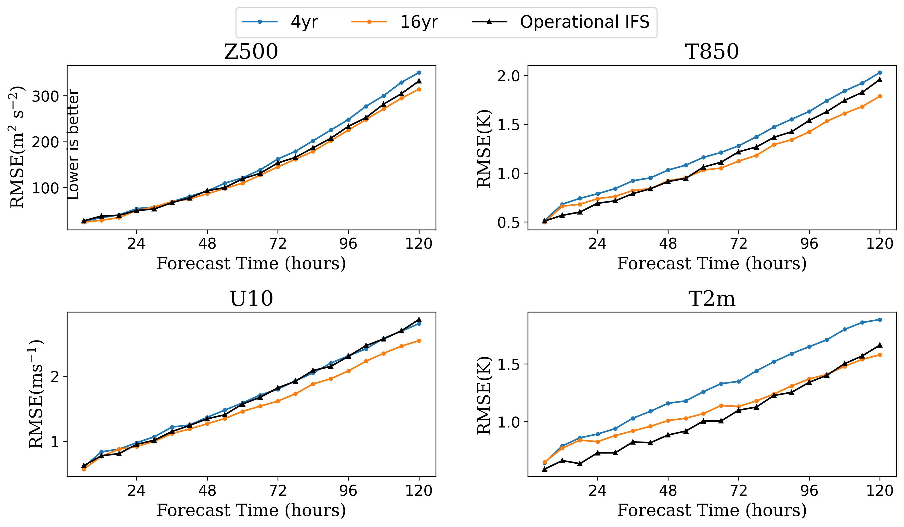

ENGLISH | [简体中文](README_CN.md)

# GraphCast: Medium-range Global Weather Forecasting Based on GNN

## Overview

GraphCast is a data-driven global weather forecast model developed by researchers from DeepMind and Google. It provides medium-term forecasts of key global weather indicators with a resolution of 0.25°. Equivalent to a spatial resolution of approximately 25 km x 25 km near the equator and a global grid of 721 x 1440 pixels in size. Compared with the previous ML-based weather forecast model, this model improves the accuarcy to 99.2% of the 252 targets.


This tutorial introduces the research background and technical path of GraphCast, and shows how to train and fast infer the model through MindEarth. More information can be found in [paper](https://arxiv.org/abs/2212.12794). The partial dataset with a resolution of 1.4° is used in this tutorial, and the results is shown below.

## QuickStart

You can download dataset from [graphcast/dataset](https://download.mindspore.cn/mindscience/mindearth/dataset/WeatherBench_1.4_69/) for model evaluation. Save these dataset at `./dataset`.

### Run Option 1: Call `main.py` from command line

```shell
python -u ./main.py \
  --config_file_path \
  --device_target Ascend \
  --device_id 0 \
```

where:
`--config_file_path` the path of config file, default "./GraphCast.yaml".

`--device_target` device type, default 'Ascend'.

`--device_id` NPU id, default 0.

### Run Option 2: Run Jupyter Notebook

You can use [Chinese](https://gitee.com/mindspore/mindscience/raw/master/MindEarth/applications/medium-range/graphcast/graphcast_CN.ipynb) or [English](https://gitee.com/mindspore/mindscience/raw/master/MindEarth/applications/medium-range/graphcast/graphcast.ipynb) Jupyter Notebook to run the training and evaluation code line-by-line.

### Analysis

The following figure shows the ground truth, predicion and their errors using the checkpoint of training epoch 100.


Summary of skill score for 6-hours to 5-days lead time is shown below.


## Performance

|        Parameter         |        Ascend               |    GPU       |
|:----------------------:|:--------------------------:|:---------------:|
|     Hardware         |     Ascend 910A, 32G；CPU: 2.6GHz, 192 cores      |      NVIDIA V100 32G       |
|     MindSpore   |        2.2.0             |      2.2.0       |
|        Dataset      |        [WeatherBench 1.4°](https://download.mindspore.cn/mindscience/mindearth/dataset/WeatherBench_1.4_69/)               |       [WeatherBench 1.4°](https://download.mindspore.cn/mindscience/mindearth/dataset/WeatherBench_1.4_69/)      |
|        Parameters      |           35809280            |       35809280      |
|        Train parameters      |        batch_size=1,steps_per_epoch=403,epochs=100               |       batch_size=1,steps_per_epoch=403,epochs=100      |
|        Test parameters      |        batch_size=1,steps=8               |       batch_size=1,steps=8      |
|        Optimizer      |        Adam               |       Adam      |
|        Train loss(RMSE)      |        0.0009               |       0.0009      |
|        Valid WeightedRMSE(z500/5days)      |           889            |       870    |
|        Valid WeightedRMSE(t850/5days)      |           3.97            |       3.86    |
|        Speed(ms/step)          |     148        |    226  |

Training with more data from [WeatherBench 1.40625°](https://github.com/pangeo-data/WeatherBench) can get the following results:

|        RMSE      |     Z500(3 / 5 days)      |     T850(3 / 5 days)     |    U10(3 / 5 days)      |    T2m(3 / 5 days)     |
|:----------------:|:--------------:|:---------------:|:--------------:|:---------------:|
|        Operational IFS     |     152.2 / 331.38     |     1.34 / 2.01     |    1.92 / 2.89      |    1.3 / 1.71     |
|        ours(4yr)     |     162 / 350.18     |     1.27 / 2.03     |     1.79 / 2.8     |    1.35 / 1.88     |
|        ours(16yr)     |     145 / 314     |     1.12 / 1.78     |    1.62 / 2.54      |    1.13 / 1.58     |



## Precipitation

You need a pre-trained [ckpt](https://download-mindspore.osinfra.cn/mindscience/mindearth/dataset/medium_precipitation/tiny_datasets/ckpt/) of GraphCast. Set `tp: True` and modify `tp_dir`, `backbone_ckpt_path` in `GraphCastTp.yaml`.

## Run: Call `.sh` from command line

## Single-Device

```shell
cd scripts
bash run_standalone_train.sh $device_id
```

## Distribution

```shell
cd scripts
bash run_distributed_train.sh $path/to/rank_table.json $device_num $device_start_id
```

### Visualization

The following figure shows the ground truth, predicion using the checkpoint of training epoch 20.


## Contributor

gitee id: liulei277, Bokai Li, Zhou Chuansai

email: liulei2770919@163.com, 1052173504@qq.com, chuansaizhou@163.com