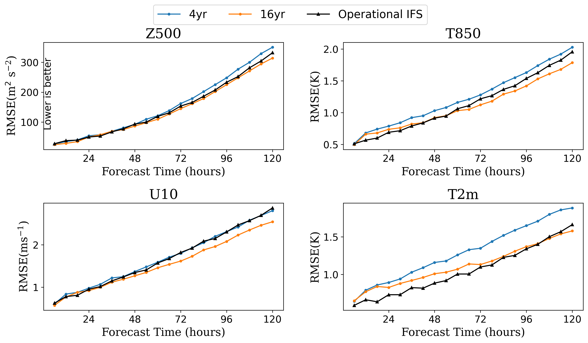

[ENGLISH](README.md) | 简体中文

# GraphCast: 基于图神经网络的全球中期天气预报

## 概述

GraphCast是由DeepMind和Google的研究人员开发的一个基于数据驱动的全球天气预报模型。它提供了关键全球天气指标的中期预报，分辨率为0.25°。相当于赤道附近约25公里x25公里的空间分辨率和大小为721 x 1440像素的全球网格。与以前的基于ML的天气预报模型相比，该模型将252个目标的准确率提高到99.2%。


本教程介绍了GraphCast的研究背景和技术路径，并展示了如何通过MindEarth训练和快速推理模型。 更多信息参见[文章](https://arxiv.org/abs/2212.12794)。本教程中使用分辨率为1.4°的部分数据集，结果如下所示。

## 快速开始

在[graphcast/dataset](https://download.mindspore.cn/mindscience/mindearth/dataset/WeatherBench_1.4_69/)下载数据并保存在`./dataset`。

### 运行方式一: 在命令行调用`main.py`脚本

```shell
python -u ./main.py \
  --config_file_path ./GraphCast.yaml \
  --device_target Ascend \
  --device_id 0
```

其中，
`--config_file_path` 配置文件的路径，默认值"./GraphCast.yaml"。

`--device_target` 表示设备类型，默认Ascend。

`--device_id` 表示运行设备的编号，默认值0。

### 运行方式二: 运行Jupyter Notebook

使用[中文](https://gitee.com/mindspore/mindscience/raw/master/MindEarth/applications/medium-range/graphcast/graphcast_CN.ipynb)或[英文](https://gitee.com/mindspore/mindscience/raw/master/MindEarth/applications/medium-range/graphcast/graphcast.ipynb) Jupyter Notebook可以逐行运行训练和推理代码

### 结果展示

下图展示了使用训练结果的第100个epoch进行推理绘制的地表、预测值和他们之间的误差。


6小时至5天的天气预报关键指标见下图。


## 性能

|        参数         |        Ascend               |    GPU       |
|:----------------------:|:--------------------------:|:---------------:|
|     硬件资源         |     Ascend 910A, 显存32G；CPU: 2.6GHz, 192核      |      NVIDIA V100 显存32G       |
|     MindSpore版本   |        2.2.0             |      2.2.0       |
|        数据集      |        [WeatherBench 1.4°](https://download.mindspore.cn/mindscience/mindearth/dataset/WeatherBench_1.4_69/)               |       [WeatherBench 1.4°](https://download.mindspore.cn/mindscience/mindearth/dataset/WeatherBench_1.4_69/)      |
|        参数量      |             35809280          |      35809280       |
|        训练参数      |        batch_size=1,steps_per_epoch=403,epochs=100               |       batch_size=1,steps_per_epoch=403,epochs=100      |
|        测试参数      |        batch_size=1,steps=8               |       batch_size=1,steps=8      |
|        优化器      |        Adam               |       Adam      |
|        训练损失(RMSE)      |        0.0009               |       0.0009      |
|        验证加权损失(z500/5天)      |           889            |       870    |
|        验证加权损失(t850/5天)      |           3.97            |       3.86    |
|        速度(ms/step)          |     148        |    226  |

使用[WeatherBench 1.40625°](https://github.com/pangeo-data/WeatherBench)更多数据训练可以获得如下结果:

|        RMSE      |     Z500(3 / 5 days)      |     T850(3 / 5 days)     |    U10(3 / 5 days)      |    T2m(3 / 5 days)     |
|:----------------:|:--------------:|:---------------:|:--------------:|:---------------:|
|        Operational IFS     |     152.2 / 331.38     |     1.34 / 2.01     |    1.92 / 2.89      |    1.3 / 1.71     |
|        ours(4yr)     |     162 / 350.18     |     1.27 / 2.03     |     1.79 / 2.8     |    1.35 / 1.88     |
|        ours(16yr)     |     145 / 314     |     1.12 / 1.78     |    1.62 / 2.54      |    1.13 / 1.58     |



## 贡献者

gitee id: liulei277, Bokai Li

email: liulei2770919@163.com, 1052173504@qq.com