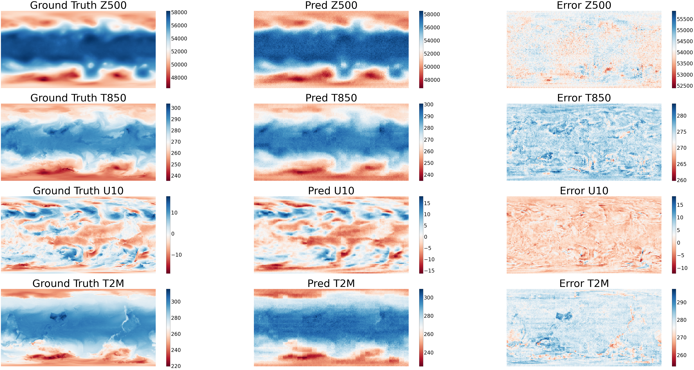
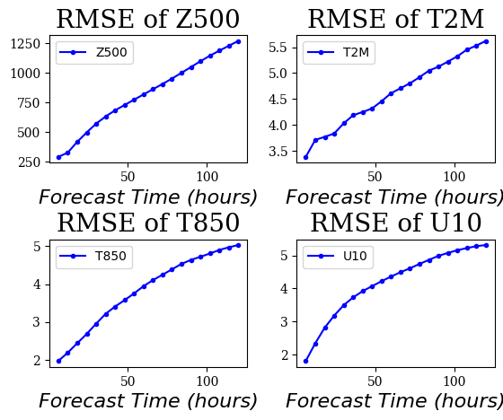
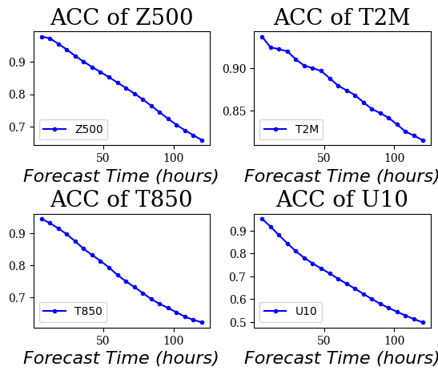

# ViT-KNO

## 概述

VIT-KNO是一种深度学习模型，它利用Vision Transformer结构和Koopman理论来有效地学习Koopman Operator算子，用于预测非线性系统的动力学。通过约束重建过程将复杂的动力学嵌入到线性结构中，VIT-KNO能够捕获复杂的非线性行为，同时保持轻量级和计算效率。该模型具有明确的数学理论，并有可能在气象学、流体动力学和计算物理学等领域取得突破。

## 快速开始

在[dataset](https://download.mindspore.cn/mindscience/mindearth/dataset/WeatherBench_1.4_69/)下载数据并保存在`./dataset`。

### 运行方式一: 在命令行调用`main.py`脚本

```shell
python -u ./main.py \
  --device_target Ascend \
  --device_id 0 \
  --grid_resolution 1.4 \
  --output_dir ./summary \
```

其中，
--device_target 表示设备类型，默认Ascend。
--device_id 表示运行设备的编号，默认值0。
--grid_resolution 网格分辨率，默认值1.4。
--output_dir 输出文件的路径，默认值"./summary"。

### 运行方式二: 运行Jupyter Notebook

使用'Chinese'或'English' Jupyter Notebook可以逐行运行训练和推理代码

### 结果展示

下图展示了使用训练结果的第10个epoch进行推理绘制的地表、预测值和他们之间的误差。



6小时至5天的天气预报关键指标见下图。




## Contributor

gitee id: Bokai Li
email: 1052173504@qq.com