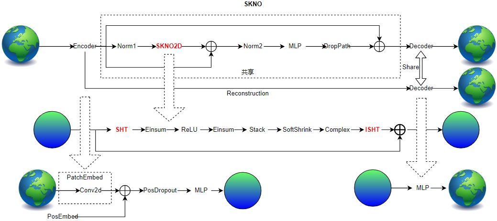

ENGLISH | [简体中文](README_CN.md)

## 1. Overview

### 1.1 Source and Value Overview

The SKNO case is developed by this team and integrates the KNO model and SHT operator. SKNO is developed based on the 16-year assimilation reanalysis dataset ERA5 and can forecast global weather with 6-hour temporal resolution and 1.4-degree spatial resolution, including temperature, humidity, wind and other indicators.

In this case, the SKNO algorithm model and the SHT operator developed based on MindSpore are integrated. You can directly invoke the SKNO algorithm or independently invoke the SHT operator for development.

Formula of spherical convolution:
$$\mathcal{F}[k\times u](l,m)=2\pi \sqrt{\frac{4\pi }{2l+1} }\mathcal{F}[u]\cdot \mathcal{F}[k](l,0)$$

If the fixed operator $\mathcal{F}[k](l, 0)$ is replaced by the learnable parameter $\widetilde{k}_{\theta}(l)$, the operator can be converted into:
$$\mathcal{F}[ \mathcal{K}_{\theta}[u] ](l,m)=\widetilde{k}_{\theta}(l)\cdot \mathcal{F}[u](l,m)$$

Table 1-1：Involved features

| *ISSUE编号* | *ISSUE标题*                                    | *特性等级*         | *支持后端*       | *支持模式*              | 支持平台          | *MindSpore支持版本* |  *规划版本* |
| ------------- | ------------------------------------------------ | -------------------- | ------------------ | ------------------------- | ----------------- | ------------ |  ------------ |
| *mindearth-2023Q4-2*    | *application-mindearth-skno*    | *STABLE* | *Ascend 910A*            | *Graph* | LINUX | *1.10.1*      | *0.2*      |

### 1.2 Scenario Analysis

_Overall objective: As a part of the MindEarth suite, provide SKNO model training and inference scenarios for customers._

- SKNO can be used as a medium- and long-term meteorological forecast model.
- The SHT operator in SKNO can be used as an independent part of the model for secondary development.
- Provides interfaces for multi-card training.

Table 1-2：Restriction Description

| *支持后端*       | *支持模式*              | 支持平台          |
| ------------------ | ------------------------- | ----------------- |
| *ASCEND 910A* | *Graph* | LINUX |

## 2. Detailed Design

### 2.1 Overall Solution

_SKNO includes code for model training, inference, code testing, and operator testing._

Image 2-1 SKNO framework



#### 2.1.1 Structure of SKNO

- The SKNO model consists of three parts: Encoder, SKNOBlock, and Decoder. In the model, the input data is first encoded by the encoder, the encoded features are enhanced and learned by the SKNOBlock, and the enhanced features are decoded and restored by the Decoder.
- Encoder: The encoder consists of two parts: Patch_embedd module for dividing patches and optional MLP. In Patch_embedd, the input feature is patched by using a convolution kernel with a large stride. Then, position coding is performed on the features obtained after patch embedding. Finally, you can choose whether to use MLP to further fuse the features.
- SKNO2d: In this module, we use the SHT operator to perform spherical harmonic transformation on meteorological data and spherical decomposition on meteorological data. After that, the decomposed data is enhanced and fused. Then, iSHT operator is used to perform inverse spherical harmonic transformation on the enhanced data. Restore to the format before the transformation.
- Decoder: At the decoding part, the MLP is used to enhance and merge the input data, and then the dimension transformation is used to restore the dimension of the feature to the form of the input data.
- In the SKNO model, we use the reconstruction loss constraint model to reconstruct the input information. At the same time, the reconstruction module is used to reduce the calculation amount of the model.

#### 2.1.2 Training

- The model is trained with single-step prediction. That is, during each training, one step of reasoning is performed later, and the data input on the current day is supervised training is performed by the prediction result of the next day.
- The training process is supervised by Lploss, which calculates the difference between the predicted result and the real result. The loss function uses the normalized difference as the loss function value of the model.

$$Lploss = \frac{ \sqrt[p]{(\sum (abs(Y_{pred}-Y_{label})))^p} }{ \sqrt[p]{(\sum(Y_{label}))^p} }, (p=2)$$

- The training process is optimized by AdamW.

### 2.2 Catalogue

```plaintext
applications
├── medium-range                                # Model
│   └── SKNO                                    # SKNO
│       ├── README.md                           # Document in English
│       ├── README_CN.md                        # Document in Chinese
│       ├── skno.ipynb                          # Description Document
│       ├── requirements.txt                    # Requirement Document
│       ├── scripts                             # Script Files
│       │   ├── run_distributed_train.sh        # Distributed Training Script
│       │   ├── run_eval.sh                     # Evaluation
│       │   └── run_standalone_train.sh         # Single-GPU Training Script
│       ├── src                                 # Source Codes
│       │   ├── solver.py                       # Model Structure
│       │   ├── callback.py                     # Callback Function
│       │   ├── dataset.py                      # Functions
│       │   ├── skno_block.py                   # Modules
│       │   └── skno.py                         # Structured Model
│       ├── configs                             # Configuration Files
│       │   └── skno.yaml                       # YAML File for SKNO
│       └── main.py                             # Main Document
```

### 2.3 Configuration file

_skno.yaml_

```plaintext
model:
  name: SKNO
  backbone: "SKNO"
  encoder_depth: 16
  encoder_network: False
  encoder_embed_dim: 768
  num_blocks: 16
  mlp_ratio: 4
  dropout_rate: 1.
data:
  name: "era5"
  root_dir: './dataset'
  feature_dims: 68
  pressure_level_num: 13
  patch: True
  patch_size: 4
  batch_size: 1
  h_size: 128
  w_size: 256
  t_in: 1
  t_out_train: 20
  t_out_valid: 20
  t_out_test: 20
  valid_interval: 36
  test_interval: 36
  train_interval: 6
  pred_lead_time: 6
  data_frequency: 1
  train_period: [start_year, end_year]
  valid_period: [start_year, end_year]
  test_period: [start_year, end_year]
  recon: True
  ori_shape: False
optimizer:
  name: "adam"
  finetune_lr: 0.0000003
  warmup_epochs: 1
  weight_decay: 0.1
  gamma: 0.5
summary:
  summary_dir: "./summary"
  save_checkpoint_steps: 5
  keep_checkpoint_max: 20
train:
  name: "oop"
```

### 2.4 Acceptance Specifications

|        Parameter         |        NPU              |
|:----------------------:|:--------------------------:|
|     Hardware         |     Ascend memory 32G      |
|     MindSpore version   |        2.2.0             |
|     dataset      |      [ERA5_1_4_16yr](https://www.ecmwf.int/en/forecasts/dataset/ecmwf-reanalysis-v5)             |
|     parameters      |          91214592         |
|     training config    |        batch_size=1, steps_per_epoch=24834, epochs=200              |
|     test config      |        batch_size=1,steps=39              |
|     optimizer      |        AdamW              |
|        training loss(MSE)      |        0.0857             |
|        Z500(6h,72h,120h)(RMSE)      |        28, 164, 349             |
|        T2M(6h,72h,120h)(RMSE)      |        0.86, 1.36, 1.78             |
|        T850(6h,72h,120h)(RMSE)      |        0.61, 1.35, 2.01             |
|        U10(6h,72h,120h)(RMSE)      |        0.66, 1.87, 2.87             |
|        speed(ms/step)          |     692ms       |
|        total training time （h/m/s）         |     430332s       |

#### Tiny Dataset

|        Parameter         |        NPU             |    GPU       |
|:----------------------:|:--------------------------:|:---------------:|
|     Hardware         |     Ascend memory 32G      |      NVIDIA V100 memory 32G       |
|     MindSpore version   |        2.2.0             |      2.2.0       |
|     dataset      |      [ERA5_1_4_tiny400](https://download.mindspore.cn/mindscience/mindearth/dataset/WeatherBench_1.4_69/)             |     [ERA5_1_4_tiny400](https://download.mindspore.cn/mindscience/mindearth/dataset/WeatherBench_1.4_69/)      |
|     parameters      |       91214592         |     91214592    |
|     training config    |        batch_size=1, steps_per_epoch=408, epochs=200             |     batch_size=1, steps_per_epoch=408, epochs=200       |
|     optimizer      |        Adamw              |    Adamw     |
|        training loss(Lp)      |        0.136             |    0.093   |
|        Z500(6h,72h,120h)(RMSE)      |       150,539,772    |       160,605,819      |
|        T2M(6h,72h,120h)(RMSE)      |      1.84,3.19,3.60       |       1.86,3.86.4.63      |
|        T850(6h,72h,120h)(RMSE)      |     1.33,3.02,3.57           |       1.30,3.31,4.29      |
|        U10(6h,72h,120h)(RMSE)      |       1.26,3.46,4.35         |       1.42,3.82,4.71      |
|        speed(ms/step)          |       640       |      340     |

## 3. QuickStart

You can download dataset from [SKNO/dataset](https://download.mindspore.cn/mindscience/mindearth/dataset/WeatherBench_1.4_69/) for model evaluation. Save these dataset at `./dataset`.

### Run Option 1: Call `main.py` from command line

```shell
python -u ./main.py \
  --config_file_path \
  --device_target Ascend \
  --device_id 0 \
```

where:
`--config_file_path` the path of config file, default ".configs/skno.yaml".

`--device_target` device type, default 'Ascend'.

`--device_id` NPU id, default 0.

### Run Option 2: Run Jupyter Notebook

You can use [Chinese](https://gitee.com/mindspore/mindscience/blob/master/MindEarth/applications/medium-range/skno/SKNO.ipynb) Jupyter Notebook to run the training and evaluation code line-by-line.

## 4. References

Bonev, Boris, et al. "Spherical Fourier Neural Operators: Learning Stable Dynamics on the Sphere." arXiv preprint arXiv:2306.03838 (2023).

## Contributor

gitee id: chenhao
email: 2306963526@qq.com
