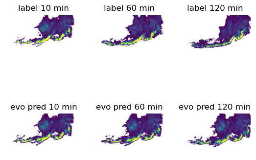
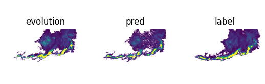

# NowcastNet: Physics-based generative model for extreme precipitation nowcasting

## Overview

NowcastNet is proposed by Long Mingsheng. It is a nonlinear nowcasting model for
extreme precipitation with lead times of up to 3h. It includes a stochastic generative network and a deterministic
evolution network. The evolution network yields physically plausible predictions for advective features at a scale of
20km. The generative network generates convective details present in the radar observations.
More information can be found in [paper](https://www.nature.com/articles/s41586-023-06184-4). The architecture of the
model is shown below.


This tutorial shows how to train and fast infer the model through MindEarth.。More information can be found in [paper](https://www.nature.com/articles/s41586-023-06184-4).
We used [USA-MRMS](https://cloud.tsinghua.edu.cn/d/b9fb38e5ee7a4dabb2a6/) provided by authors. This work run evolution module and generation module individually.
You could set `module_name` in `./configs/Nowcastnet.yaml`. It can be set to: `evolution` or `generation`

## QuickStart

You can download dataset from [NowcastNet/dataset](https://download-mindspore.osinfra.cn/mindscience/mindearth/dataset/nowcastnet/) for model evaluation. You should modify `root_dir` in `./configs/Nowcastnet.yaml`.

### Run Option: Call `.sh` from command line

You should set `module_name: evolution` in `./configs/Nowcastnet.yaml` if you want to run evolution module, otherwise set `module_name: generation`

### Single-Device training

Set `distribute: False` in `./configs/Nowcastnet.yaml`.

```shell
cd scripts
bash run_standalone_train.sh $device_id
```

### Distribution training

Set `distribute: True` in `./configs/Nowcastnet.yaml`.

```shell
cd scripts
bash run_distributed_train.sh $path/to/rank_table.json $device_num $device_start_id
```

### Evaluation

Set `load_ckpt: True` in `./configs/Nowcastnet.yaml`. You should set `evolution_ckpt_path` if you  want to run evolution module, otherwise set `generate_ckpt_path`.

```shell
cd scripts
bash run_eval.sh $device_id
```

### Visualization：

#### Evolution

The following figure shows the label and prediction from our evolution module.



#### Generation

The following figure shows the label and prediction from our generation module.



## Contributor

gitee id: Zhou Chuansai

email: chuansaizhou@163.com