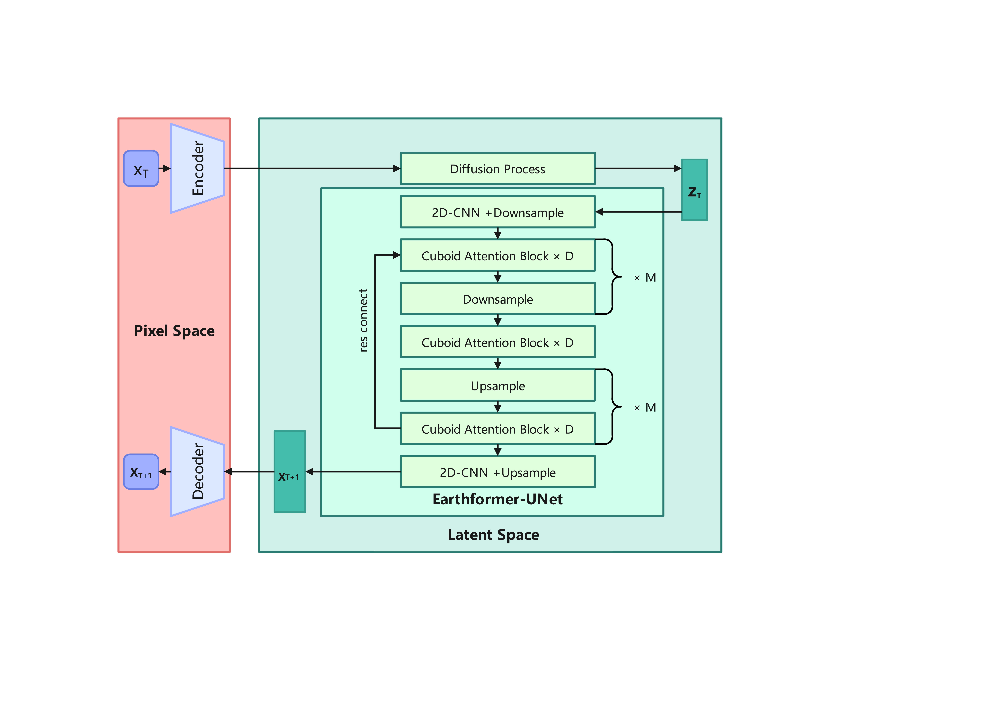

# PreDiff: Short-Term Precipitation Forecasting Based on Latent Diffusion Models

## Overview

Traditional weather forecasting techniques rely on complex physical models. These models not only incur high computational costs but also require in-depth professional knowledge. However, in the past decade, with the explosive growth of Earth's spatio-temporal observation data, deep learning techniques have opened up new avenues for building data-driven prediction models. Although these models have demonstrated great potential in various Earth system prediction tasks, they still fall short in managing uncertainties and integrating domain-specific prior knowledge, often resulting in vague or physically implausible prediction results.

To overcome these challenges, Gao Zhihan from the Hong Kong University of Science and Technology implemented the **PreDiff** model, specifically designed for probabilistic spatio-temporal prediction. This process integrates a conditional latent diffusion model with an explicit knowledge alignment mechanism, aiming to generate prediction results that adhere to domain-specific physical constraints and accurately capture spatio-temporal changes. Through this approach, we expect to significantly improve the accuracy and reliability of Earth system predictions. On this basis, refined results are generated to obtain the final precipitation forecast. The model framework diagram is shown below (the image is sourced from the paper [PreDiff: Precipitation Nowcasting with Latent Diffusion Models](https://openreview.net/pdf?id=Gh67ZZ6zkS)).



During the training process, data extracts key information into the latent space through the variational autoencoder, then randomly selects time steps to generate corresponding noise for the data, performing noise injection. The noisy data is then input into Earthformer-UNet for denoising, which utilizes a UNet architecture and cuboid attention while removing the cross-attention structure connecting the encoder and decoder in Earthformer. Finally, the results are restored to obtain the denoised data through a variational autoencoder. The diffusion model learns the data distribution by reversing the predefined noise injection process that corrupts the original data.

This tutorial demonstrates how to train and perform rapid inference on the model using MindEarth. For more information, refer to the [article](https://openreview.net/pdf?id=Gh67ZZ6zkS).
In this tutorial, the open-source dataset [SEVIR-LR](https://deep-earth.s3.amazonaws.com/datasets/sevir_lr.zip) is used for training and inference.

You can download the required checkpoint (ckpt) files for training and inference at [ckpt](https://download-mindspore.osinfra.cn/mindscience/mindearth/dataset/PreDiff/)

## Quick Start

Download and save the data from [PreDiff/dataset](https://deep-earth.s3.amazonaws.com/datasets/sevir_lr.zip), and then modify the `root_dir` path in `./configs/diffusion_cfg.yaml`.

### Running Method: Invoke the `main` script from the command line

```python

python main.py --device_id 0 --device_target Ascend --cfg ./configs/diffusion_cfg.yaml --mode train

```

Here, `--device_target` indicates the device type, with the default being Ascend. `--device_id` indicates the number of the running device, with the default value being 0. `--cfg` is the path to the configuration file, with the default value being `./configs/diffusion_cfg.yaml`. `--mode` is the running mode, with the default value being `train`.

### Inference

Set `ckpt_path` in `./configs/diffusion_cfg.yaml` to the ckpt address of the diffusion model.

```python

python main.py --device_id 0 --mode test

```

### Results Presentation

#### Visualization of Prediction Results

The following figure shows the results of inference after training with approximately 20,000 samples for 2000 epochs.


### Performance

|        Parameter         |        NPU              |
|:----------------------:|:--------------------------:|
|    Hardware        |     Ascend,64G    |
|     MindSpore Version   |        2.5.0             |
|     Dataset      |      SEVIR-LR             |
|     Training Parameters    |        batch_size=1, steps_per_epoch=24834, epochs=5            |
|     Testing Parameters      |        batch_size=1, steps=2500              |
|     Optimizer      |        AdamW              |
|        Training Loss (MSE)      |        0.0857             |
|        POD robability of Detection(16h)      |        0.50             |
|        Training Resources      |        1 Node, 1 NPU            |
|        Training Speed (ms/step)          |     3000 ms       |

## Contributors

Gitee ID: funfunplus

Email: funniless@163.com