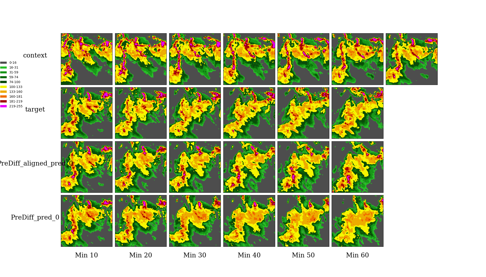

# PreDiff: 基于潜在扩散模型的降水短时预报

## 概述

传统的天气预报技术依赖于复杂的物理模型，这些模型不仅计算成本高昂，还要求深厚的专业知识支撑。然而，近十年来，随着地球时空观测数据的爆炸式增长，深度学习技术为构建数据驱动的预测模型开辟了新的道路。虽然这些模型在多种地球系统预测任务中展现出巨大潜力，但它们在管理不确定性和整合特定领域先验知识方面仍有不足，时常导致预测结果模糊不清或在物理上不可信。

为克服这些难题，来自香港科技大学的Gao Zhihan实现了**prediff**模型，专门用于实现概率性的时空预测。该流程融合了条件潜在扩散模型与显式的知识对齐机制，旨在生成既符合特定领域物理约束，又能精确捕捉时空变化的预测结果。通过这种方法，我们期望能够显著提升地球系统预测的准确性和可靠性。
基础上生成精细化的结果，从而得到最终的降水预报。模型框架图入下图所示(图片来源于论文 [PreDiff: Precipitation Nowcasting with Latent Diffusion Models](https://openreview.net/pdf?id=Gh67ZZ6zkS))


训练的过程中，数据通过变分自编码器提取关键信息到隐空间，之后随机选择时间步生成对应时间步噪声，对数据进行加噪处理。之后将数据输入Earthformer-UNet进行降噪处理，Earthformer-UNet采用了UNet构架和cuboid attention，去除了Earthformer中连接encoder和decoder的cross-attention结构。最后将结果通过变分自解码器还原得到去噪后的数据，扩散模型通过反转预先定义的破坏原始数据的加噪过程来学习数据分布。

本教程展示了如何通过MindEarth训练和快速推理模型。更多信息参见[文章](https://openreview.net/pdf?id=Gh67ZZ6zkS)
本教程中使用开源数据集[SEVIR-LR](https://deep-earth.s3.amazonaws.com/datasets/sevir_lr.zip)数据集进行训练和推理。

可以在[ckpt](https://download-mindspore.osinfra.cn/mindscience/mindearth/dataset/PreDiff/)下载训练和推理所需要的ckpt

## 快速开始

在[PreDiff/dataset](https://deep-earth.s3.amazonaws.com/datasets/sevir_lr.zip)下载数据并保存，然后在`./configs/diffusion_cfg.yaml`中修改`root_dir`路径。

### 运行方式： 在命令行调用`main`脚本

```python

python main.py --device_id 0 --device_target Ascend --cfg ./configs/diffusion_cfg.yaml --mode train

```

其中， --device_target 表示设备类型，默认Ascend。 --device_id 表示运行设备的编号，默认值0。 --cfg 配置文件路径，默认值"./configs/diffusion_cfg.yaml"。 --mode 运行模式，默认值train

### 推理

在`./configs/diffusion_cfg.yaml`中设置`ckpt_path`为diffusion模型ckpt地址。

```python

python main.py --device_id 0 --mode test

```

### 结果展示：

#### 预测结果可视化

下图展示了使用约2w条样本训练2000个epoch后进行推理绘制的结果。



### 性能

|        Parameter         |        NPU              |
|:----------------------:|:--------------------------:|
|    硬件版本        |     Ascend， 64G     |
|     mindspore版本   |        2.5.0             |
|     数据集      |      SEVIR-LR             |
|     训练参数    |        batch_size=1, steps_per_epoch=24834, epochs=5            |
|     测试参数      |        batch_size=1,steps=2500              |
|     优化器      |        AdamW              |
|        训练损失(MSE)      |        0.0857             |
|        POD预测命中率(16h)      |        0.50             |
|        训练资源      |        1Node 1NPU            |
|        训练速度(ms/step)          |     3000ms       |

## 贡献者

gitee id: funfunplus

email: funniless@163.com