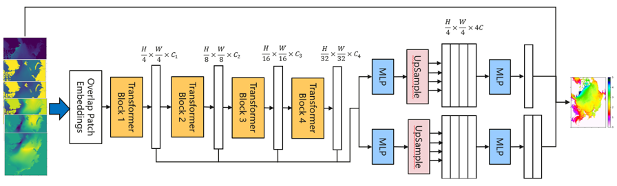
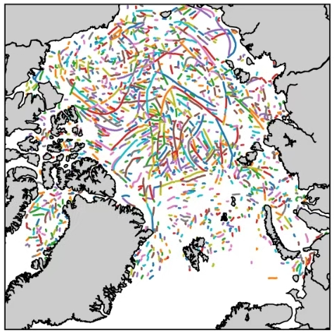

# LeadFormer: High-Resolution Intelligent Forecasting of Arctic Sea Ice

## Overview

Leads are linear fracture zones formed in sea ice under the influence of waves, wind, and ocean currents. Their morphological
 characteristics reflect the intensity of substance and energy exchange between the ocean and the atmosphere, influencing turbulent heat fluxes on the lead surface.
  Therefore, accurately characterizing the morphology and spatial distribution of leads is crucial for studying Arctic sea ice changes and predicting navigational routes.  

The morphological features of leads include length, width, and orientation (tilt angle).  

- Lead width largely determines the intensity of heat and moisture exchange between the atmosphere and ocean  
- Lead orientation reflects and influences sea ice dynamics  
- Total lead length serves as an indicator for measuring scale variations, seasonal changes, and interannual variability of leads  

High-resolution sea ice lead forecasting models are key technological tools for addressing the rapid changes in Arctic sea ice under global warming.
 To tackle the complexity of sea ice change mechanisms and the uncertainty in sea ice forecasting, ***LeadFormer*** leverages Arctic high-resolution
  numerical model data and a Transformer-based artificial intelligence model. It achieves intelligent forecasting of Arctic leads, covering the pan-Arctic
   region with a high-resolution ice condition forecasting system at 2 km resolution.

The model framework is shown in the figure below:



The model adopts an encoder-decoder framework:

- **Encoding stage**: Compresses and deepens features through overlapping block embedding and a four-level Transformer block structure
- **Decoding stage**: Gradually reconstructs spatial dimensions via MLP (Multi-Layer Perceptron) and upsampling operations
- **Core innovation**: Fuses global modeling capability of Transformers with local perception characteristics of CNNs (Convolutional Neural Networks),
 making it suitable for high-precision image processing tasks

The dataset for this model is currently not open-source; only the code is open-sourced.

## Quick Start

Prepare your data, then modify the `data_path` in `./configs/2km_ice_config.yaml` (data not currently open source).

### Running Method: Call the `main` script from the command line

```python
python main.py --device_id 0 --device_target Ascend --cfg ./configs/diffusion_cfg.yaml --mode train
```

Where:

- `--device_target` indicates the device type, default is Ascend.
- `--device_id` indicates the ID of the running device, default is 0.
- `--cfg` is the path to the configuration file, default is "./configs/2km_ice_config.yaml".
- `--mode` is the running mode, default is train.

### Inference

Set `model_checkpoint` in `./configs/2km_ice_config.yaml` to the path of the diffusion model checkpoint.

```python
python main.py --device_id 0 --mode test
```

### Result Display

#### Prediction Result Visualization

The following figure shows the results obtained after training with 728 samples for 30 epochs and then performing inference.
In the figure, the black outlines represent the topography, and the colored bands represent the prediction results.



### Performance

| Parameter | NPU |
|:----------------------:|:--------------------------:|
| Hardware Version | Ascend, 64G |
| MindSpore Version | 2.5.0 |
| Dataset | Polar Region Images |
| Training Parameters | batch_size=1, steps_per_epoch=728, epochs=30 |
| Testing Parameters | batch_size=1, steps=44 |
| Optimizer | AdamW |
| Training Loss (RMSE) | 0.07727 |
| Lead Detection Prediction Accuracy (Acc) | 98.90112% |
| Lead Length Deviation | 0.09848% |
| Lead Angle Deviation | 6.27244° |
| Lead Width Deviation | 1.21519% |
| Training Resources | 1 Node 8 NPUs |

## Contributors

**gitee id**: funfunplus
**email**: funniless@163.com