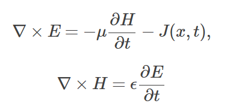
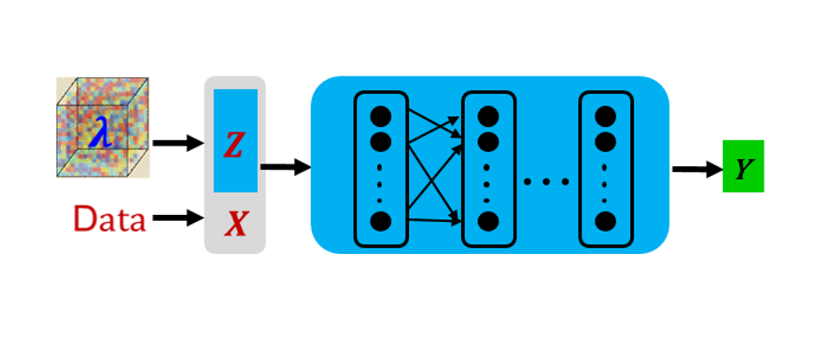
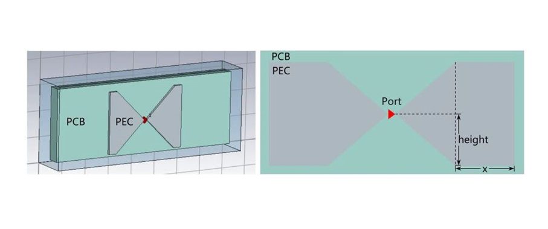
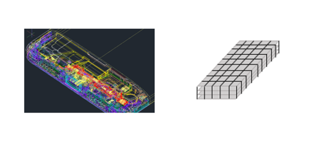

# MindSpore Elec

[View English](README.md)

<!-- TOC --->

- [MindSpore Elec介绍](#mindspore-elec介绍)
    - [数据构建及转换](#数据构建及转换)
    - [仿真计算](#仿真计算)
        - [AI电磁模型库](#AI电磁模型库)
        - [优化策略](#优化策略)
    - [结果可视化](#结果可视化)
    - [论文](#论文)
    - [典型应用案例](#典型应用案例)
- [安装教程](#安装教程)
    - [确认系统环境信息](#确认系统环境信息)
    - [网页下载安装](#网页下载安装)
    - [pip安装](#pip安装)
    - [源码安装](#源码安装)
- [API](#api)
- [验证是否成功安装](#验证是否成功安装)
- [快速入门](#快速入门)
- [文档](#文档)
- [社区](#社区)
    - [治理](#治理)
- [贡献](#贡献)
- [版本说明](#版本说明)
- [许可证](#许可证)
- [合作伙伴](#合作伙伴)

<!-- /TOC -->

## **最新消息** 📰

- `2022.11` 论文"Meta-Auto-Decoder for Solving Parametric Partial Differential Equations" 被AI领域顶会 NeurIPS 2022 SpotLight(前5%)接收，详情参见[论文](https://arxiv.org/pdf/2111.08823)和[代码](https://gitee.com/mindspore/mindscience/tree/master/MindElec/examples/physics_driven/incremental_learning)
- `2022.07` 论文"A Universal PINNs Method for Solving Partial Differential Equations with a Point Source" 被AI领域顶会 IJCAI 2022接收，详情参见[论文](https://www.ijcai.org/proceedings/2022/533)和[代码](https://gitee.com/mindspore/mindscience/tree/master/MindElec/examples/physics_driven/time_domain_maxwell)

## MindSpore Elec介绍

电磁仿真是指通过计算的方式模拟电磁波在物体或空间中的传播特性，其在手机容差、天线优化和芯片设计等场景中应用广泛。传统数值方法如有限差分、有限元等需网格剖分、迭代计算，仿真流程复杂、计算时间长，无法满足产品的设计需求。AI方法具有万能逼近和高效推理能力，可有效提升仿真效率。

MindSpore Elec是基于MindSpore开发的AI电磁仿真工具包，由数据构建及转换、仿真计算、以及结果可视化组成。可以支持端到端的AI电磁仿真。目前已在华为终端手机容差场景中取得阶段性成果，相比商业仿真软件，AI电磁仿真的S参数误差在2%左右，端到端仿真速度提升10+倍。

<div align=center>

</div>

### 数据构建及转换

支持CSG （Constructive Solid Geometry，CSG）
模式的几何构建，如矩形、圆形等结构的交集、并集和差集，以及cst和stp数据（CST等商业软件支持的数据格式）的高效张量转换。未来还会支持智能网格剖分，为传统科学计算使用。

### 仿真计算

#### AI电磁模型库

提供物理和数据驱动的AI电磁模型：物理驱动是指网络的训练无需额外的标签数据，只需方程和初边界条件即可；数据驱动是指训练需使用仿真或实验等产生的数据。物理驱动相比数据驱动，优势在于可避免数据生成带来的成本和网格独立性等问题，劣势在于需明确方程的具体表达形式并克服点源奇异性、多任务损失函数以及泛化性等技术挑战。

#### 优化策略

为提升物理和数据驱动模型的精度、减少训练的成本，提供了一系列优化措施。数据压缩可以有效地减少神经网络的存储和计算量；多尺度滤波、动态自适应加权可以提升模型的精度，克服点源奇异性等问题；小样本学习主要是为了减少训练的数据量，节省训练的成本。

### 结果可视化

仿真的结果如S参数或电磁场等可保存在CSV、VTK文件中。MindInsight可以显示训练过程中的损失函数变化，并以图片的形式在网页上展示结果；Paraview是第三方开源软件，具有动态展示切片、翻转等高级功能。

### 论文

如果你对求解时域麦克斯韦方程感兴趣，请阅读我们的相关[论文](https://arxiv.org/abs/2111.01394): Xiang Huang, Hongsheng Liu, Beiji Shi, Zidong Wang, Kang Yang, Yang Li, Bingya Weng, Min Wang, Haotian Chu, Jing Zhou, Fan Yu, Bei Hua, Lei Chen, Bin Dong, Solving Partial Differential Equations with Point Source Based on Physics-Informed Neural Networks, preprint 2021

如果你对元学习自解码器求解参数化偏微分方程感兴趣，请阅读我们的相关[论文](https://arxiv.org/abs/2111.08823): Xiang Huang, Zhanhong Ye, Hongsheng Liu, Beiji Shi, Zidong Wang, Kang Yang, Yang Li, Bingya Weng, Min Wang, Haotian Chu, Jing Zhou, Fan Yu, Bei Hua, Lei Chen, Bin Dong, Meta-Auto-Decoder for Solving Parametric Partial Differential Equations, preprint 2021

### 典型应用案例

#### 物理驱动的AI电磁仿真方法

- [点源时域麦克斯韦方程AI求解](https://www.mindspore.cn/mindelec/docs/zh-CN/master/time_domain_maxwell.html)

  基于PINNs方法求解二维时域MaxWell方程时，面临点源奇异性、剧烈变化的多尺度波函数以及多损失函数等问题。MindSpore Elec通过高斯分布函数平滑、多通道残差网络结合sin激活函数的网络结构以及自适应加权的多任务学习策略，使得求解精度和性能均明显优于其他框架及方法。[【代码链接】](https://gitee.com/mindspore/mindscience/tree/master/MindElec/examples/physics_driven/time_domain_maxwell)
<div align="center">

</div>
<div align="center">


</div>

- [增量训练求解麦克斯韦方程组](https://www.mindspore.cn/mindelec/docs/zh-CN/master/incremental_learning.html)

  方程介质参数发生变化时，需重新训练。为降低训练成本，我们提出了基于物理信息的自解码器来求解同一类的方程组。该方法将高维可变参数空间映射到由低维向量表征的低维流形上，然后将流形的特征参数与方程的输入融合作为点源问题求解网络的输入一起参与到PINNs的训练中，由此可以得到预训练模型。针对新给定的可变参数问题，对预训练模型进行微调即可以得到新方程的解。[【代码链接】](https://gitee.com/mindspore/mindscience/tree/master/MindElec/examples/physics_driven/incremental_learning)

<div align="center">


</div>

#### 数据驱动的AI电磁仿真方法

- [基于参数化方案的AI电磁仿真](https://www.mindspore.cn/mindelec/docs/zh-CN/master/parameterization.html)

  蝶形天线参数化方案实现的是参数到仿真结果的直接映射，例如天线的宽度、角度作为网络输入，网络输出为散射参数（S参数）。参数化方案的优点是直接映射且网络简单。[【代码链接】](https://gitee.com/mindspore/mindscience/tree/master/MindElec/examples/data_driven/parameterization)

<div align="center">


</div>

- [基于点云方案的AI电磁仿真](https://www.mindspore.cn/mindelec/docs/zh-CN/master/point_cloud.html)

  点云方案实现的是从天线/手机的采样点云到仿真结果的映射，该方案先将手机结构文件转化为点云张量数据，（压缩后）使用卷积神经网络提取结构特征，再通过数层全连接层映射到最终的仿真结果（即S参数），该方案的优点是适用于结构参数数量或种类可能发生变化的复杂工况。[【代码链接】](https://gitee.com/mindspore/mindscience/tree/master/MindElec/examples/data_driven/pointcloud)

<div align="center">


</div>

#### 端到端可微分的FDTD方法

- [基于可微分FDTD的贴片天线S参数仿真](https://www.mindspore.cn/mindelec/docs/zh-CN/master/AD_FDTD_forward.html)

  时域有限差分（FDTD）方法求解麦克斯韦方程组的过程等价于一个循环卷积网络（RCNN）。利用MindSpore的可微分算子重写更新流程，便可得到端到端可微分FDTD。如下图右，三维贴片天线S参数仿真精度与BenchMark一致。[【代码链接】](https://gitee.com/mindspore/mindscience/tree/master/MindElec/examples/AD_FDTD/fdtd_forward)

<div align="center">


</div>

- [端到端可微分FDTD求解电磁逆散射问题](https://www.mindspore.cn/mindelec/docs/zh-CN/master/AD_FDTD_inverse.html)

  基于端到端可微FDTD求解二维TM模式的电磁逆散射问题。两个介质体位于矩形区域内。如下图左，在求解区域外侧设置4个激励源（红色三角）和8个观察点（绿色原点）。反演得到的相对介电常数SSIM达0.9635，与目标（下图右）高度吻合。[【代码链接】](https://gitee.com/mindspore/mindscience/tree/master/MindElec/examples/AD_FDTD/fdtd_inverse)

<div align=center>


</div>

## 安装教程

### 版本依赖关系

由于MindSpore Elec与MindSpore有依赖关系，请根据下表中所指示的对应关系，在[MindSpore下载页面](https://www.mindspore.cn/versions)
下载并安装对应的whl包。

|   MindSpore Elec 版本  |                                  分支                                    |  MindSpore 运行最低版本 |
|:---------------------:|:-----------------------------------------------------------------------:|:---------------------:|
|        master         | [master](https://gitee.com/mindspore/mindscience/tree/master/MindElec)  |           \           |
|       0.2.0rc1        | [r0.2.0](https://gitee.com/mindspore/mindscience/tree/r0.2.0/MindElec)  |       \>=2.0.0rc1     |

其余依赖请参见[requirements.txt](https://gitee.com/mindspore/mindscience/blob/master/MindElec/requirements.txt)

### 硬件支持情况

| 硬件平台      | 操作系统        | 状态  |
| :------------ | :-------------- | :--- |
| Ascend 910    | Ubuntu-x86      | ✔️   |
|               | Ubuntu-aarch64  | ✔️   |
|               | EulerOS-aarch64 | ✔️   |
|               | CentOS-x86      | ✔️   |
|               | CentOS-aarch64  | ✔️   |

### 网页下载安装

在[MindSpore Elec下载页面](https://www.mindspore.cn/versions) 直接下载并安装对应whl包

```bash
pip install mindelec_ascend-0.2.0rc1-cp37-cp37m-linux_x86_64.whl
```

此外，还有ARM架构下相应的whl包，请用户查阅。

### pip安装

下载并安装对应的whl包。

```bash
pip install https://ms-release.obs.cn-north-4.myhuaweicloud.com/2.0.0rc1/MindScience/{arch}/mindelec_ascend-{version}-{python_version}-linux_{arch}.whl -i https://pypi.tuna.tsinghua.edu.cn/simple
```

> -在联网状态下，安装whl包时会自动下载MindSpore Elec安装包的依赖项（依赖项详情参见[setup.py](https://gitee.com/mindspore/mindscience/blob/master/MindElec/setup.py)），点云数据采样依赖[pythonocc](https://github.com/tpaviot/pythonocc-core)，需自行安装。
> - `{version}`表示MindSpore Elec版本号，例如下载0.1.0版本MindSpore Elec时，`{version}`应写为0.1.0。
> - `{arch}`表示系统架构，例如使用的Linux系统是x86架构64位时，`{arch}`应写为x86_64。如果系统是ARM架构64位，则写为aarch64。
> - `{python_version}`表示用户的Python版本，Python版本为3.7.5时，{python_version}应写为cp37-cp37m。Python版本为3.9.0时，则写为cp39-cp39。

### 源码安装

1. 从代码仓下载源码

    ```bash
    cd ~
    git clone https://gitee.com/mindspore/mindscience.git
    ```

2. 编译安装MindSpore Elec

    ```bash
    cd ~/MindElec
    bash build.sh
    pip install output/mindelec_ascend-0.2.0rc1-cp37-cp37m-linux_x86_64.whl -i https://pypi.tuna.tsinghua.edu.cn/simple
    ```

## API

MindSpore Elec API文档请查看[文档链接](https://mindspore.cn/mindelec/docs/zh-CN/master/mindelec.architecture.html)

## 验证是否成功安装

执行如下命令，如果没有报错`No module named 'mindelec'`，则说明安装成功。

```bash
python -c 'import mindelec'
```

## 快速入门

关于如何快速使用AI电磁仿真工具包，进行训练推理，请点击查看[MindSpore Elec使用教程](https://mindspore.cn/mindelec/docs/zh-CN/master/intro_and_install.html)

## 文档

有关安装指南、教程和API的更多详细信息，请参阅[用户文档](https://gitee.com/mindspore/docs/tree/master/docs/mindscience)。

## 社区

### 治理

查看MindSpore如何进行[开放治理](https://gitee.com/mindspore/community/blob/master/governance.md)。

## 贡献

欢迎参与贡献。更多详情，请参阅我们的[贡献者Wiki](https://gitee.com/mindspore/mindspore/blob/master/CONTRIBUTING.md)。

## 版本说明

版本说明请参阅[RELEASE](https://gitee.com/mindspore/mindscience/blob/master/MindElec/RELEASE.md)。

## 许可证

[Apache License 2.0](LICENSE)

## 合作伙伴

<div align=center>


</div>
