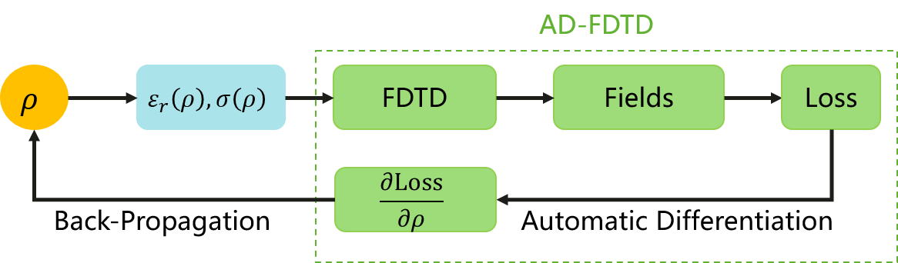

# Contents

- [Contents](#contents)
    - [Maxwell's Equations](#maxwells-equations)
    - [AD-FDTD-Based Solver for the Electromagnetic Inversion Problems](#ad-fdtd-based-solver-for-the-electromagnetic-inversion-problems)
    - [Datasets](#datasets)
    - [Environment Requirements](#environment-requirements)
    - [Script Description](#script-description)
        - [Script and Sample Code](#script-and-sample-code)
    - [Script Parameters](#script-parameters)
    - [Training](#training)
        - [Training Performance](#training-performance)
    - [Evaluation](#evaluation)
    - [MindScience Home Page](#mindscience-home-page)

## Maxwell's Equations

Maxwell's equations are a set of differential equations that describe how electric and magnetic fields are generated by charges and currents. The governing equations with excitation sources are described as follows:

$$
\begin{split}
\nabla\times E&=-\mu \dfrac{\partial H}{\partial t},\\
\nabla\times H&=\epsilon \dfrac{\partial E}{\partial t} + \sigma E + J,
\end{split}
$$

where $\epsilon,\mu, \sigma$ are permittivity, permeability and conductivity of the material respectively. $J$ represents a known excitation source function. Common excitation sources include point source, line source and area source. In this tutorial, the point sources are considered, of which can be expressed as follows:

$$
J(x, y, t)=\delta(x - x_0, y-y_0)f(t)
$$

## AD-FDTD-Based Solver for the Electromagnetic Inversion Problems

Finite-Difference Time-Domain (FDTD) method, which is widely used in solving Maxwell's equations, is equivalent to a recurrent convolution neural network (RCNN). For example, when using CFS-PML to truncate the solution domain, the updating process at the $n$th time step in the TM-mode 2-D FDTD method is as follows:


Using the differentiable operators in MindSpore, it is quite straightforward to implement an end-to-end automatically differentiable FDTD (AD-FDTD) solver. Combining with the differentiable loss function and the differentiable mapping from the parameters to the material distributions, the AD-FDTD-based solver can be applied to solve various electromagnetic inverse problems, such as the electromagnetic inverse scattering problems.
The structure of the solver can be as follows:



In this tutorial, the solver is used to solve a TM-mode electromagnetic inverse scattering problem. The following figure describes the setup of the problem:


Here, two dielectric circles with $\varepsilon_r=4$ are to be reconstructed. The inversion domain $\Omega = \{(x,y)|0.3\leq x\leq 0.7, 0.3\leq y\leq 0.7\}$. 4 sources (marked as red triangles) and 8 receivers (marked as green dots) are placed outside the inversion domain. $\rho(x,y)$ represents the parameters to be optimzed, where $(x,y)\in\Omega$, and the relative permittivity $\varepsilon_r(x,y)$ are generated according to a differentiable mapping $\varepsilon_r=\varepsilon_{r,\min}+\text{elu}(\rho,\alpha=1e-2)$. The inputs of the solver are the time-domain waveforms of the sources, and the outputs are $E_z$ at the receivers accordingly. The loss function is the mse loss. By applying the automatic difference to the loss function, we can optimize the parameters $\rho$ with gradient-based optimizers, such as SGD and ADAM.

## Datasets

- Training data: $E_z$ at the 8 receivers with respect to the 4 sources computed by FDTD method.
- Evaluation data: The relative permittivities to be reconstructed.

## Environment Requirements

- Hardware (CPU/GPU)
    - Prepare the CPU/GPU to set up the hardware environment.
- Framework
    - [MindSpore](https://www.mindspore.cn/install)　　
- For more information, see the following resources:
    - [MindSpore Tutorial](https://www.mindspore.cn/tutorials/en/master/index.html)
    - [MindSpore Python API](https://www.mindspore.cn/docs/en/master/index.html)

## Script Description

### Script and Sample Code

```path
└─AD_FDTD
  ├─README.md
  ├─docs                                      # schematic diagram of README
  ├─src
    ├──constants.py                           # physical constants
    ├──base_topology_designer.py              # basic class for differentialbe topology designers
    ├──transverse_mangetic.py                 # TM-Mode 2D AD-FDTD
    ├──transverse_electric.py                 # TE-Mode 2D AD-FDTD
    ├──cfs_pml.py                             # CFS-PML boundary condition
    ├──waveforms.py                           # time-domain waveforms
    ├──utils.py                               # utility functions
    ├──metric.py                              # metric functions
    ├──solver.py                              # AD-FDTD-based solvers
  ├─dataset                                   # pre-computed label data
  ├─solve.py                                  # solve script
```

## Script Parameters

The control parameters are set in the `solve.py` file as follows:

```python
"epoch": 100,                           # number of epoch of training
"lr": 0.1,                              # learning rate
"device_target": "GPU",                 # device name
"nt": 350,                              # number of time steps
"max_call_depth": 2000,                 # limitation for maximum call depth
"dataset_dir": "./dataset",             # path of dataset directory
"result_dir": "./result",               # path to save the results
```

## Training

You can start training by running `solve.py` as follows：

```shell
python solve.py --epoch 100
    --device_target 'GPU'
```

### Training Performance

The scripts provides the function of evaluation while training. The total loss of training are as follows:

```log
Epoch: [  0 / 100], loss: 2.114364e-01
Epoch: [  1 / 100], loss: 1.751708e-01
Epoch: [  2 / 100], loss: 1.517662e-01
Epoch: [  3 / 100], loss: 1.315168e-01
Epoch: [  4 / 100], loss: 1.142960e-01
Epoch: [  5 / 100], loss: 9.941817e-02
...
Epoch: [ 95 / 100], loss: 1.188854e-04
Epoch: [ 96 / 100], loss: 1.157768e-04
Epoch: [ 97 / 100], loss: 1.127892e-04
Epoch: [ 98 / 100], loss: 1.099153e-04
Epoch: [ 99 / 100], loss: 1.071493e-04
```

## Evaluation

After solving the problem, the script will automatically compute the PSNR and SSIM of the reconstructed results:

```log
[epsr] PSNR: 27.835317 dB, SSIM: 0.963564
```

The reconstructed results are shown in the following figure.


## MindScience Home Page

Visit the official website [home page](https://gitee.com/mindspore/mindscience).
