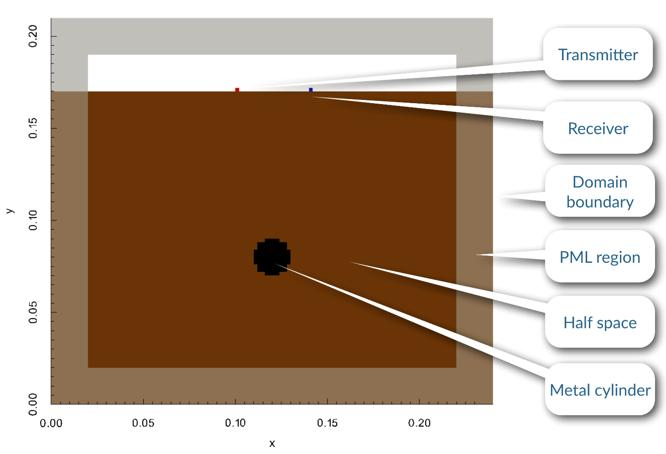
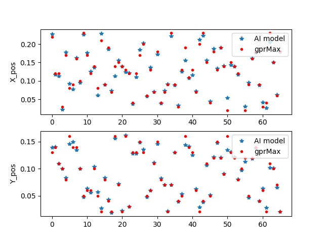

# 目录

- [目录](#目录)
- [探地雷达电磁反演](#探地雷达电磁反演)
- [数据集](#数据集)
- [环境要求](#环境要求)
- [脚本说明](#脚本说明)
    - [脚本及样例代码](#脚本及样例代码)
    - [数据集生成](#数据集生成)
    - [脚本参数](#脚本参数)
    - [模型训练](#模型训练)
    - [模型推理](#模型推理)
- [随机情况说明](#随机情况说明)
- [MindScience主页](#mindscience主页)

# 探地雷达电磁反演

探地雷达（Ground Penetrating Radar，GPR）是利用天线发射和接收高频电磁波来探测介质内部特性的一种地球物理方法。由于其探测的高精度、高效率以及无损的特点，目前已被用于考古、矿产勘查、灾害地质调查、岩土工程勘察、工程质量检测、建筑结构检测以及军事目标探测等众多领域。MindSpore Elec电磁仿真套此前主要聚焦于正问题（或正演），即已知待仿真目标的结构和属性，计算电磁场以及散射参数等物理量。探地雷达的电磁反演则是经典的反问题，需要根据接收来的电磁波信号，反推出目标的结构和属性。本案例主要介绍基于数据驱动的AI方法解决探地雷达的电磁反演问题。

# 数据集

- 数据集大小：共330个电磁场物理量([Ez、Hx、Hy])-金属圆柱位置([x,y])的样本对，按照8:2随机划分训练集和测试集。
- 数据格式：张量数据

# 环境要求

- 硬件（Ascend/GPU）
- 准备Ascend/GPU处理器搭建硬件环境。
- 框架
    - [MindSpore](https://www.mindspore.cn/install)　　
- 如需查看详情，请参见如下资源：
    - [MindSpore教程](https://www.mindspore.cn/tutorials/zh-CN/master/index.html)
    - [MindSpore Python API](https://www.mindspore.cn/docs/api/zh-CN/master/index.html)

# 脚本说明

## 脚本及样例代码

```path
└─gprinversion
  ├─README.md
  ├─docs                              # README示意图
  ├─ckpt                              # 训练完的checkpoint
  ├─dataset                           # 数据集生成
    ├──generate.sh                    # 基于gprMax生成HDF5文件数据
    ├──convert.py                     # HDF5文件转换成numpy数据
　├──metric.py                        # 损失&误差评估函数
　├──monitoreval.py                   # 监测函数
　├──train.py                         # 训练网络
　├──eval.py                          # 评估网络
```

## 数据集生成（可直接使用数据集）

### 安装gprMax

根据要求安装gprMax 3.1.5版本的[开源软件](https://github.com/gprMax/gprMax)。gprMax源码中的gprMax/user_models目录提供了基础的探地雷达的应用模型，我们采用cylinder_Ascan_2D.in模型，如图所示：



对应的in文件如下：

```shell
#title: A-scan from a metal cylinder buried in a dielectric half-space
#domain: 0.240 0.210 0.002
#dx_dy_dz: 0.002 0.002 0.002
#time_window: 3e-9

#material: 6 0 1 0 half_space

#waveform: ricker 1 1.5e9 my_ricker
#hertzian_dipole: z 0.100 0.170 0 my_ricker
#rx: 0.140 0.170 0

#box: 0 0 0 0.240 0.170 0.002 half_space
#cylinder: 0.120 0.080 0 0.120 0.080 0.002 0.010 pec

#geometry_view: 0 0 0 0.240 0.210 0.002 0.002 0.002 0.002 cylinder_half_space n
```

其中，#domain表示仿真区域（x、y、z，单位为米），#dx_dy_dz为网格大小（单位为米），#time_window为仿真时间（单位秒），#material为模型属性，#waveform为发射源的波形（振幅和频率），#hertzian_dipole为发射源位置，#rx为接收源位置，#box为背景介质，#cylinder为金属圆柱位置及材料属性，#geometry_view将模型的几何信息输出到文件中，详细的描述可以参考[文档](http://docs.gprmax.com/en/latest/examples_simple_2D.html)。

### HDF5文件数据生成

在gprMax/user_models中创建文件夹cylinder_Ascan_2D，在文件夹中运行本案例中dataset提供的generate.sh脚本。generate.sh会创建sample文件夹，并根据金属圆柱的位置生成不同的HDF5文件，即cylinder_Ascan_2D.out文件。

```shell
cd gprMax/user_models
mkdir cylinder_Ascan_2D
cd cylinder_Ascan_2D
bash generate.sh
```

### HDF5文件转换成Numpy数据

convert.py代码会从sample文件夹中读取批量的HDF5文件，并提取和保存电磁场物理量。

```shell
python convert.py
```

## 脚本参数

在train.py和eval.py中可以配置训练和评估参数。

```python
"epoch": 1000,                                             # 训练轮数
"print_interval":100,                                      # 评估间隔
"batch_size": 10,                                          # batch_size
"lr": 0.001,                                               # 学习率
"device_num": 1,                                           # 在该设备训练
"device_target": "Ascend",                                 # 设备名称Ascend
"checkpoint_dir": './ckpt/',                               # checkpoint保存路径
"save_graphs_path": './graph_result/',                     # 计算图保存路径
```

## 模型训练

您可以通过train.py脚本训练探地雷达电磁反演模型，训练过程中模型参数会自动保存：

```shell
python train.py --epoch 1000
　　--device_target "Ascend"
    --device_num 0
    --checkpoint_dir CKPT_PATH
```

## 模型推理

您可以通过eval.py脚本进行模型的推理：

```shell
python eval.py --device_target "Ascend"
    --device_num 0
    --checkpoint_dir CKPT_PATH
```

### 推理精度

推理的结果如下，其中Loss_mse、L2_pos分别表示mse的损失函和相对误差：

```python
Loss_mse: 0.0001318697 L2_pos: 0.0545908527
```

金属圆柱的位置预测结果如下图所示：



# 随机情况说明

train.py中设置了随机种子，网络输入通过均匀分布随机采样。

# MindScience主页

请浏览官网[主页](https://gitee.com/mindspore/mindscience)。

