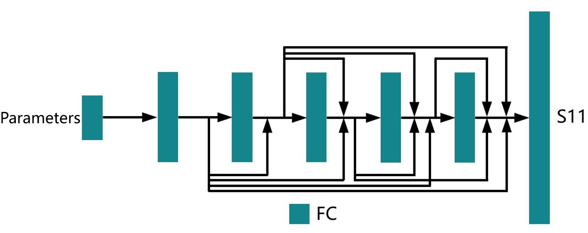

# Contents

<!-- TOC -->

- [Contents](#contents)
- [**Parameterized Electromagnetic Simulation**](#parameterized-electromagnetic-simulation)
- [**Model Architecture**](#model-architecture)
- [**Datasets**](#datasets)
- [**Requirements**](#requirements)
- [**Script Description**](#script-description)
    - [**Script and Code Sample**](#script-and-code-sample)
    - [**Parameters**](#parameters)
    - [**Model Training**](#model-training)
        - [**Usage**](#usage)
- [Random Seed Setting](#random-seed-setting)
- [MindScience Home Page](#mindscience-home-page)

<!-- /TOC -->

# **Parameterized Electromagnetic Simulation**

In some scenarios of electromagnetic simulation (such as tolerance evaluation), the structure can be described by a set of parameters. These parameters can be used as the input of neural network to simulate the scattering parameters of different structures. This section describes how to use parameterized electromagnetic simulation method of MindElec to calculate the scattering parameters of antennas and mobile phones. For details, see the parametrized electromagnetic simulation tutorial.

# **Model Architecture**

The following figure shows the network architecture of the parametrized electromagnetic simulation model.



The network inputs are the changed parameters, and the output is the S11 parameter of each frequency (S11 is the only component of scattering parameter in single port scenario).

# **Datasets**

Use the `generate_data` function in `src/dataset.py` to automatically obtain 25 x 50 x 25 block data from the original point cloud data for training or testing.

- Dataset size: There are 495 pairs of parameter-S11 samples in the bowtie antenna dataset. The training set and testing set are randomly divided into 9:1. There are 284 pairs of parameter-S11 samples in the mobile phone dataset. The training set and test set are randomly divided into 9:1.
- Data format: tensor data
    - Note: Data is processed in src/dataset.py.

# **Requirements**

- Hardware (Ascend)
    - Prepare the Ascend AI Processor to set up the hardware environment.
- Framework
    - [MindSpore Elec](https://gitee.com/mindspore/mindscience/tree/master/MindElec)
- For more information, see the following resources:
    - [MindSpore Elec Tutorial](https://www.mindspore.cn/mindelec/docs/en/master/intro_and_install.html)
    - [MindSpore Elec Python API](https://www.mindspore.cn/mindelec/docs/en/master/mindelec.architecture.html)

# **Script Description**

## **Script and Code Sample**

```path
.
└─parameterization
  ├─README.md
  ├─docs                              # schematic diagram of README
  ├─src
    ├──dataset.py                     # Dataset config
    ├──loss.py                        # Loss function
    ├──maxwell_model.py               # Parameterized electromagnetic simulation model
  ├──train.py                         # Model train
  ├──eval.py                          # Model eval
```

## **Parameters**

You can configure training and evaluation parameters in  `train.py`  and  `eval.py` .

```python
"epoch": 10000,                                                       # number of epochs
"print_interval":1000,                                                # interval for evaluation
"batch_size": 8,                                                      # size of mini-batch
"lr": 0.0001,                                                         # basic learning rate
"input_dim": 3,                                                       # parameter Dimension
"device_num": 1,                                                      # training in this equipment
"device_target": "Ascend",                                            # device Name Ascend/GPU
"checkpoint_dir": './ckpt/',                                          # checkpoint saved path
"save_graphs_path": './graph_result/',                                # graphs saved path
"input_path": './dataset/Butterfly_antenna/data_input.npy',           # input parameter dataset path
"label_path": './dataset/Butterfly_antenna/data_label.npy',           # output S11 dataset Path
```

## **Model Training**

### **Usage**

You can use the train.py script to train a parameterized electromagnetic simulation model. During the training, the model parameters are automatically saved in the configured output directory.

```shell
python train.py --input_path INPUT_PATH
                --label_path LABEL_PATH
                --device_num 0
                --checkpoint_dir CKPT_PATH
```

# Random Seed Setting

The seed for the `create_dataset` function are set in `dataset.py`. Random seeds in train.py are also used.

# MindScience Home Page

Visit the official website [home page](<https://gitee.com/mindspore/mindscience>).
