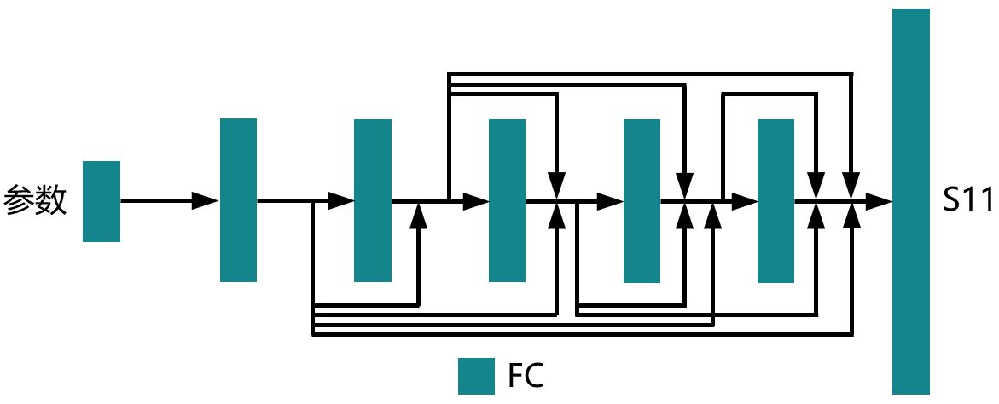

# 目录

- [目录](#目录)
- [参数化电磁仿真](#参数化电磁仿真)
- [模型架构](#模型架构)
- [数据集](#数据集)
- [环境要求](#环境要求)
- [脚本说明](#脚本说明)
    - [脚本及样例代码](#脚本及样例代码)
    - [脚本参数](#脚本参数)
    - [模型训练](#模型训练)
        - [用法](#用法)
- [随机情况说明](#随机情况说明)
- [MindScience主页](#mindscience主页)

# 参数化电磁仿真

电磁仿真的某些场景（如容差评估）中，目标结构可以用一组参数描述，将这些参数作为神经网络的输入可以仿真不同目标结构的散射参数。本案例介绍如何通过MindSpore Elec参数化方法仿真天线和手机的散射参数，详细信息可以参考参数化电磁仿真教程。

# 模型架构

参数化电磁仿真模型整体网络架构如下：



网络输入为变化的参数，网络输出为各个频点下的S11参数（单端口场景下散射参数只有S11）。

# 数据集

- 数据集大小：蝶形天线共495个参数-S11样本对，按照9:1随机划分训练集和测试集；手机共284个参数-S11样本对，按照9:1随机划分训练集和测试集。
- 数据格式：张量数据
    - 注：数据在src/dataset.py中处理。

# 环境要求

- 硬件（Ascend）
    - 准备Ascend处理器搭建硬件环境。
- 框架
    - [MindSpore Elec](https://gitee.com/mindspore/mindscience/tree/master/MindElec)
- 如需查看详情，请参见如下资源：
    - [MindSpore Elec教程](https://www.mindspore.cn/mindelec/docs/zh-CN/master/intro_and_install.html)
    - [MindSpore Elec Python API](https://www.mindspore.cn/mindelec/docs/zh-CN/master/mindelec.architecture.html)

# 脚本说明

## 脚本及样例代码

```path
.
└─parameterization
  ├─README.md
  ├─docs                              # README示意图
  ├─src
    ├──dataset.py                     # 数据集配置
    ├──loss.py                        # 损失函数
    ├──maxwell_model.py               # 参数化电磁仿真模型
  ├──train.py                         # 训练网络
  ├──eval.py                          # 评估网络
```

## 脚本参数

在train.py和eval.py中可以配置训练和评估参数。

```python
"epoch": 10000,                                                       # 训练轮数
"print_interval":1000,                                                # 评估间隔
"batch_size": 8,                                                      # batch_size
"lr": 0.0001,                                                         # 基础学习率
"input_dim": 3,                                                       # 参数维度
"device_num": 1,                                                      # 在该设备训练
"device_target": "Ascend",                                            # 设备名称Ascend GPU
"checkpoint_dir": './ckpt/',                                          # checkpoint保存路径
"save_graphs_path": './graph_result/',                                # 计算图保存路径
"input_path": './dataset/Butterfly_antenna/data_input.npy',           # 输入参数数据集路径
"label_path": './dataset/Butterfly_antenna/data_label.npy',           # 输出S11数据集路径
```

## 模型训练

### 用法

您可以通过train.py脚本训练参数化电磁仿真模型，训练过程中模型参数会自动保存：

```shell
python train.py --input_path INPUT_PATH
                --label_path LABEL_PATH
                --device_num 0
                --checkpoint_dir CKPT_PATH
```

# 随机情况说明

dataset.py中设置了“create_dataset”函数内的种子，同时还使用了train.py中的随机种子。

# MindScience主页

请浏览官网[主页](https://gitee.com/mindspore/mindscience)。
