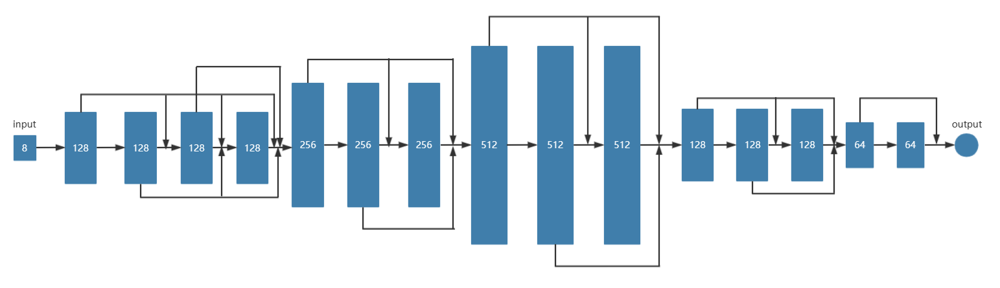
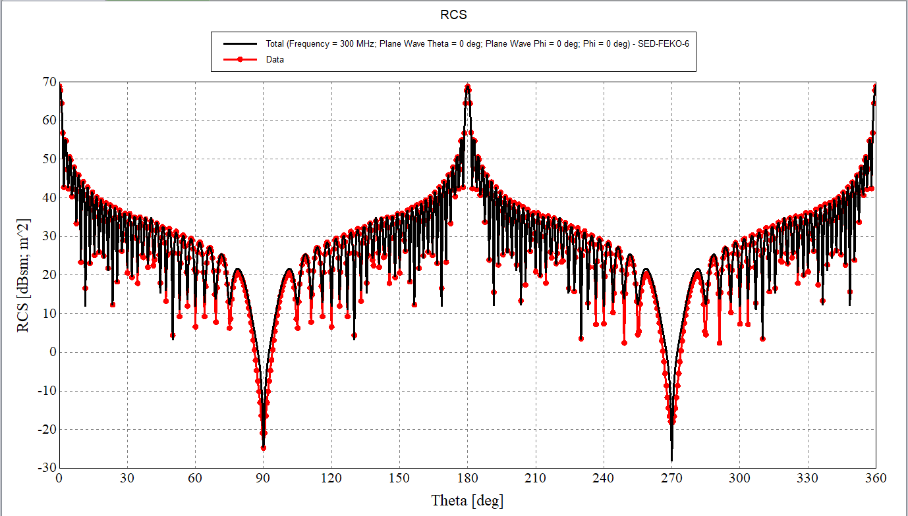

# 目录

- [目录](#目录)
- [SED_ANN](#SED_ANN)
- [数据集](#数据集)
- [环境要求](#环境要求)
- [网络结构](#网络结构)
- [脚本说明](#脚本说明)
    - [脚本及样例代码](#脚本及样例代码)
    - [数据集说明](#数据集说明)
    - [脚本参数](#脚本参数)
    - [模型训练](#模型训练)
    - [模型推理](#模型推理)
    - [结果合并](#结果合并)
    - [获取结果](#获取结果)
- [结果对比示例](#结果对比示例)
- [MindScience主页](#mindscience主页)

# SED_ANN

一种基于神经网络加速的快速子全域基函数方法，通过周期阵列数据集对神经网络进行训练，得到的训练完成的网络模型可以快速预估新阵列的SED基函数拓展系数，进而计算出周期阵列电磁散射感应电流分布。本方法可以大幅度提高子全域基函数方法的计算效率。

# 数据集

- 数据集介绍：首先将有限周期阵列中阵列大小、阵列周期长度、单元所在阵列的位置以及入射角度作为神经网络的输入，使用SED基函数方法计算出阵列中每个单元的SED基函数拓展系数作为神经网络的输出，从而建立数据集。然后根据SED算法的物理特征将数据集划分为中心区域、边缘区域、角块区域（ic、ec、cc），最后按照8:2的比例将数据集随机划分训练集和测试集。

- 数据格式：张量数据

# 环境要求

- 硬件（Ascend/GPU）
- 准备Ascend/GPU处理器搭建硬件环境。
- 框架
    - [MindSpore](https://www.mindspore.cn/install)
    - [MindElec](https://gitee.com/mindspore/mindscience/tree/master/MindElec)
- 如需查看详情，请参见如下资源：
    - [MindSpore教程](https://www.mindspore.cn/tutorials/zh-CN/master/index.html)
    - [MindSpore Python API](https://www.mindspore.cn/docs/zh-CN/master/index.html)
    - [MindElec教程](https://gitee.com/mindspore/mindscience/tree/master/MindElec)
- 安装aicc
    - 运行

        ```bash
        ma.sh
        ```

# 网络结构

神经网络结构如下图：



# 脚本说明

## 脚本及样例代码

```path
└─SED_ANN
  ├─ckpt                              # 训练完的checkpoint
  ├─docs                              # README示意图
  ├─dataset                           # 数据集
  ├─data_merging                      # 推理数据合并
    ├──ReadSEDCoef.m                  # 合并ic、ec、cc结果
  ├─data_generate                     # 数据生成
    ├──ANN_SED_VSIE_DATA.m            # 生成训练数据和测试数据
  ├─RCS_C++                           # RCS_C++
    ├──EMLauncher.exe                 # 生成RCS结果
    ├──CONFIG_OUTPUT.yml              # 配置文件
  ├──loss.py                          # 损失&误差评估函数
  ├──run.sh                           # 推理脚本
  ├──train.py                         # 训练网络
  ├──eval.py                          # 评估网络
  ├──ma.sh
  ├──aicc_tools-0.1.7-py3-none-any.whl
  ├──README.md
```

## 数据集说明

由于整体数据量过大，我们将数据集按照平面波入射角度theta（0-180°）划分为7部分，分别对应dataset中data1-4，data1-4中TrainParas.csv文件的第一到六列分别代表阵列x、y方向周期长度、阵列x、y方向大小和平面波入射角度theta和phi。

```matlab
ANN_SED_VSIE_DATA.m
```

## 脚本参数

在train.py和eval.py中可以配置训练和评估参数。

```python
"epoch": 1500,  # 训练轮数
"print_interval": 100,  # 评估间隔
"batch_size": 8000,  # batch_size
"lr": 0.001,  # 学习率
"device_num": 1,  # 在该设备训练
"device_target": "Ascend",  # 设备名称Ascend
"checkpoint_dir": './ckpt/',  # checkpoint保存路径
"save_graphs_path": './graph_result/',  # 计算图保存路径
```

## 模型训练

网络的训练根据数据集进行划分，分为ic、ec、cc，然后再根据输出分为实部和虚部，一共需要训练六个网络模型。您可以通过train.py脚本训练SED_ANN模型，根据数据集的不同可适当修改网络，训练过程中模型参数会自动保存：

```shell
python train.py
```

## 模型推理

您可以通过run.sh脚本进行模型的推理，创建data文件夹并放入推理数据，创建model文件夹并放入保存的模型，创建output文件夹，在run.sh脚本根据六个推理数据和模型，生成对应的ic_Re、ic_Im、ec_Re、ec_Im、cc_Re、cc_Im六个输出文件：

```shell
bash run.sh
```

## 结果合并

将run.sh生成的六个文件放入output文件夹中，并修改ReadSEDCoef.m中变量path的值为output文件夹的绝对路径，然后通过matlab运行ReadSEDCoef.m文件，得到合并后的csv文件：

```matlab
ReadSEDCoef.m
```

## 获取结果

修改RCS_C++文件夹下的CONFIG_OUTPUT.yml：
1、修改文件中mesh_path的值为RCS_C++中SED-ANN-T.nas文件的绝对路径。
2、修改文件中red_ANN的值为结果合并后得到的csv文件的绝对路径。
3、根据目标有限周期阵列信息，修改对应的平面波入射角theta和phi，阵列的大小Array_x和Array_y，阵列的周期长度Dx和Dy等配置信息。
双击RCS_C++下的EMLauncher.exe可执行文件，并将CONFIG_OUTPUT.yml文件的绝对路径路径复制并粘贴，回车运行，最后在SED-ANN-T_ANN_SED_T文件夹中获取RCS结果：

```C++
EMLauncher.exe --CONFIG_OUTPUT.yml
```

# 结果对比示例

## 根据SED_ANN模型生成的RCS结构可导入到FEKO中显示，再将FEKO自身计算的RCS结构导入可对比显示出网络的推理能力,示例结果如下图所示：



# MindScience主页

请浏览官网[主页](https://gitee.com/mindspore/mindscience)。
