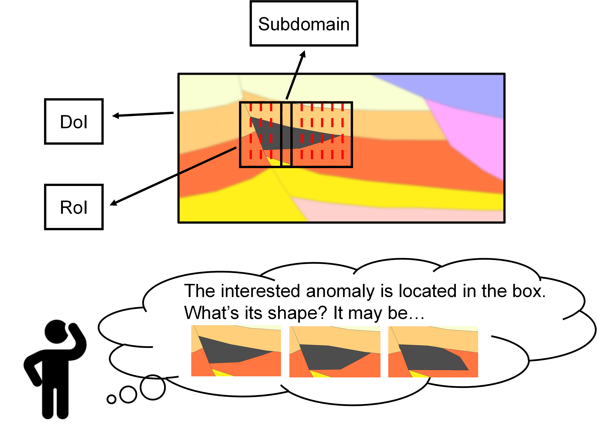
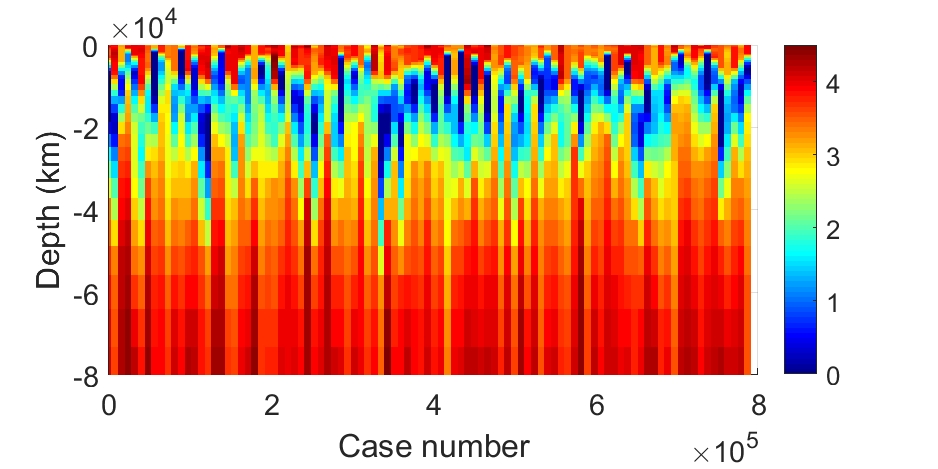
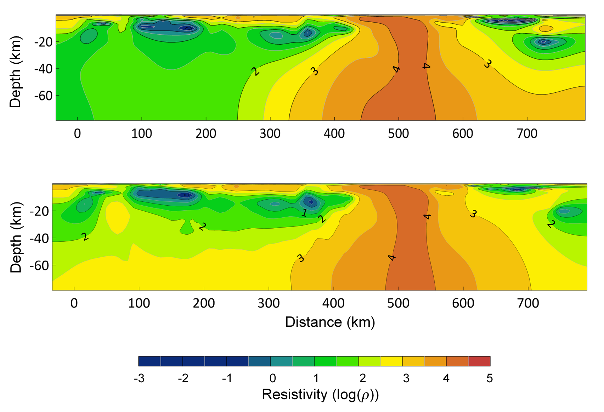

# 目录

- [目录](#目录)
- [项目简介](#项目简介)
- [数据集](#数据集)
- [环境要求](#环境要求)
- [文件说明](#文件说明)
    - [文件列表](#文件列表)
    - [电磁计算库](#电磁计算库)
    - [运行方式](#运行方式)
- [参考文献](#参考文献)
    - [文献引用](#文献引用)
- [MindScience主页](#mindscience主页)
- [mailto](#mailto)

# 项目简介

本项目包括了*Feature-based magnetotelluric inversion by variational autoencoder using a subdomain encoding scheme*一文中实测算例反演的开源代码。  

大地电磁（Magnetotelluric, MT）反演通过地表测量到的电磁场推测地质结构分布，被广泛地应用于油气矿产资源勘探、深部地质调查等领域。MT方法实验设置简便，探测深度大，然而其较低的分辨率限制了其对地下结构的准确刻画。基于昇思MindSpore，我们将变分自编码器 (VAE) 融入反演算法, 通过设计训练集将目标的先验知识融入反演。根据反演区域的几何特征和物理场分布规律，灵活设计了隐变量和像素的双向映射方案, 在训练开销较小的基础上有效提升了反演的精度和准确率。在开源MT实测数据集SAMTEX（Southern Africa MT EXperiment，南部非洲大地电磁实验项目）上验证了本算法融合多物理先验知识的有效性。



# 数据集

- 数据集大小：共60000组一维电阻率向量，按照8:2随机划分训练集和测试集。
- 数据格式：张量数据
- 下图展示了50组训练样例



# 环境要求

- 硬件（Ascend/GPU/CPU）
- 准备Ascend/GPU/CPU处理器搭建硬件环境
- 框架
    - [MindSpore](https://www.mindspore.cn/install)　　
- 如需查看详情，请参见如下资源：
    - [MindSpore教程](https://www.mindspore.cn/tutorials/zh-CN/master/index.html)
    - [MindSpore Python API](https://www.mindspore.cn/docs/zh-CN/master/index.html)

# 文件说明

## 文件列表

```path
└─feature_based_MT_inversion
  ├─README.md
  ├─docs                              # README示意图
  ├─ckpt                              # 训练完的checkpoint
  ├─dataset                           # 数据集
    ├──conventional_inversion_result    # 传统反演成像结果
    ├──measured_data                    # 实测MT数据
    ├──VAE_dataset                      # VAE训练数据集
  ├─results                           # 结果
    ├──test_net                         # VAE测试输出
      ├───test1                           # 测试集测试输出
      ├───test2                           # 传统反演结果测试输出
    ├──inversion                        # 反演结果输出
  ├──library                          # 电磁计算库
  ├──src                              # 网络定义
　├──train.py                         # 数据集生成&网络训练&验证
　├──inversion.py                     # 反演程序
　├──help.py                          # 辅助函数库
```

注：dataset和results文件夹请访问[链接](https://download-mindspore.osinfra.cn/mindscience/mindelec/)中feature_based_MT_inversion_dataset.zip文件

## 电磁计算库

MT2DFWD2.pyd：MT正演建模函数（Windows, python3.9）  
Jacobians.pyd：MT雅克比矩阵计算函数（Windows, python3.9）  
MT2DFWD2.so：MT正演建模函数（Linux, python3.9）  
Jacobians.so：MT雅克比矩阵计算函数（Linux，python3.9）

## 运行方式

train.py：在程序内部设置TRAIN变量，TRAIN=-1为训练集生成，TRAIN=1为网络训练，TRAIN=2为网络测试。超参数包括在代码开头，可修改。  
inversion.py：可直接运行。超参数包括在代码开头，可自适应修改。反演结果如下图所示，上下两幅子图分别为传统反演结果和提出的特征域MT反演结果。



# 参考文献

[1] Habashy T, Abubakar A. A general framework for constraint minimization for the inversion of electromagnetic measurements[J]. Progress in electromagnetics Research, 2004, 46: 265-312.

[2] Khoza T D, Jones A G, Muller M R, et al. Lithospheric structure of an Archean craton and adjacent mobile belt revealed from 2‐D and 3‐D inversion of magnetotelluric data: Example from southern Congo craton in northern Namibia[J]. Journal of Geophysical Research: Solid Earth, 2013, 118(8): 4378-4397.

[3] Zhou H, Guo R, Li M, et al. Feature-based magnetotelluric inversion by variational autoencoder using a subdomain encoding scheme[J]. Geophysics, 2024, 89(1): WA67-WA83.

## 文献引用

如果您在研究中借鉴了本项目的代码，请引用下面的文献  
{  
  @article{zhou2024feature,
  title={Feature-based magnetotelluric inversion by variational autoencoder using a subdomain encoding scheme},
  author={Zhou, Hongyu and Guo, Rui and Li, Maokun and Yang, Fan and Xu, Shenheng and Abubakar, Aria},
  journal={Geophysics},
  volume={89},
  number={1},
  pages={WA67--WA83},
  year={2024},
  publisher={Society of Exploration Geophysicists}
}  
}

# MindScience主页

请浏览官网[主页](https://gitee.com/mindspore/mindscience)。

# mailto  

maokunli@tsinghua.edu.cn  
zhouhy21@mails.tsinghua.edu.cn