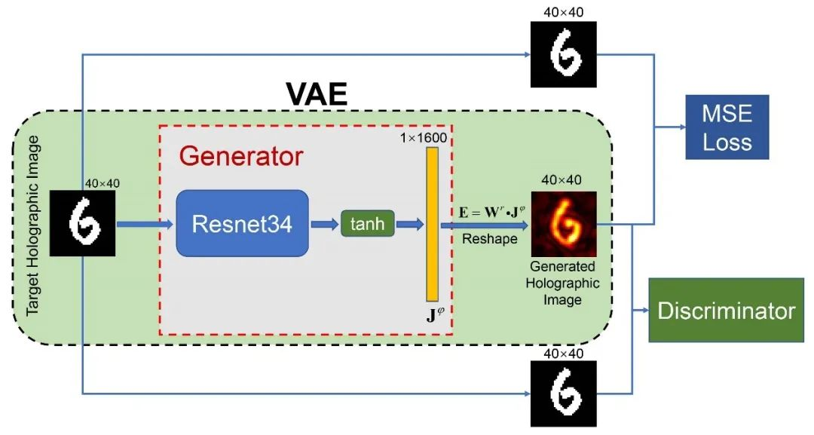

# Contents

<!-- TOC -->

- [Contents](#contents)
- [**Metasurface Holography**](#Metasurface Holography)
- [**Datasets**](#datasets)
- [**Requirements**](#requirements)
- [**Script Description**](#script-description)
    - [**Script and Code Sample**](#script-and-code-sample)
    - [**Parameters**](#parameters)
    - [**Model Training**](#model-training)
- [MindScience Home Page](#mindscience-home-page)

<!-- /TOC -->

# **Metasurface Holography**

"Holographic display" is a 3D imaging technology that uses the interference principle to record and reproduce the real three-dimensional image of the object, but the traditional light field control device has problems such as narrow field of view and small information capacity. As a new type of planar optics, "metasurface" is expected to achieve new breakthroughs in the field of holographic technology by taking advantage of its small pixel size and strong light field control ability. It is found that when the scale of the material structure is smaller than the wavelength of light, there will be a completely different optical modulation effect than under macroscopic conditions, and the sub-wavelength structure can be used to modulate light in multiple dimensions such as phase, amplitude and polarization. This case is based on a study by Southeast University, using the AI method of Physics-assisted Generative Adversarial Network (GAN) to perform unsupervised learning for metasurface holographic imaging design, avoiding the production process of datasets, and has better results in indicators and visual perception than traditional GS algorithms.

It works as follows: first, build a deep neural network, the input of this neural network is the target image, and the output is metamaterial coding; Secondly, the Green's function is used to derive the forward propagation process from metamaterial coding to target image. Finally, the neural network is connected with this forward propagation process to form an autoencoder structure in which both input and output are the target image, and the autoencoder structure is shown in Figure 1. The mean squared error between the input image and the output image is used as the objective function to train the autoencoder so that the objective function is as small as possible, so that after the training is completed, the output of the neural network is the required metamaterial encoding. In actual training, it is found that because the imaging is the target, the mean squared error cannot fully reflect the similarity of the imaging in human visual senses, so the discriminant error of GAN is also introduced into the error function, so that the autoencoder is also a generator of GAN, and the visual semantic characteristics of the hologram are clearer.

<div  align="center">

</div>

references:

Liu, Che, Wen Ming Yu, Qian Ma, Lianlin Li and Tie jun Cui. “Intelligent coding metasurface holograms by physics-assisted unsupervised generative adversarial network.” Photonics Research (2021): n. pag.

# **Datasets**

We use MNIST as our training data for the objective images

# **Requirements**

- Hardware (Ascend)
    - Prepare the Ascend AI Processor to set up the hardware environment.
- Framework
    - [MindSpore](https://www.mindspore.cn/install)
- For more information, see the following resources:
    - [MindSpore Tutorial](https://www.mindspore.cn/tutorials/en/master/index.html)
    - [MindSpore Python API](https://www.mindspore.cn/docs/en/master/index.html)

# **Script Description**

## **Script and Code Sample**

```path
└─metasurface_holograms
  ├──README.md                        # README
  ├──docs
  ├──config.py                        # argparse
  ├──dataset.py                       # dataset processing
  ├──main.py                          # main module
  ├──mse.py                           # Mean Squared Error
  ├──resnet34.py                      # ResNet
  ├──train_test.py
  ├──utils.py                         # utility functions
  ├──wgan_gradient_penalty.py         #
```

## **Parameters**

You can configure training and evaluation parameters with Python command line options (e.g. --epochs=100).

```python
"is_finetune": True,                                                   # whether to fine-tune
"is_evaluate": False,                                                  # whether to test model with images from <test_dataroot>
"is_test_single_image": True,                                          # whether to test model with single image from <single_image_path>
"dataroot": './MNIST/binary_images',                                   # Path to dataroot
"train_dataroot": '../MNIST/binary_images/trainimages',                # Path to train_dataroot
"test_dataroot": '../MNIST/binary_images/testimages',                  # Path to test_dataroot
"valid_dataroot": '../MNIST/binary_images/validimages',                # Path to valid_dataroot
"single_image_path": './MNIST/binary_images/testimages/9/38.png',      # Path to single_image_path
"dataset": 'mnist',                                                    # name of the dataset
"download": False,                                                     # whether to download
"epochs": 200,                                                         # number of epochs
"Gen_learning_rate": 3e-5,                                             # generator learning rate
"Dis_learning_rate": 3e-5,                                             # discriminator learning rate
"save_per_times": 500,                                                 # interval for model saving
"batch_size": 64,                                                      # size of mini-batch
"Dis_per_train": 1,                                                    # interval for training the generator
"Gen_per_train": 3,                                                    # interval for training the discriminator
```

## **Model Training**

You can use "wgan_gradient_penalty.py" script to train the model：

```shell
python wgan_gradient_penalty.py --epochs 1000 --is_evaluate True
```

# MindScience Home Page

Visit the official website [home page](<https://gitee.com/mindspore/mindscience>).
