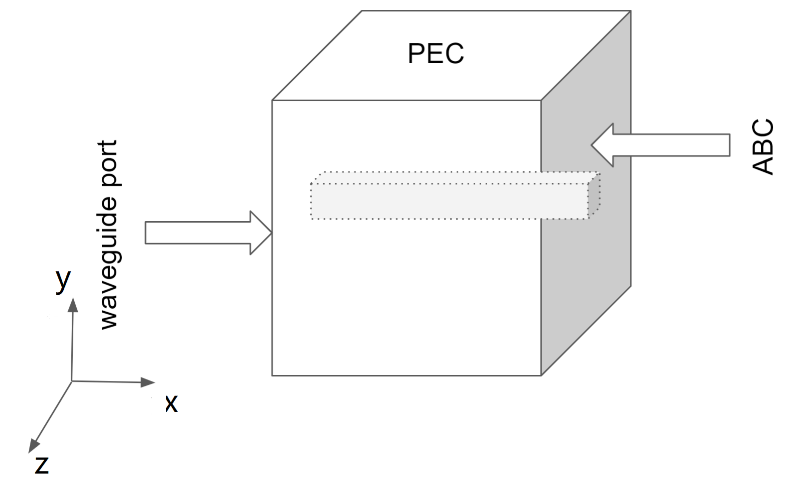
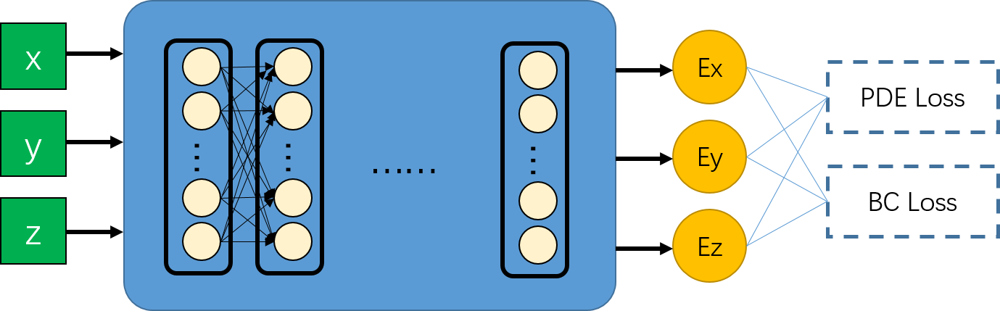
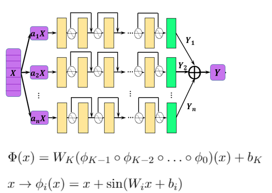
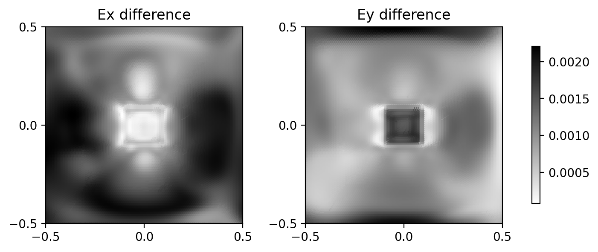
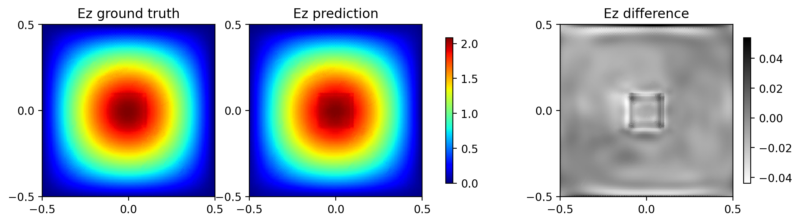
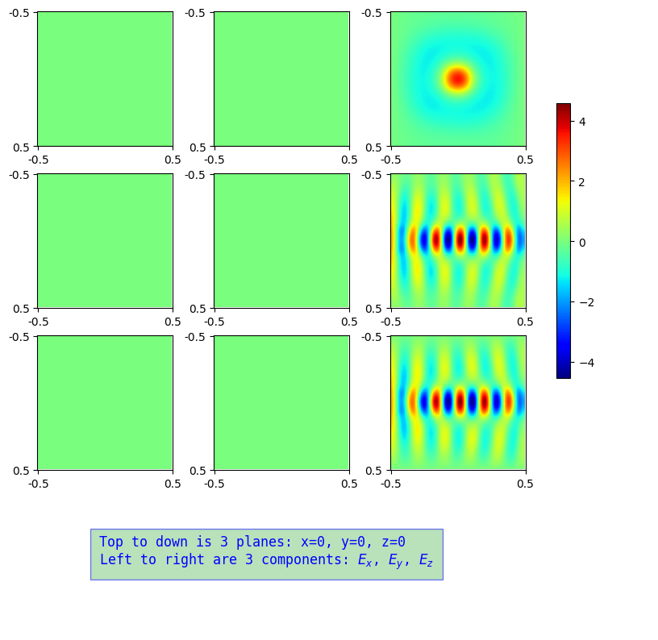

# 目录

## 模型名称

PINNs(Physical Informed Neural Networks) 求解频域 3D Maxwell 方程：
$$
\nabla\times\nabla\times {E} + \epsilon_r k^2 {E} = {0}
$$
在立方体内部无源，因此有
$$
\nabla \cdot {E} = 0
$$
则可以化简得出
$$
\nabla^2 {E} + \epsilon_r k^2 {E} = {0}
$$

仿真环境如图1所示：
<center>


图 仿真环境示意图
</center>

* 仿真的立方体长、宽、高尺寸均为 $1$，取立方体中心为坐标原点，向右、向上、向外分别为 $x, y, z$ 方向。实心导体贯穿立方体且位于立方体中心，其截面尺寸为 $0.2\times 0.2$。
* 四个环面（上、前、下、右）边界为 PEC（理想导体边界条件），右面为 ABC（吸收边界条件）。
* PEC 边界条件方程为：

$$
{n}\times(\nabla\times{E})=0
$$

* ABC(Absorbing boundary condition，吸收边界条件)的边界方程为

$$
{n}\times{E}=0 \\
\frac{\partial E_n}{\partial n} = 0
$$

## 模型架构

PDE方程求解的原理如下图所示：

<center>


图 全连接PINNs神经网络示意图
</center>

采用 `mindelec.architecture` 提供的 `MultiScaleFCCell` 模型。采用多通道残差网络结合Sin激活函数的网络架构，其结构如图所示：

<center>


图 多通道残差网络示意图
</center>

## 数据集

数据集包含3类：

* 对立方体内部，使用 `mindelec` 定义的 `Cuboid` 采样，默认采用均匀网格划分，划分粒度为 $64\times 64 \times 64$ 。
* 对立方体的4个PEC面和ABC面，使用 `mindelec` 定义的随机采样，采样点数默认为 `65536`。
* 对波导管数据，采用外部数据，该数据为[Nvidia Modulus](https://docs.nvidia.com/deeplearning/modulus/modulus-v2209/user_guide/intermediate/em.html#problem-4-3d-dielectric-slab-waveguide) 进行该仿真时采用的数据，详见 `data/sample_points_all.npy` 文件，包含11000多条数据。

## 环境要求

requirements.txt

```text
numpy
matplotlib
pandas
tqdm
easydict
mindspore >= 1.5.0
mindelec==0.1.0
```

## 快速入门

项目仅支持 Ascend平台。

* 训练命令

```bash
python train.py
```

说明：由于默认将日志打印到控制台，如果要保存成文本，可以使用 Linux 的管道及 `tee` 命令同时将输出保存到文件，例如保存到 `log.out` ，则运行

```bash
python train.py | tee log.out
```

* 推理命令

```bash
python eval.py
```

## 脚本说明

### 脚本和样例代码

```python3
   3D_dielectric_slab/
   |   eval.py                    # 评估模型脚本
   |   README.md                  # 项目介绍
   |   requirements.txt           # 所需Python库
   |   train.py                   # 训练脚本
   |
   +---data/
   |       sample_points_all.npy  # 波导管数据
   |
   +---images/                    # README.md 中一些插图
   |
   \---src/
           callback.py            # 回调函数
           config.py              # 模型参数配置
           dataset.py             # 生成数据集
           maxwell.py             # Maxwell方程定义
```

### 脚本参数

```python
# 在立方体中采样配置
cuboid_sampling_config = ed({
    'domain': ed({                   # 区域内采样
        'random_sampling': False,    # 是否随机采样
        'size': [64, 64, 64],        # 采样网格
    }),
    'BC': ed({                       # 边界点采样
        'random_sampling': True,     # 是否随机采样
        'size': 65536,               # 采样点数
        'sampler': 'uniform',        # 均匀分布采样
    })
})

# 模型等config
maxwell_3d_config = ed({
    "name": "Maxwell3D",             # 模型名称
    "geom_name": "cuboid",           # 几何体名称
    "waveguide_name": "waveguide",   # 波导管名称
    "waveguide_points_path": "data/sample_points_all.npy", # 波导管数据

    # 训练参数
    "epochs": 3000,                  # 迭代epoch次数，建议 >=1000
    "batch_size": 256,               # 训练batch_size
    "lr": 0.001,                     # 训练学习率
    "pretrained": False,             # 是否使用预训练模型，模型从 param_path加载。
    "param_path": "checkpoints/model_slab_best.ckpt",  # 训练好的参数路径

    # 仿真环境参数
    "coord_min": [-0.5, -0.5, -0.5], # xyz最小坐标值
    "coord_max": [0.5, 0.5, 0.5],    # xyz最大坐标值
    "slab_len": 0.2,                 # 中间电导体尺寸
    "eps1": 1.5,                     # 电导体电导率
    "eps0": 1.0,                     # 真空电导率
    "wave_number": 32.0,             # 波数

    # 神经网络参数
    "in_channel": 3,                 # 输入通道数
    "out_channel": 3,                # 输出通道数
    "layers": 6,                     # 重复次数
    "neurons": 32,                   # 每层的神经元数量

    # 评估参数，其中训练好权重路径和训练参数param_path共用
    "axis_size": 101,                # 评估时网格划分密度
    "result_save_dir": "result",     # 评估结果保存文件夹
})
```

## 训练过程

### 训练

训练命令

```shell
python train.py | tee log.out
```

训练过程日志

```log
# grep log.out
epoch: 1 step: 1024, loss is 7.13861083984375
epoch time: 368.796 s, per step time: 360.153 ms
Current epoch: 1, loss: 7.13861083984375, saved checkpoint.
...
epoch: 2995 step: 1024, loss is 0.08456216752529144
epoch time: 18.103 s, per step time: 17.679 ms
...
epoch: 2999 step: 1024, loss is 0.2671869993209839
epoch time: 18.077 s, per step time: 17.653 ms
epoch: 3000 step: 1024, loss is 0.18585500121116638
epoch time: 18.102 s, per step time: 17.678 ms
```

## 推理

### 推理过程

推理脚本

```bash
python eval.py
```

### 推理结果

* 因为只有波导面有真实值，因此主要看波导面相对误差。波导管输入面结果（最大差值 $E_z = 0.05378$, 其中波导面 $E_z$ 最大值为 $2.082099191$, 因此相对误差为 `max(diff)/max(ground-truth) = 2.58%`。而在波导面 $E_x, E_y$ 方向，真实值应为0，预测值的最大值很小，分别为 $0.00221, 0.00071$）。

* $E_x, E_y$ 的真实值均为0，因此只给出预测值，预测值也接近0。

<center>


图 电场Ex, Ey在波导面的分布（真实值为0）
</center>

真实值由$(y, z)$ 坐标给出，由于所给数据为采样的离散点，通过cubic插值算法得到网格点，从而获取真实值。使用PINNs网络计算得到预测值。结果如下图：

<center>


图  电场Ez在波导面的分布，从左到右依次为真实值、预测值、差值
</center>

* 波导管在 $x=-0.5$ 截面，该面上只有 $E_z$ 分量的电场，场强由前述训练数据给出。下图绘制出三个中心面，即 $x=0, y=0, z=0$ 三个面上的场强分布。

<center>


图 三个过立方体中心的截面电场值
</center>

* 从图中可以看出，$E_x, E_y$ 几乎为总 $0$。

* 由于中间的介质电导率为 $1.5$，而周围的为 $1.0$，可以看到电磁波主要在中间的电介质中传播。

## 性能

### 训练性能

提供您训练性能的详细描述.

| Parameters          | Ascend 910                                        |
| ------------------- | ------------------------------------------------- |
| Model Version       | PINNs Cavity                                      |
| Resource            | Ascend: 1*Ascend 910, CPU: 24vCPUs 96GB           |
| uploaded Date       | 09/30/2022 (month/day/year)                       |
| MindSpore Version   | 1.15.1                                            |
| Dataset             | 立方体内部、边界采样；外部波导管数据                 |
| Training Parameters | epoch=3000, steps per epoch=1024, batch_size =256 |
| Optimizer           | Adam                                              |
| Loss Function       | L2范数                                            |
| outputs             | 电场分量 $E_x$, $E_y$, $E_z$                       |
| Loss                | 0.0029008                                         |
| Speed               | 16.8 s/epoch（第一个epoch耗时较长，约368秒）        |
| Total time          | 14 hours                                          |
| Parameters (KB)     | 220 KB                                            |

### 推理性能

| Parameters          | Ascend                                  |
| ------------------- | --------------------------------------- |
| Resource            | Ascend: 1*Ascend 910, CPU: 24vCPUs 96GB |
| Uploaded Date       | 9/30/2022 (month/day/year)              |
| MindSpore Version   | 1.15.1                                  |
| Dataset             | 自定义数据集                            |
| outputs             | 电场分量 $E_x$, $E_y$, $E_z$            |
| Model for inference | 220KB (.ckpt)                           |
| Total time          | 1.36 Minutes                            |

## 参考资料

[Nvidia Modulus](https://docs.nvidia.com/deeplearning/modulus/modulus-v2209/user_guide/intermediate/em.html)

## ModelZoo 主页

请浏览官方[主页](https://gitee.com/mindspore/models)。
