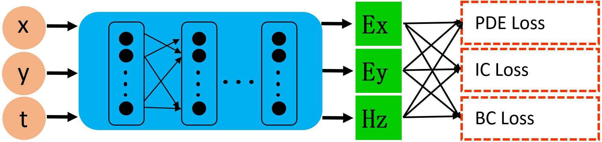

# 目录

- [目录](#目录)
- [麦克斯韦方程组](#麦克斯韦方程组)
- [AI求解点源麦克斯韦方程组](#ai求解点源麦克斯韦方程组)
- [数据集](#数据集)
- [环境要求](#环境要求)
- [脚本说明](#脚本说明)
    - [脚本及样例代码](#脚本及样例代码)
    - [脚本参数](#脚本参数)
- [模型描述](#模型描述)
- [模型训练](#模型训练)
    - [训练性能与精度](#训练性能与精度)
- [模型推理](#模型推理)
    - [推理性能与精度](#推理性能与精度)
- [随机情况说明](#随机情况说明)
- [MindScience主页](#mindscience主页)

# 麦克斯韦方程组

麦克斯韦方程组是一组描述电场、磁场与电荷密度、电流密度之间关系的偏微分方程，有激励源的控制方程具体描述如下：

$$
\nabla\times E=-\mu \dfrac{\partial H}{\partial t} - J(x, t),
$$
$$
\nabla\times H=\epsilon \dfrac{\partial E}{\partial t}
$$

其中$\epsilon,\mu$分别是介质的绝对介电常数、绝对磁导率。$J(x, t)$是电磁仿真过程中的激励源，常用的加源方式包括点源，线源和面源，本案例主要考虑点源的形式，数学上表示为：
$$
J(x, t)=\delta(x - x_0)g(t)
$$

# AI求解点源麦克斯韦方程组

AI求解点源麦克斯韦方程组的整体网络架构如下：



以二维点源麦克斯韦方程组为例，网络输入为$\Omega=(x, y, t)\in [0,1]^3$, 输出为方程的解$u=(E_x, E_y, H_z)$。基于网络的输出和MindSpore框架的自动微分功能，训练损失函数来自于控制方程(PDE loss)，初始条件(IC loss)和边界条件(BC loss)三部分。这里我们采用电磁场为0的初始值，边界采用二阶Mur吸收边界条件。由于激励源的存在，我们将PDE loss的计算分为两部分：激励源附近区域$\Omega_0$与非激励源区域$\Omega_1$。最终我们整体的损失函数可以表示为：
$$L_{total} = \lambda_{src}L_{src} + \lambda_{src_ic}L_{src_ic} + \lambda_{no_src}L_{no_src} + \lambda_{no_src_ic}L_{no_src_ic} +  \lambda_{bc}L_{bc} $$
其中$\lambda$s表示各项损失函数的权重。为了降低权重选择的难度，我们采用了自适应加权的算法，具体参见我们的论文。

# 数据集

- 训练数据：基于五个损失函数，我们分别对有源区域，无源区域，边界，初始时刻进行随机采点，作为网络的输入。
- 评估数据：我们基于传统的时域有限差分算法生成高精度的电磁场。
    - 注：数据在src/dataset.py中处理。

# 环境要求

- 硬件（Ascend）
    - 准备Ascend处理器搭建硬件环境。
- 框架
    - [MindSpore Elec](https://gitee.com/mindspore/mindscience/tree/master/MindElec)
- 如需查看详情，请参见如下资源：
    - [MindSpore Elec教程](https://www.mindspore.cn/mindelec/docs/zh-CN/master/intro_and_install.html)
    - [MindSpore Elec Python API](https://www.mindspore.cn/mindelec/docs/zh-CN/master/mindelec.architecture.html)

# 脚本说明

## 脚本及样例代码

```path
.
└─Maxwell
  ├─README.md
  ├─docs                              # README示意图
  ├─src
    ├──dataset.py                     # 数据集配置
    ├──maxwell.py                     # 点源麦克斯韦方程定义
    ├──lr_scheduler.py                # 学习率下降方式
    ├──callback.py                    # 回调函数
    ├──sampling_config.py             # 随机采样数据集的参数配置文件
    ├──utils.py                       # 功能函数
  ├──train.py                         # 训练脚本
  ├──eval.py                          # 推理和评估脚本
  ├──config.json                      # 训练参数和评估数据参数
```

## 脚本参数

数据集采样控制参数在`src/sampling_config.py`文件中配置如下：

```python
src_sampling_config = edict({         # 有源区域的采样配置
    'domain': edict({                 # 内部点空间采样配置
        'random_sampling': True,      # 是否随机采样
        'size': 65536,                # 采样样本数目
        'sampler': 'uniform'          # 随机采样方式
    }),
    'IC': edict({                     # 初始条件样本采样配置
        'random_sampling': True,      # 是否随机采样
        'size': 65536,                # 采样样本数目
        'sampler': 'uniform',         # 随机采样方式
    }),
    'time': edict({                   # 时间采样配置
        'random_sampling': True,      # 是否随机采样
        'size': 65536,                # 采样样本数目
        'sampler': 'uniform',         # 随机采样方式
    }),
})

no_src_sampling_config = edict({      # 无源区域的采样配置
    'domain': edict({                 # 内部点空间采样配置
        'random_sampling': True,      # 是否随机采样
        'size': 65536,                # 采样样本数目
        'sampler': 'uniform'          # 随机采样方式
    }),
    'IC': edict({                     # 初始条件样本采样配置
        'random_sampling': True,      # 是否随机采样
        'size': 65536,                # 采样样本数目
        'sampler': 'uniform',         # 随机采样方式
    }),
    'time': edict({                   # 时间采样配置
        'random_sampling': True,      # 是否随机采样
        'size': 65536,                # 采样样本数目
        'sampler': 'uniform',         # 随机采样方式
    }),
})

bc_sampling_config = edict({          # 边界区域的采样配置
    'BC': edict({                     # 边界点空间采样配置
        'random_sampling': True,      # 是否随机采样
        'size': 65536,                # 采样样本数目
        'sampler': 'uniform',         # 随机采样方式
        'with_normal': False          # 是否需要边界法向向量
    }),
    'time': edict({                   # 时间采样配置
        'random_sampling': True,      # 是否随机采样
        'size': 65536,                # 采样样本数目
        'sampler': 'uniform',         # 随机采样方式
    }),
})
```

模型训练及控制参数在`config.json`文件中配置如下：

```python
{
    "Description" : [ "PINNs for solve Maxwell's equations" ], # 案例描述
    "Case" : "2D_Mur_Src_Gauss_Mscale_MTL",                    # 案例标记
    "random_sampling" : true,                                  # 样本集是否通过随机采样生成，如果为false则加载离线生成的数据集
    "coord_min" : [0.0, 0.0],                                  # 矩形计算域x和y轴最小坐标
    "coord_max" : [1.0, 1.0],                                  # 矩形计算域x和y轴最大坐标
    "src_pos" : [0.4975, 0.4975],                              # 点源位置坐标
    "src_frq": 1e+9,                                           # 激励源主频率
    "range_t" : 4e-9,                                          # 模拟时长
    "input_scale": [1.0, 1.0, 2.5e+8],                         # 网络输入坐标的缩放系数
    "output_scale": [37.67303, 37.67303, 0.1],                 # 网络输出物理量的缩放系数
    "src_radius": 0.01,                                        # 高斯平滑后的点源范围半径大小
    "input_size" : 3,                                          # 网络输入维度
    "output_size" : 3,                                         # 网络输出维度
    "residual" : true,                                         # 网络结构是否包含残差模块
    "num_scales" : 4,                                          # 多尺度网络的子网数目
    "layers" : 7,                                              # 全连接网络层数(输入、输出加隐藏层)
    "neurons" : 64,                                            # 隐层神经元个数
    "amp_factor" : 10,                                         # 网络输入的放大因子
    "scale_factor" : 2,                                        # 多尺度网络的各子网放大系数
    "save_ckpt" : true,                                        # 训练中是否保存checkpoint信息
    "load_ckpt" : false,                                       # 是否加载权重进行增量训练
    "train_with_eval": false                                   # 是否边训练边推理
    "save_ckpt_path" : "./ckpt",                               # checkpoint保存路径
    "load_ckpt_path" : "",                                     # 加载checkpoint的文件路径
    "train_data_path" : "",                                    # 加载离线训练数据集的路径
    "test_data_path" : "",                                     # 加载离线测试数据集的路径
    "lr" : 0.002,                                              # 初始学习率
    "milestones" : [2000, 4000, 5000],                         # 学习率衰减的里程碑
    "lr_gamma" : 0.1,                                          # 学习率衰减系数
    "train_epoch" : 6000,                                      # 迭代训练数据集的次数
    "train_batch_size" : 8192,                                 # 网络训练的批数据大小
    "test_batch_size" : 32768,                                 # 网络推理的批数据大小
    "predict_interval" : 150,                                  # 边训练边推理的迭代间隔步数
    "vision_path" : "./vision",                                # 可视化结果保存路径
    "summary_path" : "./summary"                               # mindinsight summary结果保存路径
}
```

# 模型描述

本案例采用多通道残差网络结合Sin激活函数的网络架构。


# 模型训练

您可以通过train.py脚本训练参数化电磁仿真模型，训练过程中模型参数会自动保存：

```shell
python train.py
```

## 训练性能与精度

脚本提供了边训练边评估的功能，网络训练的损失函数、性能数据以及精度评估结果如下：

```log
epoch: 1 step: 8, loss is 11.496931
epoch time: 185.432 s, per step time: 23178.955 ms
epoch: 2 step: 8, loss is 9.000967
epoch time: 0.511 s, per step time: 63.926 ms
epoch: 3 step: 8, loss is 8.101629
epoch time: 0.490 s, per step time: 61.248 ms
epoch: 4 step: 8, loss is 7.4107575
epoch time: 0.490 s, per step time: 61.230 ms
epoch: 5 step: 8, loss is 7.0657954
epoch time: 0.484 s, per step time: 60.477 ms
epoch: 6 step: 8, loss is 6.894913
epoch time: 0.482 s, per step time: 60.239 ms
epoch: 7 step: 8, loss is 6.6508193
epoch time: 0.482 s, per step time: 60.297 ms
epoch: 8 step: 8, loss is 6.316092
epoch time: 0.483 s, per step time: 60.343 ms
epoch: 9 step: 8, loss is 6.264338
epoch time: 0.484 s, per step time: 60.463 ms
epoch: 10 step: 8, loss is 6.113656
epoch time: 0.483 s, per step time: 60.392 ms
...
epoch: 5990 step: 8, loss is 0.7306183
epoch time: 0.485 s, per step time: 60.684 ms
epoch: 5991 step: 8, loss is 0.7217314
epoch time: 0.484 s, per step time: 60.559 ms
epoch: 5992 step: 8, loss is 0.7106861
epoch time: 0.483 s, per step time: 60.399 ms
epoch: 5993 step: 8, loss is 0.7238727
epoch time: 0.484 s, per step time: 60.520 ms
epoch: 5994 step: 8, loss is 0.72685266
epoch time: 0.486 s, per step time: 60.735 ms
epoch: 5995 step: 8, loss is 0.7518991
epoch time: 0.485 s, per step time: 60.613 ms
epoch: 5996 step: 8, loss is 0.7451218
epoch time: 0.482 s, per step time: 60.308 ms
epoch: 5997 step: 8, loss is 0.74497545
epoch time: 0.483 s, per step time: 60.313 ms
epoch: 5998 step: 8, loss is 0.72911096
epoch time: 0.483 s, per step time: 60.425 ms
epoch: 5999 step: 8, loss is 0.7317751
epoch time: 0.485 s, per step time: 60.591 ms
epoch: 6000 step: 8, loss is 0.71511096
epoch time: 0.485 s, per step time: 60.580 ms
==========================================================================================
l2_error, Ex:  0.03556711707787814 , Ey:  0.03434167989333677 , Hz:  0.022974221345851673
==========================================================================================
```

Mindinsight同样提供了实时可视化精度曲线的功能。在网页打开收集的summary文件，随着训练的进行，Ex/Ey/Hz的误差曲线如下图所示：


# 模型推理

您可以通过eval.py脚本加载测试数据集进行推理，并获取推理精度：

```shell
python eval.py
```

## 推理性能与精度

```log
predict total time: 40.59165406227112 s
l2_error, Ex:  0.03556711707787814 , Ey:  0.03434167989333677 , Hz:  0.022974221345851673
```

瞬时电磁场的分布与FDTD标签数据的对比云图如下所示：


# 随机情况说明

train.py中设置了随机种子，网络输入通过均匀分布随机采样。

# MindScience主页

请浏览官网[主页](https://gitee.com/mindspore/mindscience)。
