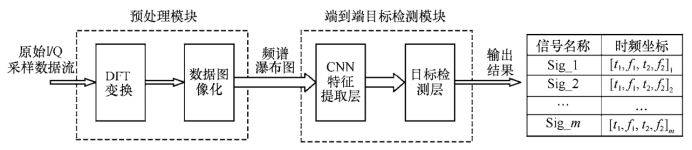
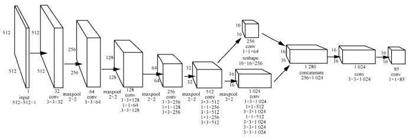
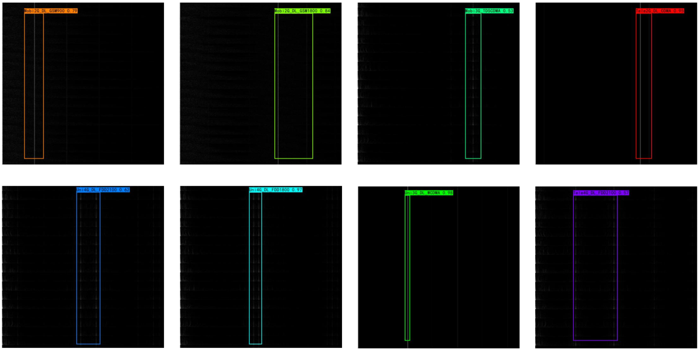
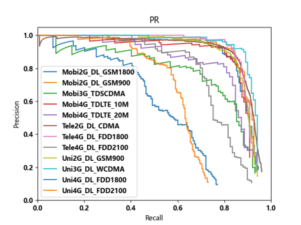
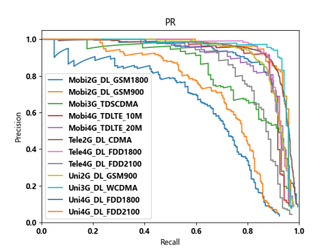

# 基于图像深度学习的无线电信号识别

## 概述

### 背景

随着互联网时代的到来和物联网的兴起，无线电波已成为信息通讯的重要载体，但其开放性也导致其容易收到干扰和非法利用，因此，无线电信号的监测识别在通信安全、无线电频谱管理等方面有着重要的现实意义和需求。因此，借助AI提升无线电监测的性能是十分必要的。

RadioImageDet算法将无线电信号识别问题转为图像识别领域的目标检测问题，从而提升无线电信号识别的智能化水平和复杂电磁环境下的识别能力。更多信息可参考[基于图像深度学习的无线电信号识别](https://xueshu.baidu.com/usercenter/paper/show?paperid=1s6y0xj0922m0mb0r11d0pc0b0712061&site=xueshu_se)

本案例教程介绍RadioImageDet算法的实现。

### 技术路径

该算法的技术思路如下图所示，主要分为两个部分：先在预处理模块将无线电信号具象化为一张二维图片；再利用目标检测算法对具象化二维图像的无线电信号进行识别。该方法避免了基于经验的人工特征提取，对复杂电磁环境下智能化无线电信号识别技术的研究提供了新的思路。



针对原论文中数据集难以获取的情况，本案例提供了一个信号生成代码signal_general.pyimage模拟原始I/Q采样数据流

其中目标检测算法是基于YOLOv2的RadioYOLO，其结构如下图所示



之后基于YOLOv5对RadioYOLO进行改进

## 快速开始

数据集可使用util/image_general.py脚本生成各类型信号的图像数据，存入Vocdevkit/VOC2007/JPEGImages文件夹下，
再自行使用image_img标注工具进行标注，将标注的xml文件存入Vocdevkit/VOC2007/Annotations文件夹下，
最后使用util/voc_annotation.py脚本分割数据集

### 基于YOLOv2的算法

请先在train_v2.py中按照注释要求配置参数

|       参数        |                                 参数设置                                 |
|:---------------:|:--------------------------------------------------------------------:|
|   model_path    |                        模型文件路径，若为空则自动初始化参数进行训练                        |
| label_smoothing |                           标签平滑，一般设为0.01以下                            |
|  freeze_train   | 设为True时使用冻结主干网络的训练，需要在有预训练模型时使用。在此情况下先冻结训练freeze_epoch次epoch，之后再整体训练 |
|   save_period   |                            多少个epoch保存一次权值                            |
|    save_dir     |                            权值与日志文件保存的文件夹                             |
|    eval_flag    |            在训练时进行评估的选项，评估对象为验证集。每eval_period次epoch进行一次评估             |
|   num_workers   |                              读取数据占用的线程数                              |

之后在命令行中调用脚本进行训练

```text
python train_v2.py
```

预测前请先再nets/yolo_predicting_v2.py修改参数model_path，将其改为你的模型路径

使用predict_v2.py脚本进行预测

```text
python predict_v2.py
```

### 基于YOLOv5的算法

请先在train_v5.py中按照注释要求配置参数

|       参数        |                                 参数设置                                 |
|:---------------:|:--------------------------------------------------------------------:|
|   model_path    |                        模型文件路径，若为空则自动初始化参数进行训练                        |
| label_smoothing |                           标签平滑，一般设为0.01以下                            |
|  freeze_train   | 设为True时使用冻结主干网络的训练，需要在有预训练模型时使用。在此情况下先冻结训练freeze_epoch次epoch，之后再整体训练 |
|   save_period   |                            多少个epoch保存一次权值                            |
|    save_dir     |                            权值与日志文件保存的文件夹                             |
|    eval_flag    |            在训练时进行评估的选项，评估对象为验证集。每eval_period次epoch进行一次评估             |
|   num_workers   |                              读取数据占用的线程数                              |

之后在命令行中调用脚本进行训练

```text
python train_v5.py
```

预测前请先再nets/yolo_predicting_v5.py修改参数model_path，将其改为你的模型路径

使用predict_v5.py脚本进行预测

```text
python predict_v5.py
```

## 结果展示



## 性能

|     参数      |     YOLOv2_based     |     YOLOv5_based     |
|:-----------:|:--------------------:|:--------------------:|
|    硬件资源     |    Ascend, 显存32G     |    Ascend, 显存32G     |
| MindSpore版本 |        2.2.14        |        2.2.14        |
|     数据集     | image_general生成仿真数据集 | image_general生成仿真数据集 |
|     优化器     |         SGD          |         SGD          |
|  训练损失(MSE)  |        0.124         |        0.096         |
| 验证损失(RMSE)  |        0.119         |        0.103         |

### YOLOv2_Based



### YOLOv5_Based



## Contributor

gitee id：[xiaofang666666](https://gitee.com/xiaofang666666)

email: 3290352431@qq.com