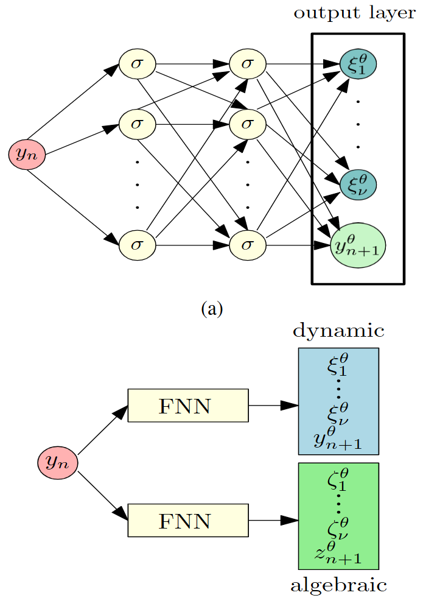
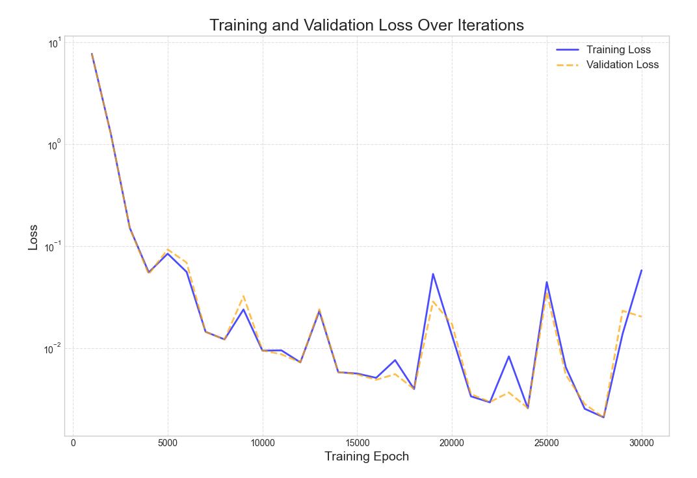
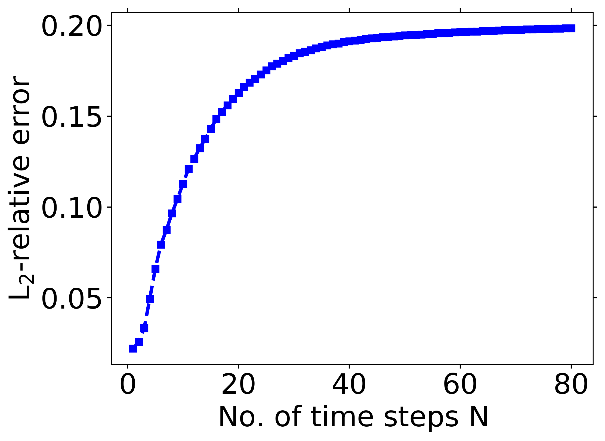
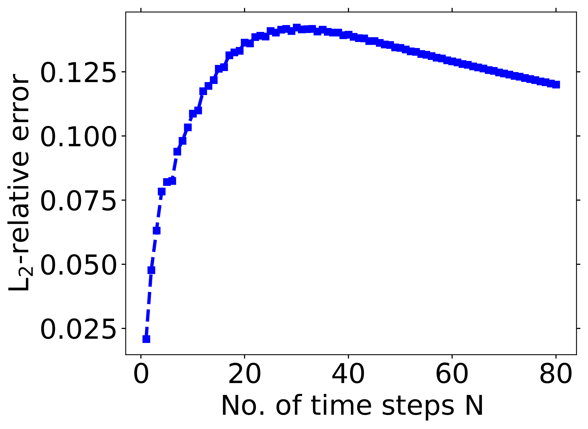
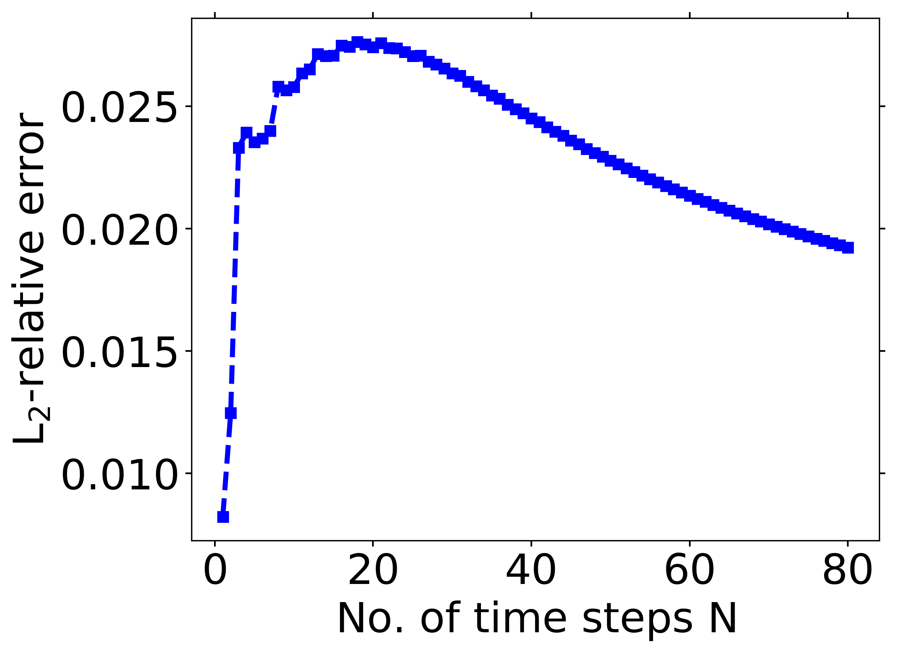
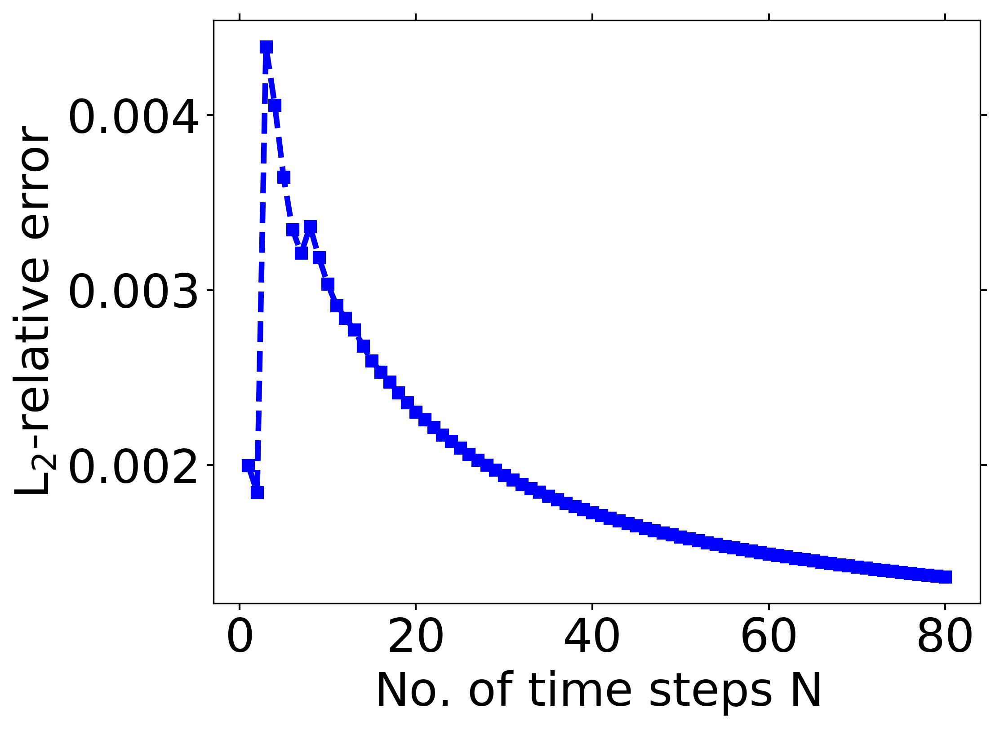

# DAE-PINN

## Overview

* **Dynamic Security Assessment Needs of Power Networks**: With the integration of distributed energy resources into power networks, market liberalization, and the adoption of complex communication and control algorithms, the operating conditions and potential fault scenarios of power networks are becoming more diverse, affecting their security. To evaluate the dynamic security of power networks, it is necessary to simulate their dynamic response when facing a single fault. This requires solving a set of nonlinear differential-algebraic equations (DAEs). Traditional explicit integration schemes fail to solve DAEs, and commercial solvers are computationally expensive and memory-intensive, limiting the online deployment of dynamic security assessment.
* **The Potential and Challenges of Deep Learning in Scientific and Engineering Fields**: Despite the significant success of deep learning in computer vision and natural language processing, its application in learning scientific and engineering dynamic systems is limited. This is due to the high cost of data collection and the lack of robustness and generalization ability of most traditional deep learning methods when data is limited.

## How It Works

* The DAE-PINNs framework combines an implicit Runge-Kutta time-stepping scheme (designed specifically for solving DAEs) with physics-informed neural networks (PINNs). During the time-stepping process, assuming integration has reached $(t_n, y_n, z_n)$, the goal is to advance to $(t_{n+1}, y_{n+1}, z_{n+1})$. After applying the implicit Runge-Kutta scheme, a series of equations are obtained, including update formulas for internal stages and final states.
* The neural network is constrained to satisfy the DAE through a penalty method. During training, the residual of the DAE is used as part of the loss function. This enables the network to not only fit the data but also satisfy the DAE equations described by physical laws during the learning process, thereby incorporating physical information into the learning process of the neural network.

## Method Details

* **Problem Setup**: The DAE is given in semi-explicit form, including dynamic states y and algebraic variables z, as well as f describing the differential equations and g describing the algebraic equations. It is assumed that f and g are sufficiently differentiable and that the DAE has an index of 1, i.e., the Jacobian matrix g_z is invertible and bounded near the exact solution. This ensures that the algebraic equations have a unique local solution $z = G(y)$, allowing the DAE to be transformed into a system of ordinary differential equations.
* **Network Structure**: Similar to standard PINNs, DAE-PINNs typically consist of an input layer, multiple hidden layers, and an output layer. The input layer receives information such as time and dynamic states, the hidden layers extract and transform features through nonlinear activation functions, and the output layer predicts the values of algebraic variables.
* **Loss Function**: The loss function consists of two parts. One part is the data loss, used to fit data from known points such as initial and boundary conditions. The other part is the physics loss, which is the residual loss of the DAE. By automatically differentiating the network's outputs with respect to time and state variables, the residual of the DAE equation is obtained and used as part of the physics loss. Optimizing these two parts of the loss function enables the network to both fit the data and satisfy the physical equations.



As shown in the figure above, the network structure of DAE-PINN differs from traditional neural networks in that it incorporates physical information. By constructing a specific loss function, the network not only fits the data during the learning process but also satisfies the DAE equations described by physical laws. This enhances the accuracy and generalization ability of the model. The overall network architecture includes two networks that separately process dynamic states and algebraic states. The network inputs include time information and dynamic state information, and the outputs are predictions of dynamic states and algebraic variables. For example, in the case of a power network, the network outputs predictions of dynamic states and algebraic variables to simulate the dynamic behavior of the power network. The network supports three types of backbones: `fnn`, `attention`, and `conv1d`. `fnn` is a multi-layer perceptron network, `attention` is a FFN network adopting a transformer-like attention mechanism, and `conv1d` is a FFN network utilizing `Conv1D`.

## Advantages and Contributions

* **Advantages**: DAE-PINNs can effectively learn and simulate the solution trajectories of general power systems with a certain degree of stiffness. The generated simulations are suitable for long-time DAE simulations, filling the gap in deep learning methods for handling stiff dynamics. This provides a new efficient method for solving DAE problems in complex engineering systems.
* **Contributions**: Through a three-node power network case, the authors have verified the ability of DAE-PINN to quickly learn the mapping from initial condition distributions to solution trajectories and to simulate DAEs over long periods. This demonstrates its effectiveness and accuracy, offering a potential online tool for power system dynamic security assessment.

## Getting Started

### Training Method One: Calling the `train.py` Script in the Command Line

```shell
python -u train.py --config_file ./configs/config.yaml --device_target Ascend --device_id 1 --mode PYNATIVE
```

Here,

`--config_file` indicates the path to the configuration file, with a default value of './configs/vit.yaml';

`--device_target` indicates the type of computing platform, which can be 'Ascend' or 'CPU', with a default value of 'Ascend';

`--device_id` indicates the number of the computing card to be used, which can be filled in according to actual conditions, with a default value of 1;

`--mode` indicates the running mode, 'GRAPH' for static graph mode and 'PYNATIVE' for dynamic graph mode, with a default value of 'PYNATIVE'.

### Training Method Two: Running Jupyter Notebook

You can use the [Jupyter Notebook](./DAE-PINN.ipynb) to run the training and validation code line by line.

## Result Presentation

The loss curve during training is shown in the figure below:



The L2 relative loss predicted by the network for 4 dynamic and 1 algebraic variable is shown in the following figure:






## Performance

| Parameter | Metric |
| :--------: | :-----------------------------------------------: |
| Hardware Resources | Atlas 800T A2 |
| MindSpore Version | >=2.5.0 |
| Dataset | HyperCube |
| Number of Parameters | 6e4 |
| Training Parameters | batch_size=1048, steps_per_epoch=6, epochs=30000 |
| Optimizer | Adam |
|Config   |  [config.yaml](./configs/config.yaml) |
| Training Loss (MSE) | 5e-3 |
| Validation Loss (MSE) | 5e-3 |
| Speed (ms/step) | 140 |

## Contributors

gitee id: [Brian-K](https://gitee.com/b_rookie)

email: brian_k2023@163.com