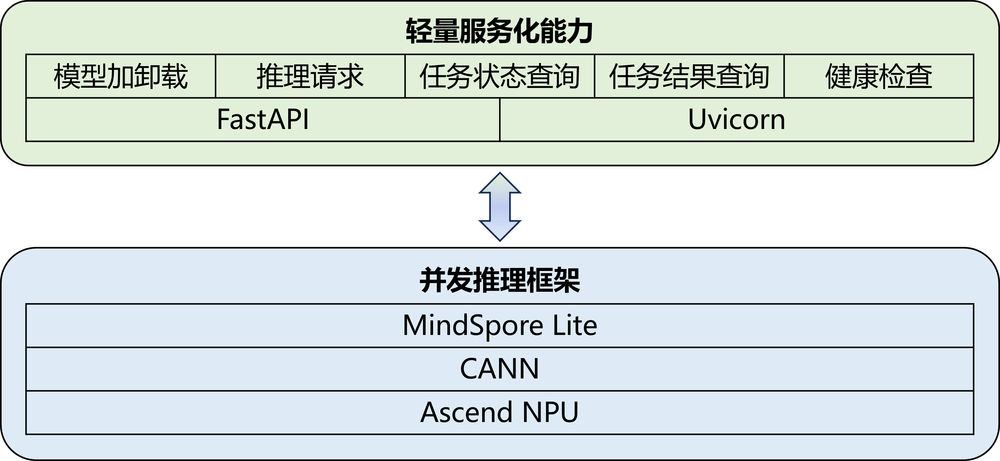

# MindScience 部署服务

MindScience 部署服务是一个基于 FastAPI 的模型部署和监控系统，支持多设备并行推理和资源监控功能。

## 架构图

<p align = "left">

</p>

## 目录结构

```shell
deploy/
├── deploy.py          # 模型部署服务主文件
├── monitor.py         # 服务器监控服务主文件
├── requirements.txt   # 项目依赖
└── src/               # 源代码目录
    ├── config.py      # 配置文件
    ├── enums.py       # 枚举定义
    ├── inference.py   # 推理实现
    ├── schemas.py     # 数据模型定义
    ├── session.py     # 会话管理
    └── utils.py       # 工具函数
```

## 功能特性

### 部署服务 (deploy.py)

- **模型加载/卸载**：支持通过 HTTP 接口上传 MindIR 模型文件并加载到设备上
- **异步推理**：支持后台异步执行推理任务
- **任务状态管理**：支持任务状态查询（待处理、处理中、已完成、错误）
- **健康检查**：提供模型状态检查接口
- **结果下载**：推理完成后可下载结果文件
- **多设备支持**：支持最多 8 个 NPU 设备并行推理

### 监控服务 (monitor.py)

- **资源监控**：实时监控 CPU、内存和 NPU 使用率
- **健康检查**：提供服务器资源使用情况查询接口

## 配置参数

### 部署配置 (DeployConfig)

- `max_device_num`: 最大设备数量（默认 8）
- `deploy_device_num`: 部署使用的设备数量（默认 8）
- `max_request_num`: 最大并发请求数（默认 100）
- `models_dir`: 模型文件存储目录（默认 "models"）
- `datasets_dir`: 数据集文件存储目录（默认 "datasets"）
- `results_dir`: 结果文件存储目录（默认 "results"）
- `dummy_model_path`: 用于测试的虚拟模型路径（默认 "dummy_model.mindir"）
- `chunk_size`: 数据块大小（默认 8MB）

### 服务器配置 (ServerConfig)

- `host`: 服务器主机地址（默认 "127.0.0.1"）
- `deploy_port`: 部署服务端口（默认 8001）
- `monitor_port`: 监控服务端口（默认 8002）
- `limit_concurrency`: 最大并发连接数（默认 1000）
- `timeout_keep_alive`: Keep-alive 连接超时时间（默认 30 秒）
- `backlog`: 待处理连接队列大小（默认 2048）

## API 接口

### 部署服务接口

- `POST /mindscience/deploy/load_model` - 加载模型
    - 参数：model_name (表单), model_file (可选文件)

- `POST /mindscience/deploy/unload_model` - 卸载模型

- `POST /mindscience/deploy/infer` - 执行推理
    - 参数：dataset (文件), task_type (表单)

- `GET /mindscience/deploy/query_status/{task_id}` - 查询任务状态

- `GET /mindscience/deploy/query_results/{task_id}` - 获取推理结果

- `GET /mindscience/deploy/health_check` - 健康检查

### 监控服务接口

- `GET /mindscience/monitor/resource_usage` - 获取资源使用情况
    - 返回：CPU使用率、内存使用率、NPU使用率、NPU内存使用率

## 依赖项

- `fastapi == 0.121.2`: Web 框架
- `uvicorn == 0.38.0`: ASGI 服务器
- `python-multipart == 0.0.20`: 多部分表单数据处理
- `h5py == 3.14.0`: HDF5 文件处理
- `loguru == 0.7.3`: 日志处理
- `aiofiles == 25.1.0`: 异步文件操作
- `psutil == 7.0.0`: 系统和进程监控
- `numpy == 1.26.4`: 科学计算库
- `mindspore_lite == 2.7.1`: MindSpore Lite 推理引擎
- `CANN == 8.2.RC1`: 神经网络异构计算架构

## 安装和使用

1. 参考[CANN官网](https://www.hiascend.com/document/detail/zh/CANNCommunityEdition/83RC1/softwareinst/instg/instg_quick.html?Mode=PmIns&InstallType=local&OS=openEuler&Software=cannToolKit)文档安装CANN社区版软件包。

2. 从[MindSpore官网](https://www.mindspore.cn/lite/docs/zh-CN/r2.7.1/use/downloads.html#mindspore-lite-python%E6%8E%A5%E5%8F%A3%E5%BC%80%E5%8F%91%E5%BA%93)下载MindSpore Lite Python接口开发库：

   ```bash
   wget https://ms-release.obs.cn-north-4.myhuaweicloud.com/2.7.1/MindSporeLite/lite/release/linux/aarch64/cloud_fusion/python310/mindspore_lite-2.7.1-cp310-cp310-linux_aarch64.whl

   pip install mindspore_lite-2.7.1-cp310-cp310-linux_aarch64.whl
   ```

3. 安装 Python 依赖：

   ```bash
   pip install -r requirements.txt
   ```

4. 根据实际业务修改src/config.py配置文件中的配置项。

5. 启动部署服务：

   ```bash
   python deploy.py
   ```

6. 启动监控服务：

   ```bash
   python monitor.py
   ```

## 技术架构

- **框架**：FastAPI + Uvicorn
- **推理引擎**：MindSpore Lite
- **设备支持**：华为昇腾 NPU
- **并行处理**：多进程并行推理
- **数据格式**：HDF5 数据存储

系统采用异步处理方式，支持高并发推理请求，并提供完整的任务生命周期管理。
