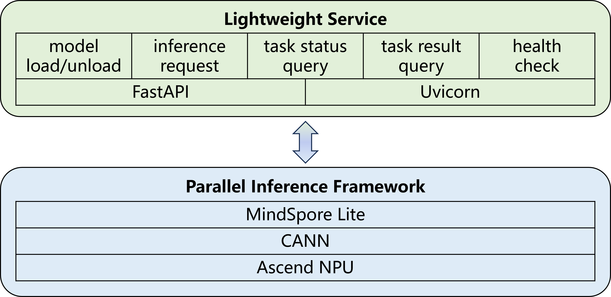

# MindScience Deployment Service

MindScience Deployment Service is a model deployment and monitoring system based on FastAPI, supporting multi-device parallel inference and resource monitoring capabilities.

## Architecture

<p align = "left">

</p>

## Directory Structure

```shell
deploy/
├── deploy.py          # Model deployment service main file
├── monitor.py         # Server monitoring service main file
├── requirements.txt   # Project dependencies
└── src/               # Source code directory
    ├── config.py      # Configuration file
    ├── enums.py       # Enum definitions
    ├── inference.py   # Inference implementation
    ├── schemas.py     # Data model definitions
    ├── session.py     # Session management
    └── utils.py       # Utility functions
```

## Features

### Deployment Service (deploy.py)

- **Model load/unload**: Supports uploading MindIR model files via HTTP interface and loading them to devices
- **Asynchronous inference**: Supports background asynchronous execution of inference tasks
- **Task status management**: Supports task status queries (pending, processing, completed, error)
- **Health check**: Provides model status checking interface
- **Result download**: Results file can be downloaded after inference completion
- **Multi-device support**: Supports up to 8 NPU devices for parallel inference

### Monitoring Service (monitor.py)

- **Resource monitoring**: Real-time monitoring of CPU, memory and NPU usage
- **Health check**: Provides server resource usage query interface

## Configuration Parameters

### Deployment Configuration (DeployConfig)

- `max_device_num`: Maximum number of devices (default 8)
- `deploy_device_num`: Number of devices used for deployment (default 8)
- `max_request_num`: Maximum concurrent request number (default 100)
- `models_dir`: Model file storage directory (default "models")
- `datasets_dir`: Dataset file storage directory (default "datasets")
- `results_dir`: Result file storage directory (default "results")
- `dummy_model_path`: Path for dummy model used in testing (default "dummy_model.mindir")
- `chunk_size`: Chunk size (default 8MB)

### Server Configuration (ServerConfig)

- `host`: Server host address (default "127.0.0.1")
- `deploy_port`: Deployment service port (default 8001)
- `monitor_port`: Monitoring service port (default 8002)
- `limit_concurrency`: Maximum concurrent connection number (default 1000)
- `timeout_keep_alive`: Keep-alive connection timeout (default 30 seconds)
- `backlog`: Pending connection queue size (default 2048)

## API Interfaces

### Deployment Service Interfaces

- `POST /mindscience/deploy/load_model` - Load model
    - Parameters: model_name (form), model_file (optional file)

- `POST /mindscience/deploy/unload_model` - Unload model

- `POST /mindscience/deploy/infer` - Execute inference
    - Parameters: dataset (file), task_type (form)

- `GET /mindscience/deploy/query_status/{task_id}` - Query task status

- `GET /mindscience/deploy/query_results/{task_id}` - Get inference results

- `GET /mindscience/deploy/health_check` - Health check

### Monitoring Service Interface

- `GET /mindscience/monitor/resource_usage` - Get resource usage
    - Returns: CPU usage rate, memory usage rate, NPU usage rate, NPU memory usage rate

## Dependencies

- `fastapi == 0.121.2`: Web framework
- `uvicorn == 0.38.0`: ASGI server
- `python-multipart == 0.0.20`: Multipart form data processing
- `h5py == 3.14.0`: HDF5 file processing
- `loguru == 0.7.3`: Logging
- `aiofiles == 25.1.0`: Asynchronous file operations
- `psutil == 7.0.0`: System and process monitoring
- `numpy == 1.26.4`: Scientific computing library
- `mindspore_lite == 2.7.1`: MindSpore Lite inference engine
- `CANN == 8.2.RC1`: Compute Architecture for Neural Networks

## Installation and Usage

1. Refer to the [CANN official website](https://www.hiascend.com/document/detail/zh/CANNCommunityEdition/83RC1/softwareinst/instg/instg_quick.html?Mode=PmIns&InstallType=local&OS=openEuler&Software=cannToolKit) documentation to install the CANN community edition software package.

2. Download MindSpore Lite Python API development library from the [MindSpore official website](https://www.mindspore.cn/lite/docs/zh-CN/r2.7.1/use/downloads.html#mindspore-lite-python%E6%8E%A5%E5%8F%A3%E5%BC%80%E5%8F%91%E5%BA%93)

   ```bash
   wget https://ms-release.obs.cn-north-4.myhuaweicloud.com/2.7.1/MindSporeLite/lite/release/linux/aarch64/cloud_fusion/python310/mindspore_lite-2.7.1-cp310-cp310-linux_aarch64.whl

   pip install mindspore_lite-2.7.1-cp310-cp310-linux_aarch64.whl
   ```

3. Install Python dependencies:

   ```bash
   pip install -r requirements.txt
   ```

4. Modify the configuration items in the src/config.py file based on actual business needs.

5. Start deployment service:

   ```bash
   python deploy.py
   ```

6. Start monitoring service:

   ```bash
   python monitor.py
   ```

## Technical Architecture

- **Framework**: FastAPI + Uvicorn
- **Inference engine**: MindSpore Lite
- **Device support**: Huawei Ascend NPU
- **Parallel processing**: Multi-process parallel inference
- **Data format**: HDF5 data storage

The system adopts an asynchronous processing approach, supports high-concurrency inference requests, and provides complete task lifecycle management.
