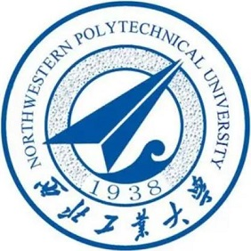

[ENGLISH](README_EN.md) | 简体中文

# MindFlow

## MindFlow介绍

流体仿真是指通过数值计算对给定边界条件下的流体控制方程进行求解，从而实现流动的分析、预测和控制，其在航空航天、船舶制造以及能源电力等行业领域的工程设计中应用广泛。传统流体仿真的数值方法如有限体积、有限差分等，主要依赖商业软件实现，需要进行物理建模、网格划分、数值离散、迭代求解等步骤，仿真过程较为复杂，计算周期长。AI具备强大的学习拟合和天然的并行推理能力，可以有效地提升流体仿真效率。

MindFlow是基于[昇思MindSpore](https://www.mindspore.cn/)开发的流体仿真领域套件，支持航空航天、船舶制造以及能源电力等行业领域的AI流场仿真、AI气动外形设计、AI流动控制，旨在于为广大的工业界科研工程人员、高校老师及学生提供高效易用的AI计算流体仿真软件。

## 最新消息

- 🔥`2025.12.30` MindScience 1.0.0版本发布，MindFlow相关案例详见[MindFlow 0.4.0](RELEASE_CN.md)，旧框架下案例会逐步迁移到新框架下。
- 🔥`2025.03.30` MindFlow 0.3.0版本发布，详见[MindFlow 0.3.0](RELEASE_CN.md)。
- 🔥`2024.11.04` 2024科学智能峰会由北京大学计算机学院、北京科学智能研究院主办。会上，北京大学博雅特聘教授、北京国际数学研究中心教授、国际机器学习研究中心副主任董彬介绍，基于MindSpore和MindFlow套件，发布可以直接处理任意 PDE 形式的端到端解预测模型PDEformer-2，同时适用于含时与不含时的方程。模型使用约 40TB 的数据集进行预训练，能够对具有不同边界条件、求解区域、变量个数的二维方程直接推理，快速获得任意时空位置的预测解。此外，PDEformer-2 作为正问题解算子的可微分代理模型，也可以用于求解各类反问题，包括基于有噪声的时空散点观测进行全波反演以恢复方程中的波速场等。这为模型支持包括流体、电磁等领域的众多物理现象及工程应用的研究打下良好基础。[相关新闻](https://www.mindspore.cn/news/newschildren?id=3481&type=news)
- 🔥`2024.10.13` 智能流体力学产业联合体第三次全体会议在陕西西安索菲特人民大厦成功举办，产业联合体代表及关心联合体的学术界、产业界专家共计超过两百位嘉宾现场参会。会上专家分享了《AI流体仿真及MindSpore实践》报告，介绍了昇思MindSpore AI框架使能大模型全流程开发的能力及MindSpore Flow流体仿真套件相关进展，同时，也介绍了与产业联合体的主要伙伴们的联合创新成果，展示了AI+流体力学在大飞机、气动外形设计等国计民生场景的应用实践。[相关新闻](https://www.mindspore.cn/news/newschildren?id=3424&type=news)
- 🔥`2024.09.23` “风雷”气动外形设计大模型平台在四川绵阳举办的“智能赋能空天科技创新”博士后学术交流活动上发布。“风雷”大模型平台由中国空气动力研究与发展中心基于昇思MindSpore AI框架及MindSpore Flow流体力学套件研制，用于辅助设计人员在飞行器概念设计阶段开展气动外形生成。“风雷”可实现满足性能指标的气动外形端到端生成，适配多场景、多类型气动外形设计，且设计方案覆盖多样性需求。学术交流活动上，中国科学院院士唐志共向全体参会专家介绍了风雷大模型的技术框架和应用案例，他表示：“AI给空气动力学提供了新的研究范式，为学科发展和空天科技创新发展注入了新的活力，生成式气动外形设计平台加速了气动外形概念设计，可助力设计范式智能化转型”。[相关新闻](https://www.mindspore.cn/news/newschildren?id=3405&type=news)
- 🔥`2024.07.04` 以“以共商促共享 以善治促善智”为主题的2024世界人工智能大会在上海召开。会上，基于昇思MindSpore框架打造的南方电网公司研发成果“驭电”智能仿真大模型获得最高奖SAIL大奖。“驭电大模型既能精准刻画新型电力系统的安全边界，又能精细安排各类电源的发电计划，确保大电网安全的前提下，动态优化电网运行方式，解决新能源变化无常、难以计划带来的难题，最大限度提高新能源的利用率。”南方电网公司战略规划部总经理郑外生介绍。[相关新闻](https://business.cctv.com/2024/07/04/ARTICo0MOGKfEyWdRf3QTyGo240704.shtml)
- 🔥`2024.03.22` 以“为智而昇，思创之源”为主题的昇思人工智能框架峰会2024在北京国家会议中心召开，北京国际数学研究中心教授、国际机器学习研究中心副主任董彬介绍，基于MindSpore和MindFlow套件，团队打造了AI解偏微分方程领域的基础模型PDEformer-1，能够直接接受任意形式PDE作为输入，通过在包含300万条一维PDE样本的庞大数据集上进行训练，PDEformer-1展现出了对广泛类型的一维PDE正问题的迅速且精准求解能力。
- 🔥`2024.03.22` 以“为智而昇，思创之源”为主题的昇思人工智能框架峰会2024在北京国家会议中心召开，中国科学院院士、中国空气动力学会理事长唐志共介绍，基于昇思MindSpore和MindFlow套件，团队首创了生成式气动设计大模型平台，面向多种应用场景，打破传统设计范式，将设计时长由月级缩短到分钟级，满足概念设计要求[相关新闻](https://tech.cnr.cn/techph/20240323/t20240323_526636454.shtml)。
- 🔥`2024.03.20` MindFlow 0.2.0版本发布，详见[MindFlow 0.2.0](RELEASE_CN.md)。
- 🔥`2023.11.04` 中国(西安)人工智能高峰论坛在西安市雁塔区高新国际会议中心召开，由西北工业大学与华为联合研发的首个面向飞行器的流体力学大模型“秦岭·翱翔”正式发布。该模型是西工大流体力学智能化国际联合研究所携手华为AI4Sci Lab在国产开源流体计算软件风雷的基础上，依托昇腾AI澎湃算力及昇思MindSpore AI框架共同研发的面向飞行器流体仿真的智能化模型，[相关新闻](https://mp.weixin.qq.com/s/Rhpiyf3VJYm_lMBWTRDtGA)。
- 🔥`2023.08.02` MindFlow 0.1.0版本发布，详见[MindFlow 0.1.0](https://mindspore.cn/mindflow/docs/zh-CN/r0.1/index.html)。
- 🔥`2023.07.06` 以“智联世界 生成未来”为主题的2023世界人工智能大会在上海世博中心开幕，来自中国商用飞机有限责任公司上海飞机设计研究院的三维超临界机翼流体仿真重器“东方.翼风”获得世界人工智能大会最高奖项——SAIL奖，该模型是由中国商用飞机有限责任公司上海飞机设计研究院与华为基于国产昇腾AI基础软硬件平台及昇思MindSpore AI框架研发的面向机翼复杂流动仿真场景的智能化模型，[相关新闻](https://www.thepaper.cn/newsDetail_forward_23769936)。
- 🔥`2023.05.21` 智能流体力学产业联合体第二次全体会议在杭州西湖大学成功举办，昇思MindSpore协办本次会议，三位中国科学院院士、产业联合体代表及关心联合体的学术界、产业界专家共计百位嘉宾现场参会。面向飞行器的首个流体力学大模型————“秦岭·翱翔”大模型预发布，该模型是由西北工业大学流体力学智能化国际联合研究所与华为基于国产昇腾AI基础软硬件平台及昇思MindSpore AI框架，共同研发的面向飞行器流体仿真的智能化模型，[相关新闻](http://science.china.com.cn/2023-05/23/content_42378458.htm)。
- 🔥`2023.02.05` [MindFlow 0.1.0-alpha](https://mindspore.cn/mindflow/docs/zh-CN/r0.1.0-alpha/index.html) 版本发布。
- 🔥`2023.01.17` 推出[MindFlow-CFD](https://zhuanlan.zhihu.com/p/599592997)基于MindSpore的端到端可微分求解器，[详见](https://gitee.com/mindspore/mindscience/tree/legacy-master/MindFlow/mindflow/cfd)。
- 🔥`2022.09.02` 中国商飞首席科学家吴光辉院士在WAIC2022世界人工智能大会发布首个工业级流体仿真大模型“东方.御风”, AI流体仿真助力国产大飞机气动仿真， [相关新闻](http://www.news.cn/fortune/2022-09/06/c_1128978806.htm)。

## 论文

[2024] Li X, Deng Z, Feng R, et al. Deep learning-based reduced order model for three-dimensional unsteady flow using mesh transformation and stitching[J]. Computers & Fluids. [[Paper]](https://arxiv.org/pdf/2307.07323)

[2024] Wang Q, Ren P, Zhou H, et al. P $^ 2$ C $^ 2$ Net: PDE-Preserved Coarse Correction Network for efficient prediction of spatiotemporal dynamics[J]. arXiv preprint.[[Paper]](https://arxiv.org/pdf/2411.00040)

[2024] Zeng B, Wang Q, Yan M, et al. PhyMPGN: Physics-encoded Message Passing Graph Network for spatiotemporal PDE systems[J]. arXiv preprint. [[Paper]](https://arxiv.org/pdf/2410.01337)

[2024] Ye Z, Huang X, Chen L, et al. Pdeformer-1: A foundation model for one-dimensional partial differential equations[J]. arXiv preprint. [[Paper]](https://arxiv.org/pdf/2407.06664)

[2024] Li Z, Wang Y, Liu H, et al. Solving the boltzmann equation with a neural sparse representation[J]. SIAM Journal on Scientific Computing. [[Paper]](https://arxiv.org/pdf/2302.09233)

[2024] Ye Z, Huang X, Chen L, et al. Pdeformer: Towards a foundation model for one-dimensional partial differential equations[J]. arXiv preprint.[[Paper](https://arxiv.org/abs/2402.12652)]

[2024] Ye Z, Huang X, Liu H, et al. Meta-Auto-Decoder: A Meta-Learning Based Reduced Order Model for Solving Parametric Partial Differential Equations[J]. Communications on Applied Mathematics and Computation. [[Paper]](https://link.springer.com/article/10.1007/s42967-023-00293-7)

[2024] Li Z, Wang Y, Liu H, et al. Solving Boltzmann equation with neural sparse representation[J]. SIAM Journal on Scientific Computing. [[Paper]](https://epubs.siam.org/doi/abs/10.1137/23M1558227?journalCode=sjoce3) [[Code]](https://gitee.com/mindspore/mindscience/tree/legacy-master/MindFlow/applications/physics_driven/boltzmann)

[2023] Deng Z, Wang J, Liu H, et al. Prediction of transactional flow over supercritical airfoils using geometric-encoding and deep-learning strategies[J]. Physics of Fluids. [[Paper]](https://pubs.aip.org/aip/pof/article-abstract/35/7/075146/2903765/Prediction-of-transonic-flow-over-supercritical?redirectedFrom=fulltext)
[[Code]](https://gitee.com/mindspore/mindscience/tree/legacy-master/MindFlow/applications/data_driven/airfoil/2D_steady)

[2023] Rao C, Ren P, Wang Q, et al. Encoding physics to learn reaction–diffusion processes[J]. Nature Machine Intelligence. [[Paper]](https://arxiv.org/abs/2106.04781)
[[Code]](https://gitee.com/mindspore/mindscience/tree/legacy-master/MindFlow/applications/data_mechanism_fusion/percnn)

[2023] Deng Z, Liu H, Shi B, et al. Temporal predictions of periodic flows using a mesh transformation and deep learning-based strategy[J]. Aerospace Science and Technology. [[Paper]](https://www.sciencedirect.com/science/article/pii/S1270963822007556)

[2022] Huang X, Liu H, Shi B, et al. A Universal PINNs Method for Solving Partial Differential Equations with a Point Source[C]. IJCAI. [[Paper]](https://gitee.com/link?target=https%3A%2F%2Fwww.ijcai.org%2Fproceedings%2F2022%2F0533.pdf) [[Code]](https://gitee.com/mindspore/mindscience/tree/legacy-master/MindFlow/applications/physics_driven/poisson/point_source)

## 应用案例

### 数据驱动

|        案例            |        数据集               |    模型架构       |  GPU    |  NPU  |
|:----------------------:|:--------------------------:|:---------------:|:-------:|:------:|
|[GINO仿真大规模3D PDEs](?) | [三维NS方程数据集](?) | FNO & GNO | - | ✔️ |
|[东方.御风](https://gitee.com/mindspore/mindscience/tree/legacy-master/MindFlow/applications/data_driven/airfoil/2D_steady)   |  [二维翼型流场数据集](https://download.mindspore.cn/mindscience/mindflow/dataset/applications/data_driven/airfoil/2D_steady/)   |     ViT           |   ✔️     |   ✔️   |
|[FNO方法求解Burgers方程](https://gitee.com/mindspore/mindscience/tree/legacy-master/MindFlow/applications/data_driven/burgers/fno1d)   | [一维Burgers方程数据集](https://download.mindspore.cn/mindscience/mindflow/dataset/applications/data_driven/burgers/)     |     FNO1D       |   ✔️     |   ✔️   |
|[KNO方法求解Burgers方程](https://gitee.com/mindspore/mindscience/tree/legacy-master/MindFlow/applications/data_driven/burgers/kno1d)     | [一维Burgers方程数据集](https://download.mindspore.cn/mindscience/mindflow/dataset/applications/data_driven/burgers/)       |       KNO1D       |   ✔️     |   ✔️   |
|[SNO方法求解Burgers方程](https://gitee.com/mindspore/mindscience/tree/legacy-master/MindFlow/applications/data_driven/burgers/sno1d) | [一维Burgers方程数据集](https://download.mindspore.cn/mindscience/mindflow/dataset/applications/data_driven/burgers/) | SNO1D | ✔️ | ✔️ |
|[FNO方法求解NS方程](https://gitee.com/mindspore/mindscience/tree/legacy-master/MindFlow/applications/data_driven/navier_stokes/fno2d)   |  [二维NS方程数据集](https://download.mindspore.cn/mindscience/mindflow/dataset/applications/data_driven/navier_stokes/)         |        FNO2D          | ✔️   |   ✔️    |
|[SNO方法求解NS方程](https://gitee.com/mindspore/mindscience/tree/legacy-master/MindFlow/applications/data_driven/navier_stokes/sno2d) | [二维NS方程数据集](https://download.mindspore.cn/mindscience/mindflow/dataset/applications/data_driven/navier_stokes/) | SNO2D | ✔️ | ✔️ |
|[KNO方法求解NS方程](https://gitee.com/mindspore/mindscience/tree/legacy-master/MindFlow/applications/data_driven/navier_stokes/kno2d) | [二维NS方程数据集](https://download.mindspore.cn/mindscience/mindflow/dataset/applications/data_driven/navier_stokes/) | KNO2D | ✔️ | ✔️ |
|[FNO3D方法求解NS方程](https://gitee.com/mindspore/mindscience/tree/legacy-master/MindFlow/applications/data_driven/navier_stokes/fno3d)  | [二维NS方程数据集](https://download.mindspore.cn/mindscience/mindflow/dataset/applications/data_driven/navier_stokes/)          |          FNO3D        |   ✔️     |   ✔️   |
|[SNO3D方法求解NS方程](https://gitee.com/mindspore/mindscience/tree/legacy-master/MindFlow/applications/data_driven/navier_stokes/sno3d) | [三维NS方程数据集](https://download.mindspore.cn/mindscience/mindflow/dataset/applications/data_driven/navier_stokes_3d/) | SNO3D | ✔️ | ✔️ |
|[CAE-LSTM方法求解二维黎曼问题](https://gitee.com/mindspore/mindscience/tree/legacy-master/MindFlow/applications/research/cae_lstm)       |  [二维黎曼问题数据集](https://download.mindspore.cn/mindscience/mindflow/dataset/applications/data_driven/cae-lstm/riemann/)       |     CAE-LSTM      |   ✔️     |   ✔️   |
|[CAE-LSTM方法求解Shu-Osher问题](https://gitee.com/mindspore/mindscience/tree/legacy-master/MindFlow/applications/research/cae_lstm)     |   [一维Shu-Osher波数据集](https://download.mindspore.cn/mindscience/mindflow/dataset/applications/data_driven/cae-lstm/shu_osher/)    |      CAE-LSTM      |   ✔️     |   ✔️   |
|[CAE-LSTM方法求解Sod激波管问题](https://gitee.com/mindspore/mindscience/tree/legacy-master/MindFlow/applications/research/cae_lstm)   |  [一维Sod激波管数据集](https://download.mindspore.cn/mindscience/mindflow/dataset/applications/data_driven/cae-lstm/sod/)         |     CAE-LSTM    |   ✔️     |   ✔️   |
|[CAE-LSTM方法求解KH问题](https://gitee.com/mindspore/mindscience/tree/legacy-master/MindFlow/applications/research/cae_lstm)         |  [二维K-H问题数据集](https://download.mindspore.cn/mindscience/mindflow/dataset/applications/data_driven/cae-lstm/kh/)            |  CAE-LSTM     |   ✔️     |   ✔️   |
|[eHDNN方法求解抖振流场](https://gitee.com/mindspore/mindscience/tree/legacy-master/MindFlow/applications/research/transonic_buffet_ehdnn)          |  [二维翼型抖振数据集](https://download.mindspore.cn/mindscience/mindflow/dataset/applications/data_driven/airfoil/2D_unsteady/)           |      eHDNN    |   ✔️     |   ✔️   |
|[eHDNN方法预测非定常流场](https://gitee.com/mindspore/mindscience/tree/legacy-master/MindFlow/applications/research/move_boundary_hdnn)          |  [动边界流场数据集](https://download.mindspore.cn/mindscience/mindflow/dataset/applications/data_driven/move_boundary_hdnn)           |      eHDNN    |   ✔️     |   ✔️   |
|[ResUnet3D方法求解三维圆球绕流](https://gitee.com/mindspore/mindscience/tree/legacy-master/MindFlow/applications/data_driven/flow_around_sphere)          |  [三维非定常流动数据集](https://download.mindspore.cn/mindscience/mindflow/dataset/applications/data_driven/3d_unsteady_flow/)           |      ResUnet3D    |   ✔️     |   ✔️   |
|[CAE-Transformer方法求解二维圆柱绕流问题](https://gitee.com/mindspore/mindscience/tree/legacy-master/MindFlow/applications/research/cae_transformer)          |  [低雷诺数圆柱绕流数据集](https://download.mindspore.cn/mindscience/mindflow/dataset/applications/data_driven/cae-transformer/)           |      CAE-Transformer    |   ✔️     |   ✔️   |
|[FNO2D和UNET2D方法预测多时间步跨声速翼型复杂流场](https://gitee.com/mindspore/mindscience/tree/legacy-master/MindFlow/applications/data_driven/airfoil/2D_unsteady)          |  [二维跨声速翼型复杂流场数据集](https://download-mindspore.osinfra.cn/mindscience/mindflow/dataset/applications/data_driven/airfoil/2D_unsteady/)           |      FNO2D/UNET2D    |   ✔️     |   ✔️   |
|[HDNN方法预测流固耦合系统流场](https://gitee.com/mindspore/mindscience/tree/legacy-master/MindFlow/applications/research/fluid_structure_interaction)          |  [流固耦合系统数据集](https://download-mindspore.osinfra.cn/mindscience/mindflow/dataset/applications/data_driven/fluid_structure_interaction/)           |      HDNN    |   ✔️     |   ✔️   |
|[CascadeNet预测圆柱尾迹脉动速度时空场](https://gitee.com/mindspore/mindscience/legacy-master/MindFlow/applications/research/cascade_net) | [CascadeNet圆柱尾迹脉动数据集](https://download-mindspore.osinfra.cn/mindscience/mindflow/dataset/applications/research/Cascade_Net/) | CascadeNet | ✔️ | ✔️ |
|[MultiScaleGNN求解压力泊松方程](https://gitee.com/mindspore/mindscience/tree/legacy-master/MindFlow/applications/research/multiscale_gnn) | [MultiScaleGNN压力泊松方程数据集](https://download-mindspore.osinfra.cn/mindscience/mindflow/dataset/applications/research/MultiScaleGNN/) | MultiScaleGNN | ✔️ | ✔️ |
|[基于神经算子网络的涡轮级流场预测与不确定性优化设计](https://gitee.com/mindspore/mindscience/tree/legacy-master/MindFlow/applications/research/turbine_uq) | [涡轮级子午面流场数据集](https://gitee.com/link?target=https%3A%2F%2Fdownload-mindspore.osinfra.cn%2Fmindscience%2Fmindflow%2Fdataset%2Fapplications%2Fresearch%2Fturbine_uq%2F) | UNet/FNO | ✔️ | ✔️ |

### 数据-机理融合驱动

|          案例              |        数据集               |    模型架构       |  GPU    |  NPU  |
|:-------------------------:|:--------------------------:|:---------------:|:-------:|:------:|
|[P2C2Net](https://gitee.com/mindspore/mindscience/tree/master/MindFlow/applications/data_mechanism_fusion/p2c2net)   |  [二维自生成PDE数值解数据集](https://gitee.com/mindspore/mindscience/blob/master/MindFlow/applications/data_mechanism_fusion/p2c2net/src/data_gen.py)   |     P2C2Net           |   -     |   ✔️   |
| [PDE-NET方法求解对流扩散方程](https://gitee.com/mindspore/mindscience/tree/legacy-master/MindFlow/applications/data_mechanism_fusion/pde_net)   | -           |    PDE-Net    |   ✔️     |   ✔️   |
|   [PeRCNN方法求解二维Burgers方程](https://gitee.com/mindspore/mindscience/tree/legacy-master/MindFlow/applications/data_mechanism_fusion/percnn/burgers_2d)  |    [PeRCNN数据集](https://download.mindspore.cn/mindscience/mindflow/dataset/applications/data_mechanism_fusion/PeRCNN/) |  PeRCNN  |   ✔️     |   ✔️   |
|   [PeRCNN方法求解三维反应扩散方程](https://gitee.com/mindspore/mindscience/tree/legacy-master/MindFlow/applications/data_mechanism_fusion/percnn/gsrd_3d)  |    [PeRCNN数据集](https://download.mindspore.cn/mindscience/mindflow/dataset/applications/data_mechanism_fusion/PeRCNN/) |  PeRCNN  |   ✔️     |   ✔️   |
| [AI湍流模型](https://gitee.com/mindspore/mindscience/tree/legacy-master/MindFlow/applications/data_mechanism_fusion/ai_turbulence_modeling)   | -           |    MLP    |   ✔️     |   ✔️   |
| [物理编码消息传递图神经网络PhyMPGN求解时空PDE](https://gitee.com/mindspore/mindscience/tree/legacy-master/MindFlow/applications/data_mechanism_fusion/phympgn) | [PhyMPGN数据集](https://download-mindspore.osinfra.cn/mindscience/mindflow/dataset/applications/data_mechanism_fusion/PhyMPGN/) | PhyMPGN  |      |  ✔️   |
| [数据与物理混合驱动下的物理场预测模型](https://gitee.com/mindspore/mindscience/tree/legacy-master/MindFlow/applications/research/heat_conduction) | [Allen-Cahn数据集](https://download.mindspore.cn/mindscience/mindflow/dataset/periodic_hill_2d/) |  UNet2D  |  ✔️   |  ✔️   |
| [融合物理机理的复杂流动温度场预测](https://gitee.com/mindspore/mindscience/tree/legacy-master/MindFlow/applications/research/superposition) |                              -                               |   SDNO   |  ✔️   |  ✔️   |

### 物理驱动

|        案例            |        数据集               |    模型架构       |  GPU    |  NPU  |
|:----------------------:|:--------------------------:|:---------------:|:-------:|:------:|
|[PINNs方法求解Burgers方程](https://gitee.com/mindspore/mindscience/tree/legacy-master/MindFlow/applications/physics_driven/burgers)     |            [Burgers数据集](https://download.mindspore.cn/mindscience/mindflow/dataset/applications/physics_driven/burgers_pinns/)              |     PINNs        |   ✔️     |   ✔️   |
|[PINNs方法求解圆柱绕流](https://gitee.com/mindspore/mindscience/tree/legacy-master/MindFlow/applications/physics_driven/navier_stokes/cylinder_flow_forward)      |             [圆柱绕流流场数据集](https://download.mindspore.cn/mindscience/mindflow/dataset/applications/physics_driven/flow_past_cylinder/)              |        PINNs     |     ✔️   |   ✔️   |
|[PINNs方法求解Darcy流动](https://gitee.com/mindspore/mindscience/tree/legacy-master/MindFlow/applications/physics_driven/darcy)         |             -              |      PINNs      |  ✔️      |  ✔️    |
|[PINNs方法求解泊松方程](https://gitee.com/mindspore/mindscience/tree/legacy-master/MindFlow/applications/physics_driven/poisson/continuous)          |             -              |        PINNs     |  ✔️      |   ✔️   |
|[PINNs方法求解玻尔兹曼方程](https://gitee.com/mindspore/mindscience/tree/legacy-master/MindFlow/applications/physics_driven/boltzmann)      |             -              |      PINNs       |   ✔️     |   ✔️   |
|[PINNs方法求解泰勒-格林涡](https://gitee.com/mindspore/mindscience/tree/legacy-master/MindFlow/applications/physics_driven/navier_stokes/taylor_green)      |             -              |      PINNs        |   ✔️     |   ✔️   |
|[PINNs方法求解NS方程反问题](https://gitee.com/mindspore/mindscience/tree/legacy-master/MindFlow/applications/physics_driven/navier_stokes/cylinder_flow_inverse)      |             [NS方程反问题数据集](https://download.mindspore.cn/mindscience/mindflow/dataset/applications/physics_driven/inverse_navier_stokes/)              |       PINNs       |   ✔️     |   ✔️   |
|[PINNs方法求解二维带点源的泊松方程](https://gitee.com/mindspore/mindscience/legacy-master/legacy-master/MindFlow/applications/physics_driven/poisson/point_source)      |             -              |       PINNs       |   ✔️     |   ✔️   |
|[PINNs方法求解Kovasznay流动](https://gitee.com/mindspore/mindscience/tree/legacy-master/MindFlow/applications/physics_driven/navier_stokes/kovasznay)      |             -              |       PINNs       |   ✔️     |   ✔️   |
|[PINNs方法求解周期山流动问题](https://gitee.com/mindspore/mindscience/tree/legacy-master/MindFlow/applications/physics_driven/navier_stokes/periodic_hill)      |             [Periodic  Hill数据集](https://download.mindspore.cn/mindscience/mindflow/dataset/applications/research/allen_cahn/)              |       PINNs       |   ✔️     |   ✔️   |
|[PINNs方法求解Allen-Cahn方程](https://gitee.com/mindspore/mindscience/tree/legacy-master/MindFlow/applications/research/allen_cahn)      |             [Allen-Cahn数据集](https://download.mindspore.cn/mindscience/mindflow/dataset/periodic_hill_2d/)              |       PINNs       |   ✔️     |   ✔️   |
|[CMA-ES&多目标梯度下降算法](https://gitee.com/mindspore/mindscience/tree/legacy-master/MindFlow/applications/research/cma_es_mgda)      |             [Periodic Hill数据集](https://download.mindspore.cn/mindscience/mindflow/dataset/periodic_hill_2d/)              |       PINNs       |   ✔️     |   ✔️   |
|[META-PINNs算法](https://gitee.com/mindspore/mindscience/tree/legacy-master/MindFlow/applications/research/meta_pinns)         |             -              |      PINNs      |  ✔️      |  ✔️    |
|[MOE-PINNs算法](https://gitee.com/mindspore/mindscience/tree/legacy-master/MindFlow/applications/research/moe_pinns)         |             -              |      PINNs      |  ✔️      |  ✔️    |
|[R-DLGA算法](https://gitee.com/mindspore/mindscience/tree/legacy-master/MindFlow/applications/research/r_dlga)         |             -              |      PINNs      |  ✔️      |  ✔️    |
|[NSFNets方法求解不可压缩 Navier-Stokes 方程](https://gitee.com/mindspore/mindscience/tree/legacy-master/MindFlow/applications/research/nsf_nets) | - | NSFNets | ✔️ | ✔️ |

### CFD

|   案例        |     格式      |       数据集               |    GPU    |    NPU |
|:------------:|:-------------:|:--------------------------:|:---------:|:------:|
|[二维/三维声波方程求解](https://gitee.com/mindspore/mindscience/tree/master/MindFlow/applications/cfd/acoustic) | CBS | [二维/三维声波方程数据集](https://download.mindspore.cn/mindscience/mindflow/dataset/applications/cfd/acoustic/) | - | ✔️ |
|[Sod激波管](https://gitee.com/mindspore/mindscience/tree/legacy-master/MindFlow/applications/cfd/sod)      |    Rusanov    | - |       ✔️   |   -   |
|[Lax激波管](https://gitee.com/mindspore/mindscience/tree/legacy-master/MindFlow/applications/cfd/lax)      |    Rusanov    | - |     ✔️    |   -   |
|[二维黎曼问题](https://gitee.com/mindspore/mindscience/tree/legacy-master/MindFlow/applications/cfd/riemann2d)    |       -       | - |     ✔️     |   -  |
|[库埃特流动](https://gitee.com/mindspore/mindscience/tree/legacy-master/MindFlow/applications/cfd/couette)      |       -       | - |  ✔️        |   -   |

## 社区

### 加入MindScience SIG

<!DOCTYPE html>
<html lang="zh">
<head>
    <meta http-equiv="Content-Type" content="text/html" charset="utf-8">
</head>
<body>
<table id="t2" style="text-align:center" align="center">
    <tr id="tr2">
        <td>
            
            

                西北工业大学 张伟伟
            

        </td>
        <td>
            
            

                北京大学 董彬
            

        </td>
        <td>
            
            

                中国人民大学 孙浩
            

        </td>
                <td>
            
            

                郑州航空工业管理学院 马浩
            

        </td>
    </tr>
</table>

</body>
</html>

[加入](https://mp.weixin.qq.com/s/e00lvKx30TsqjRhYa8nlhQ)昇思[MindScience SIG](https://www.mindspore.cn/sig/MindSpore%20Science)，助力AI流体仿真发展。
MindSpore AI+科学计算专题，北京大学董彬老师[Learning and Learning to solve PDEs](https://www.bilibili.com/video/BV1ur4y1H7vB?p=4)专题报告。
我们将不断发布[开源实习任务](https://gitee.com/mindspore/mindscience/issues/ICPSV5?from=project-issue)，与各位共同构筑MindFlow生态，与领域内的专家、教授和学生一起推动计算流体力学的发展，欢迎各位积极认领。

### 核心贡献者

感谢以下开发者做出的贡献 🧑‍🤝‍🧑：

yufan, wangzidong, liuhongsheng, zhouhongye, zhangyi, dengzhiwen, liulei, guoboqiang, chengzeruizhi, libokai, yangge, longzichao, qiuyisheng, haojiwei, leiyixiang, huangxiang, huxin,xingzhongfan, mengqinghe, lizhengyi, lixin, liuziyang, dujiaoxi, xiaoruoye, liangjiaming, zoujingyuan, wanghaining, juliagurieva, guoqicheng, chenruilin, chenchao, wangqineng, wubingyang, zhaoyifan

### 合作伙伴

<!DOCTYPE html>
<html lang="zh">
<head>
    <meta charset="UTF-8">
</head>
<body>
<table id="t1" style="text-align:center" align="center">
    <tr id="tr1">
        <td>
            
            

                中国商飞
            

        </td>
        <td>
            
            

                太湖实验室
            

        </td>
        <td>
            
            

                西北工业大学
            

        </td>
        <td>
            
            

                北京大学
            

        </td>
        <td>
            
            

                中国人民大学
            

        </td>
        <td>
            
            

                哈尔滨工业大学
            

        </td>
    </tr>
</table>
</body>
</html>

## 贡献指南

- 如何贡献您的代码，请点击此处查看：[贡献指南](https://gitee.com/mindspore/mindscience/blob/legacy-master/MindFlow/CONTRIBUTION_CN.md)
- 需要算力的用户，请参考[启智社区云脑使用指南](https://download-mindspore.osinfra.cn/mindscience/mindflow/tutorials/%E5%90%AF%E6%99%BA%E6%8C%87%E5%8D%97.pdf), [NPU使用录屏](https://download-mindspore.osinfra.cn/mindscience/mindflow/tutorials/npu%E4%BD%BF%E7%94%A8.MP4), [GPU使用录屏](https://download-mindspore.osinfra.cn/mindscience/mindflow/tutorials/gpu%E4%BD%BF%E7%94%A8.MP4)

## 许可证

[Apache License 2.0](http://www.apache.org/licenses/LICENSE-2.0)
