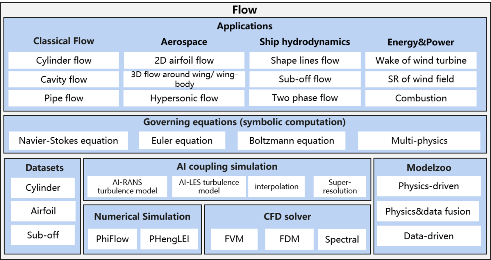

ENGLISH | [简体中文](README.md)

[](https://gitee.com/mindspore/mindscience/blob/master/MindFlow/README.md)
[](https://mindspore.cn/mindflow/docs/en/master/index.html)
[](https://gitee.com/mindspore/community/issues/I55B5A?from=project-issue)
[](https://www.mindspore.cn/community/SIG/detail/?name=mindflow+SIG)
[](https://pepy.tech/project/mindflow-gpu)
[](https://gitee.com/mindspore/mindscience/pulls)
[](https://github.com/mindspore-ai/mindspore/blob/master/LICENSE)

# **MindFlow**

## **Introduction**

Flow simulation aims to solve the fluid governing equation under a given boundary condition by numerical methods, so as to realize the flow analysis, prediction and control. It is widely used in engineering design in aerospace, ship manufacturing, energy and power industries. The numerical methods of traditional flow simulation, such as finite volume method and finite difference method, are mainly implemented by commercial software, requiring physical modeling, mesh generation, numerical dispersion, iterative solution and other steps. The simulation process is complex and the calculation cycle is long. AI has powerful learning fitting and natural parallel inference capabilities, which can improve the efficiency of the flow simulation.

MindSpore Flow is a flow simulation suite developed based on [MindSpore](https://www.mindspore.cn/). It supports AI flow simulation in industries such as aerospace, ship manufacturing, and energy and power. It aims to provide efficient and easy-to-use AI computing flow simulation software for industrial research engineers, university professors, and students.

<div align=center></div>

## **Latest News**

- 🔥`2024.03.22` MindSpore Artificial Intelligence Framework Summit 2024 was held in Beijing National Convention Center. Professor Dong Bin, affiliated with both the Beijing International Center for Mathematical Research and the Center for Machine Learning Research at Peking University, revealed that the team has developed a groundbreaking model in the realm of AI-driven PDEs, named PDEformer-1. Leveraging the MindSpore and MindFlow suites, this model is uniquely capable of directly ingesting any PDE format as input. Through extensive training on a comprehensive dataset encompassing 3 million 1D PDE samples, it has demonstrated impressive speed and precision in resolving a broad spectrum of 1D PDE forward problems.
- 🔥`2024.03.22` MindSpore Artificial Intelligence Framework Summit 2024 was held in Beijing National Convention Center. Tang Zhigong, academician of Chinese Academy of Sciences and chairman of the Chinese Aerodynamic Society, introduced that the team created the generative aerodynamic design model platform based on MindSpore and MindFlow. Platform is oriented to a variety of application scenarios and breaks the traditional design paradigm. It shortens the design periods from the month level to the minute level, and meet the conceptual design requirements. [News](https://tech.cnr.cn/techph/20240323/t20240323_526636454.shtml).
- 🔥`2024.03.20` MindFlow 0.2.0 is released, [Page](RELEASE.md).
- 🔥`2023.11.07`The China (Xi'an) Artificial Intelligence Summit Forum was held at the High-tech International Conference Center in Yanta District, Xi'an, and the first large-scale fluid dynamics model for aircraft, "Qinling·AoXiang", jointly developed by Northwestern Polytechnical University and Huawei, was officially released. The model is an intelligent model for aircraft fluid simulation jointly developed by the International Joint Institute of Fluid Mechanics and Intelligence of Northwestern Polytechnical University and Huawei AI4Sci Lab on the basis of the domestic open-source fluid computing software Fenglei, relying on the surging computing power of Ascend AI and the MindSpore AI framework, [page](https://mp.weixin.qq.com/s/Rhpiyf3VJYm_lMBWTRDtGA).
- 🔥`2023.08.02` MindFlow 0.1.0 is released, [Page](https://mindspore.cn/mindflow/docs/zh-CN/r0.1/index.html).
- 🔥`2023.07.06` The 2023 World Artificial Intelligence Conference with the theme of "Connect the World Intelligently. Generate the Future" was successfully held at the Shanghai World Expo Center. The 3D Supercritical airfoil fluid simulation AI model "Dongfang Yifeng" from Comac Shanghai Aircraft Design and Research Institute won the SAIL Award, the highest award of the World Artificial Intelligence Conference. This model is a large intelligent AI model for wing complex flow simulation scenarios jointly developed by Comac Co., Ltd. Shanghai Aircraft Design and Research Institute and Huawei based on the domestic Shengteng AI basic software and hardware platform and MindSpore AI framework, [Page](https://www.thepaper.cn/newsDetail_forward_23769936).
- 🔥`2023.05.21` The second plenary meeting of the intelligent fluid mechanics industrial consortium was successfully held in Hangzhou West Lake University, and Shengsi MindSpore co organized the meeting. Three academicians of the CAS Member, representatives of the industrial consortium and experts from the academic and industrial circless who care about the consortium attended the meeting. The first fluid mechanics model for aircraft - "Qinling · AoXiang" model is pre released. This model is an intelligent model for aircraft fluid simulation jointly developed by the International Joint Institute of fluid mechanics Intelligence of Northwestern Polytechnical University and Huawei based on the domestic Shengteng AI basic software and hardware platform and MindSpore AI framework.[Page](http://science.china.com.cn/2023-05/23/content_42378458.htm).
- 🔥`2023.02.05` [MindFlow 0.1.0-alpha](https://mindspore.cn/mindflow/docs/zh-CN/r0.1.0-alpha/index.html) is released.
- 🔥`2023.01.17` [MindFlow-CFD](https://zhuanlan.zhihu.com/p/599592997), an End-to-End Differentiable Solver based on MindSpore, [see more](https://gitee.com/mindspore/mindscience/tree/master/MindFlow/mindflow/cfd).
- 🔥`2022.09.02` Academician Guanghui Wu, Chief Scientist of COMAC, released the first industrial flow simulation model "DongFang.YuFeng" at WAIC2022 World Artificial Intelligence Conference. AI flow simulation assisted the aerodynamic simulation of domestic large aircraft. [Page](http://www.news.cn/fortune/2022-09/06/c_1128978806.htm).

## Publications

Ye Z, Huang X, Liu H, et al. Meta-Auto-Decoder: A Meta-Learning Based Reduced Order Model for Solving Parametric Partial Differential Equations[J]. Communications on Applied Mathematics and Computation. [[Paper]](https://link.springer.com/article/10.1007/s42967-023-00293-7)

Deng Z, Wang J, Liu H, et al. Prediction of transactional flow over supercritical airfoils using geometric-encoding and deep-learning strategies. Physics of Fluids 35, 075146 (2023). [[Paper]](https://pubs.aip.org/aip/pof/article-abstract/35/7/075146/2903765/Prediction-of-transonic-flow-over-supercritical?redirectedFrom=fulltext)
[[Code]](https://gitee.com/mindspore/mindscience/tree/master/MindFlow/applications/data_driven/airfoil/2D_steady)

Rao C, Ren P, Wang Q, et al. Encoding physics to learn reaction–diffusion processes[J]. Nature Machine Intelligence, 2023: 1-15. [[Paper]](https://arxiv.org/abs/2106.04781)
[[Code]](https://gitee.com/mindspore/mindscience/tree/master/MindFlow/applications/data_mechanism_fusion/percnn)

Li Z, Wang Y, Liu H, et al. Solving Boltzmann equation with neural sparse representation[J]. SIAM Journal on Scientific Computing, Vol. 46, Iss. 2 (2024).
[[Paper]](https://epubs.siam.org/doi/abs/10.1137/23M1558227?journalCode=sjoce3)
[[Code]](https://gitee.com/mindspore/mindscience/tree/master/MindFlow/applications/physics_driven/boltzmann)

Deng Z, Liu H, Shi B, et al. Temporal predictions of periodic flows using a mesh transformation and deep learning-based strategy[J]. Aerospace Science and Technology, 2023, 134: 108081. [[Paper]](https://www.sciencedirect.com/science/article/pii/S1270963822007556)

Huang X, Liu H, Shi B, et al. A Universal PINNs Method for Solving Partial Differential Equations with a Point Source[C]//IJCAI. 2022: 3839-3846. [[Paper]](https://gitee.com/link?target=https%3A%2F%2Fwww.ijcai.org%2Fproceedings%2F2022%2F0533.pdf) [[Code]](https://gitee.com/mindspore/mindscience/tree/master/MindFlow/applications/physics_driven/poisson/point_source)

## Features

- [MindSpore Grad](https://gitee.com/mindspore/mindscience/blob/master/MindFlow/features/mindspore_grad_cookbook.ipynb)

- [Solve Pinns by MindFlow](https://gitee.com/mindspore/mindscience/tree/master/MindFlow/features/solve_pinns_by_mindflow)

## Applications

### Data Driven

|                                                                      Case                                                                       |                                                                  Dataset                                                                   |     Network     | GPU | NPU |
| :---------------------------------------------------------------------------------------------------------------------------------------------: | :----------------------------------------------------------------------------------------------------------------------------------------: | :-------------: | :-: | :-: |
|           [DongFang.YuFeng](https://gitee.com/mindspore/mindscience/tree/master/MindFlow/applications/data_driven/airfoil/2D_steady)            |     [2D Airfoil Flow Dataset](https://download.mindspore.cn/mindscience/mindflow/dataset/applications/data_driven/airfoil/2D_steady/)      |       ViT       | ✔️  | ✔️  |
|        [Solve Burgers Equation by FNO](https://gitee.com/mindspore/mindscience/tree/master/MindFlow/applications/data_driven/burgers/fno1d)        |        [1D Burgers Equation Dataset](https://download.mindspore.cn/mindscience/mindflow/dataset/applications/data_driven/burgers/)         |      FNO1D      | ✔️  | ✔️  |
|        [Solve Burgers Equation by KNO](https://gitee.com/mindspore/mindscience/tree/master/MindFlow/applications/data_driven/burgers/kno1d)        |        [1D Burgers Equation Dataset](https://download.mindspore.cn/mindscience/mindflow/dataset/applications/data_driven/burgers/)         |      KNO1D      | ✔️  | ✔️  |
|  [Solve Navier-Stokes Equation by FNO](https://gitee.com/mindspore/mindscience/tree/master/MindFlow/applications/data_driven/navier_stokes/fno2d)  |  [2D Navier-Stokes Equation Dataset](https://download.mindspore.cn/mindscience/mindflow/dataset/applications/data_driven/navier_stokes/)   |      FNO2D      | ✔️  | ✔️  |
| [Solve Navier-Stokes Equation by FNO3D](https://gitee.com/mindspore/mindscience/tree/master/MindFlow/applications/data_driven/navier_stokes/fno3d) |  [2D Navier-Stokes Equation Dataset](https://download.mindspore.cn/mindscience/mindflow/dataset/applications/data_driven/navier_stokes/)   |      FNO3D      | ✔️  | ✔️  |
|  [Solve Navier-Stokes Equation by KNO](https://gitee.com/mindspore/mindscience/tree/master/MindFlow/applications/data_driven/navier_stokes/kno2d)  |  [2D Navier-Stokes Equation Dataset](https://download.mindspore.cn/mindscience/mindflow/dataset/applications/data_driven/navier_stokes/)   |      KNO2D      | ✔️  | ✔️  |
|                [Solve 2D Riemann Problem by CAE-LSTM](https://gitee.com/mindspore/mindscience/tree/master/MindFlow/applications/research/cae_lstm)                |    [2D Riemann Problem Dataset](https://download.mindspore.cn/mindscience/mindflow/dataset/applications/data_driven/cae-lstm/riemann/)     |    CAE-LSTM     | ✔️  | ✔️  |
|                [Solve Shu-Osher Problem by CAE-LSTM](https://gitee.com/mindspore/mindscience/tree/master/MindFlow/applications/research/cae_lstm)                 |  [1D Shu-Osher Problem Dataset](https://download.mindspore.cn/mindscience/mindflow/dataset/applications/data_driven/cae-lstm/shu_osher/)   |    CAE-LSTM     | ✔️  | ✔️  |
|                   [Solve 1D Sod Shock Tube Problem by CAE-LSTM](https://gitee.com/mindspore/mindscience/tree/master/MindFlow/applications/research/cae_lstm)                    |        [1D Sod Problem Dataset](https://download.mindspore.cn/mindscience/mindflow/dataset/applications/data_driven/cae-lstm/sod/)         |    CAE-LSTM     | ✔️  | ✔️  |
|                   [Solve KH Problem by CAE-LSTM](https://gitee.com/mindspore/mindscience/tree/master/MindFlow/applications/research/cae_lstm/)                    |         [2D K-H Problem Dataset](https://download.mindspore.cn/mindscience/mindflow/dataset/applications/data_driven/cae-lstm/kh/)         |    CAE-LSTM     | ✔️  | ✔️  |
|         [Solve 2D Airfoil Buffet by eHDNN](https://gitee.com/mindspore/mindscience/tree/master/MindFlow/applications/research/transonic_buffet_ehdnn)          |   [2D Airfoil Buffet Dataset](https://download.mindspore.cn/mindscience/mindflow/dataset/applications/data_driven/airfoil/2D_unsteady/)    |      eHDNN      | ✔️  | ✔️  |
|           [Predict Unsteady Flow Fields with Move Boundary by eHDNN](https://gitee.com/mindspore/mindscience/tree/master/MindFlow/applications/research/move_boundary_hdnn)           |    [Move Boundary eHdnn Dataset](https://download.mindspore.cn/mindscience/mindflow/dataset/applications/data_driven/move_boundary_hdnn)    |      eHDNN       | ✔️  | ✔️  |
|          [Solve 3D Unsteady Sphere Flow by ResUnet3D](https://gitee.com/mindspore/mindscience/tree/master/MindFlow/applications/data_driven/flow_around_sphere)           |     [3D Unsteady Flow Dataset](https://download.mindspore.cn/mindscience/mindflow/dataset/applications/data_driven/3d_unsteady_flow/)      |    ResUnet3D    | ✔️  | ✔️  |
|       [Solve 2D Cylinder Flow by CAE-Transformer](https://gitee.com/mindspore/mindscience/tree/master/MindFlow/applications/research/cae_transformer)       | [Low Reynolds Cylinder Flow Dataset](https://download.mindspore.cn/mindscience/mindflow/dataset/applications/data_driven/cae-transformer/) | CAE-Transformer | ✔️  | ✔️  |
|[Predict Multi-timestep Complicated Transonic Airfoil by FNO2D and UNET2D](https://gitee.com/mindspore/mindscience/tree/master/MindFlow/applications/data_driven/airfoil/2D_unsteady)          |  [2D Transonic Airfoil Dataset](https://download-mindspore.osinfra.cn/mindscience/mindflow/dataset/applications/data_driven/airfoil/2D_unsteady/)           |      FNO2D/UNET2D    |   ✔️     |   ✔️   |
|[Predict Fluid-structure Interaction System by HDNN](https://gitee.com/mindspore/mindscience/tree/master/MindFlow/applications/research/fluid_structure_interaction)          |  [Fluid-structure Interaction System Dataset](https://download-mindspore.osinfra.cn/mindscience/mindflow/dataset/applications/data_driven/fluid_structure_interaction/)           |      HDNN    |   ✔️     |   ✔️   |

### Data-Mechanism Fusion

|                                                                         Case                                                                         |                                                         Dataset                                                         | Network | GPU | NPU |
| :--------------------------------------------------------------------------------------------------------------------------------------------------: | :---------------------------------------------------------------------------------------------------------------------: | :-----: | :-: | :-: |
| [Solve Convection-Diffusion Equation by PDE-NET](https://gitee.com/mindspore/mindscience/tree/master/MindFlow/applications/data_mechanism_fusion/pde_net) |                                                            -                                                            | PDE-Net | ✔️  | ✔️  |
|                   [Solve 2D Burgers Equation by PeRCNN](https://gitee.com/mindspore/mindscience/tree/master/MindFlow/applications/data_mechanism_fusion/percnn/burgers_2d)                   | [PeRCNN Dataset](https://download.mindspore.cn/mindscience/mindflow/dataset/applications/data_mechanism_fusion/PeRCNN/) | PeRCNN  | ✔️  | ✔️  |
|                   [Solve 3D Reaction-Diffusion Equation by PeRCNN](https://gitee.com/mindspore/mindscience/tree/master/MindFlow/applications/data_mechanism_fusion/percnn/gsrd_3d)                   | [PeRCNN Dataset](https://download.mindspore.cn/mindscience/mindflow/dataset/applications/data_mechanism_fusion/PeRCNN/) | PeRCNN  | ✔️  | ✔️  |
| [AI Turb Model](https://gitee.com/mindspore/mindscience/tree/master/MindFlow/applications/data_mechanism_fusion/ai_turbulence_modeling)   | -           |    MLP    |   ✔️     |   ✔️   |

### Physics Driven

|                                                                          Case                                                                          |                                                                    Dataset                                                                     | Network | GPU | NPU |
| :----------------------------------------------------------------------------------------------------------------------------------------------------: | :--------------------------------------------------------------------------------------------------------------------------------------------: | :-----: | :-: | :-: |
|                  [Solve Burgers Equation by PINNs](https://gitee.com/mindspore/mindscience/tree/master/MindFlow/applications/physics_driven/burgers)                  |            [Burgers Dataset](https://download.mindspore.cn/mindscience/mindflow/dataset/applications/physics_driven/burgers_pinns/)            |  PINNs  | ✔️  | ✔️  |
|    [Solve 2D Cylinder Flow by PINNs](https://gitee.com/mindspore/mindscience/tree/master/MindFlow/applications/physics_driven/navier_stokes/cylinder_flow_forward)    |     [2D Cylinder Fow Dataset](https://download.mindspore.cn/mindscience/mindflow/dataset/applications/physics_driven/flow_past_cylinder/)      |  PINNs  | ✔️  | ✔️  |
|                       [Solve 2D Darcy Problem by PINNs](https://gitee.com/mindspore/mindscience/tree/master/MindFlow/applications/physics_driven/darcy)                       |                                                                       -                                                                        |  PINNs  | ✔️  | ✔️  |
|            [Solve Poisson Equation by PINNs](https://gitee.com/mindspore/mindscience/tree/master/MindFlow/applications/physics_driven/poisson/continuous)             |                                                                       -                                                                        |  PINNs  | ✔️  | ✔️  |
|                [Solve Boltzmann Equation by PINNs](https://gitee.com/mindspore/mindscience/tree/master/MindFlow/applications/physics_driven/boltzmann)                |                                                                       -                                                                        |  PINNs  | ✔️  | ✔️  |
|      [Solve 2D Taylor-Green Votex by PINNs](https://gitee.com/mindspore/mindscience/tree/master/MindFlow/applications/physics_driven/navier_stokes/taylor_green)      |                                                                       -                                                                        |  PINNs  | ✔️  | ✔️  |
| [Solve Inverse Navier-Stoken Problem by PINNs](https://gitee.com/mindspore/mindscience/tree/master/MindFlow/applications/physics_driven/navier_stokes/cylinder_flow_inverse)  | [Navier-Stoken Inverse Dataset](https://download.mindspore.cn/mindscience/mindflow/dataset/applications/physics_driven/inverse_navier_stokes/) |  PINNs  | ✔️  | ✔️  |
| [Solve 2D Poisson Equation with Point Source by PINNs](https://gitee.com/mindspore/mindscience/tree/master/MindFlow/applications/physics_driven/poisson/point_source) |                                                                       -                                                                        |  PINNs  | ✔️  | ✔️  |
|           [Solve Kovasznay Flow by PINNs](https://gitee.com/mindspore/mindscience/tree/master/MindFlow/applications/physics_driven/navier_stokes/kovasznay)           |                                                                       -                                                                        |  PINNs  | ✔️  | ✔️  |
|         [Solve Periodic Hill Flow by PINNs](https://gitee.com/mindspore/mindscience/tree/master/MindFlow/applications/physics_driven/navier_stokes/periodic_hill)          |                     [Periodic Hill Dataset](https://download.mindspore.cn/mindscience/mindflow/dataset/periodic_hill_2d/)                      |  PINNs  | ✔️  | ✔️  |
|         [Solve Allen-Cahn Equation by PINNs](https://gitee.com/mindspore/mindscience/tree/master/MindFlow/applications/research/allen_cahn)          |                     [Allen-Cahn Dataset](https://download.mindspore.cn/mindscience/mindflow/dataset/applications/research/allen_cahn/)                      |  PINNs  | ✔️  | ✔️  |
|  [CMA-ES&Multi-objective Gradient Descent Algorithm Accelerates PINNs Convergence](https://gitee.com/mindspore/mindscience/tree/master/MindFlow/applications/research/cma_es_mgda)   |                     [Periodic Hill Dataset](https://download.mindspore.cn/mindscience/mindflow/dataset/periodic_hill_2d/)                      |  PINNs  | ✔️  | ✔️  |
|[META-PINNs Algorithm](https://gitee.com/mindspore/mindscience/tree/master/MindFlow/applications/research/meta_pinns)         |             -              |      PINNs      |  ✔️      |  ✔️    |
|[MOE-PINNs Algorithm](https://gitee.com/mindspore/mindscience/tree/master/MindFlow/applications/research/moe_pinns)         |             -              |      PINNs      |  ✔️      |  ✔️    |
|[R-DLGA Algorithm](https://gitee.com/mindspore/mindscience/tree/master/MindFlow/applications/research/r_dlga)         |             -              |      PINNs      |  ✔️      |  ✔️    |

### CFD

|                                                     Case                                                      |  Numerical Scheme   | GPU | NPU |
| :-----------------------------------------------------------------------------------------------------------: | :-----: | :-: | :-- |
|      [Sod Shock Tube](https://gitee.com/mindspore/mindscience/tree/master/MindFlow/applications/cfd/sod)      | Rusanov | ✔️  | -   |
|      [Lax Shock Tube](https://gitee.com/mindspore/mindscience/tree/master/MindFlow/applications/cfd/lax)      | Rusanov | ✔️  | -   |
| [2D Riemann Problem](https://gitee.com/mindspore/mindscience/tree/master/MindFlow/applications/cfd/riemann2d) |    -    | ✔️  | -   |
|     [Couette Flow](https://gitee.com/mindspore/mindscience/tree/master/MindFlow/applications/cfd/couette)     |    -    | ✔️  | -   |

## **Installation**

### Version Dependency

Because MindFlow is dependent on MindSpore, please click [MindSpore Download Page](https://www.mindspore.cn/versions) according to the corresponding relationship indicated in the following table. Download and install the corresponding whl package.

| MindFlow |                                 Branch                                 |  MindSpore  | Python |
| :------: | :--------------------------------------------------------------------: | :---------: | :----: |
|  master  | [master](https://gitee.com/mindspore/mindscience/tree/master/MindFlow) |     \       | \>=3.7 |
| 0.2.0  | [r0.6](https://gitee.com/mindspore/mindscience/tree/r0.6/MindFlow) |   \>=2.2.12  | \>=3.7 |
| 0.1.0    | [r0.3](https://gitee.com/mindspore/mindscience/tree/r0.3/MindFlow) |   \>=2.0.0  | \>=3.7 |
| 0.1.0rc1 | [r0.2.0](https://gitee.com/mindspore/mindscience/tree/r0.2.0/MindFlow) | \>=2.0.0rc1 | \>=3.7 |

### Install Dependency

```bash
pip install -r requirements.txt
```

### Hardware

| Hardware      | OS              | Status |
| :------------ | :-------------- | :----- |
| Ascend        | Linux           | ✔️ |
| GPU           | Linux           | ✔️ |

### **pip install**

```bash
# gpu and ascend are supported
export DEVICE_NAME=gpu
pip install mindflow_${DEVICE_NAME}
```

### **source code install**

- Download source code from Gitee.

```bash
git clone https://gitee.com/mindspore/mindscience.git
cd {PATH}/mindscience/MindFlow
```

- Compile in Ascend backend.

```bash
bash build.sh -e ascend -j8
```

- Compile in GPU backend.

```bash
export CUDA_PATH={your_cuda_path}
bash build.sh -e gpu -j8
```

- Install the compiled .whl file.

```bash
cd {PATH}/mindscience/MindFLow/output
pip install mindflow_*.whl
```

## **Community**

### Join MindFlow SIG

<!DOCTYPE html>
<html>
<head>
    <meta http-equiv="Content-Type" content="text/html" charset="utf-8">
</head>
<body>
<table id="t2" style="text-align:center" align="center">
    <tr id="tr2">
        <td align="center">
            
            <p align="center">
                Northwestern Polytechnical University ZhangWeiwei
            </p>
        </td>
        <td align="center">
            
            <p align="center">
                Peking University DongBin
            </p>
        </td>
        <td align="center">
            
            <p align="center">
                RenMin University of China SunHao
            </p>
        </td>
        <td align="center">
            
            <p align="center">
                Zhengzhou University of Aeronautics MaHao
            </p>
        </td>
    </tr>
</table>

</body>
</html>

[Join](https://mp.weixin.qq.com/s/e00lvKx30TsqjRhYa8nlhQ) MindSpore [MindFlow SIG](https://www.mindspore.cn/community/SIG/detail/?name=mindflow+SIG) to help AI fluid simulation development.
MindSpore AI for Science, [Learning and Learning to solve PDEs](https://www.bilibili.com/video/BV1ur4y1H7vB?p=4) topic report by Dong Bin, Peking University.
We will continue to release [open source internship tasks](https://gitee.com/mindspore/community/issues/I55B5A?from=project-issue), build MindFlow ecology with you, and promote the development of computational fluid dynamics with experts, professors and students in the field. Welcome to actively claim the task.

### Core Contributor

Thanks goes to these wonderful people 🧑‍🤝‍🧑:

yufan, wangzidong, liuhongsheng, zhouhongye, zhangyi, dengzhiwen, liulei, guoboqiang, chengzeruizhi, libokai, yangge, longzichao, qiuyisheng, haojiwei, leiyixiang, huangxiang, huxin,xingzhongfan, mengqinghe, lizhengyi, lixin, liuziyang, dujiaoxi, xiaoruoye, liangjiaming

### Community Partners

<!DOCTYPE html>
<html>
<head>
    <meta charset="UTF-8">
</head>
<body>
<table id="t1" style="text-align:center" align="center">
    <tr id="tr1">
        <td>
            
            <p align="center">
                Commercial Aircraft Corporation of China Ltd
            </p>
        </td>
        <td>
            
            <p align="center">
                TaiHu Laboratory
            </p>
        </td>
        <td>
            
            <p align="center">
                Northwestern Polytechnical University
            </p>
        </td>
        <td>
            
            <p align="center">
                Peking University
            </p>
        </td>
        <td>
            
            <p align="center">
                Renmin University of China
            </p>
        </td>
                <td>
            
            <p align="center">
                Harbin Institute of Technology
            </p>
        </td>
    </tr>
</table>
</body>
</html>

## **Contribution Guide**

- Please click here to see how to contribute your code:[Contribution Guide](https://gitee.com/mindspore/mindscience/blob/master/MindFlow/CONTRIBUTION_CN.md)
- For users who are in need of AI chips, please refer to [the document of Open Intelligence](https://download-mindspore.osinfra.cn/mindscience/mindflow/tutorials/%E5%90%AF%E6%99%BA%E6%8C%87%E5%8D%97.pdf), [NPU tutorials](https://download-mindspore.osinfra.cn/mindscience/mindflow/tutorials/npu%E4%BD%BF%E7%94%A8.MP4), [GPU tutorials](https://download-mindspore.osinfra.cn/mindscience/mindflow/tutorials/gpu%E4%BD%BF%E7%94%A8.MP4)

## **License**

[Apache License 2.0](http://www.apache.org/licenses/LICENSE-2.0)
