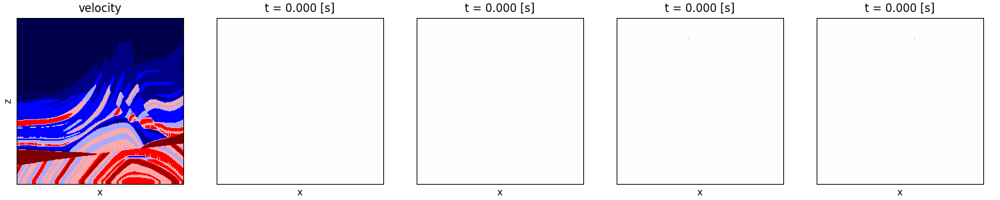
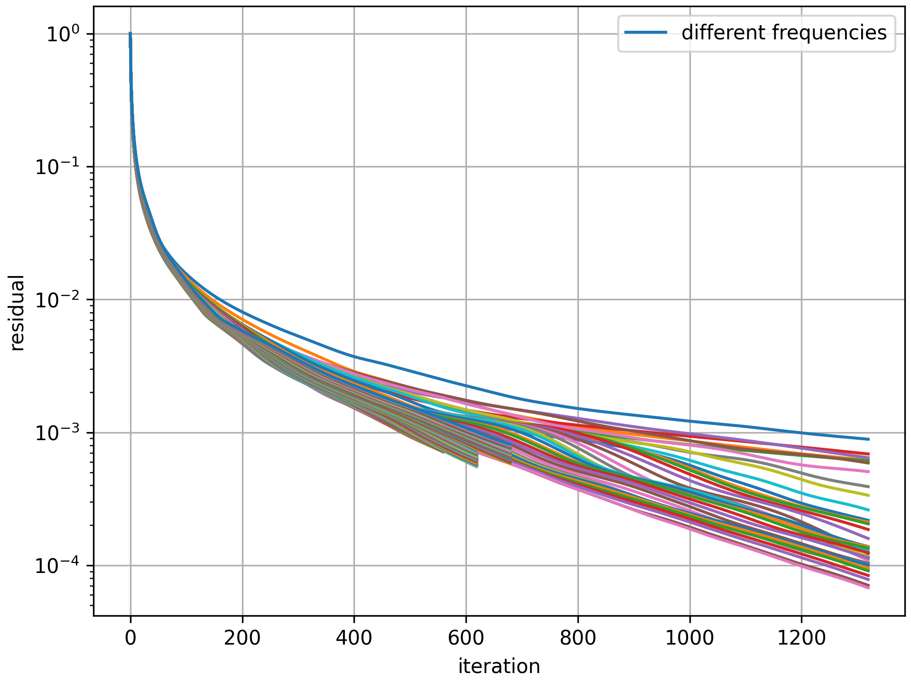

# 2D Acoustic Wave Equation CBS Solver

## Overview

The solution of the acoustic wave equation is a core technology in fields such as medical ultrasound and geological exploration. Large-scale acoustic wave equation solving faces challenges in computing power and storage. Acoustic wave equation solvers generally use frequency domain solving algorithms and time domain solving algorithms. The representative of time domain solving algorithms is the Time Domain Finite Difference (TDFD) method, and the frequency domain solving algorithms include Frequency Domain Finite Difference (FDFD), Finite Element Method (FEM), and Convergent Born Series (CBS) iterative method. The CBS method is widely recognized in the engineering and academic communities due to its low memory requirements and the absence of dispersion errors. In particular, [Osnabrugge et al. (2016)](https://linkinghub.elsevier.com/retrieve/pii/S0021999116302595) solved the convergence problem of this method, making the application of the CBS method have broader prospects. The AI model based on the CBS computational structure is a typical representative of the dual-driven paradigm of physics and AI, including [Stanziola et al. (2022)](http://arxiv.org/abs/2212.04948), [Zeng et al. (2023)](http://arxiv.org/abs/2312.15575), etc.

This case will demonstrate how to call the CBS API provided by MindFlow to solve the 2D acoustic wave equation.

## Theoretical Background

### Problem Description

In the solution of the acoustic wave equation, the velocity field and source information are input parameters, and the output is the spatiotemporal distribution of the wavefield.

The expression of the 2D acoustic wave equation is as follows:

| Time Domain Expression                                | Frequency Domain Expression                       |
| ----------------------------------------------------- | ------------------------------------------------- |
| $\frac{\partial^2u}{\partial t^2} - c^2 \Delta u = f$ | $-\omega^2 \hat{u} - c^2 \Delta\hat{u} = \hat{f}$ |

where

- $u(\bold{x},t) \;\; [L]$ Deformation displacement (pressure divided by density), scalar
- $c(\bold{x}) \;\; [L/T]$ Wave velocity, scalar
- $f(\bold{x},t) \;\; [L/T^2]$ Excitation source (volume distribution force), scalar

During actual solving, in order to reduce the parameter dimensions, the parameters are usually made dimensionless first, and then the dimensionless equations are solved against the dimensionless parameters, and finally the dimensions of the solutions are recovered. By selecting $\omega$, $\hat{f}$, and $d$ (grid spacing, required to be equal in all directions in this case) to normalize the frequency domain equation, the dimensionless frequency domain equation can be obtained:

$$
u^* + c^{*2} \tilde{\Delta} + f^* = 0
$$

where

- $u^* = \hat{u} \omega^2 / \hat{f}$ Dimensionless deformation displacement
- $c^* = c / (\omega d)$ Dimensionless wave velocity
- $\tilde{\Delta}$ Normalized Laplace operator, i.e., the Laplace operator when the grid spacing is 1
- $f^*$ Mask marking the source position, with 1 at the source location and 0 at other positions

### CBS Introduction

Here is a brief introduction to the theory of the CBS method. For further understanding, please refer to [Osnabrugge et al. (2016)](https://linkinghub.elsevier.com/retrieve/pii/S0021999116302595).

**Original Born Series**

First, the frequency domain acoustic wave equation is expressed in the following equivalent form
$$
k^2 \hat{u} + \Delta \hat{u} +S = 0
$$
where $k=\frac{\omega}{c}$ and $S=\frac{\hat{f}}{c^2}$. The non-uniform wave number field $k$ is decomposed into a uniform background potential $k_0$ and a scattering potential $V$: $k^2 = V + k_0^2 + i\epsilon$, where $\epsilon$ is a small quantity that ensures the stability of the iteration, and the final solution of the equation is independent of the specific values of $k_0$ and $\epsilon$. The equation for a single iteration is
$$
(k_0^2 + i\epsilon) \hat{u} + \Delta \hat{u} = -V \hat{u} - S
$$
Treating the right-hand side as a known quantity, the solution of this equation is
$$
\hat{u} = G (V \hat{u} + S)
\qquad
G = \mathcal{F}^{-1} \frac1{|\bold{p}|^2 - k_0^2 - i\epsilon} \mathcal{F}
$$
Substituting the solution of each iteration back into the right-hand side and performing the next iteration, the iterative expression is obtained
$$
\hat{u}_{k+1} = GV\hat{u}_k + GS = (1 + GV + GVGV + \cdots)GS
$$
**Convergent  Born Series**

To ensure convergence, preprocessing and reasonable selection of the value of $epsilon$ are required. Define the preprocessing operator as $\gamma = \frac{i}{\epsilon} V$, and take $\epsilon \geq \max\{|k^2 - k_0^2|\}$. Multiply both sides of the iteration equation by $\gamma$ and rearrange, we get
$$
\hat{u} = (\gamma GV - \gamma + 1) \hat{u} + \gamma GS
$$
Let $\gamma GV - \gamma + 1 = M$, then the iteration equation becomes
$$
\hat{u}_{k+1} = M \hat{u}_k + \gamma GS = (1 + M + M^2 + \cdots) \gamma GS
$$
In matrix form
$$
\begin{bmatrix} \hat{u}_k \\ S \end{bmatrix} =
\begin{bmatrix} M & \gamma G \\ 0 & 1 \end{bmatrix}^k
\begin{bmatrix} 0 \\ S \end{bmatrix}
$$
In the actual program implementation, in order to reduce the number of Fourier transforms, the following equivalent form of the iteration equation is used
$$
\hat{u}_{k+1} = \hat{u}_k + \gamma [G(V\hat{u}_k + S) - \hat{u}_k]
$$

## Case Design

The content is translated into English as follows:

- Non-dimensionalization of input parameters;
- Non-dimensionalization of frequency domain 2D acoustic wave equation CBS solver;
- Dimensional restoration of the solution;
- Time-frequency transformation of the solution.

The core solving process is parallelized for different source locations and different frequency points. Due to the large number of frequency points, it is divided into `n_batches` batches to solve sequentially along the frequency direction. The required input for the case is placed in the `dataset/` directory in the form of files, and the file names are passed in through `config.yaml`. The output results include the solution of the non-dimensionalized equation in the frequency domain `u_star.npy`, the dimensional final solution converted to the time domain `u_time.npy`, and the visualization animation of the time domain solution `wave.gif`.

## Quick Start

To facilitate direct verification by users, preset inputs are provided [here](https://download-mindspore.osinfra.cn/mindscience/mindflow/dataset/applications/cfd/acoustic). Please download the data and put them in `./dataset` in the case directory. The data include the velocity field `velocity.npy`, source location list `srclocs.csv`, and source waveform `srcwaves.csv`. Users can modify the input parameters according to the file format.

### Method 1: Running the `solve_acoustic.py` script

```shell
python solve_acoustic.py --config_file_path ./configs.yaml --device_id 0 --mode GRAPH
```

Where

`--config_file_path` represents the path of the configuration file, with a default value of `./config.yaml`;

`--device_id` represents the ID of the computing card used, which can be filled in according to the actual situation, and the most idle one will be automatically selected from all the computing cards by default;

`--mode` represents the running mode, 'GRAPH' represents static graph mode, and 'PYNATIVE' represents dynamic graph mode.

### Method 2: Running Jupyter Notebook

You can use the [Chinese version](./acoustic_CN.ipynb) and the [English version](./acoustic.ipynb) of Jupyter Notebook to run the training and validation code line by line.

## Result Display

The evolution of the wave field excited by different source locations for the same velocity model over time is shown in the following figure.



The iterative convergence process of the equation residual is shown in the following figure, with each line representing a frequency point. The number of iterations required to reach the convergence threshold varies for different frequency points, and the number of iterations in the same batch depends on the slowest converging frequency point.



## Performance

| Parameter              | Ascend               |
|:----------------------:|:--------------------------:|
| Hardware                | Ascend NPU            |
| MindSpore Version      | >=2.3.0                 |
| Dataset                  | [Marmousi velocity model](https://en.wikipedia.org/wiki/Marmousi_model) slices, included in the `dataset/` path of the case |
| Number of Parameters     | No trainable parameters |
| Solver Parameters         | batch_size=300, tol=1e-3, max_iter=10000 |
| Convergence Iterations | batch 0: 1320, batch 1: 560, batch 2: 620, batch 3: 680|
| Solver Speed (ms/iteration) | 500                 |

## Contributors

gitee id: [WhFanatic](https://gitee.com/WhFanatic)

email: hainingwang1995@gmail.com