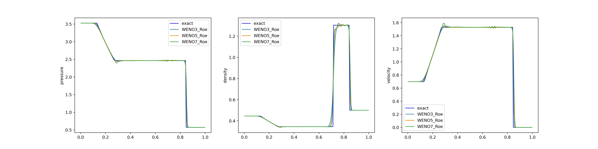
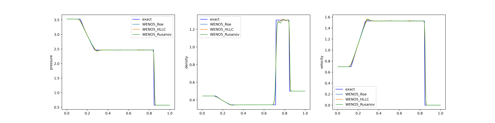

[ENGLISH](README.md) | 简体中文

# Lax 激波管问题

## 概述

Lax 激波管问题是流体动力学中的经典问题，以 Peter D. Lax 的名字命名。该问题用于测试求解偏微分方程的数值方法的准确性。本案例采用 MindFlow 流体模拟套件用于解决 Lax 激波管问题。

## 快速开始

### 训练方式一：在命令行中调用`solve_lax.py`脚本

```shell
python solve_lax.py --mode GRAPH --save_graphs_path ./graphs --device_target GPU --device_id 0 --config_file_path ./numeric.yaml --reconstructor WENO5 --riemann_computer Roe
```

其中，
`--mode`表示运行的模式，'GRAPH'表示静态图模式, 'PYNATIVE'表示动态图模式，详见[MindSpore 官网](https://www.mindspore.cn/docs/zh-CN/r2.0/design/dynamic_graph_and_static_graph.html)，默认值'GRAPH'；

`--save_graphs`表示是否保存计算图，默认值'False'；

`--save_graphs_path`表示计算图保存的路径，默认值'./graphs'

`--device_target`表示使用的计算平台类型，可以选择'Ascend'或'GPU'，默认值'GPU'；

`--device_id`表示使用的计算卡编号，可按照实际情况填写，默认值 0；

`--config_file_path`表示配置文件的路径，默认值'./numeric.yaml'；

`--reconstructor`表示使用的重构格式，可以选择'WENO3'、'WENO5'或'WENO7'，默认值'WENO5'；

`--riemann_computer`表示使用的 Riemann 求解器，可以选择'HLLC'、'Roe'或'Rusanov'，默认值'Roe'；

### 训练方式二：运行 Jupyter Notebook

您可以使用[中文版](./lax_tube_CN.ipynb)和[英文版](./lax_tube.ipynb)Jupyter Notebook 逐行运行训练和验证代码。

## 结果展示

下面的两幅图展示了针对 Lax 激波管问题采用不同的重构格式和 Riemann 求解器所计算得到的结果。首先是第一幅图，展示了在使用 Roe Riemann 求解器的情况下，采用不同的重构格式得到的结果。第二幅图旨在展示在使用固定重构格式 WENO5 的情况下，不同 Riemann 求解器之间的差异。其中，"exact"表示精确解，用作参考对比。需要注意的是，两幅图中的计算结果呈现出一定的振荡行为。这是因为本程序采用了基于物理空间的守恒变量重构，而在物理空间中进行高阶重构可能会引起一些振荡。从结果中也可以观察到，WENO7 的振荡比 WENO3 更为明显。




## Contributor

huxin2023
