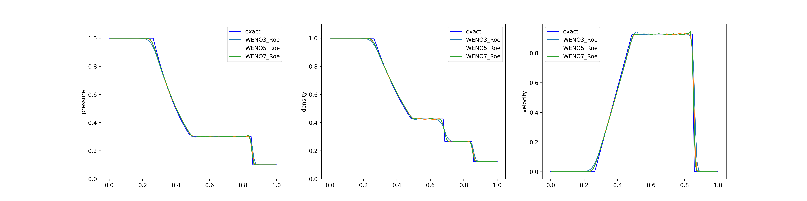
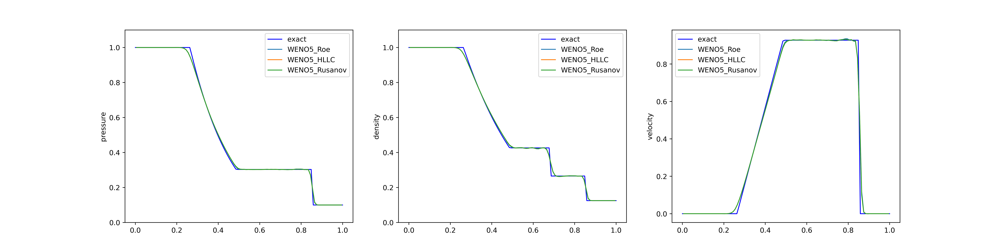

ENGLISH | [简体中文](README_CN.md)

# Sod Tube Problem

## Overview

The Sod shock tube problem, named after Gary A. Sod, is a common test for the accuracy of computational fluid codes, like Riemann solvers. In this case, MindFlow fluid simulation suite is used to solve the sod problem.

## QuickStart

### Run Option 1: Call `solve_sod.py` from command line

```shell
python solve_sod.py --mode GRAPH --save_graphs_path ./graphs --device_target GPU --device_id 0 --config_file_path ./numeric.yaml --reconstructor WENO5 --riemann_computer Roe
```

where:

`--mode` is the running mode. 'GRAPH' indicates static graph mode. 'PYNATIVE' indicates dynamic graph mode. You can refer to [MindSpore official website](https://www.mindspore.cn/docs/en/r2.0/design/dynamic_graph_and_static_graph.html) for details.Default 'GRAPH'.

`--save_graphs` indicates whether to save the computational graph. Default 'False'.

`--save_graphs_path` indicates the path to save the computational graph. Default './graphs'.

`--device_target` indicates the computing platform. You can choose 'Ascend' or 'GPU'. Default 'Ascend'.

`--device_id` indicates the index of NPU or GPU. Default 0.

`--config_file_path` indicates the path of the parameter file. Default './burgers_cfg.yaml'.

`--reconstructor` indicates the reconstructor. You can choose 'WENO3', 'WENO5' or 'WENO7'. Default 'WENO5'

`--riemann_computer` indicates the riemann computer. You can choose 'HLLC', 'Roe' or 'Rusanov'. Default 'Roe'

### Run Option 2: Run Jupyter Notebook

You can use [Chinese](./sod_tube_CN.ipynb) or [English](./sod_tube.ipynb) Jupyter Notebook to run the training and evaluation code line-by-line.

## Results

The following two figures depict the results of the Sod shock tube problem computed using different reconstruction schemes and Riemann computers. Firstly, the first figure demonstrates the outcomes obtained with various reconstruction schemes when the Roe Riemann computer is employed. Meanwhile, the second figure aims to illustrate the discrepancies resulting from different Riemann computers under the utilization of a fixed reconstruction scheme, namely WENO5. Here, the label "exact" represents the exact solution used as a reference for comparison. It should be noted that both figures exhibit certain oscillatory behavior in the computed results. This can be attributed to the adoption of a reconstruction approach based on physical space conservation variables, which may introduce some oscillations when performing high-order reconstruction in physical space. Accordingly, it can be observed from the results that WENO7 exhibits more pronounced oscillations compared to WENO3.




## Contributor

huxin2023
