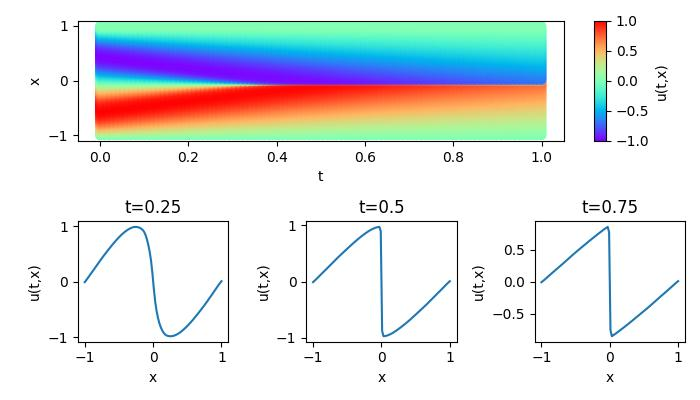
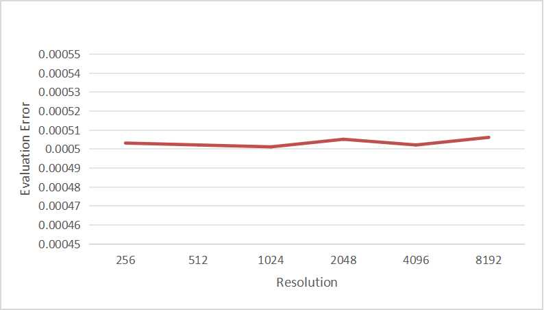

# FNO operator solves Burgers equation

## Introduction

### Background

Computational fluid dynamics is one of the most important techniques in the field of fluid mechanics in the 21st century. The flow analysis, prediction and control can be realized by solving the governing equations of fluid mechanics by numerical method. Traditional finite element method (FEM) and finite difference method (FDM) are inefficient because of the complex simulation process (physical modeling, meshing, numerical discretization, iterative solution, etc.) and high computing costs. Therefore, it is necessary to improve the efficiency of fluid simulation with AI.

Machine learning methods provide a new paradigm for scientific computing by providing a fast solver similar to traditional methods. Classical neural networks learn mappings between finite dimensional spaces and can only learn solutions related to a specific discretization. Different from traditional neural networks, Fourier Neural Operator (FNO) is a new deep learning architecture that can learn mappings between infinite-dimensional function spaces. It directly learns mappings from arbitrary function parameters to solutions to solve a class of partial differential equations.  Therefore, it has a stronger generalization capability. More information can be found in the paper, [Fourier Neural Operator for Parametric Partial Differential Equations](https://arxiv.org/abs/2010.08895).

This tutorial describes how to solve the 1-d Burgers' equation using Fourier neural operator.

### 问题描述

## Burgers' equation

The 1-d Burgers’ equation is a non-linear PDE with various applications including modeling the one
dimensional flow of a viscous fluid. It takes the form

$$
\partial_t u(x, t)+\partial_x (u^2(x, t)/2)=\nu \partial_{xx} u(x, t), \quad x \in(0,1), t \in(0, 1]
$$

$$
u(x, 0)=u_0(x), \quad x \in(0,1)
$$

where $u$ is the velocity field, $u_0$ is the initial condition and $\nu$ is the viscosity coefficient.

We aim to learn the operator mapping the initial condition to the solution at time one:

$$
u_0 \mapsto u(\cdot, 1)
$$

### Technical path

The Fourier Neural Operator consists of the Lifting Layer, Fourier Layers, and the Decoding Layer.


Fourier layers: Start from input V. On top: apply the Fourier transform $\mathcal{F}$; a linear transform R on the lower Fourier modes and filters out the higher modes; then apply the inverse Fourier transform $\mathcal{F}^{-1}$. On the bottom: apply a local linear transform W.  Finally, the Fourier Layer output vector is obtained through the activation function.


## QuickStart

You can download dataset from [data_driven/burgers/](https://download.mindspore.cn/mindscience/mindflow/dataset/applications/data_driven/burgers/). Save these dataset at `./dataset`.

### Run Method 1: Call `train.py` from command line

```shell
python train.py --config_file_path ./configs/fno1d.yaml --mode GRAPH --device_target Ascend --device_id 0
```

where:

`--config_file_path` indicates the path of the parameter file. Default './configs/fno1d.yaml'；

`--device_target` indicates the computing platform. You can choose 'Ascend' or 'GPU'. Default 'Ascend'.

`--device_id` indicates the index of NPU or GPU. Default 0.

`--mode` is the running mode. 'GRAPH' indicates static graph mode. 'PYNATIVE' indicates dynamic graph mode. 

### Run Method 2: Run Jupyter Notebook

You can run the training and validation code line by line using the Chinese or English version of the Jupyter Notebook [Chinese Version](./FNO1D_CN.ipynb) and [English Version](./FNO1D.ipynb).

## Results Display



## Performance

| Parameter               | Ascend               | GPU                |
|:----------------------:|:--------------------------:|:---------------:|
| Hardware                | Ascend, 32G            | NVIDIA V100, 32G    |
| MindSpore版本           | >=2.1.0                 | >=2.1.0                   |
| Dataset                  | [1D Burgers Equation Resolution Dataset](https://download-mindspore.osinfra.cn/mindscience/mindflow/dataset/applications/data_driven/burgers/)      | [1D Burgers Equation Resolution Dataset](https://download-mindspore.osinfra.cn/mindscience/mindflow/dataset/applications/data_driven/burgers/)                   |
| Parameters                  | 5.5e5                   | 5.5e5                   |
| Train Config                | resolution=256, modes=16, hidden_channels=64, depth=10, batch_size=64, epoch=1000 | resolution=256, modes=16, hidden_channels=64, depth=10, batch_size=64, epoch=1000 |
| Evaluation Config                | batch_size=64          | batch_size=64               |
| Optimizer                  | Adam                 | Adam                   |
| Train Loss(MSE)           | 0.018363               |  0.011212             |
| Evaluation Error(RMSE)          | 0.000503                | 0.000279             |
| Speed(ms/step)           | 33                   | 17                |

The datasets at different resolutions are taken for testing and according to the following results it can be concluded that the dataset resolution has no effect on the training results.



## Contributor

gitee id：[liulei277](https://gitee.com/liulei277), [yezhenghao2023](https://gitee.com/yezhenghao2023)

email: liulei2770919@163.com, yezhenghao@isrc.iscas.ac.cn