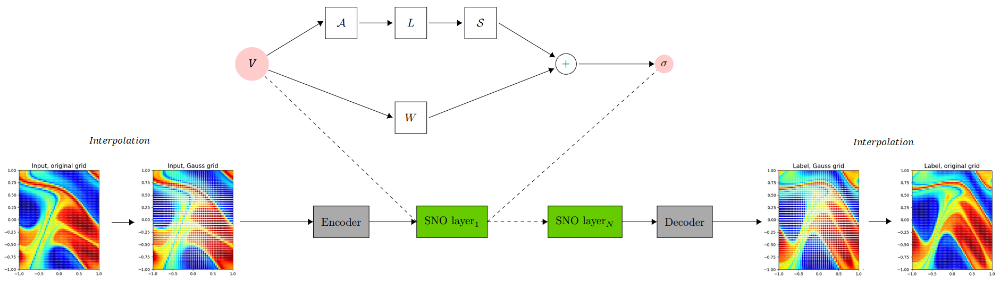
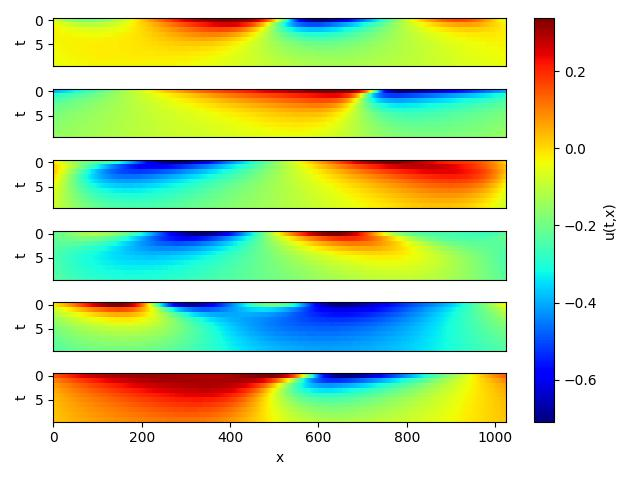
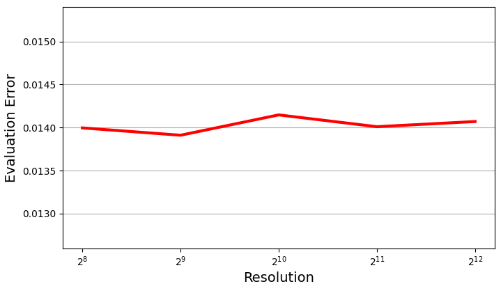

# Spectral Neural Operator Solves 1D Burgers Equation

## Overview

### Problem Description

Burgers' equation is a nonlinear partial differential equation that simulates the propagation and
reflection of shock waves. It is widely used in the fields of fluid mechanics, nonlinear acoustics,
gas dynamics, etc.

The 1-d Burgers’ equation applications include modeling the one dimensional flow of a viscous fluid.
It takes the form

$$
\partial_t u(x, t)+\partial_x (u^2(x, t)/2)=\nu \partial_{xx} u(x, t), \quad x \in(0,1), t \in(0, 1]
$$

$$
u(x, 0)=u_0(x), \quad x \in(0,1)
$$

where $u$ is the velocity field, $u_0$ is the initial condition and $\nu$ is the viscosity coefficient.

We aim to learn the operator mapping the initial condition to the solution at time one:

$$
u_0 \mapsto u(\cdot, 1)
$$

#### Technical Path

Spectral Neural Operator is the FNO-like architecture using polynomial transformation to spectral space (Chebyshev, Legendre, etc.) instead of Fourier.
To compute forward and inverse polynomial transformation matrices for spectral convolutions, the input should be interpolated at the respective Gauss quadrature nodes (Chebyshev grid, etc.).
The interpolated input is lifted to a higher dimension channel space by a convolutional Encoder layer. The result comes to the input of a sequence of spectral (SNO) layers, each of which applies a linear convolution to its truncated spectral representation. The output of SNO layers is projected back to the target dimension by a convolutional Decoder, and finally interpolated back to the original nodes.

The spectral (SNO) layer performs the following operations: applies the polynomial transformation $A$ to spectral space (Chebyshev, Legendre, etc.); a linear convolution $L$ on the lower polynomial modes and filters out the higher modes; then applies the inverse conversion $S={A}^{-1}$ (back to the physical space). Then a linear convolution $W$ of input is added, and nonlinear activation is applied.



## QuickStart

You can download dataset from [data_driven/burgers](https://download.mindspore.cn/mindscience/mindflow/dataset/applications/data_driven/burgers/) for model evaluation. Save these dataset at `./dataset`.

### Run Method 1: Call `train.py` from command line

```shell
python train.py --config_file_path ./configs/sno1d.yaml --mode GRAPH --device_target Ascend --device_id 0
```

where:

`--config_file_path` indicates the path of the parameter file. Default './configs/sno1d.yaml'；

`--device_target` indicates the computing platform. You can choose 'Ascend' or 'GPU'. Default 'Ascend'.

`--device_id` indicates the index of NPU or GPU. Default 0.

`--mode` is the running mode. 'GRAPH' indicates static graph mode. 'PYNATIVE' indicates dynamic graph mode.

### Run Method 2: Run Jupyter Notebook

You can run the training and validation code line by line using the Jupyter Notebook [English Version](SNO1D.ipynb).

## Results Display

Take 6 samples, and do 10 consecutive steps of prediction. Visualize the prediction as follows.



## Performance

| Parameter               | NPU               | GPU                |
|:----------------------:|:--------------------------:|:---------------:|
| Hardware                | Ascend, 64G            | NVIDIA V100, 16G    |
| MindSpore version           | >=2.2.0                 | >=2.2.0                   |
| Dataset                  | [1D Burgers Equation 256 Resolution Dataset](https://download-mindspore.osinfra.cn/mindscience/mindflow/dataset/applications/data_driven/burgers/)      | [1D Burgers Equation 256 Resolution Dataset](https://download-mindspore.osinfra.cn/mindscience/mindflow/dataset/applications/data_driven/burgers/)                   |
| Parameters                  | 6e5                   | 6e5                   |
| Train Config                | channels=128, modes=15, sno_layers=5, batch_size=50, steps_per_epoch=20, epochs=500 | channels=128, modes=15, sno_layers=5, batch_size=50, steps_per_epoch=20, epochs=500 |
| Evaluation Config                | batch_size=1          | batch_size=1               |
| Optimizer                  | Adam                 | Adam                   |
| Train Loss(MSE)           | 3.8e-06                | 3.8e-06             |
| Evaluation Error(RMSE)          | 0.014               | 0.014             |
| Speed(ms/step)           | 8                  | 14.5               |

The datasets at different resolutions are taken for testing and according to the following results it can be concluded that the dataset resolution has no effect on the training results.



## Contributor

gitee id：[juliagurieva](https://gitee.com/JuliaGurieva)

email: gureva-yulya@list.ru
