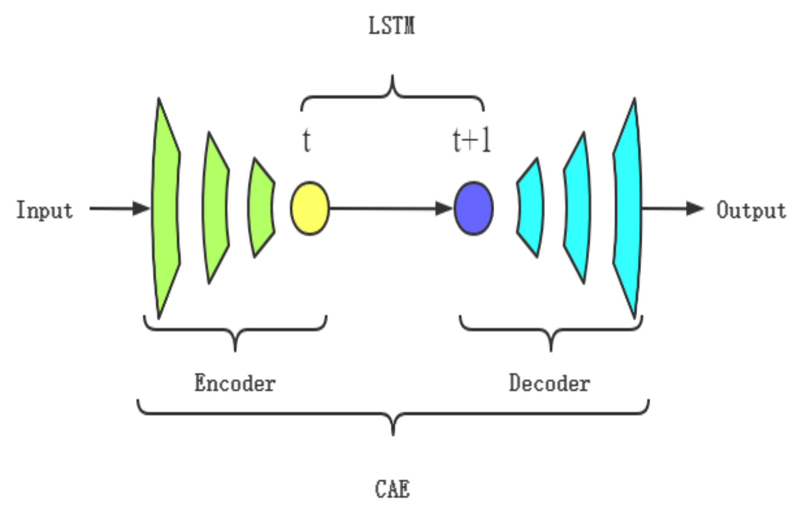

[简体中文](README_CN.md) | ENGLISH

# CAE-LSTM reduced-order model

## Overview

### Background

In order to effectively reduce the design cost and cycle time of using CFD methods, the reduced-order model (ROM) has gained wide attention in recent years. For complex compressible flows, using linear methods such as Proper Orthogonal Decomposition (POD) for flow field dimensionality reduction requires a large number of modes to ensure the reconstruction accuracy. It has been shown that the modes number can be effectively reduced by using nonlinear dimensionality reduction methods. Convolutional Autoencoder (CAE) is a kind of neural network composed of encoder and decoder, which can realize data dimensionality reduction and recon-struction, and can be regarded as a nonlinear extension of POD method. CAE is used for nonlinear dimension-ality reduction, and Long Short-Term Memory (LSTM) is used for time evolution. The CAE-LSTM can obtain high reconstruction and prediction accuracy on the premise of using less latents for unsteady compressible flows.

### Model structure

The basic framework of CAE-LSTM is mainly based on [paper](https://doi.org/10.13700/j.bh.1001-5965.2022.0085). It consists of CAE and LSTM, where the encoder in CAE reduces the dimensionality of the time series flow field to achieve feature extraction, LSTM learns low dimensional spatiotemporal features and makes predictions, and the decoder in CAE realizes flow field reconstruction.

+ Input：Input the flow field for a period of time
+ Compression：Extract high-dimensional spatiotemporal flow characteristics by dimensionality reduction of the flow field using the encoder of CAE
+ Evolution：Learning the evolution of spatiotemporal characteristics of low dimensional spatial flow fields through LSTM and predicting the next moment
+ Reconstruction：Restore the predicted low-dimensional features of the flow field to high-dimensional space through the decoder of CAE
+ Output：Output the predicted results of the transient flow field at the next moment

### Dataset

Source: Numerical simulation flow field data of one-dimensional Sod shock tube, Shu-Osher problem, Tow-dimensional Riemann problem and Kelvin-Helmholtz instability problem, provided by Professor Yu Jian from the School of Aeronautic Science and Engineering, Beihang University

Establishment method: The calculation status and establishment method of the dataset can be found in [paper](https://doi.org/10.13700/j.bh.1001-5965.2022.0085)

Data description:
Sod shock tube: The coordinate range is \[0, 1\], and there is a thin film at x=0.5 in the middle. At the initial moment, remove the thin film in the middle of the shock tube and study the changes in gas density in the shock tube. The calculation time t ranges from \[0, 0.2\] and is divided into an average of 531 time steps. A total of 531 flow field snapshots, each with a matrix size of 256.

Shu-Osher problem: The coordinate range is \[-5, 5\], and the calculation time t ranges from \[0, 1.8] and is divided into an average of 2093 time steps. A total of 2093 flow field snapshots, each with a matrix size of 512.

Riemann problem: The coordinate range is \[0, 1\], and the calculation time t ranges from \[0, 0.25]. A total of 1250 flow field snapshots, each with a matrix size of (128, 128).

Kelvin-Helmholtz instability problem: The coordinate range is \[-0.5, 0.5\], and the calculation time t ranges from \[0, 1.5] and is divided into an average of 1786 time steps. A total of 1786 flow field snapshots, each with a matrix size of (256, 256).

The download address for the dataset is: [data_driven/cae-lstm/dataset](https://download.mindspore.cn/mindscience/mindflow/dataset/applications/data_driven/cae-lstm)

## QuickStart

### Run Option 1: Call `cae_train.py` and `lstm_train.py` from command line to start train cae and lstm network, respectively

+ Train the CAE network:

`python -u cae_train.py --case sod --mode GRAPH --save_graphs False --save_graphs_path ./graphs --device_target GPU --device_id 0 --config_file_path ./config.yaml`

+ Train the LSTM network:

`python -u lstm_train.py --case sod --mode GRAPH --save_graphs False --save_graphs_path ./graphs --device_target GPU --device_id 0 --config_file_path ./config.yaml`

where:
`--case` indicates the case to run. You can choose 'sod', 'shu_osher', riemann' or 'kh'. Default 'sod'，where 'sod' and 'shu_osher' are one dimension cases, 'riemann' and 'kh' are two dimension cases

`--config_file_path` indicates the path of the parameter file. Default './config.yaml'.

`--device_target` indicates the computing platform. You can choose 'Ascend' or 'GPU'. Default 'Ascend'.

`--device_id` indicates the index of NPU or GPU. Default 0.

`--mode` is the running mode. 'GRAPH' indicates static graph mode. 'PYNATIVE' indicates dynamic graph mode. You can refer to [MindSpore official website](https://www.mindspore.cn/docs/zh-CN/master/design/dynamic_graph_and_static_graph.html) for details.Default 'GRAPH'.

`--save_graphs` indicates whether to save the computational graph. Default 'False'.

`--save_graphs_path` indicates the path to save the computational graph. Default './graphs'.

### Run Option 2: Run Jupyter Notebook

You can use [Chinese](./cae_lstm_CN.ipynb) or [English](./cae_lstm.ipynb) Jupyter Notebook to run the training and evaluation code line-by-line.

## Results

The following are the actual flow field, CAE-LSTM prediction results, and prediction errors of the four cases.

The first two flow field results for each case show the variation of density at different x positions in the flow field over time, while the third error curve shows the variation of the average relative error between the CAE-LSTM flow field and the real flow field label over time. The overall prediction time error meet the accuracy requirements of flow field prediction.

Sod shock tube:
<figure class="harf">
    
    
</figure>

Shu-Osher problem:
<figure class="harf">
    
    
</figure>

Riemann problem:
<figure class="harf">
    
    
</figure>

Kelvin-Helmholtz instability problem:
<figure class="harf">
    
    
</figure>

## Contributor

gitee id: [xiaoruoye](https://gitee.com/xiaoruoye)

email: 1159053026@qq.com
