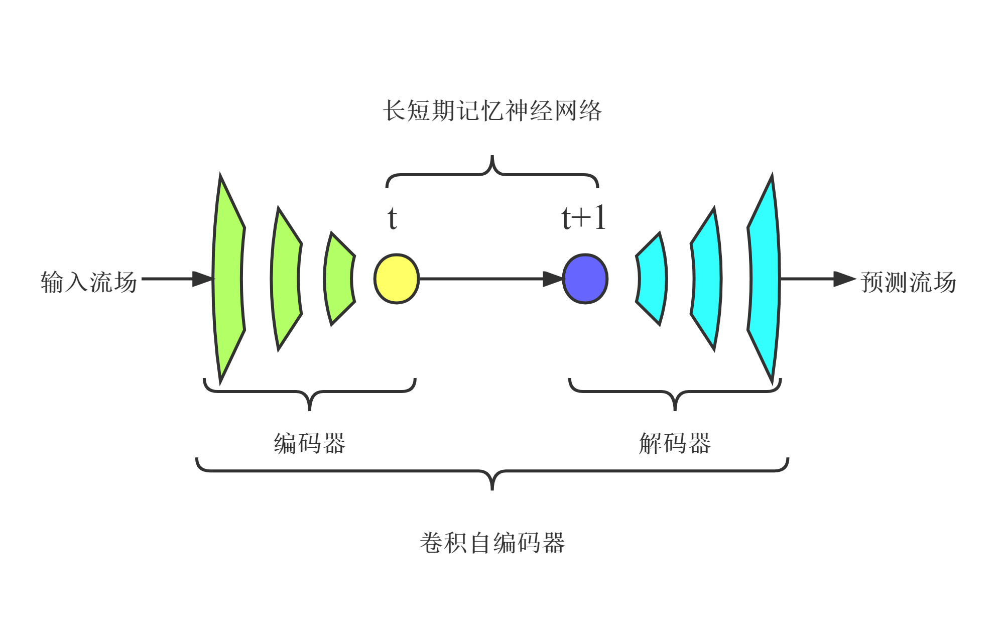

[ENGLISH](README.md) | 简体中文

# CAE-LSTM降阶模型

## 概述

### 背景

降阶模型可有效降低使用CFD方法的设计成本和周期。对于复杂的可压缩流动，使用POD等线性方法进行流场降维，需要大量的模态才能保证流场重建的精度，而采用非线性降维方法能够有效减少所需模态数。卷积自编码器(CAE)是一种由编码器和解码器组成的神经网络，能够实现数据降维和重构，可看作是POD方法的非线性拓展。采用CAE进行流场数据的非线性降维，同时使用LSTM进行流场状态的时间演化。对于非定常可压缩流动，“CAE-LSTM”降阶模型能够在使用较少自由变量数的前提下获得较高的重构和预测精度。

### 模型结构

CAE-LSTM的基本框架主要基于[论文](https://doi.org/10.13700/j.bh.1001-5965.2022.0085) ，其由CAE和LSTM组成，其中CAE中的编码器降低时间序列流场的维数，实现特征提取，LSTM学习低维时空特征并进行预测，CAE中的解码器实现流场重建。

+ 输入：输入一段时间的流场;
+ 压缩：通过CAE的编码器对流场进行降维，提取高维时空流动特征;
+ 演化：通过LSTM学习低维空间流场时空特征的演变，预测下一时刻;
+ 重建：通过CAE的解码器将预测的流场低维特征恢复到高维空间；
+ 输出：输出对下一时刻瞬态流场的预测结果。

### 数据集

数据集来源：一维Sod激波管、Shu-Osher问题和二维黎曼问题、亥姆霍兹不稳定性问题的数值仿真流场数据，由北京航空航天大学航空科学与工程学院于剑副教授团队提供

数据集建立方法：数据集计算状态与建立方法见[论文](https://doi.org/10.13700/j.bh.1001-5965.2022.0085)

数据说明：
Sod激波管：坐标x范围为[0, 1]，中间x=0.5处有一薄膜。在初始时刻，将激波管中间的薄膜撤去，研究激波管中气体密度的变化情况。计算时间t范围为[0, 0.2]，平均分成531个时间步。共531张流场快照，每张快照矩阵尺寸为128；

Shu-Osher问题：坐标x范围为[-5, 5]，计算时间t范围为[0, 1.8]，平均分成2093个时间步。共2093张流场快照，每张快照矩阵尺寸为512；

二维黎曼问题：坐标x, y范围为[0, 1]，计算时间t范围为[0, 0.25]，平均分成1250个时间步。共1250张流场快照，每张快照矩阵尺寸为(128, 128)。

二维开尔文-亥姆霍兹不稳定性问题：坐标x, y范围为[-0.5, 0.5]，计算时间t范围为[0, 1.5]，分成1786个时间步。共1786张流场快照，每张快照矩阵尺寸为(256, 256)。

数据集的下载地址为：[data_driven/cae-lstm/dataset](https://download.mindspore.cn/mindscience/mindflow/dataset/applications/data_driven/cae-lstm)

## 快速开始

### 训练方式一：在命令行中分别调用`cae_train.py`和`lstm_train.py`开始训练CAE和LSTM网络

+ 训练CAE网络：

`python -u cae_train.py --case sod --mode GRAPH --save_graphs False --save_graphs_path ./graphs --device_target GPU --device_id 0 --config_file_path ./config.yaml`

+ 训练LSTM网络：

`python -u lstm_train.py --case sod --mode GRAPH --save_graphs False --save_graphs_path ./graphs --device_target GPU --device_id 0 --config_file_path ./config.yaml`

其中，
`--case`表示运行的算例，可以选择'sod'，'shu_osher'，'riemann'和'kh', ，默认值'sod'，其中'sod'和'shu_osher'为一维算例，'riemann'和'kh'为二维算例

`--config_file_path`表示配置文件的路径，默认值'./config.yaml'

`--device_target`表示使用的计算平台类型，可以选择'Ascend'或'GPU'，默认值'GPU'

`--device_id`表示使用的计算卡编号，可按照实际情况填写，默认值 0

`--mode`表示运行的模式，'GRAPH'表示静态图模式, 'PYNATIVE'表示动态图模式，默认值'GRAPH'，详见[MindSpore 官网](https://www.mindspore.cn/docs/zh-CN/master/design/dynamic_graph_and_static_graph.html)

`--save_graphs`表示是否保存计算图，默认值'False'

`--save_graphs_path`表示计算图保存的路径，默认值'./graphs'

### 训练方式二：运行Jupyter Notebook

您可以使用[中文版](./cae_lstm_CN.ipynb)或[英文版](./cae_lstm.ipynb) Jupyter Notebook 逐行运行训练和验证代码。

## 结果展示

以下分别为四个算例的真实流场，CAE-LSTM预测结果和预测误差。

其中每个算例的前两个流场结果展现了流场中不同位置的密度随时间的变化情况，第三个误差曲线展现了CAE-LSTM流场与真实流场label的平均相对误差随时间的变化情况。整个预测时间误差都较小，满足流场预测精度需求。

Sod激波管：
<figure class="harf">
    
    
</figure>

Shu-Osher问题：
<figure class="harf">
    
    
</figure>

黎曼问题：
<figure class="harf">
    
    
</figure>

亥姆霍兹不稳定性问题：
<figure class="harf">
    
    
</figure>

## 代码贡献

gitee id: [xiaoruoye](https://gitee.com/xiaoruoye)

邮箱: 1159053026@qq.com
