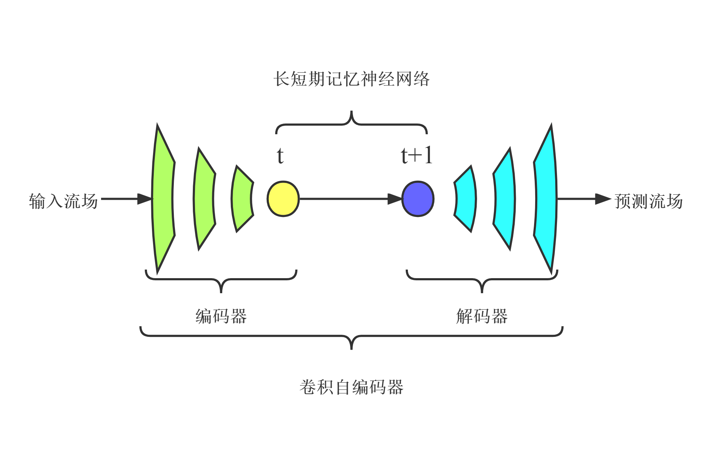

---

# 背景介绍

降阶模型可有效降低使用CFD方法的设计成本和周期。对于复杂的可压缩流动，使用POD等线性方法进行流场降维，需要大量的模态才能保证流场重建的精度，而采用非线性降维方法能够有效减少所需模态数。卷积自编码器(CAE)是一种由编码器和解码器组成的神经网络，能够实现数据降维和重构，可看作是POD方法的非线性拓展。采用CAE进行流场数据的非线性降维，同时使用LSTM进行流场状态的时间演化。对于非定常可压缩流动，“CAE-LSTM”降阶模型能够在使用较少自由变量数的前提下获得较高的重构和预测精度。

# 模型架构

CAE-LSTM的基本框架主要基于[论文](https://doi.org/10.13700/j.bh.1001-5965.2022.0085)，其由CAE和LSTM组成，其中CAE中的编码器降低时间序列流场的维数，实现特征提取，LSTM学习低维时空特征并进行预测，CAE中的解码器实现流场重建。

+ 输入：输入一段时间的流场;
+ 压缩：通过CAE的编码器对流场进行降维，提取高维时空流动特征;
+ 演化：通过LSTM学习低维空间流场时空特征的演变，预测下一时刻;
+ 重建：通过CAE的解码器将预测的流场低维特征恢复到高维空间；
+ 输出：输出对下一时刻瞬态流场的预测结果。

# 数据集

来源：二维开尔文-亥姆霍兹不稳定性问题的数值仿真流场数据，由北京航空航天大学航空科学与工程学院于剑副教授团队提供

建立方法：数据集计算状态与建立方法见[论文](https://doi.org/10.13700/j.bh.1001-5965.2022.0085)

数据说明：
二维黎曼问题的坐标范围为[-0.5, 0.5]，计算时间t范围为[0, 1.5]，平均分成1786个时间步。共1786张流场快照，每张快照矩阵尺寸为(256, 256)。

数据集的下载地址为：data_driven/cae-lstm/kh/dataset

# 训练过程

该模型单机单卡进行训练，根据训练任务需求，分别执行cae_train.py和lstm_train.py开始训练CAE和LSTM网络。
在开始训练前需要在config.yaml中设置数据读取保存路径和训练参数等相关训练条件。

+ 训练CAE网络：

`python -u cae_train.py --mode GRAPH --save_graphs_path ./graphs --device_target GPU --device_id 0 --config_file_path ./config.yaml`

+ 训练LSTM网络：

`python -u lstm_train.py --mode GRAPH --save_graphs_path ./graphs --device_target GPU --device_id 0 --config_file_path ./config.yaml`

# 预测结果可视化

根据训练条件，执行prediction.py进行模型推理，此操作将会根据训练结果的权重参数文件，预测输出CAE的降维、重构数据，LSTM的演化数据和CAE-LSTM预测的流场数据。
此操作还会分别计算CAE的重构数据和CAE-LSTM预测的流场数据的平均相对误差。

上述后处理输出路径默认为`./prediction_result`，可在config.yaml里修改保存路径。

# 预测结果展示

以下分别为真实流场，CAE-LSTM预测结果和预测误差。

其中前两个流场结果展现了流场中不同位置的密度随时间的变化情况，第三个误差曲线展现了CAE重建流场和CAE-LSTM流场与真实流场label的平均相对误差随时间的变化情况。CAE-LSTM预测结果的误差比CAE重建的误差较大，是因为前者比后者多了LSTM的演化误差，但整个预测时间误差保持在0.02以下，满足流场预测精度需求。

<figure class="harf">
    
    
    
</figure>
