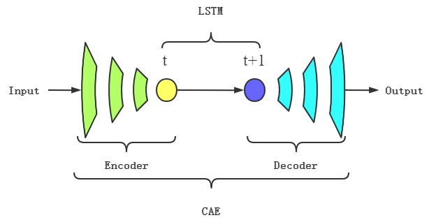
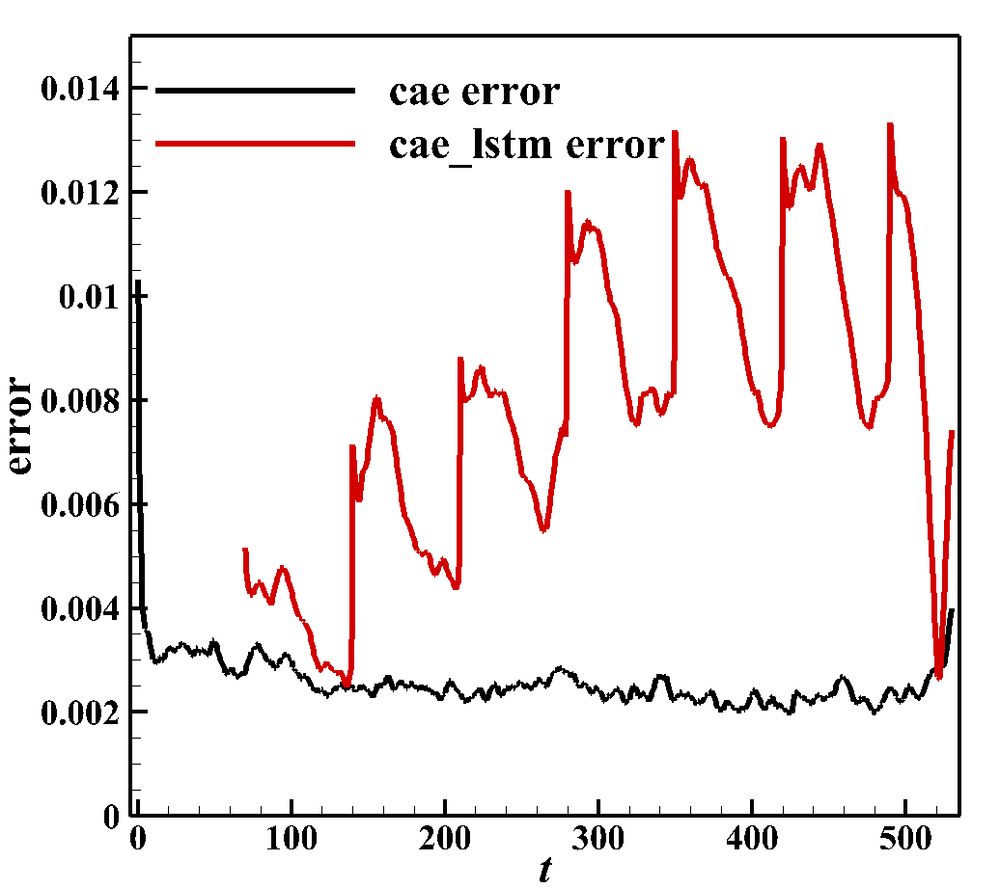

---

# Introduction

In order to effectively reduce the design cost and cycle time of using CFD methods, the reduced-order model (ROM) has gained wide attention in recent years. For complex compressible flows, using linear methods such as Proper Orthogonal Decomposition (POD) for flow field dimensionality reduction requires a large number of modes to ensure the reconstruction accuracy. It has been shown that the modes number can be effectively reduced by using nonlinear dimensionality reduction methods. Convolutional Autoencoder (CAE) is a kind of neural network composed of encoder and decoder, which can realize data dimensionality reduction and recon-struction, and can be regarded as a nonlinear extension of POD method. CAE is used for nonlinear dimension-ality reduction, and Long Short-Term Memory (LSTM) is used for time evolution. The CAE-LSTM can obtain high reconstruction and prediction accuracy on the premise of using less latents for unsteady compressible flows.

# Framework of CAE-LSTM

The basic framework of CAE-LSTM is mainly based on [paper](https://doi.org/10.13700/j.bh.1001-5965.2022.0085). It consists of CAE and LSTM, where the encoder in CAE reduces the dimensionality of the time series flow field to achieve feature extraction, LSTM learns low dimensional spatiotemporal features and makes predictions, and the decoder in CAE realizes flow field reconstruction.

+ Input：Input the flow field for a period of time
+ Compression：Extract high-dimensional spatiotemporal flow characteristics by dimensionality reduction of the flow field using the encoder of CAE
+ Evolution：Learning the evolution of spatiotemporal characteristics of low dimensional spatial flow fields through LSTM and predicting the next moment
+ Reconstruction：Restore the predicted low-dimensional features of the flow field to high-dimensional space through the decoder of CAE
+ Output：Output the predicted results of the transient flow field at the next moment

# Dataset

Source: Numerical simulation flow field data of one-dimensional Sod shock tube, provided by Professor Yu Jian from the School of Aeronautic Science and Engineering, Beihang University

Establishment method: The calculation status and establishment method of the dataset can be found in [paper](https://doi.org/10.13700/j.bh.1001-5965.2022.0085)

Data description:
The coordinate range of the sod shock tube is \[0, 1\], and there is a thin film at x=0.5 in the middle. At the initial moment, remove the thin film in the middle of the shock tube and study the changes in gas density in the shock tube. The calculation time t ranges from \[0, 0.2\] and is divided into an average of 531 time steps. A total of 531 flow field snapshots, each with a matrix size of 256

The download address for the dataset is: data_driven/cae-lstm/sod/dataset

# Training process

The model is trained by single machine and single card. According to the training task requirements, run cae_train.py and lstm_train.py to start training; Before training, relevant training conditions need to be set in config.yaml.

+ Train the CAE network:

`python -u cae_train.py --mode GRAPH --save_graphs_path ./graphs --device_target GPU --device_id 0 --config_file_path ./config.yaml`

+ Train the LSTM network:

`python -u lstm_train.py --mode GRAPH --save_graphs_path ./graphs --device_target GPU --device_id 0 --config_file_path ./config.yaml`

# Visualization of prediction results

Run the prediction.py for post-processing operation, this operation will predict the dimensionality reduction and reconstruction data of CAE, the evolution data of LSTM, and the flow field data predicted by CAE-LSTM based on the weight parameter file of the training results.
This operation also calculates the average relative error of CAE reconstruction data and CAE-LSTM predicted flow field data, respectively.

The default output path for the above post-processing is `./prediction_result`, the save path can be modified in config.yaml.

# Prediction result

The following are the actual flow field, CAE-LSTM prediction results, and prediction errors.

The first two flow field results show the variation of density at different x positions in the flow field over time, while the third error curve shows the variation of the average relative error between the CAE reconstructed flow field and the CAE-LSTM flow field and the real flow field label over time. The error of CAE-LSTM prediction results is greater than that of CAE reconstruction because the former has more LSTM evolution error than the latter, but the overall prediction time error remains below 0.014, meeting the accuracy requirements of flow field prediction.

<figure class="harf">
    
    
    
</figure>
